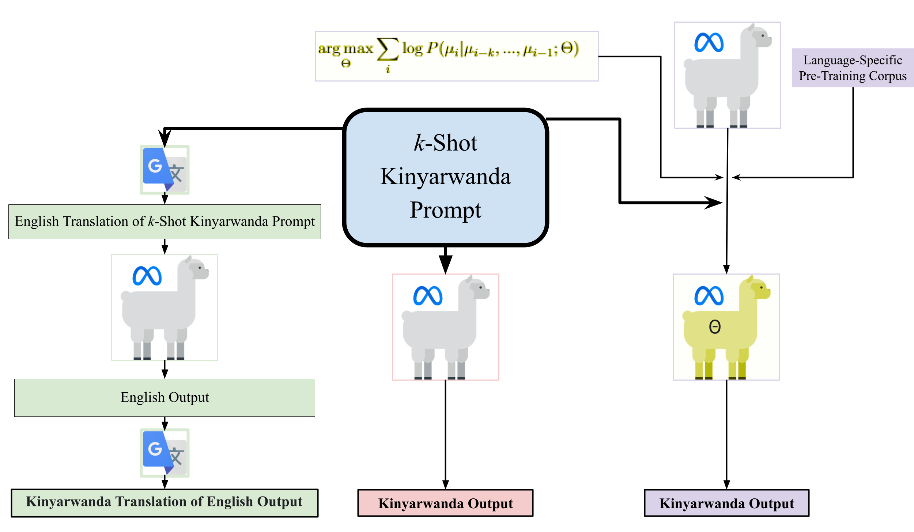
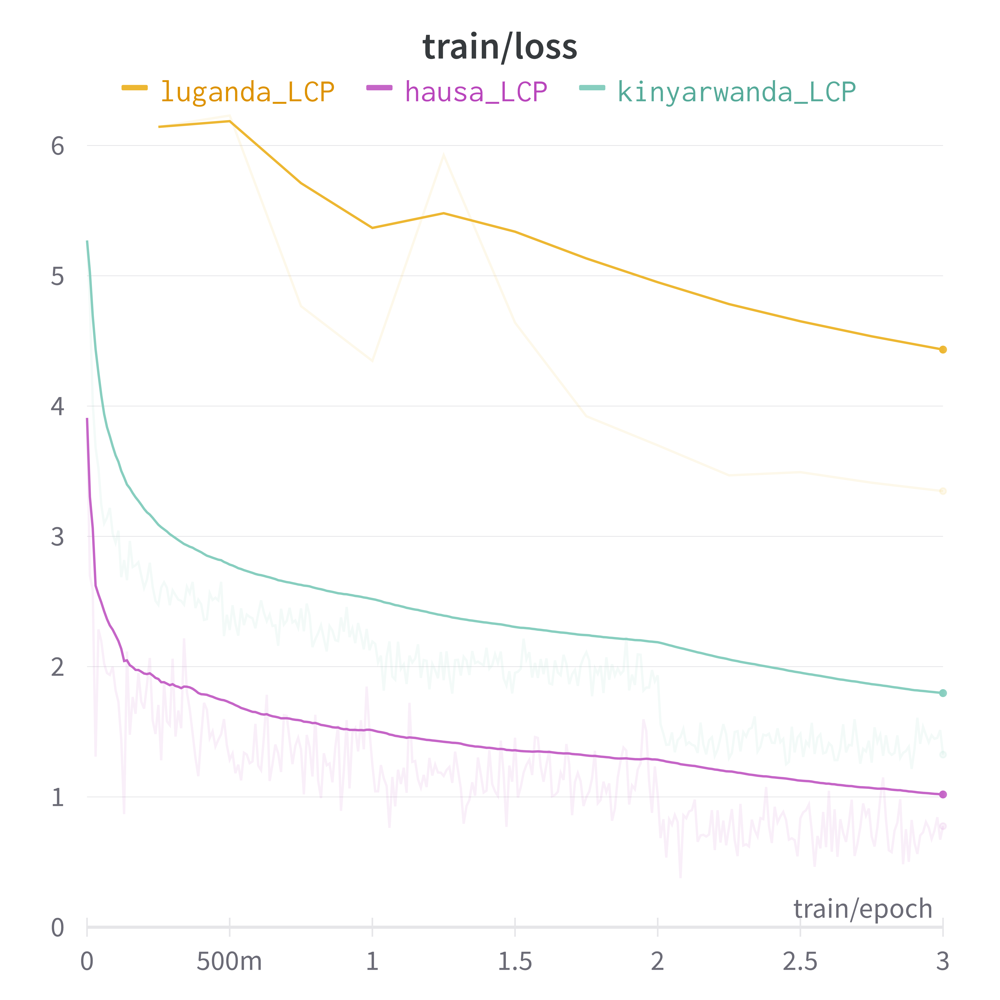
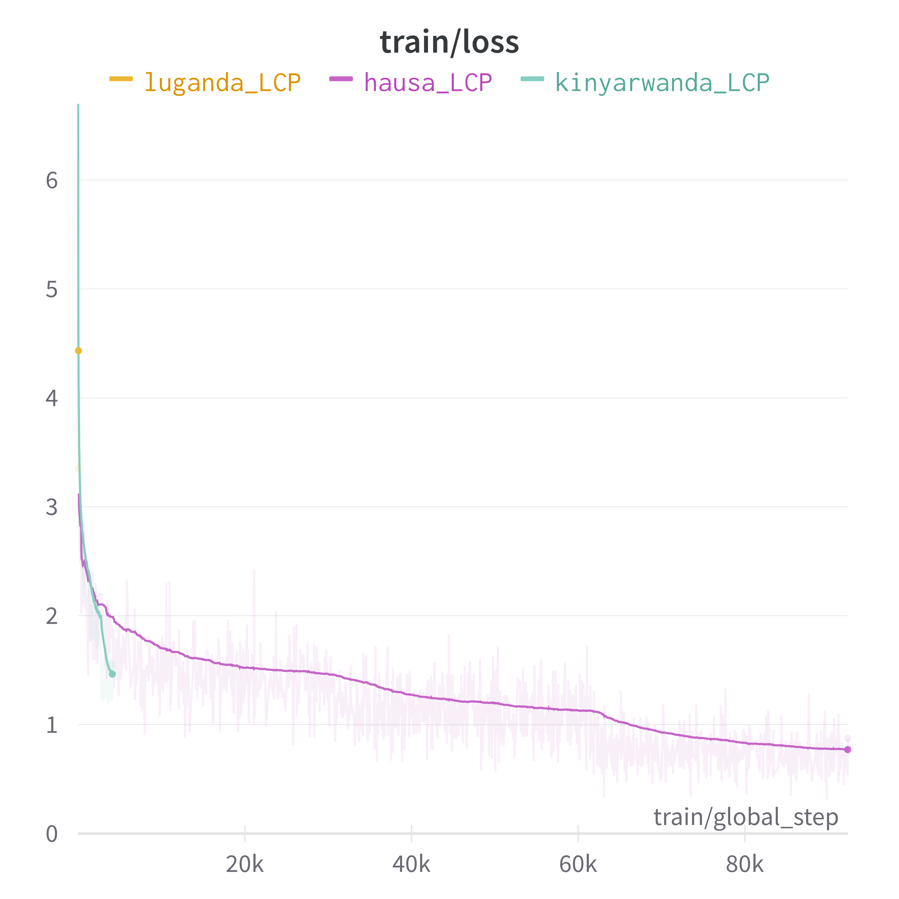

# [针对低资源语言，我们探索了少量样本下的跨语言迁移技术，以实现对大型语言模型的有效提示。这项研究旨在通过少量示例，在资源匮乏的语言环境下提升大型语言模型的性能表现。]

发布时间：2024年03月09日

`LLM应用`

> Few-Shot Cross-Lingual Transfer for Prompting Large Language Models in Low-Resource Languages

> 大型预训练语言模型（如 PLM）在 NLP 领域引领潮流，其中一种广泛运用的策略是“提示”，即情境学习。在这种方式下，用户向 PLM 提供任务说明和实例，并基于此让 PLM 对新示例执行任务。然而，仅有那些规模庞大、性能强大的 PLM 才能在情境学习中表现出色，而这些模型大多仅基于英文数据训练，使得其它语言面临挑战。由于多数语言数据资源有限，很难专门为提示功能训练语言特异性的 PLM。尽管有关提示设定的研究日益增多，但对于如何跨语言优化 PLM 进行提示应用的具体方法尚不明朗。本研究聚焦于将开源的70亿参数 PLM——LLaMa 主要针对英语训练的部分进行适应性调整，使其能在资源稀缺的语言（如基尼亚卢旺达语、豪萨语和卢干达语）中进行情境学习。我们探讨了三种方法：少量样本提示、语言适应性微调（LAFT）及神经机器翻译，并在抽象总结、多类别主题分类及命名实体识别等多个任务上进行评估。尽管 LAFT 方法计算成本较高，理论上应能取得最好效果，但实验显示，在对 PLM 进行情境学习适应时，LAFT 并非始终首选。相比之下，translate 和 prompt 设置对于所选低资源语言而言，是一种高效且成本适宜的少量样本提示方案。研究表明，不同任务和语言环境下结果各异，但总体而言，prompt 方法在所有任务和语言中的平均表现最佳。数据显示，在汇总所有任务和语言的所有样本情况下，prompt 设置相较于 translate 和 LAFT 显著更优。

> Large pre-trained language models (PLMs) are at the forefront of advances in Natural Language Processing. One widespread use case of PLMs is "prompting" - or in-context learning - where a user provides a description of a task and some completed examples of the task to a PLM as context before prompting the PLM to perform the task on a new example. Only the largest, most capable PLMs are able to perform in-context learning effectively, and these models are typically trained with a predominantly English corpus, leaving all other languages behind. The data limitations in most languages preclude the training of language-specific PLMs capable of prompting. Albeit the surge in work of prompting settings, it is still unclear how PLMs should be adapted cross-lingually specifically for prompting. We evaluate the possible methods to adapt LLaMa, a 7B parameter open-source PLM mainly trained in English, for prompting in low-resource languages, namely for Kinyarwanda, Hausa, and Luganda. We consider three methods: few-shot prompting (prompt), language-adaptive fine-tuning (LAFT), and neural machine translation (translate), and evaluate on abstractive summarization, multi-class topic classification, and named-entity recognition. Although LAFT carries the greatest compute cost and intuitively should lead to the best results, our experiments exhibit that LAFT is only occasionally the optimal choice for adapting PLMs for prompting. Rather, the translate and prompt settings are a compute-efficient and cost-effective method of few-shot prompting for the selected low-resource languages. We find that the results are task and language dependent but find that the prompting method is the best on average across all tasks and languages. Results show that the prompt setting performs better than both translating and LAFT with statistical significance for all shots when aggregated across all tasks and languages.

[Arxiv](https://arxiv.org/abs/2403.06018)