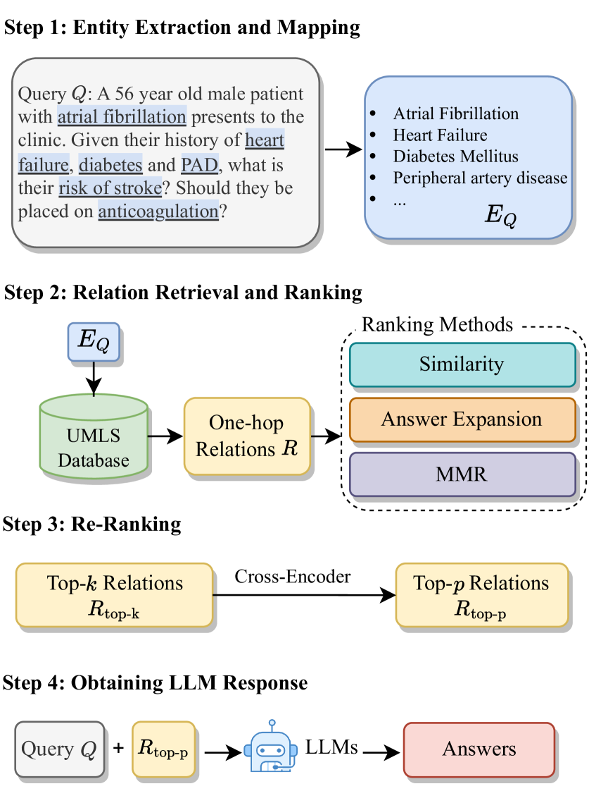
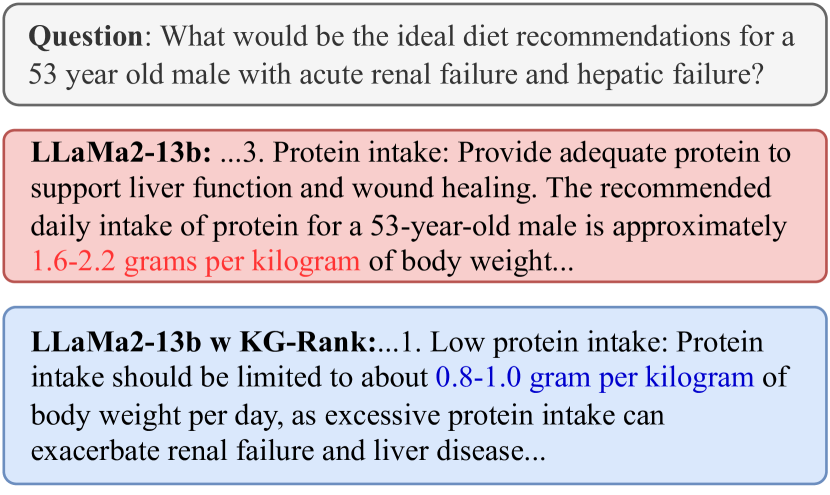
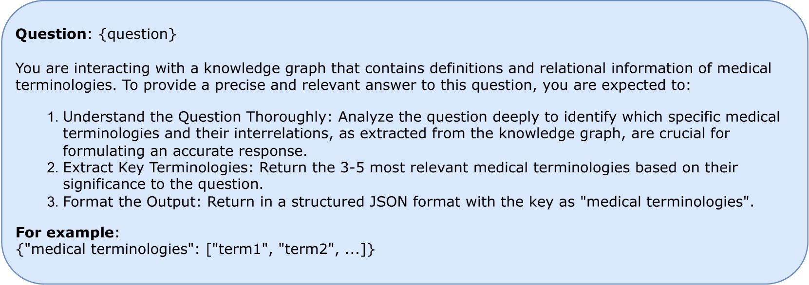
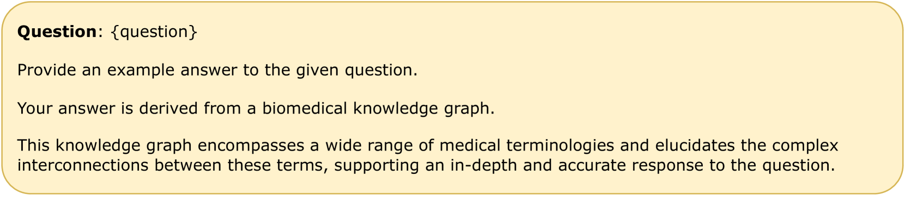
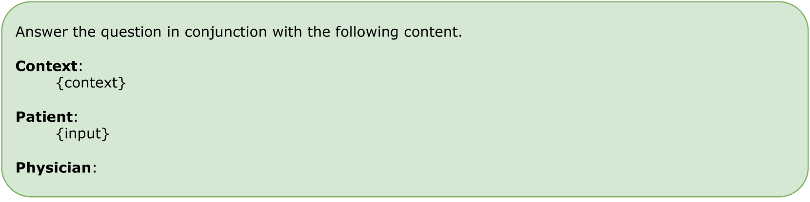
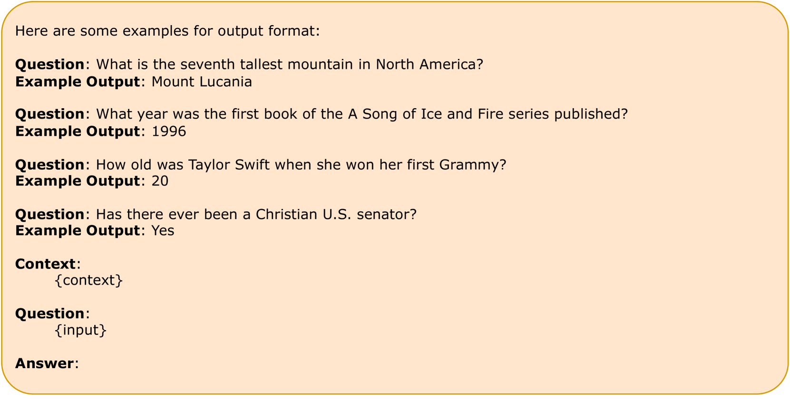
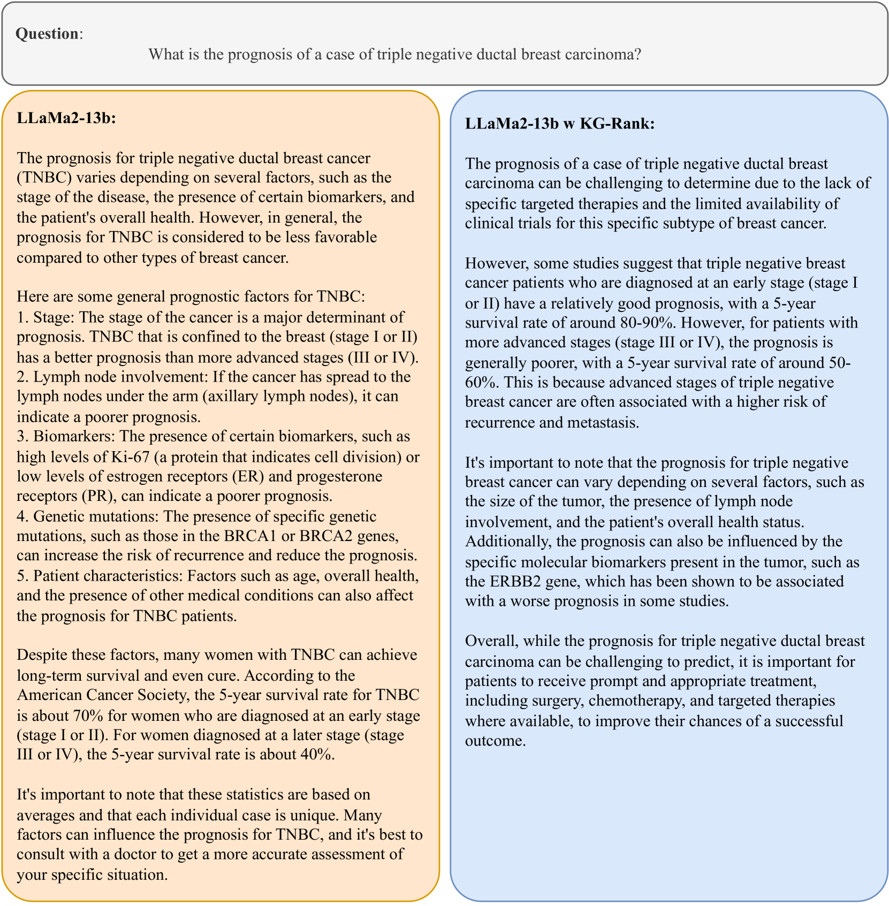
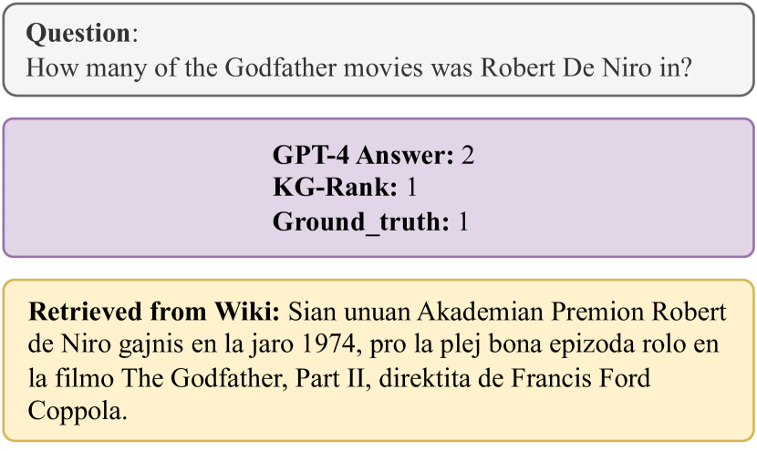

# [KG-Rank 是一项研究，通过融合知识图谱与排序技术，提升大型语言模型在处理医学问答任务时的表现力。](https://arxiv.org/abs/2403.05881)

发布时间：2024年03月09日

`LLM应用`

> KG-Rank: Enhancing Large Language Models for Medical QA with Knowledge Graphs and Ranking Techniques

> LLMs在医疗创新生成能力方面取得了显著进步，但在真实临床环境的应用却因可能违背医学事实和内在偏见而充满挑战。本研究提出了一项开创性工作——KG-Rank，它巧妙融合了医疗知识图谱（KG）与排序及重排序技术，致力于提升医疗领域内的自由文本问答精准度。面对问题，KG-Rank会先从医疗KG中检索相关事实信息，再创造性地运用排序算法调整这些信息的排列顺序，从而得出更为精确的答案。值得一提的是，KG-Rank作为首个将排序模型整合进KG并专用于医疗QA、生成长篇答案的研究成果，在对四个精选医疗QA数据集的评测中，其ROUGE-L得分提高了超过18%。不仅如此，当KG-Rank应用于开放领域时，ROUGE-L得分亦提升了14%，充分彰显了该方法的有效性和广泛应用潜力。

> Large Language Models (LLMs) have significantly advanced healthcare innovation on generation capabilities. However, their application in real clinical settings is challenging due to potential deviations from medical facts and inherent biases. In this work, we develop an augmented LLM framework, KG-Rank, which leverages a medical knowledge graph (KG) with ranking and re-ranking techniques, aiming to improve free-text question-answering (QA) in the medical domain. Specifically, upon receiving a question, we initially retrieve triplets from a medical KG to gather factual information. Subsequently, we innovatively apply ranking methods to refine the ordering of these triplets, aiming to yield more precise answers. To the best of our knowledge, KG-Rank is the first application of ranking models combined with KG in medical QA specifically for generating long answers. Evaluation of four selected medical QA datasets shows that KG-Rank achieves an improvement of over 18% in the ROUGE-L score. Moreover, we extend KG-Rank to open domains, where it realizes a 14% improvement in ROUGE-L, showing the effectiveness and potential of KG-Rank.

