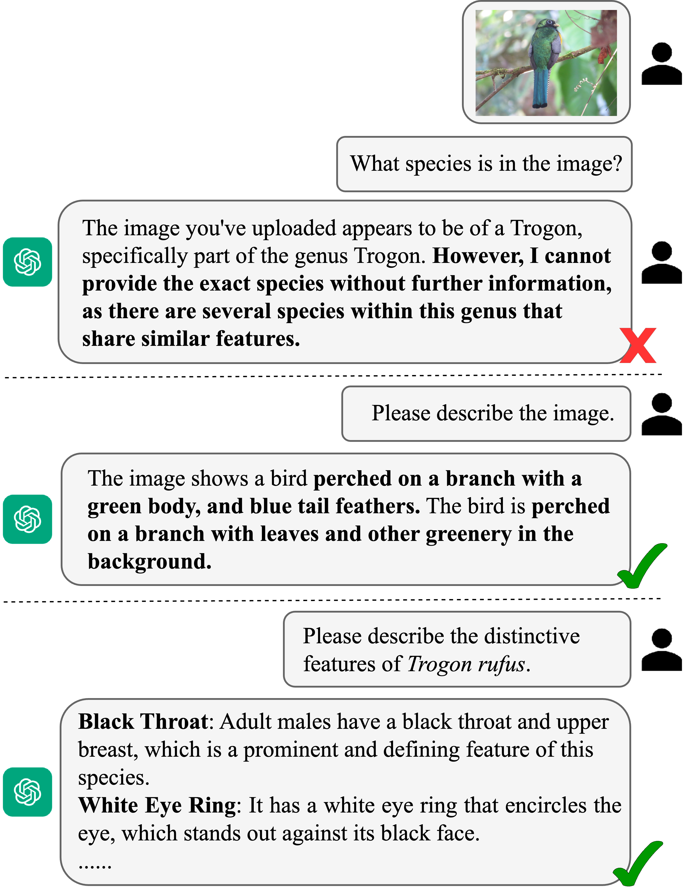
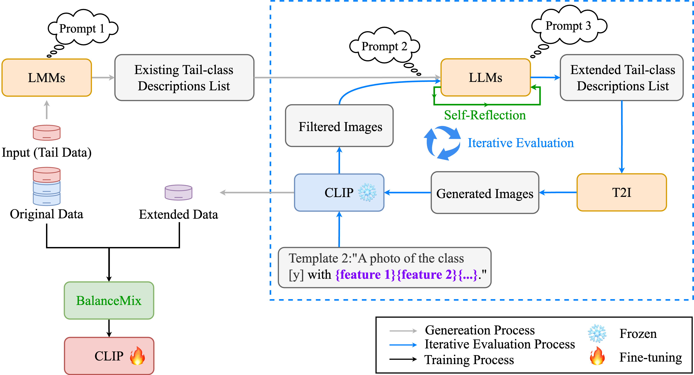
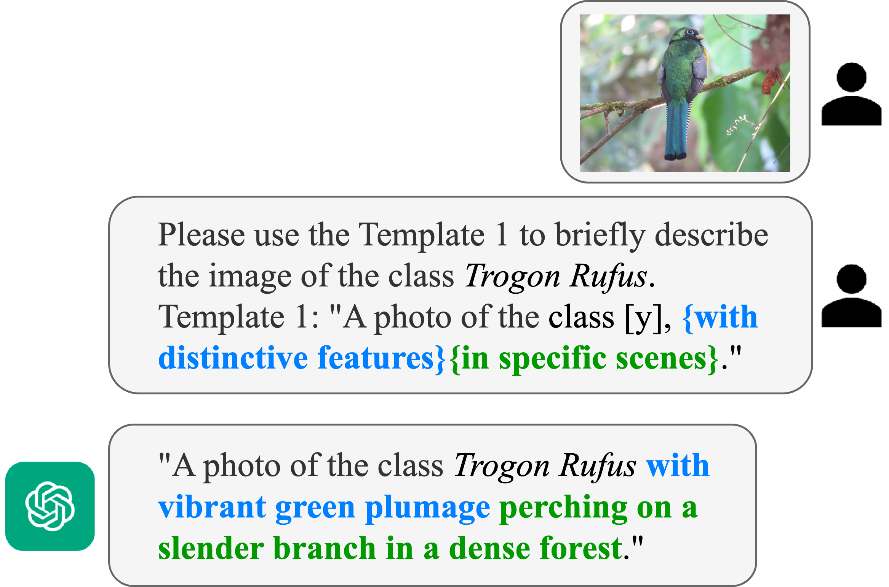
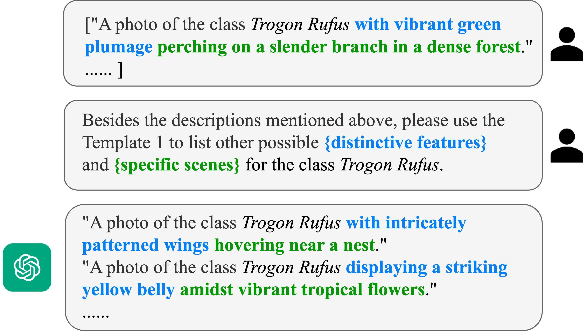
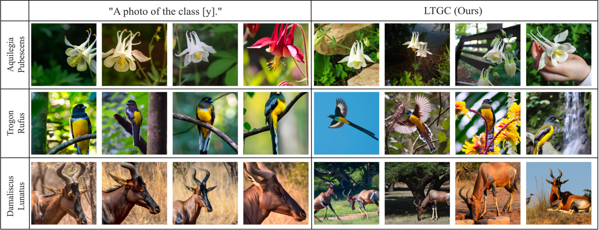
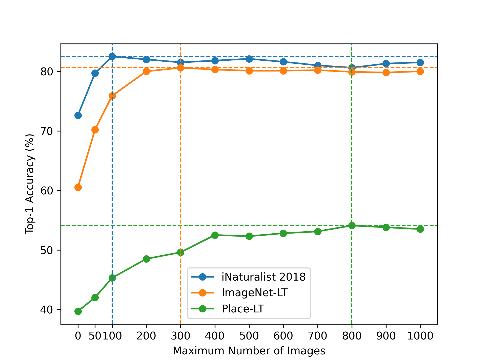
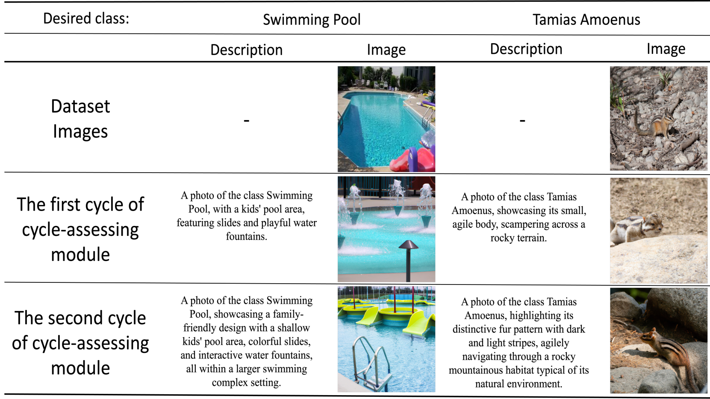
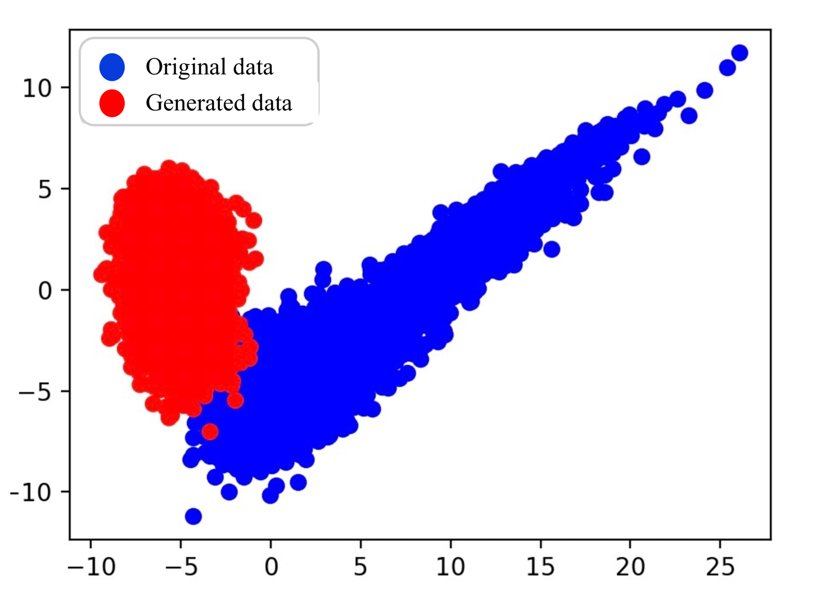

# [LTGC 方法借助LLMs驱动生成的内容，有效应对长尾识别问题。](https://arxiv.org/abs/2403.05854)

发布时间：2024年03月09日

`LLM应用`

> LTGC: Long-tail Recognition via Leveraging LLMs-driven Generated Content

> 面对长尾识别这一难题，因其需要模型在掌握尾部类别良好表示的同时应对各类别的不均衡现象。本文引入一种创新的生成与微调框架LTGC，借助生成内容的优势来攻克这一难题。该框架借鉴了大型语言模型（如LLMs）中蕴含的丰富隐性知识，巧用其强大的解析与推理能力，对原始尾部数据进行加工，从而创造出丰富多样的尾部类别内容。我们还为此框架设计了几项新颖方案，既保证生成数据的质量，又能高效地利用生成数据与原始数据共同微调模型。可视化展示表明，LTGC中的生成模块表现出色，能够精准且多样化地生成尾部数据。实验结果进一步验证了LTGC在多个流行长尾基准上的优越性，成功超越现有最先进的方法。

> Long-tail recognition is challenging because it requires the model to learn good representations from tail categories and address imbalances across all categories. In this paper, we propose a novel generative and fine-tuning framework, LTGC, to handle long-tail recognition via leveraging generated content. Firstly, inspired by the rich implicit knowledge in large-scale models (e.g., large language models, LLMs), LTGC leverages the power of these models to parse and reason over the original tail data to produce diverse tail-class content. We then propose several novel designs for LTGC to ensure the quality of the generated data and to efficiently fine-tune the model using both the generated and original data. The visualization demonstrates the effectiveness of the generation module in LTGC, which produces accurate and diverse tail data. Additionally, the experimental results demonstrate that our LTGC outperforms existing state-of-the-art methods on popular long-tailed benchmarks.

