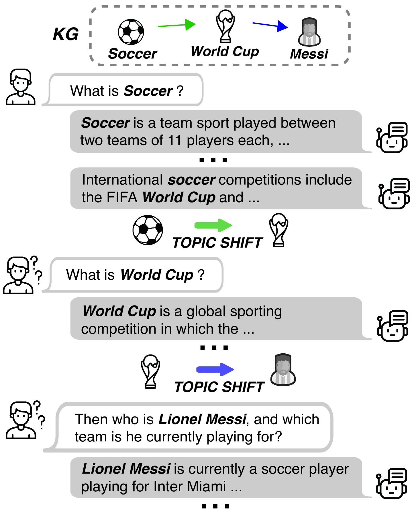
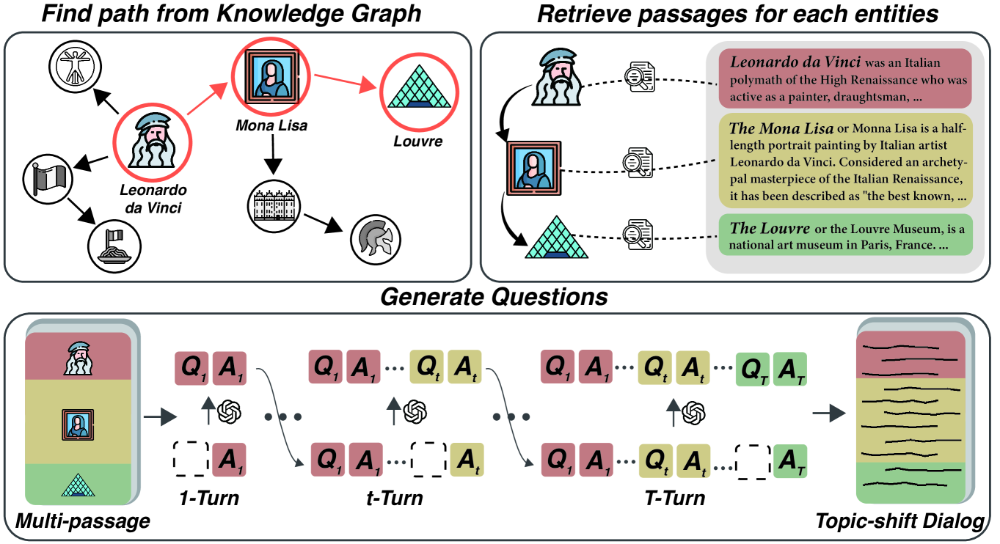
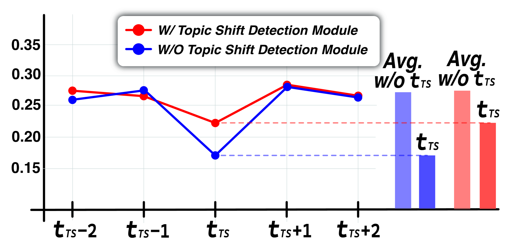
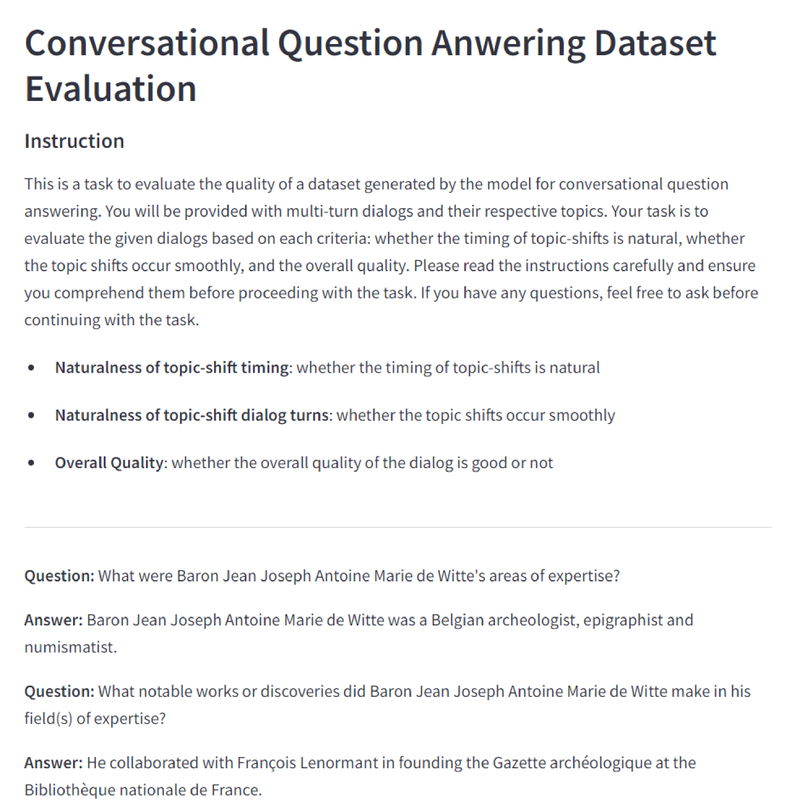
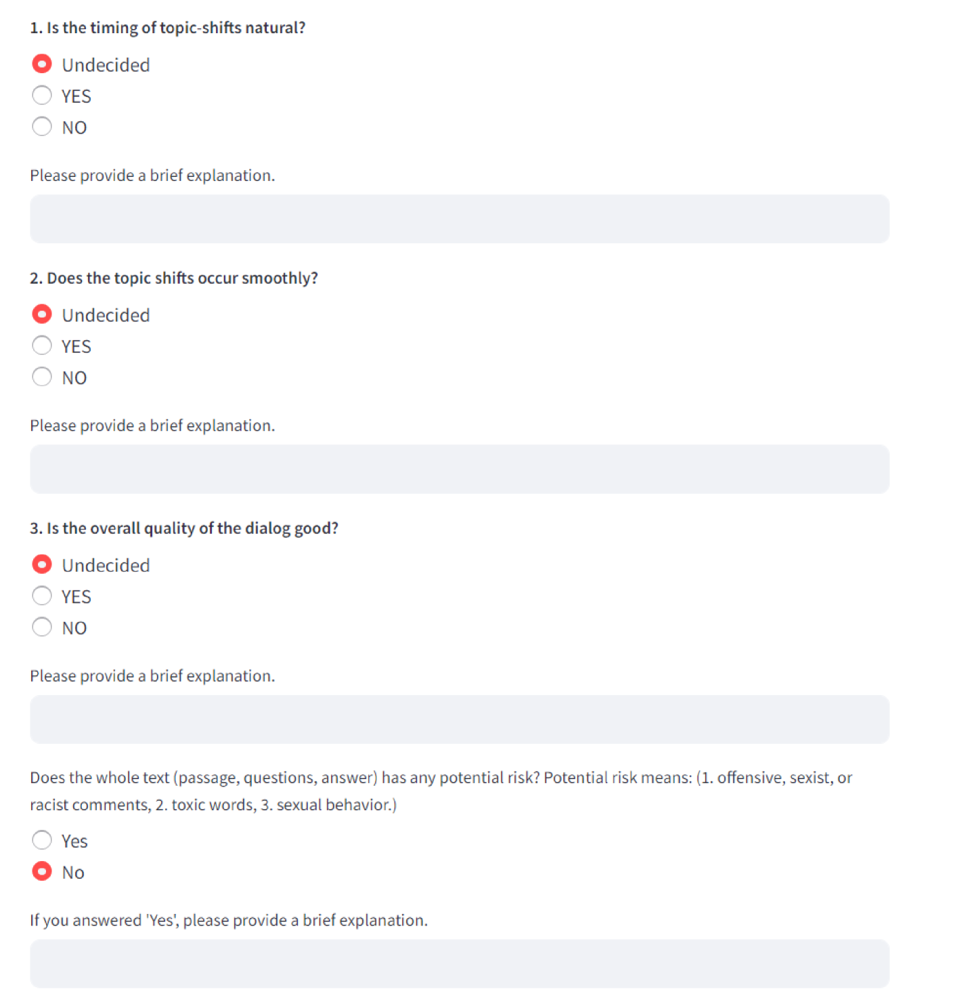

# [MP2D 是一种创新的自动化对话生成框架，它巧妙运用知识图谱技术来驱动话题的流畅转换，在对话内容生成中展现出强大的智能引导能力。](https://arxiv.org/abs/2403.05814)

发布时间：2024年03月09日

`Agent`

> MP2D: An Automated Topic Shift Dialogue Generation Framework Leveraging Knowledge Graphs

> 尽管话题对话系统日臻成熟，但如何妥善处理对话中的自然话题切换仍是难题，症结在于缺乏足够的训练数据。因此，我们创新性地提出了Multi-Passage to Dialogue（MP2D）这一数据生成框架，它可以自动生成包含自然话题过渡的对话式问答数据集。借助知识图谱中实体间的关系网络，MP2D犹如一面镜子，生动再现了人类对话中话题流动的规律。它针对性地抓取与话题紧密相关的段落，并通过段落转对话的方式构建出流畅的对话内容。经由一系列量化的、定性的实验验证，MP2D在生成富含自然话题转换对话方面的优越性得以展现。此外，本研究还推出了全新的评估话题切换对话能力的基准——TS-WikiDialog。利用此数据集进行实证分析，我们发现即便是大型语言模型（LLMs）在处理对话中的话题切换时也存在困难，而经过MP2D生成数据集训练的模型在各类话题切换对话任务上的表现均有显著提升。

> Despite advancements in on-topic dialogue systems, effectively managing topic shifts within dialogues remains a persistent challenge, largely attributed to the limited availability of training datasets. To address this issue, we propose Multi-Passage to Dialogue (MP2D), a data generation framework that automatically creates conversational question-answering datasets with natural topic transitions. By leveraging the relationships between entities in a knowledge graph, MP2D maps the flow of topics within a dialogue, effectively mirroring the dynamics of human conversation. It retrieves relevant passages corresponding to the topics and transforms them into dialogues through the passage-to-dialogue method. Through quantitative and qualitative experiments, we demonstrate MP2D's efficacy in generating dialogue with natural topic shifts. Furthermore, this study introduces a novel benchmark for topic shift dialogues, TS-WikiDialog. Utilizing the dataset, we demonstrate that even Large Language Models (LLMs) struggle to handle topic shifts in dialogue effectively, and we showcase the performance improvements of models trained on datasets generated by MP2D across diverse topic shift dialogue tasks.

[Arxiv](https://arxiv.org/abs/2403.05814)