# [针对关系型工作负载，本研究致力于提升对大型语言模型（LLM）查询的优化效果。](https://arxiv.org/abs/2403.05821)

发布时间：2024年03月09日

`LLM应用`

> Optimizing LLM Queries in Relational Workloads

> 诸如 Redshift、Databricks 和 BigQuery 等分析型数据库供应商快速整合了对大型语言模型（LLMs）的支持，用户可在分析任务中直接调用 LLMS 完成如分类、实体抽取和翻译等自然语言任务。比如，分析人员可能需要从海量产品评价中抓取客户情绪信息。不过值得注意的是，LLM 推理过程无论在计算资源消耗还是经济效益上都极为昂贵，举例来说，配备 Llama2-7B 的 NVIDIA L4 GPU 每秒仅能处理 6 KB 文本。本文研究了如何针对在 SQL 关系查询内部调用 LLM 的分析场景优化 LLM 推理性能。我们揭示了关系查询蕴含着新的加速 LLM 推理的可能性，如通过重新排列行来最大化 LLM 推理引擎内的键值缓存复用，调整单行内列的顺序以增强缓存复用效果，以及剔除重复的推理请求。我们将这些优化策略实现在 Apache Spark 平台，并采用 vLLM 作为模型后台服务，最终在一系列基于真实数据集的多元化 LLM 查询基准测试中，实现了高达 4.4 倍的端到端延迟提升。迄今为止，这是我们首次明确提出并解决在 SQL 查询内部优化 LLM 调用效率这一问题的研究。

> Analytical database providers (e.g., Redshift, Databricks, BigQuery) have rapidly added support for invoking Large Language Models (LLMs) through native user-defined functions (UDFs) to help users perform natural language tasks, such as classification, entity extraction, and translation, inside analytical workloads. For instance, an analyst might want to extract customer sentiments on millions of product reviews. However, LLM inference is highly expensive in both computational and economic terms: for example, an NVIDIA L4 GPU running Llama2-7B can only process 6 KB of text per second. In this paper, we explore how to optimize LLM inference for analytical workloads that invoke LLMs within relational queries. We show that relational queries present novel opportunities for accelerating LLM inference, including reordering rows to maximize key-value (KV) cache reuse within the LLM inference engine, reordering columns within a row to further increase cache reuse, and deduplicating redundant inference requests. We implement these optimizations in Apache Spark, with vLLM as the model serving backend and achieve up to 4.4x improvement in end-to-end latency on a benchmark of diverse LLM-based queries on real datasets. To the best of our knowledge, this is the first work to explicitly address the problem of optimizing LLM invocations within SQL queries.

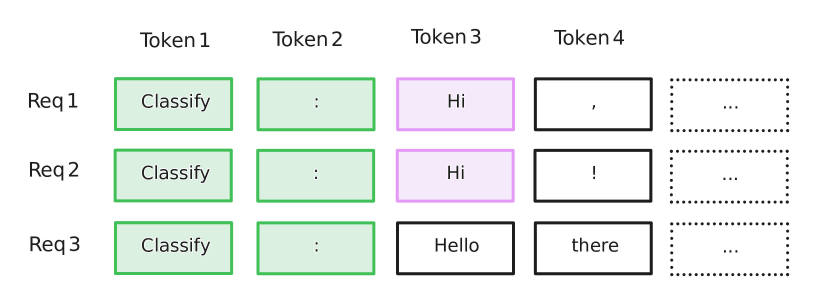

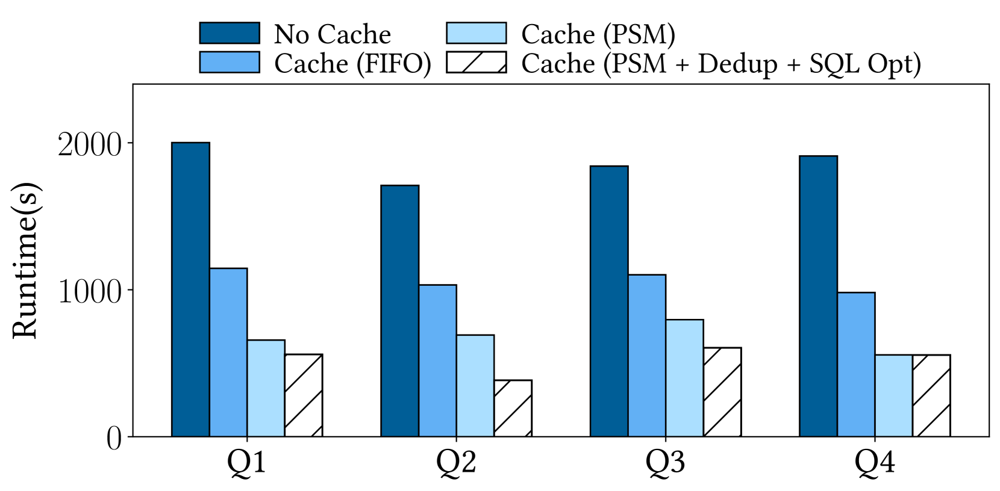

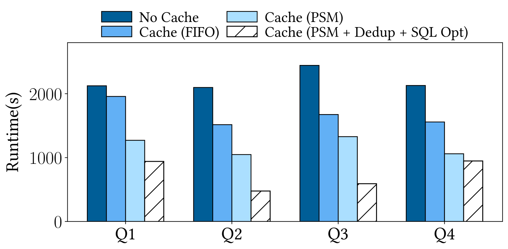

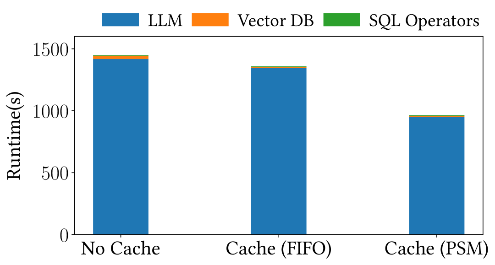

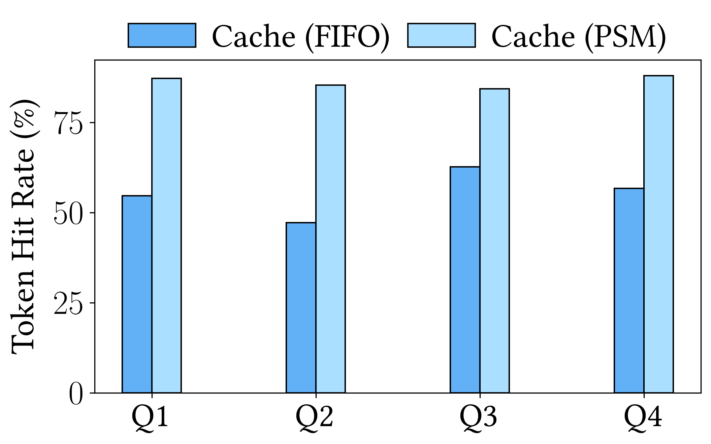

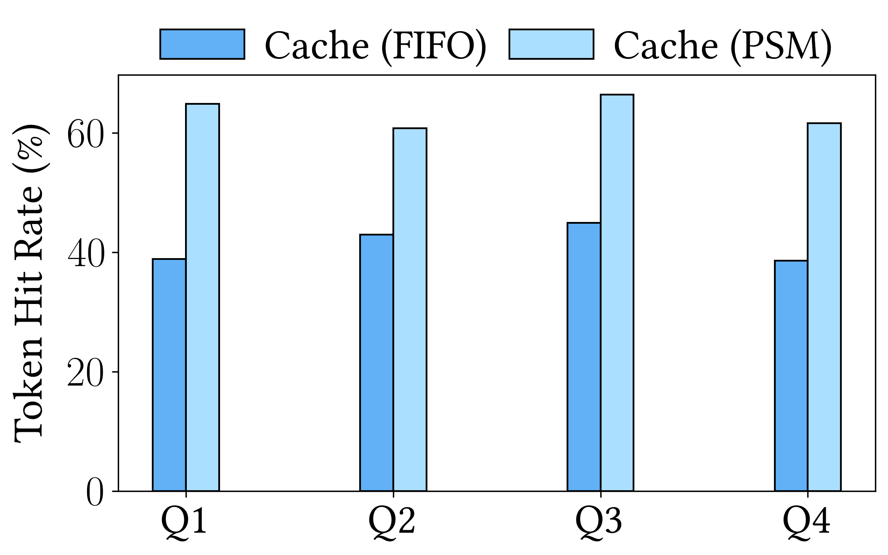

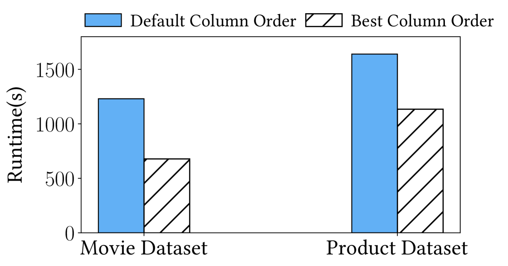

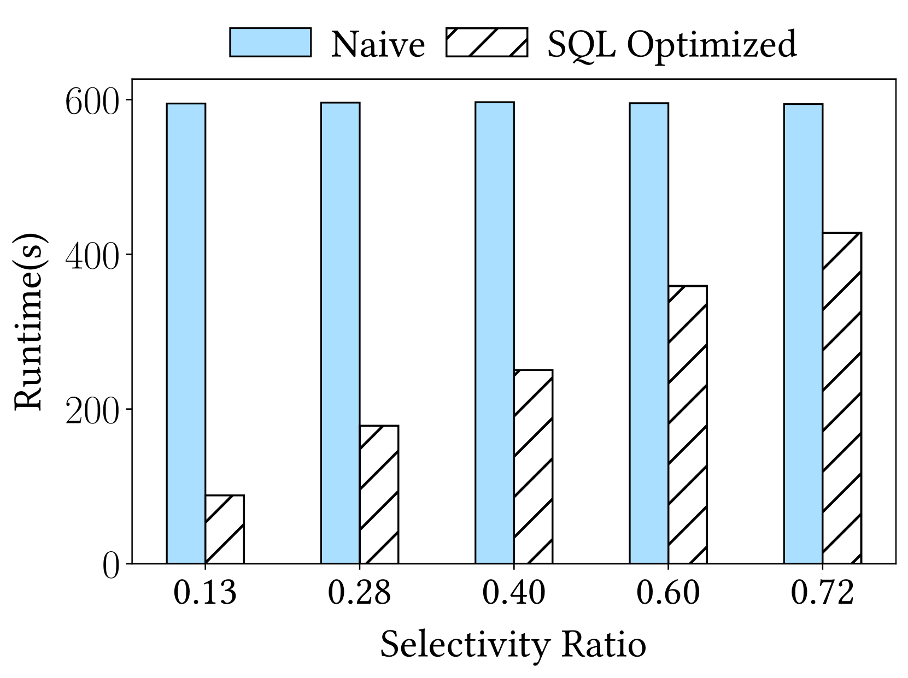

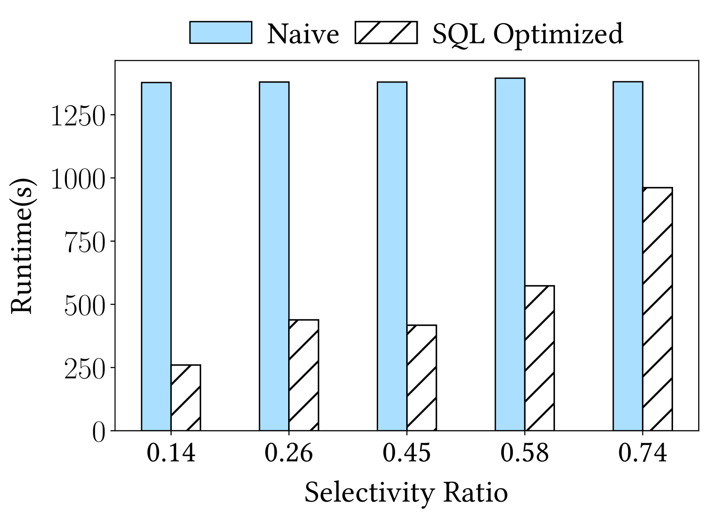

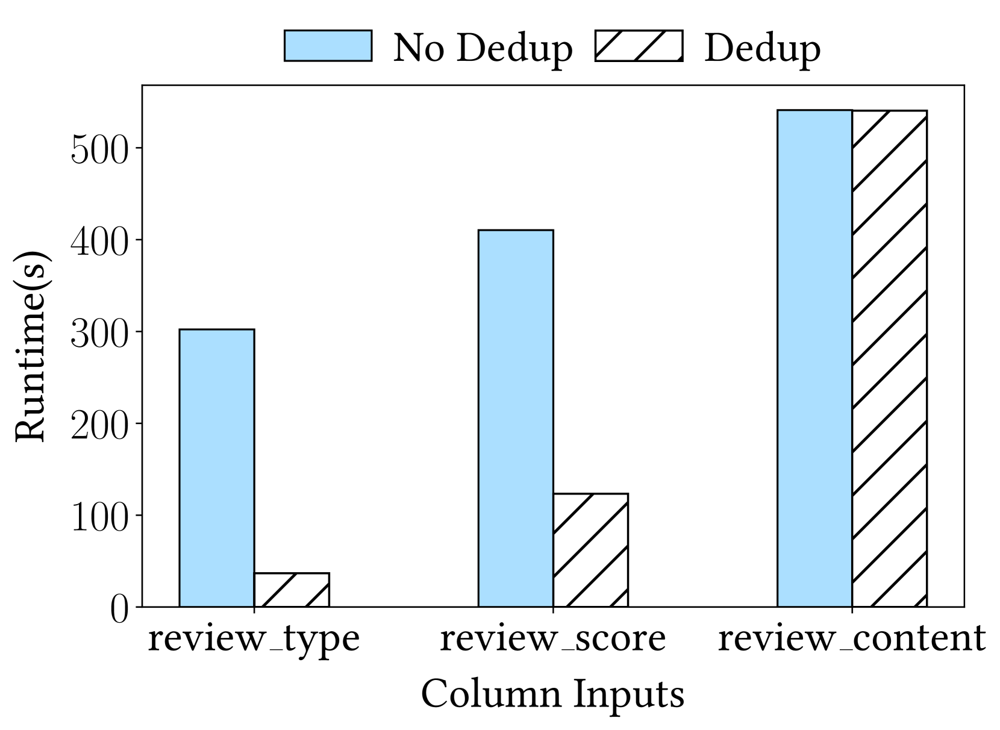

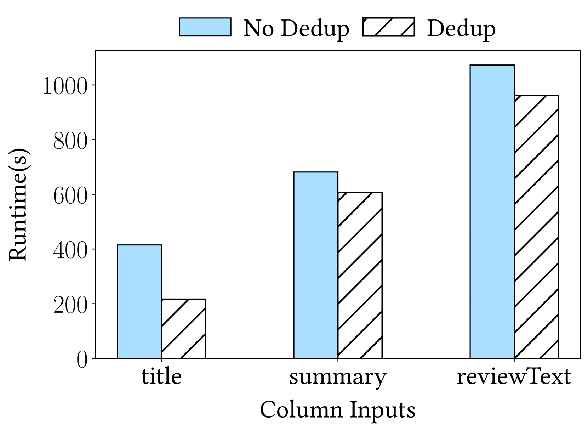