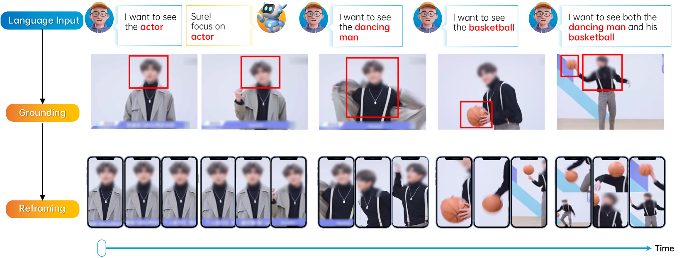
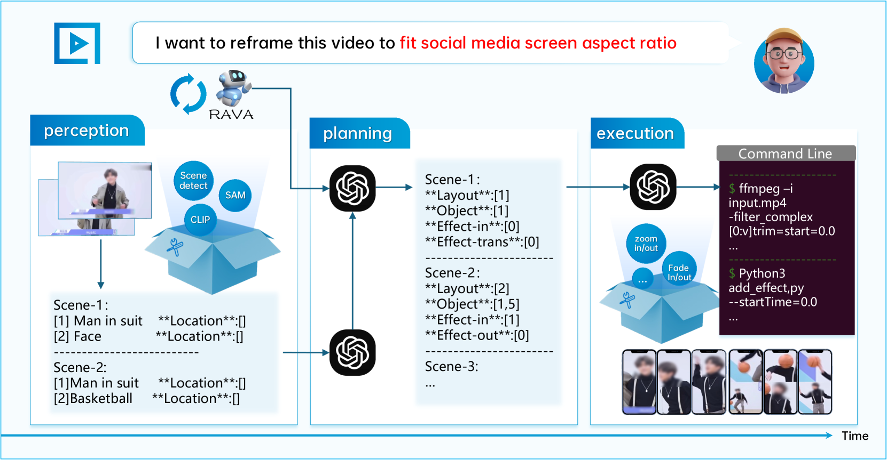
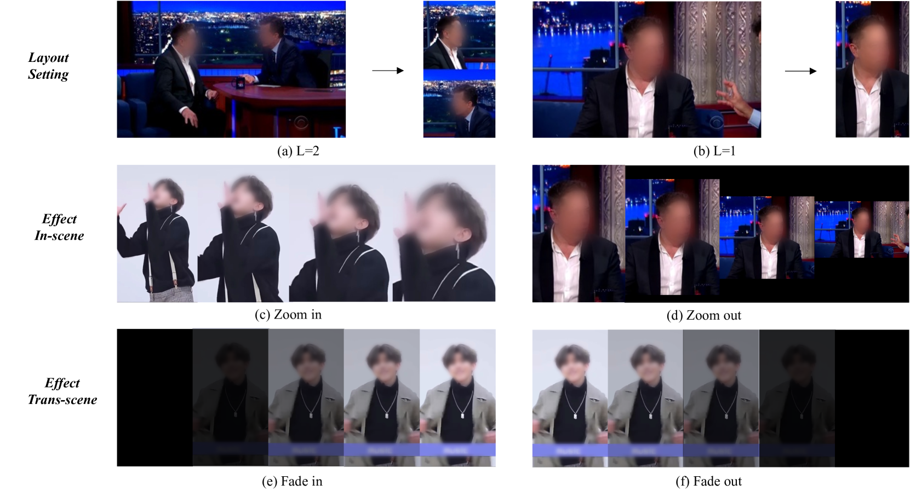
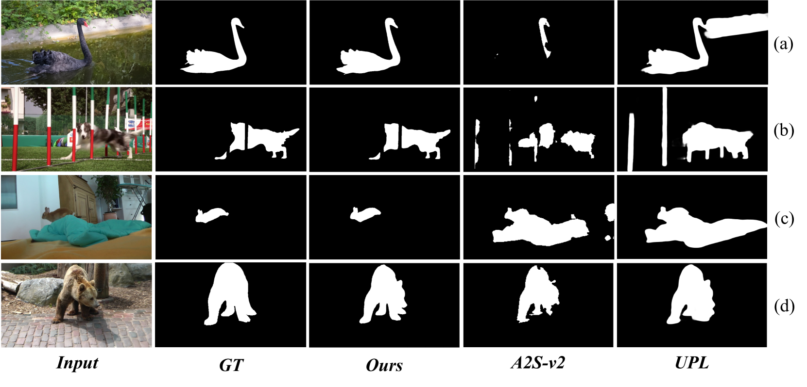
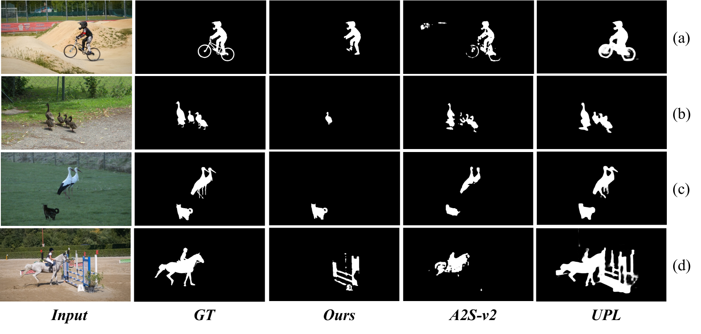
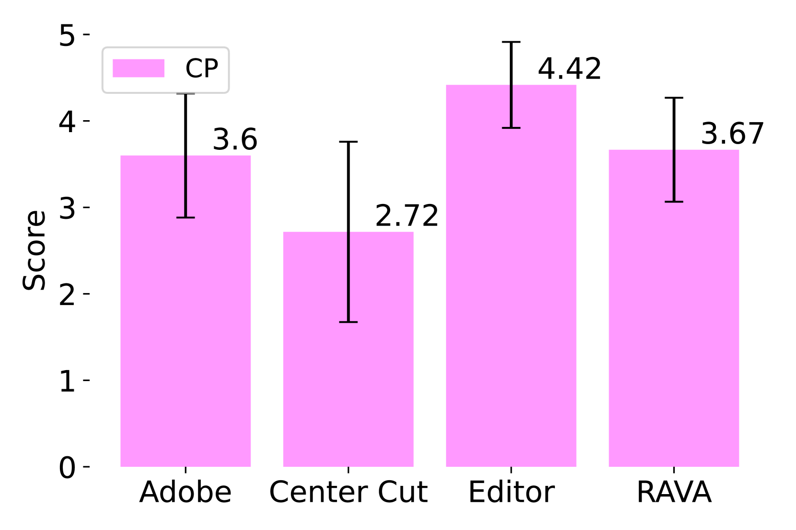
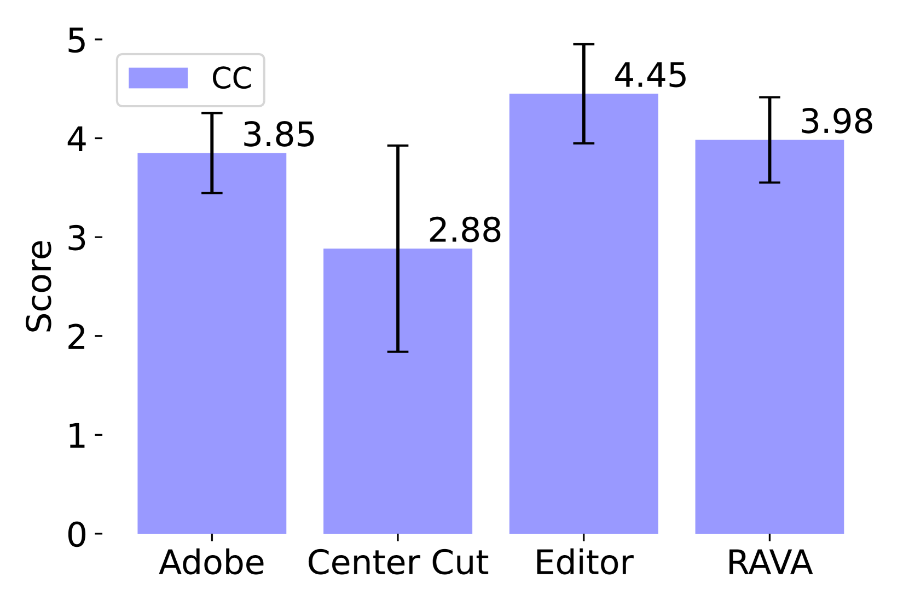
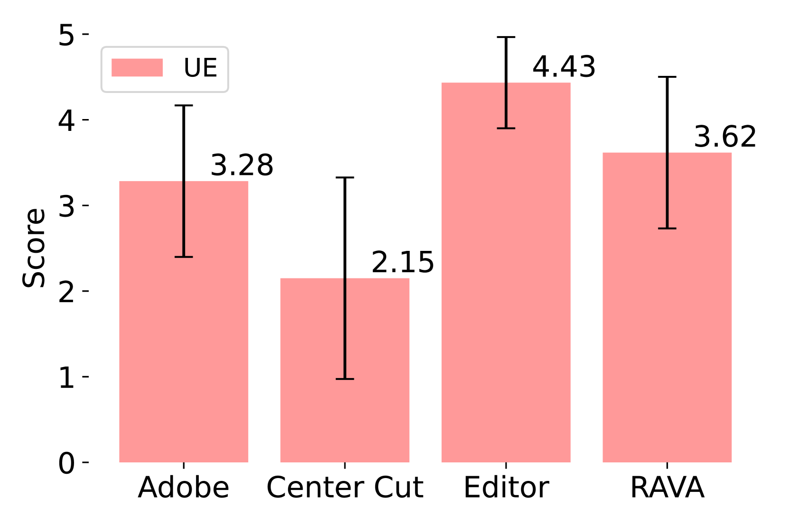
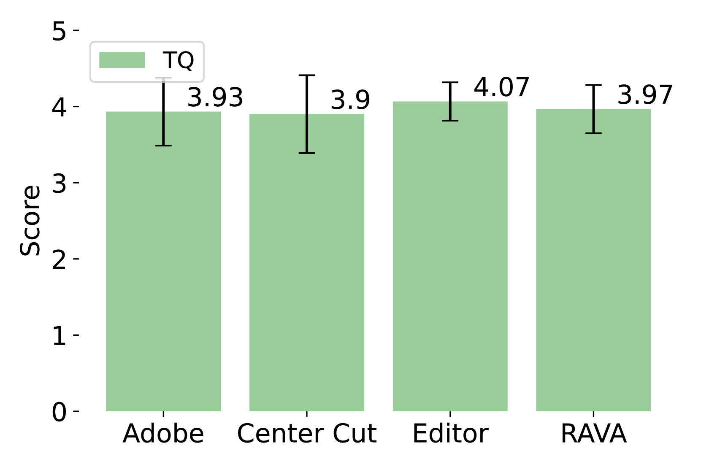

# 【重塑万物】推出 LLM 视频重构智能代理，针对开放世界场景下的视频重构任务。步骤详解：

发布时间：2024年03月09日

`Agent`

> Reframe Anything: LLM Agent for Open World Video Reframing

> 随着手机和社交媒体的广泛使用，短视频分发方式正经历变革，而如何根据不同屏幕尺寸调整视频画面布局成为一个新挑战，这一过程中需凸显视频的关键内容。以往，手动进行视频裁剪既耗时又需专业技术，成本颇高。尽管已有通过视频显著目标检测等机器学习模型尝试自动化处理，但受限于对特定训练数据的依赖，此类方法在泛化能力上存在不足。如今，功能强大的大型语言模型（LLMs）为AI技术带来了新的突破。在此背景下，我们创新提出了名为“RAVA”（Reframe Any Video Agent）的基于LLM的智能代理。RAVA结合视觉基础模型与人类指导，分三步完成视频内容重塑：首先，在感知阶段理解用户需求并解读视频素材；其次，在规划阶段制定合适的画面比例和裁剪策略；最后，在执行阶段运用编辑工具生成最终视频成品。实验证明，RAVA在视频显著目标检测及真实场景下的视频裁剪任务中表现卓越，展现出其作为一款AI赋能视频编辑工具的强大潜力。

> The proliferation of mobile devices and social media has revolutionized content dissemination, with short-form video becoming increasingly prevalent. This shift has introduced the challenge of video reframing to fit various screen aspect ratios, a process that highlights the most compelling parts of a video. Traditionally, video reframing is a manual, time-consuming task requiring professional expertise, which incurs high production costs. A potential solution is to adopt some machine learning models, such as video salient object detection, to automate the process. However, these methods often lack generalizability due to their reliance on specific training data. The advent of powerful large language models (LLMs) open new avenues for AI capabilities. Building on this, we introduce Reframe Any Video Agent (RAVA), a LLM-based agent that leverages visual foundation models and human instructions to restructure visual content for video reframing. RAVA operates in three stages: perception, where it interprets user instructions and video content; planning, where it determines aspect ratios and reframing strategies; and execution, where it invokes the editing tools to produce the final video. Our experiments validate the effectiveness of RAVA in video salient object detection and real-world reframing tasks, demonstrating its potential as a tool for AI-powered video editing.

[Arxiv](https://arxiv.org/abs/2403.06070)