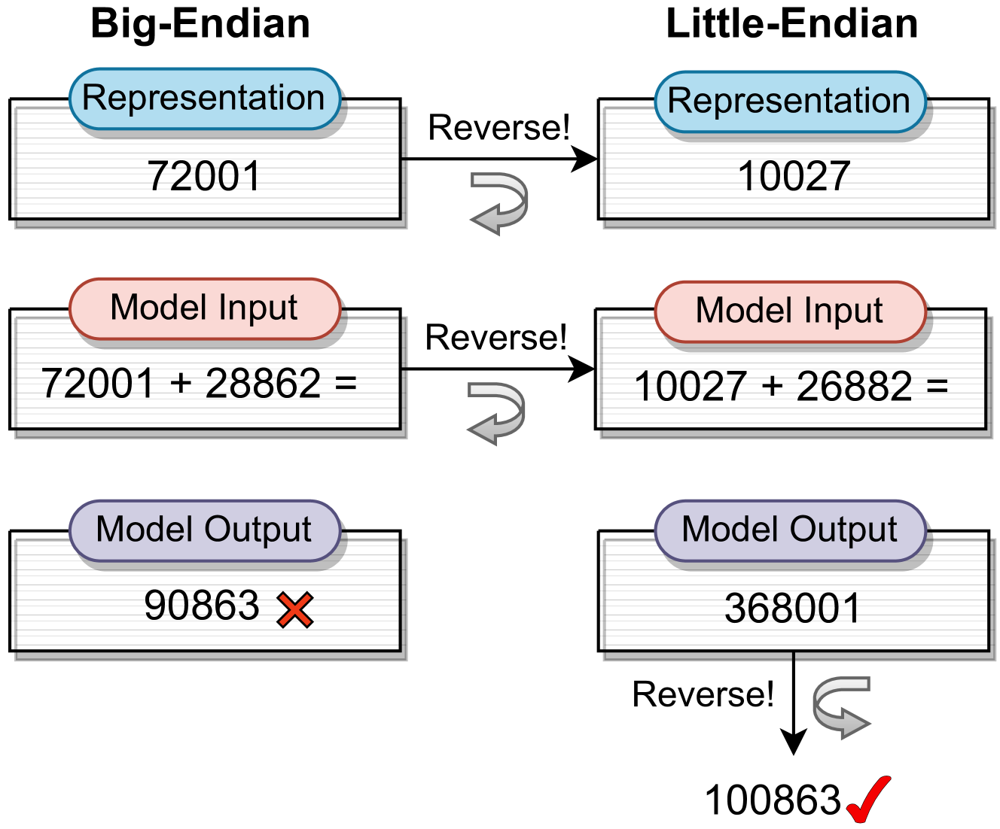
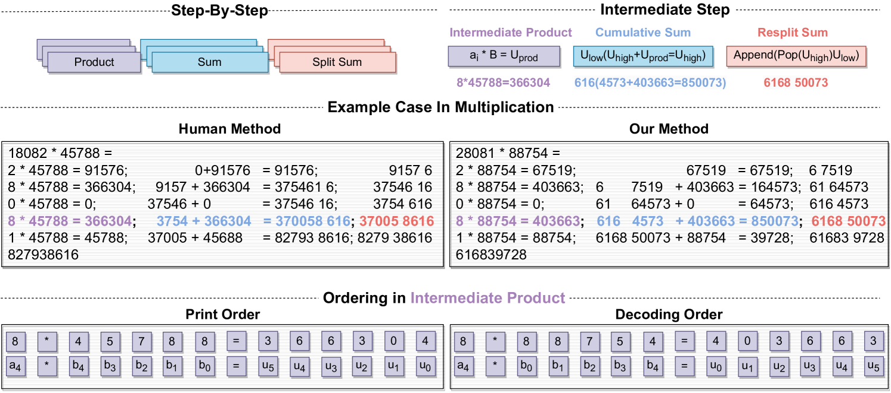
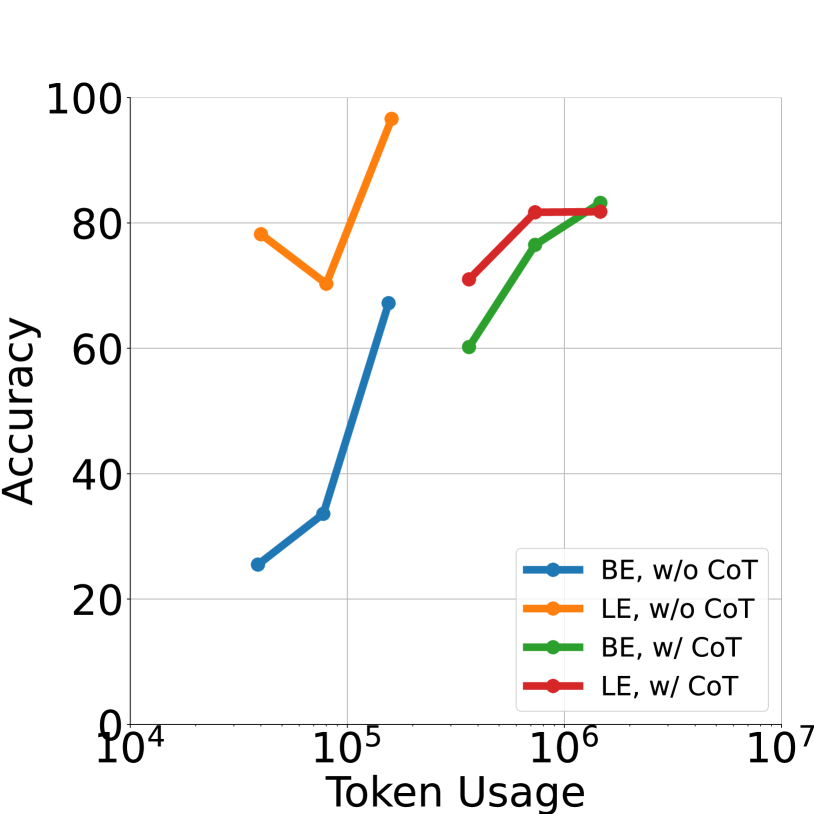
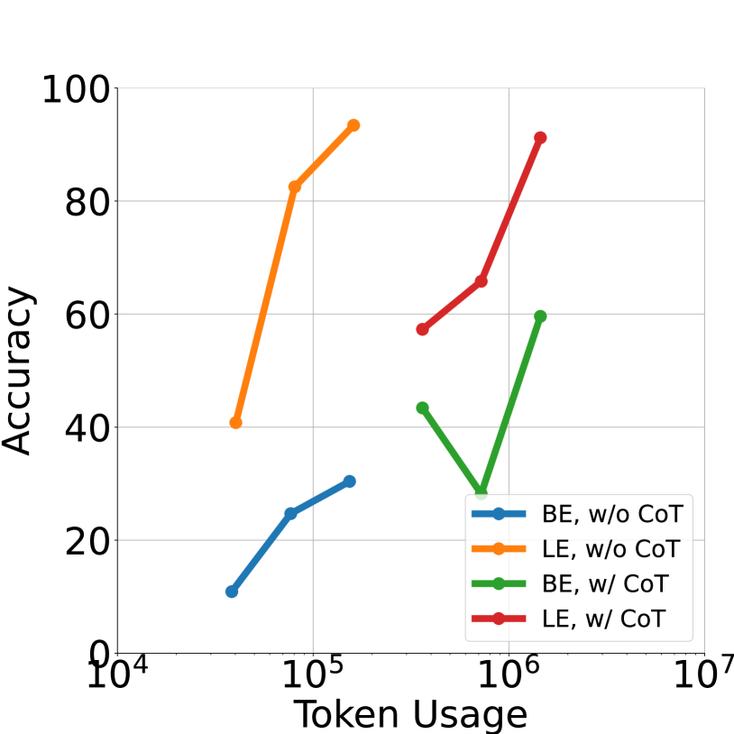
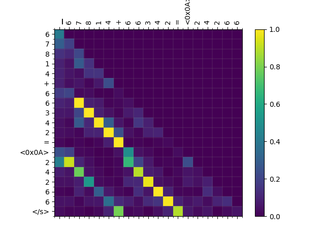

# [反转数字有玄机！在数学运算学习过程中，解码顺序确实至关重要。]

发布时间：2024年03月09日

`LLM应用`

> Reverse That Number! Decoding Order Matters in Arithmetic Learning

> 随着预训练技术的发展，现代LLMs展现出了高效掌握算术运算的能力。但目前主流的教学方法虽然认识到数字顺序对算术计算的关键作用，却普遍采用逐个步骤的方式来训练LLMs，暗示提升性能需精细到每一步骤。而我们的研究另辟蹊径，提出一种创新策略，不仅重视从最低有效位出发重组数字顺序，并结合逐层递进的方法显著降低了运算复杂性。我们在一系列广泛的实验中研发并运用了此法，相较于之前的SOTA方法，结果显示在仅消耗约三分之一训练时所需令牌的前提下，整体准确率得到提升。为了便于复现和深入研究，我们已在\url{https://anonymous.4open.science/r/RAIT-9FB7/} 公开分享了代码和数据集。

> Recent advancements in pretraining have demonstrated that modern Large Language Models (LLMs) possess the capability to effectively learn arithmetic operations. However, despite acknowledging the significance of digit order in arithmetic computation, current methodologies predominantly rely on sequential, step-by-step approaches for teaching LLMs arithmetic, resulting in a conclusion where obtaining better performance involves fine-grained step-by-step. Diverging from this conventional path, our work introduces a novel strategy that not only reevaluates the digit order by prioritizing output from the least significant digit but also incorporates a step-by-step methodology to substantially reduce complexity. We have developed and applied this method in a comprehensive set of experiments. Compared to the previous state-of-the-art (SOTA) method, our findings reveal an overall improvement of in accuracy while requiring only a third of the tokens typically used during training. For the purpose of facilitating replication and further research, we have made our code and dataset publicly available at \url{https://anonymous.4open.science/r/RAIT-9FB7/}.

[Arxiv](https://arxiv.org/abs/2403.05845)