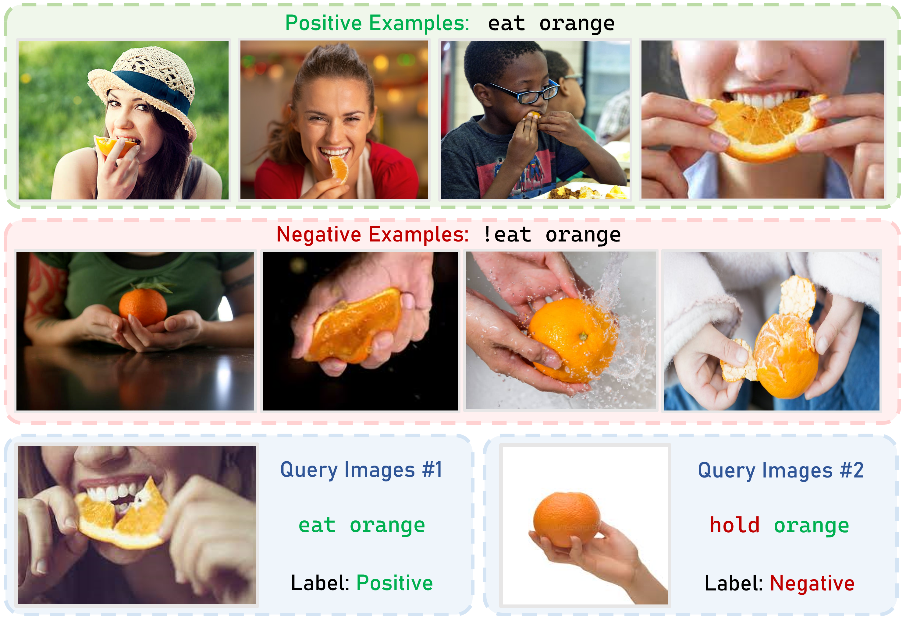
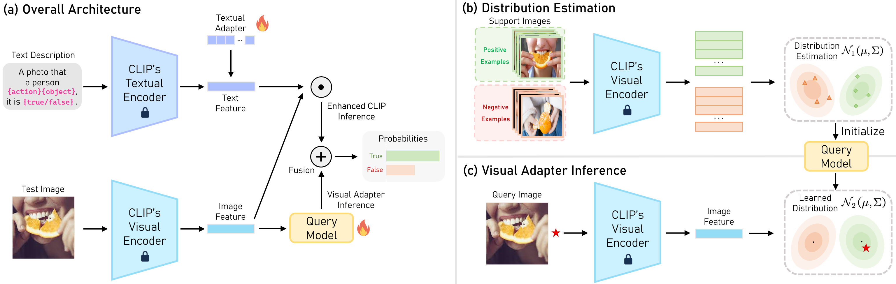

# 为解决跨模态视觉推理中的适应性问题，我们提出了一种测试阶段分布学习适配器，它能在实际推理过程中动态调整模型对不同分布数据的理解和处理能力。（由于原句较短，从准确翻译到简洁优雅的中文转换时，已尽量保持原意并增加了一些上下文信息以使句子更完整生动。）

发布时间：2024年03月09日

`Agent`

> Test-time Distribution Learning Adapter for Cross-modal Visual Reasoning

# 摘要

> VLP模型（如CLIP）展现出强大的通用视觉表征学习能力，而一些方法试图借助VLP模型习得的知识，以有限监督方式高效将其应用于下游任务。但现有方法或引入偏置表征，或需较高计算复杂度，这在微调CLIP模型时降低了效果。另外，针对特定领域训练的模型，在面对未知领域时往往泛化性能欠佳。本文提出了一种创新的方法——测试时分布学习适配器（TT-DNA），它能在测试阶段直接发挥作用。具体而言，我们运用高斯分布拟合少量支持图像的视觉特征，从而从支持集中汲取知识。基于查询图像与支持图像特征分布间的余弦相似度作为视觉适配器预测依据，然后将此预测结果与原始CLIP预测通过残差连接融合，生成最终预测结果。大量实验证明，在进行人类对象交互的视觉推理任务时，我们的TT-DNA方案显著优于当前最先进的方法，具有较大优势。

> Vision-Language Pre-Trained (VLP) models, such as CLIP, have demonstrated remarkable effectiveness in learning generic visual representations. Several approaches aim to efficiently adapt VLP models to downstream tasks with limited supervision, aiming to leverage the acquired knowledge from VLP models. However, these methods suffer from either introducing biased representations or requiring high computational complexity, which hinders their effectiveness in fine-tuning the CLIP model. Moreover, when a model is trained on data specific to a particular domain, its ability to generalize to uncharted domains diminishes. In this work, we propose Test-Time Distribution LearNing Adapter (TT-DNA) which directly works during the testing period. Specifically, we estimate Gaussian distributions to model visual features of the few-shot support images to capture the knowledge from the support set. The cosine similarity between query image and the feature distribution of support images is used as the prediction of visual adapter. Subsequently, the visual adapter's prediction merges with the original CLIP prediction via a residual connection, resulting in the final prediction. Our extensive experimental results on visual reasoning for human object interaction demonstrate that our proposed TT-DNA outperforms existing state-of-the-art methods by large margins.

[Arxiv](https://arxiv.org/abs/2403.06059)