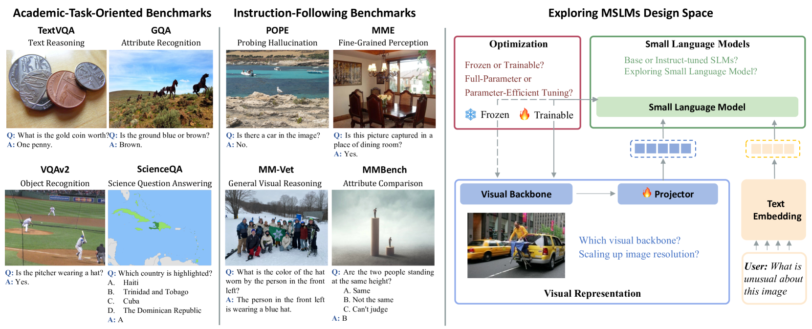
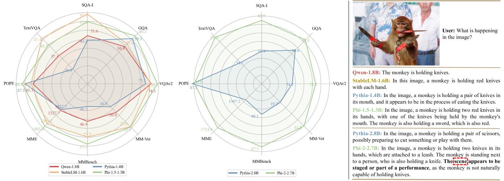
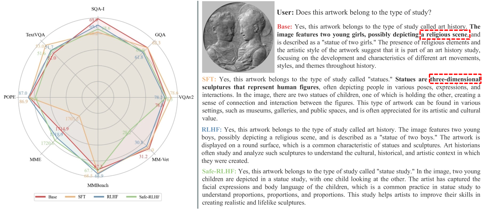
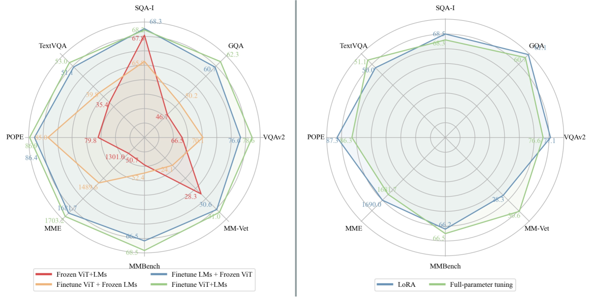

# [对基于小型语言模型的多模态助手进行一次深入彻底的重构与升级]

发布时间：2024年03月10日

`Agent`

> A Comprehensive Overhaul of Multimodal Assistant with Small Language Models

> MLLMs 在处理涉及视觉理解与推理的任务时表现出众，但受限于高昂的计算资源需求，无论是训练还是推断阶段，使得其广泛应用受到局限，仅能在部分研究和用户社群中使用。本文聚焦于探究 MSLMs 的设计特点，并创新性地提出了一个名为 Mipha 的高效多模态助手方案，它巧妙地整合了视觉表达、语言模型及优化策略等多元要素。实验结果显示，在保持训练数据规模不变的前提下，我们的 Mipha-3B 模型在多个基准测试上显著优于当前最先进大型 MLLMs，特别是在与 LLaVA-1.5-13B 对比时优势明显。通过深度剖析，我们为构建媲美 MLLMs 的强力 MSLMs 提供了有价值的洞见与实践指南。相关代码已开源，访问地址为 https://github.com/zhuyiche/Mipha。

> Multimodal Large Language Models (MLLMs) have showcased impressive skills in tasks related to visual understanding and reasoning. Yet, their widespread application faces obstacles due to the high computational demands during both the training and inference phases, restricting their use to a limited audience within the research and user communities. In this paper, we investigate the design aspects of Multimodal Small Language Models (MSLMs) and propose an efficient multimodal assistant named Mipha, which is designed to create synergy among various aspects: visual representation, language models, and optimization strategies. We show that without increasing the volume of training data, our Mipha-3B outperforms the state-of-the-art large MLLMs, especially LLaVA-1.5-13B, on multiple benchmarks. Through detailed discussion, we provide insights and guidelines for developing strong MSLMs that rival the capabilities of MLLMs. Our code is available at https://github.com/zhuyiche/Mipha.

[Arxiv](https://arxiv.org/abs/2403.06199)