# 想知道自己是否正被追踪？来领略一下LLMs在零样本轨迹追踪上的神奇力量吧！

发布时间：2024年03月10日

`LLM应用`

> Are You Being Tracked? Discover the Power of Zero-Shot Trajectory Tracing with LLMs!

# 摘要

> 当前热议焦点在于LLMs如何能成为AIoT中不可或缺的组成部分，有效解读复杂轨迹信息。本研究推出了LLMTrack模型，它创新运用单提示技术，将角色扮演、步步推理法与未经处理的IMU数据融合，展示了LLMs如何在零样本情况下实现轨迹识别。我们采用包含室内、室外多种典型轨迹的真实世界数据集对该模型进行验证，在所有测试情境下，LLMTrack表现卓越，不仅超越传统机器学习方法的性能标准，甚至在不依赖特定训练数据集的情况下，也优于当代最尖端的深度学习模型。研究结果显示，巧妙设计的提示能使LLMs充分挖掘自身海量知识储备，高效分析原始传感器数据。

> There is a burgeoning discussion around the capabilities of Large Language Models (LLMs) in acting as fundamental components that can be seamlessly incorporated into Artificial Intelligence of Things (AIoT) to interpret complex trajectories. This study introduces LLMTrack, a model that illustrates how LLMs can be leveraged for Zero-Shot Trajectory Recognition by employing a novel single-prompt technique that combines role-play and think step-by-step methodologies with unprocessed Inertial Measurement Unit (IMU) data. We evaluate the model using real-world datasets designed to challenge it with distinct trajectories characterized by indoor and outdoor scenarios. In both test scenarios, LLMTrack not only meets but exceeds the performance benchmarks set by traditional machine learning approaches and even contemporary state-of-the-art deep learning models, all without the requirement of training on specialized datasets. The results of our research suggest that, with strategically designed prompts, LLMs can tap into their extensive knowledge base and are well-equipped to analyze raw sensor data with remarkable effectiveness.

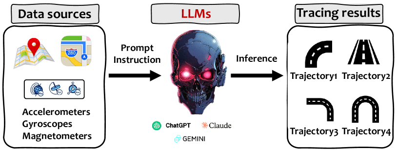

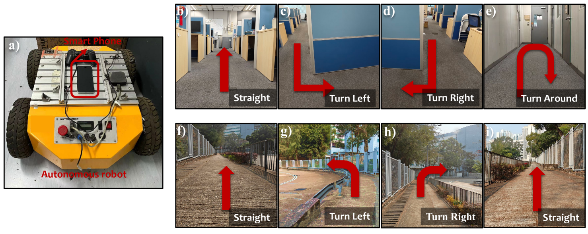

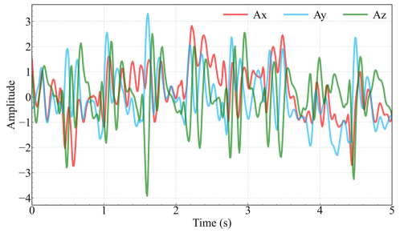

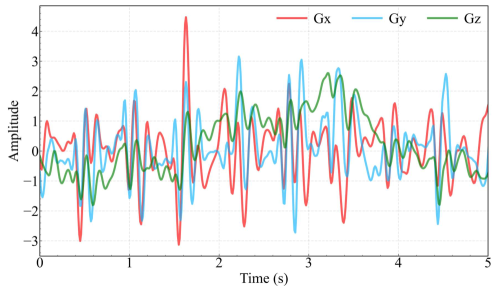

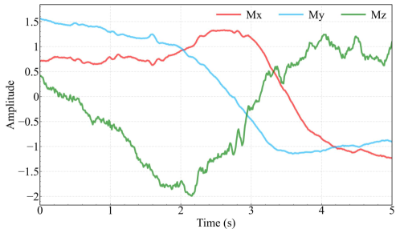

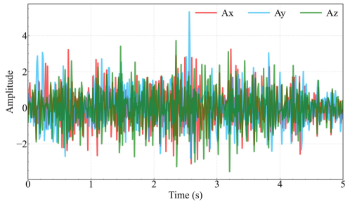

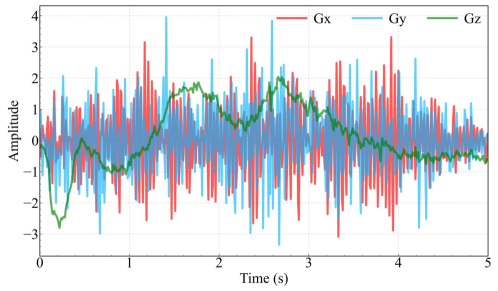

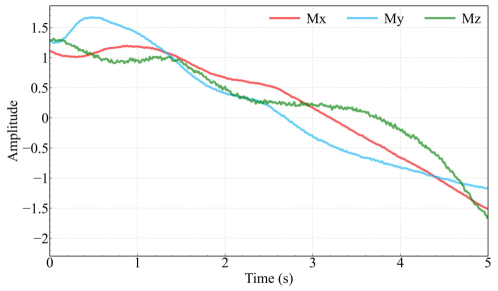

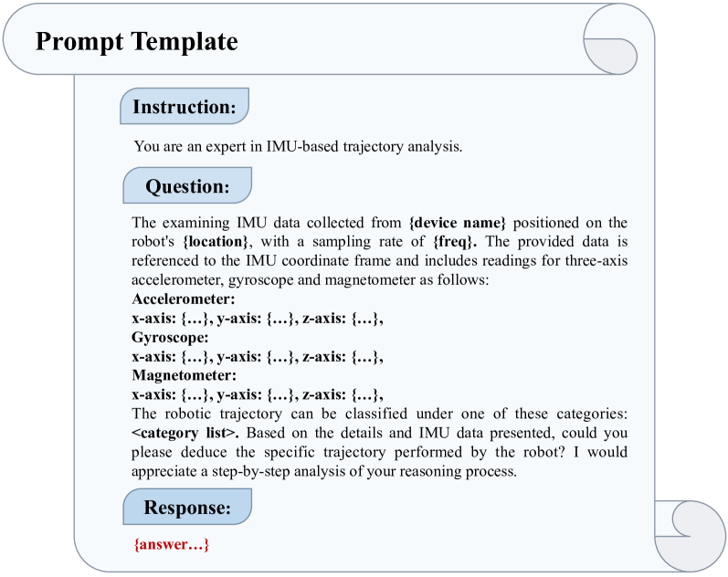

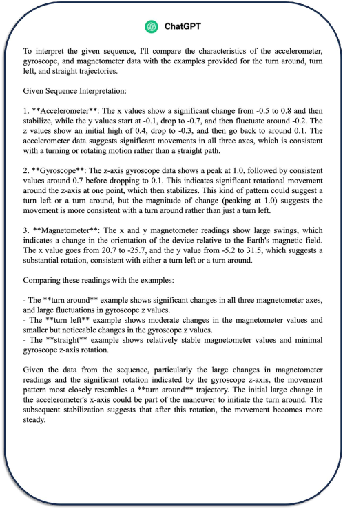

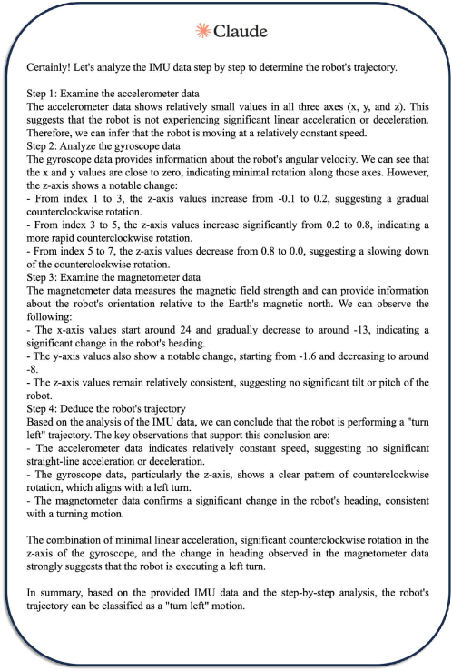

[Arxiv](https://arxiv.org/abs/2403.06201)