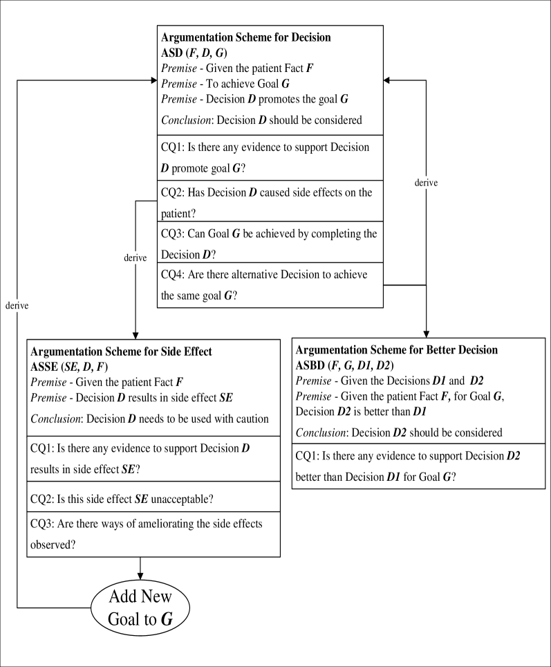
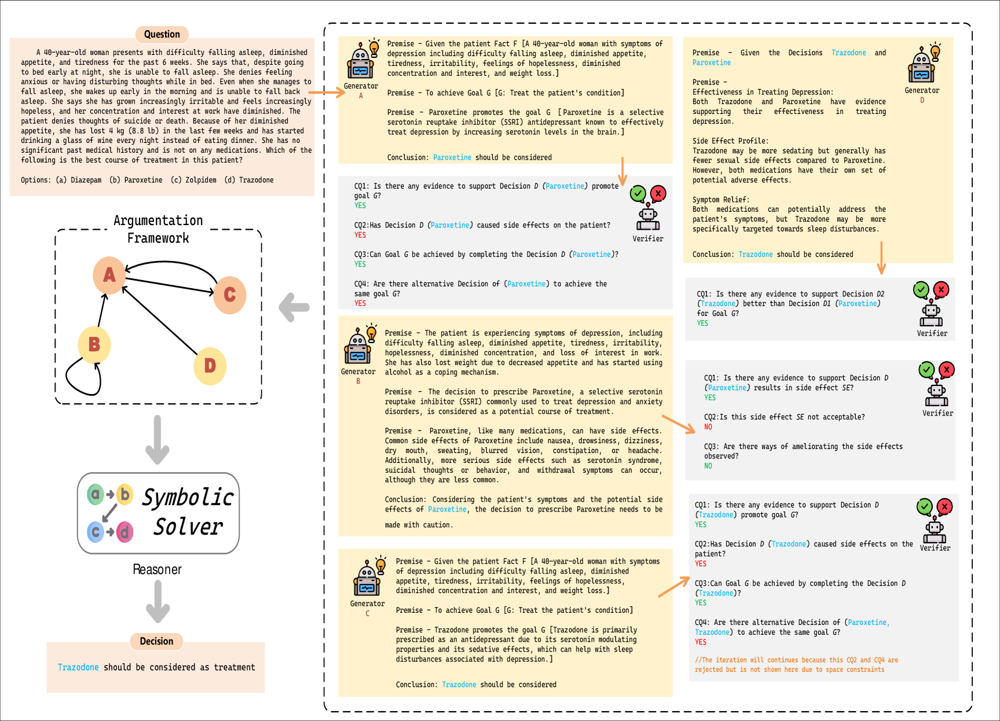
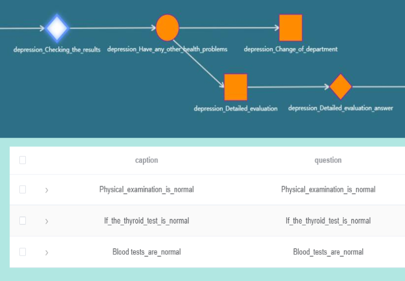
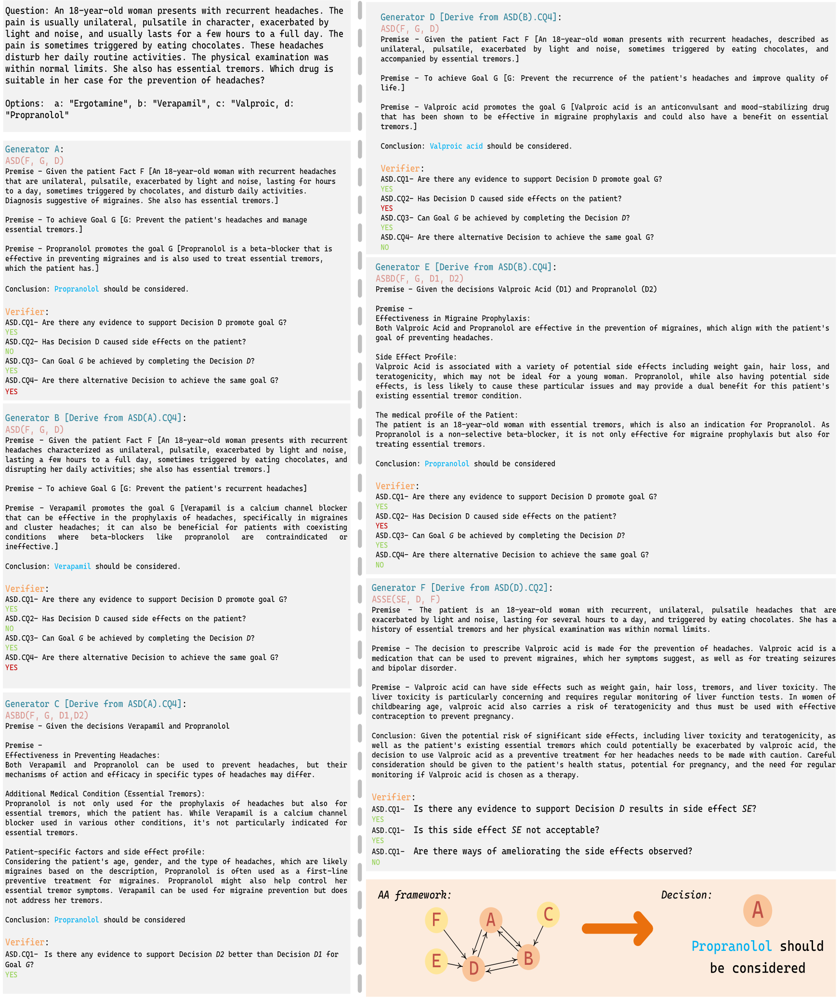
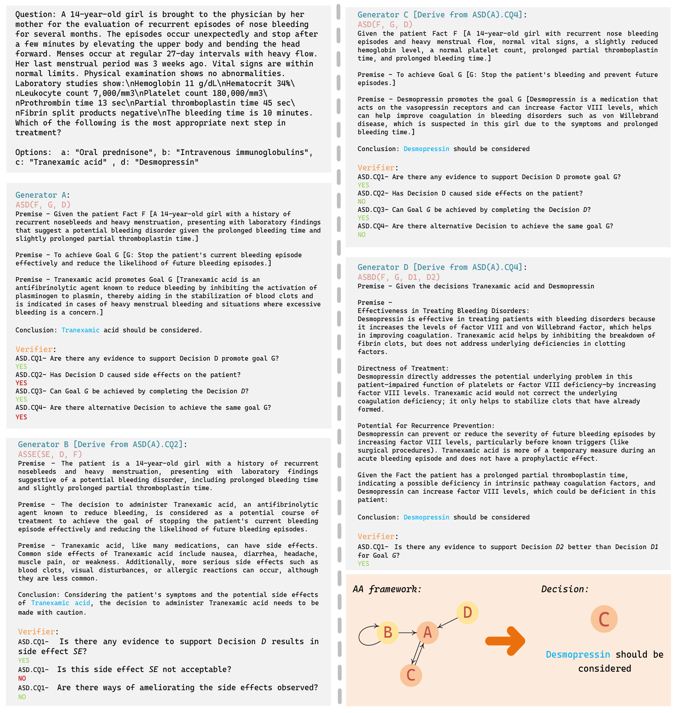

# ArgMed-Agents 是一种运用大型语言模型与论证方案相结合的方法，旨在为临床决策推理提供清晰、可解释的依据。

发布时间：2024年03月10日

`Agent`

> ArgMed-Agents: Explainable Clinical Decision Reasoning with Large Language Models via Argumentation Schemes

> 在临床推理场景应用LLMs时，面临两大挑战：一方面，尽管LLMs在NLP任务上的表现抢眼，但在解决复杂推理和规划问题时却难以满足期望；另一方面，LLMs采用的不可解释决策方法与临床医生的认知过程大相径庭，降低了用户的信任度。为此，我们提出了名为ArgMed-Agents的多智能体框架，其目标是通过互动交流，使LLM驱动的智能体能实现清晰、可解释的临床决策推理。ArgMed-Agents运用临床决策论证方案进行自我论证迭代，并以有向图形式展现相互矛盾的论证关系网络。最终，由Reasoner找出一系列理性而一致的论据支撑决策。通过自主生成推理解释，ArgMed-Agents让LLMs成功模拟了临床论证推理过程。实验证明，相较于其他提示策略，ArgMed-Agents在复杂临床决策推理任务上不仅提升了准确性，更关键的是，它提供的决策解释显著增强了用户的信赖感。

> There are two main barriers to using large language models (LLMs) in clinical reasoning. Firstly, while LLMs exhibit significant promise in Natural Language Processing (NLP) tasks, their performance in complex reasoning and planning falls short of expectations. Secondly, LLMs use uninterpretable methods to make clinical decisions that are fundamentally different from the clinician's cognitive processes. This leads to user distrust. In this paper, we present a multi-agent framework called ArgMed-Agents, which aims to enable LLM-based agents to make explainable clinical decision reasoning through interaction. ArgMed-Agents performs self-argumentation iterations via Argumentation Scheme for Clinical Decision (a reasoning mechanism for modeling cognitive processes in clinical reasoning), and then constructs the argumentation process as a directed graph representing conflicting relationships. Ultimately, Reasoner(a symbolic solver) identify a series of rational and coherent arguments to support decision. ArgMed-Agents enables LLMs to mimic the process of clinical argumentative reasoning by generating explanations of reasoning in a self-directed manner. The setup experiments show that ArgMed-Agents not only improves accuracy in complex clinical decision reasoning problems compared to other prompt methods, but more importantly, it provides users with decision explanations that increase their confidence.

[Arxiv](https://arxiv.org/abs/2403.06294)