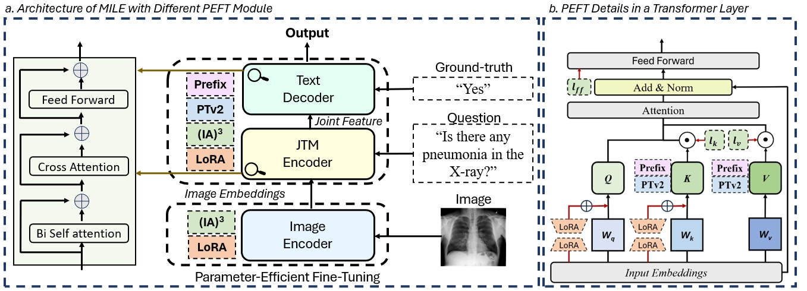
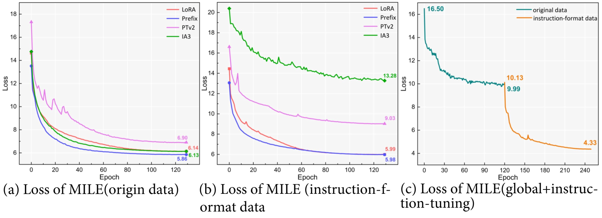
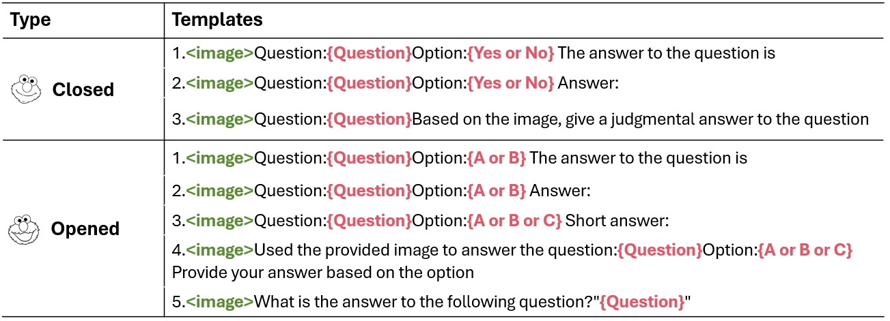
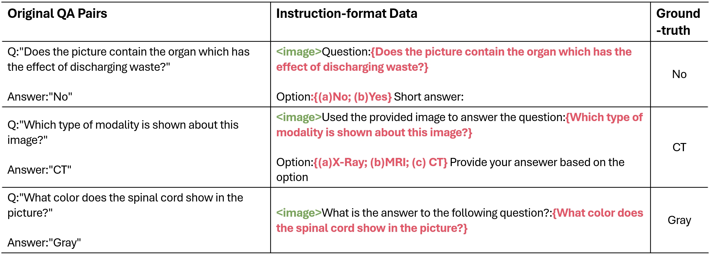

# [LLMs 的微调技术是否能在医学多模态领域奏效呢？](https://arxiv.org/abs/2403.06407)

发布时间：2024年03月10日

`LLM应用`

``

`迁移学习`

> Can LLMs' Tuning Methods Work in Medical Multimodal Domain?

> 尽管LLMs在掌握全球知识上表现出色，但在特定细分领域的适应仍需精准调节。鉴于模型庞大，传统全局微调策略对大模型来说代价高昂且可能削弱泛化性能。因此，一系列创新的参数高效微调（PEFT）技术涌现出来，在LLMs和大型视觉-语言模型（LVLMs）中都取得了瞩目成就。在医学领域，对医疗视觉-语言预训练模型（VLP）进行微调至关重要，以便将其应用于具体任务。那么，能否将大模型的微调策略迁移到医学领域以提升迁移学习效率呢？本研究深度剖析了LLMs的微调技术，并通过大量实验从训练数据层和模型结构层探究大模型微调方法对医学领域现存多模态模型的具体影响。我们揭示了这些微调方法对医疗VLMs的不同作用，并找出了最为有效的医疗VLP模型微调路径。希望通过此研究，能为医学领域的研究者提供优化VLMs训练投入、助力VLMs在医疗健康领域更广泛应用的指引。待论文被接收后，我们将公开相关的代码和数据集。

> While large language models (LLMs) excel in world knowledge understanding, adapting them to specific subfields requires precise adjustments. Due to the model's vast scale, traditional global fine-tuning methods for large models can be computationally expensive and impact generalization. To address this challenge, a range of innovative Parameters-Efficient Fine-Tuning (PEFT) methods have emerged and achieved remarkable success in both LLMs and Large Vision-Language Models (LVLMs). In the medical domain, fine-tuning a medical Vision-Language Pretrained (VLP) model is essential for adapting it to specific tasks. Can the fine-tuning methods for large models be transferred to the medical field to enhance transfer learning efficiency? In this paper, we delve into the fine-tuning methods of LLMs and conduct extensive experiments to investigate the impact of fine-tuning methods for large models on existing multimodal models in the medical domain from the training data level and the model structure level. We show the different impacts of fine-tuning methods for large models on medical VLMs and develop the most efficient ways to fine-tune medical VLP models. We hope this research can guide medical domain researchers in optimizing VLMs' training costs, fostering the broader application of VLMs in healthcare fields. Code and dataset will be released upon acceptance.

