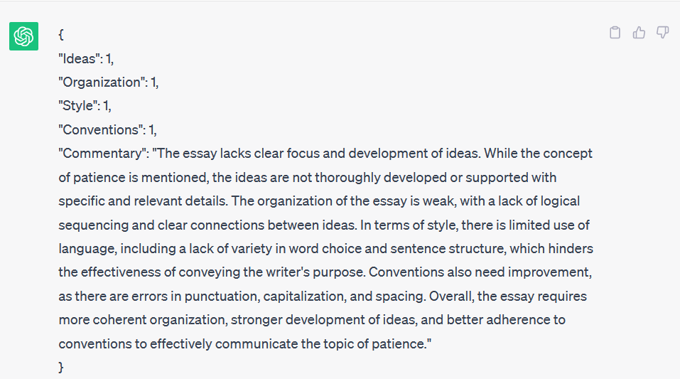

# 大型语言模型是否具备自动评分书面作文的能力？

发布时间：2024年03月10日

`LLM应用`

> Can Large Language Models Automatically Score Proficiency of Written Essays?

# 摘要

> 尽管过去半个世纪针对自动化作文评分(AES)问题已提出众多方法，实际效果仍有待提高。基于转换器架构的大型语言模型(LLMs)在各类任务上展示出卓越性能。本文探讨了拥有深厚语言理解力的LLMs能否有效分析并为书面作文打分。我们选择了ChatGPT和Llama两款广受欢迎的LLMs进行试验，并力求揭示它们在AES任务上的整体及个体写作特质层面，相较于当前最先进(SOTA)模型的性能定位。通过巧妙应用提示工程策略，我们设计了四种不同提示，以最大程度挖掘模型在此任务中的潜能。在ASAP数据集上的实验证明了若干引人关注的现象：一，选取恰当的提示对于模型及其所对应任务至关重要；二，ChatGPT与Llama在AES任务上展现相近的平均水平，其中ChatGPT略胜一筹；三，尽管两者的预测性能与SOTA模型相比存在一定差距，但它们所提供的反馈有助于提升作文质量，这一特点有望为教师和学生带来实质性的帮助。

> Although several methods were proposed to address the problem of automated essay scoring (AES) in the last 50 years, there is still much to desire in terms of effectiveness. Large Language Models (LLMs) are transformer-based models that demonstrate extraordinary capabilities on various tasks. In this paper, we test the ability of LLMs, given their powerful linguistic knowledge, to analyze and effectively score written essays. We experimented with two popular LLMs, namely ChatGPT and Llama. We aim to check if these models can do this task and, if so, how their performance is positioned among the state-of-the-art (SOTA) models across two levels, holistically and per individual writing trait. We utilized prompt-engineering tactics in designing four different prompts to bring their maximum potential to this task. Our experiments conducted on the ASAP dataset revealed several interesting observations. First, choosing the right prompt depends highly on the model and nature of the task. Second, the two LLMs exhibited comparable average performance in AES, with a slight advantage for ChatGPT. Finally, despite the performance gap between the two LLMs and SOTA models in terms of predictions, they provide feedback to enhance the quality of the essays, which can potentially help both teachers and students.

[Arxiv](https://arxiv.org/abs/2403.06149)