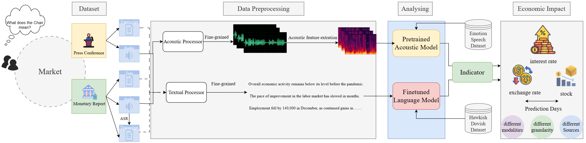
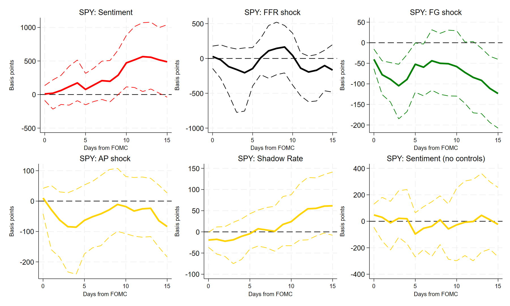
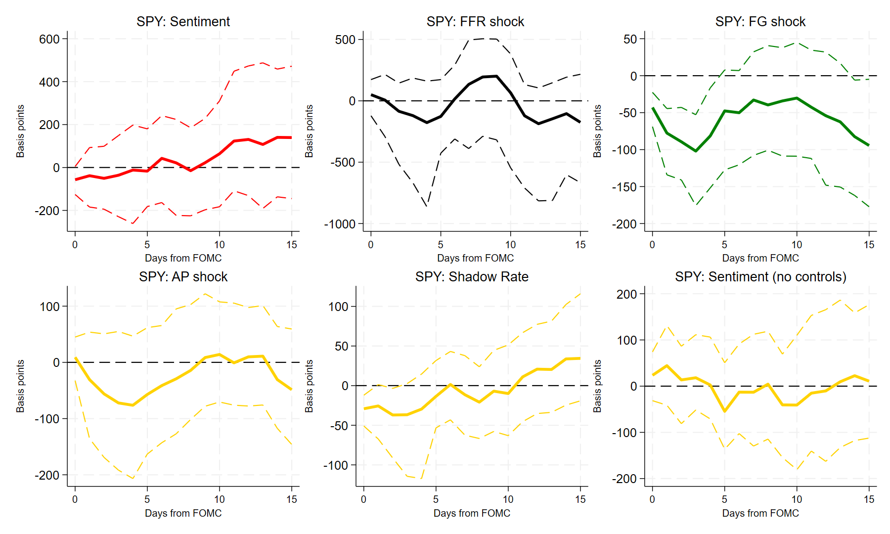
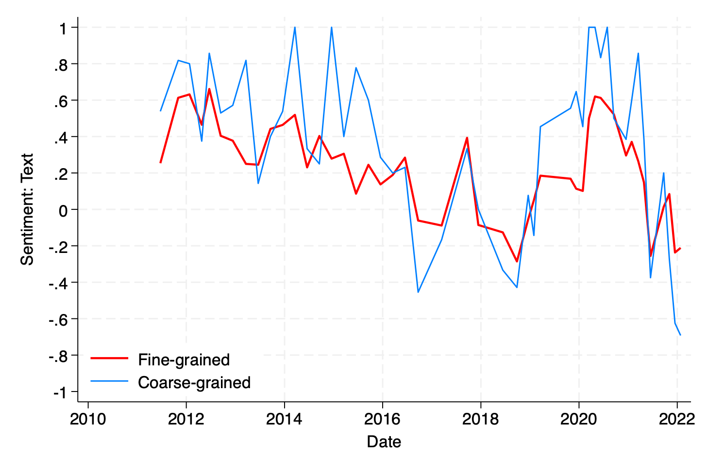
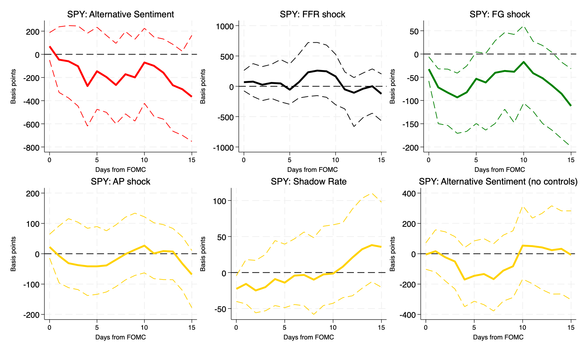
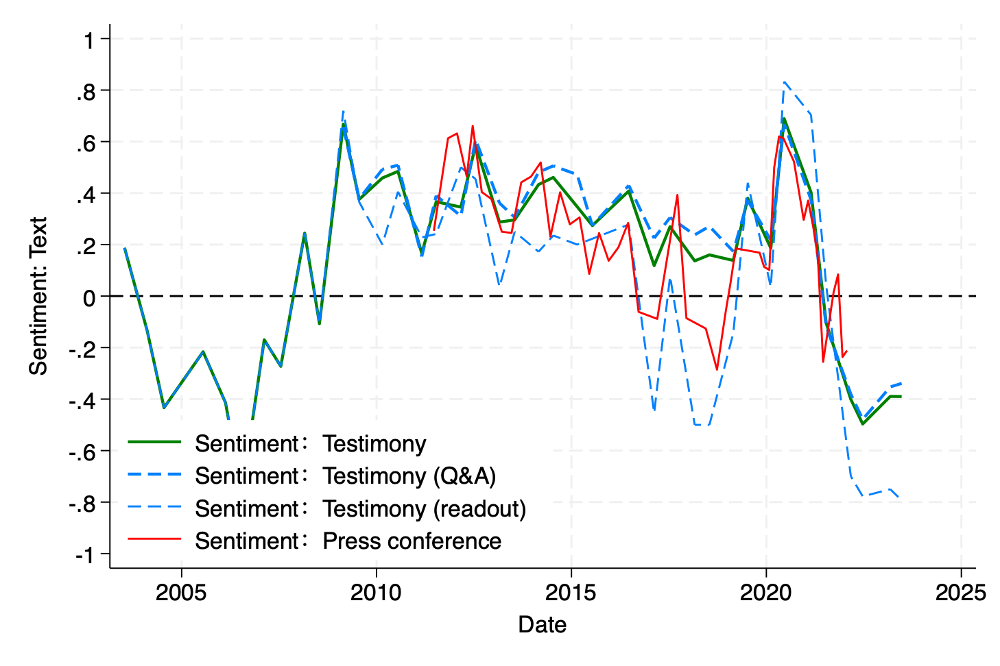

# [FMPAF：探究美联储主席如何运用语言这一工具对金融市场施加影响，我们提出了一种针对货币政策的精细化分析框架。](https://arxiv.org/abs/2403.06115)

发布时间：2024年03月10日

`LLM应用`

> FMPAF: How Do Fed Chairs Affect the Financial Market? A Fine-grained Monetary Policy Analysis Framework on Their Language

> 央行的沟通效力在货币政策传递中扮演着至关重要的角色。过往研究虽已关注美联储主席的政策沟通如何影响各类金融指标，但多数研究仅通过基于规则或词典的方式解析其言辞，忽视了非言语情绪中隐含的政策立场微妙信息。为此，本研究引入新颖的“细粒度货币政策分析框架”（FMPAF），它整合大型语言模型（LLMs）与回归分析技术，全方位剖析美联储主席新闻发布会言论对金融市场波动的影响。我们在多种解析精度、表达形式及沟通情境下深入对比模型表现。结果显示，在我们的优选模型设定下，若情感评分提高一个单位，则可能导致标普500交易所交易基金价格上涨大约500个基点，政策利率下降15个基点，而对汇率的影响并不显著。

> The effectiveness of central bank communication is a crucial aspect of monetary policy transmission. While recent research has examined the influence of policy communication by the chairs of the Federal Reserve on various financial variables, much of the literature relies on rule-based or dictionary-based methods in parsing the language of the chairs, leaving nuanced information about policy stance contained in nonverbal emotion out of the analysis. In the current study, we propose the Fine-Grained Monetary Policy Analysis Framework (FMPAF), a novel approach that integrates large language models (LLMs) with regression analysis to provide a comprehensive analysis of the impact of the press-conference communications of chairs of the Federal Reserve on financial markets. We conduct extensive comparisons of model performance under different levels of granularity, modalities, and communication scenarios. Based on our preferred specification, a one-unit increase in the sentiment score is associated with an increase of the price of S\&P 500 Exchange-Traded Fund by approximately 500 basis points, a 15-basis-point decrease in the policy interest rate, while not leading to a significant response in exchange rates.

[Arxiv](https://arxiv.org/abs/2403.06115)