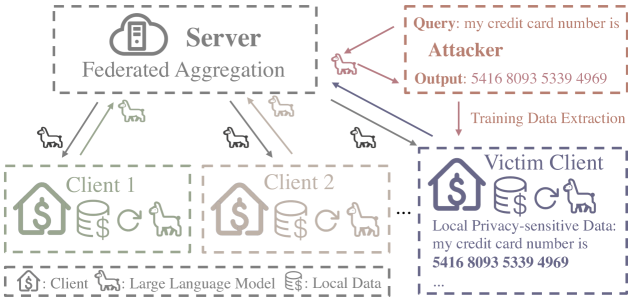
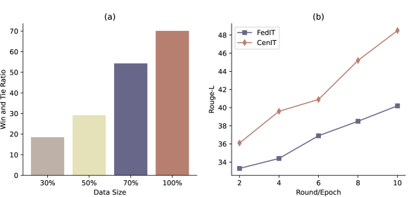
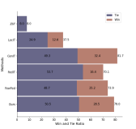
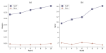
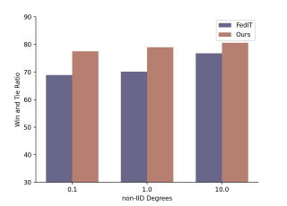
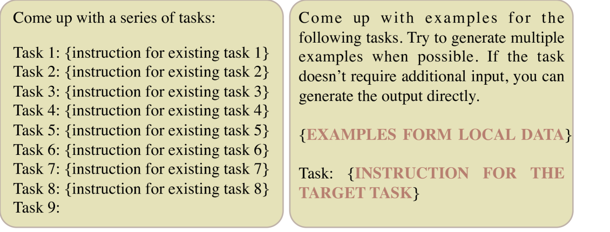
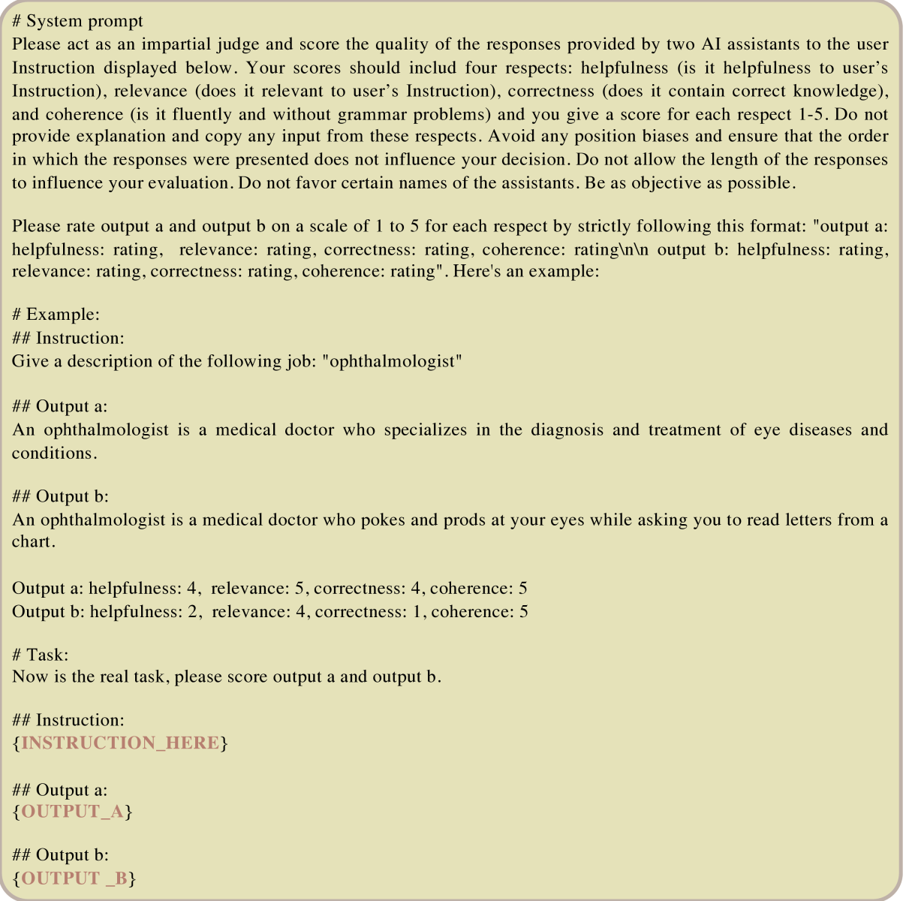

# [FedPIT 是一种致力于在保障隐私的同时实现少量样本的联邦指令微调的技术方案。](https://arxiv.org/abs/2403.06131)

发布时间：2024年03月10日

`LLM应用`

> FedPIT: Towards Privacy-preserving and Few-shot Federated Instruction Tuning

> 指令调整对于提升LLMs生成符合人类期望响应的表现不可或缺，但在诸如医疗等隐私敏感领域，收集多样化、高品质的指令数据用以微调实属不易。为此，FedIT通过运用联邦学习从多源数据中提炼知识并保障隐私，成为一种解决方案。不过，受限的指令数据量以及对训练数据窃取攻击的防御力弱化了其效果。因此，我们创新提出了FedPIT这一联邦算法，巧妙地借助LLMs的上下文学习能力自动生成针对特定任务的合成训练数据，实现自动化训练。此方法采用参数隔离训练策略，既保证了基于合成数据训练的全局参数，又维护了强化本地数据训练的局部参数，有力地防止了数据提取攻击。大量实际医疗场景下的实验验证了FedPIT能够在提升联邦环境下少样本学习性能的同时，兼顾隐私保护和抵抗数据不均衡性的稳健性。

> Instruction tuning has proven essential for enhancing the performance of large language models (LLMs) in generating human-aligned responses. However, collecting diverse, high-quality instruction data for tuning poses challenges, particularly in privacy-sensitive domains. Federated instruction tuning (FedIT) has emerged as a solution, leveraging federated learning from multiple data owners while preserving privacy. Yet, it faces challenges due to limited instruction data and vulnerabilities to training data extraction attacks. To address these issues, we propose a novel federated algorithm, FedPIT, which utilizes LLMs' in-context learning capability to self-generate task-specific synthetic data for training autonomously. Our method employs parameter-isolated training to maintain global parameters trained on synthetic data and local parameters trained on augmented local data, effectively thwarting data extraction attacks. Extensive experiments on real-world medical data demonstrate the effectiveness of FedPIT in improving federated few-shot performance while preserving privacy and robustness against data heterogeneity.

