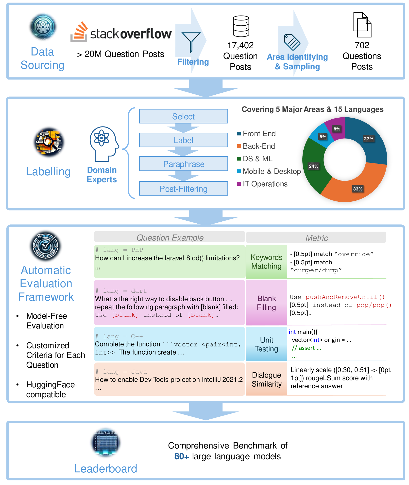
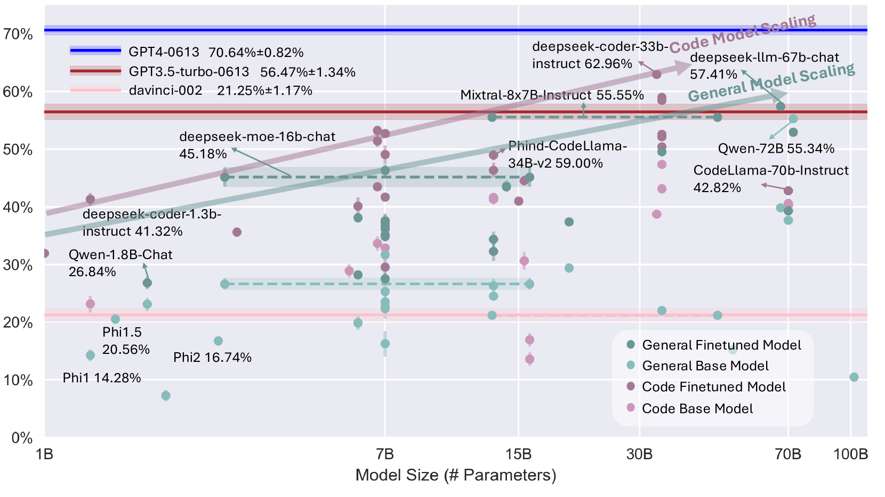

# InfiCoder-Eval：全面检验大型代码语言模型的解答问题能力

发布时间：2024年03月10日

`LLM应用` `问答系统`

> InfiCoder-Eval: Systematically Evaluating the Question-Answering Capabilities of Code Large Language Models

# 摘要

> 近年来，大型语言模型在理解和生成代码（代码LLM）方面取得了飞速进展。众多评估标准如HumanEval、DS-1000和MBPP等应运而生，专注于衡量代码LLM在代码生成任务上的表现。然而，这些标准尚不能完全覆盖代码LLM的全部潜力，它们的能力远不止于代码生成，还包括解答各类编程问题。为了解决这一问题，我们推出了InfiCoder-Eval，这是一个包含234个精选高质量Stack Overflow问题的大规模自由形式编程问答基准，覆盖了15种编程语言。该基准采用四种无模型指标，并由领域专家精心制定和明确每个问题的评价标准，以评估回答的正确性。我们对80多个代码LLM进行了全面评估，揭示了许多深刻的见解。同时，我们的深入分析为代码LLM的未来改进指明了方向。InfiCoder-Eval完全开源，可通过 https://infi-coder.github.io/inficoder-eval/ 访问，并持续更新扩展，旨在推动评估代码LLM的科学化和系统化进程。

> Large Language Models for understanding and generating code (code LLMs) have witnessed tremendous progress in recent years. With the rapid development of code LLMs, many popular evaluation benchmarks, such as HumanEval, DS-1000, and MBPP, have emerged to measure the performance of code LLMs with a particular focus on code generation tasks. However, they are insufficient to cover the full range of expected capabilities of code LLMs, which span beyond code generation to answering diverse coding-related questions. To fill this gap, we propose InfiCoder-Eval, a large-scale freeform question-answering (QA) benchmark for code, comprising 234 carefully selected high-quality Stack Overflow questions that span across 15 programming languages. To evaluate the response correctness, InfiCoder-Eval supports four types of model-free metrics and domain experts carefully choose and concretize the criterion for each question. We conduct a systematic evaluation for more than 80 code LLMs on InfiCoder-Eval, leading to a series of insightful findings. Furthermore, our detailed analyses showcase possible directions for further improvement of code LLMs. InfiCoder-Eval is fully open source at https://infi-coder.github.io/inficoder-eval/ and continuously maintaining and expanding to foster more scientific and systematic practices for evaluating code LLMs.

[Arxiv](https://arxiv.org/abs/2404.07940)