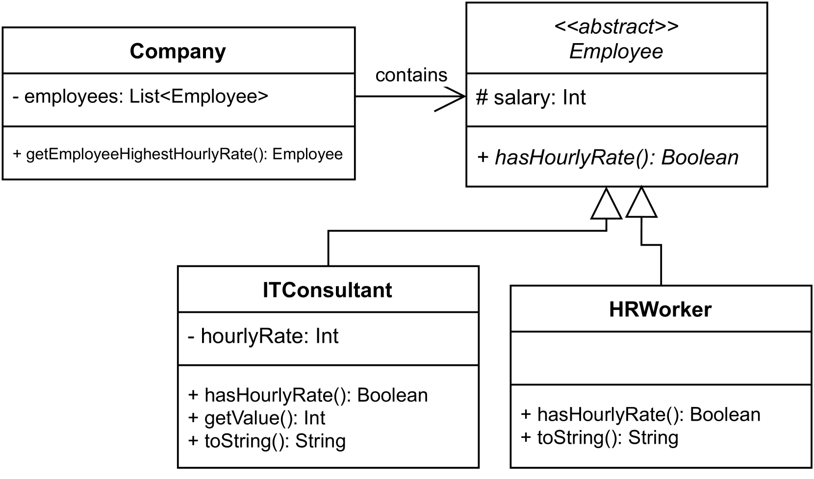

# 探究GPT-3.5、GPT-4与Bard对面向对象编程任务的处理能力，发现即便强大如LLMs，在涉及“instanceof”问题上仍存在局限性。

发布时间：2024年03月10日

`LLM应用`

> LLMs Still Can't Avoid Instanceof: An Investigation Into GPT-3.5, GPT-4 and Bard's Capacity to Handle Object-Oriented Programming Assignments

# 摘要

> LLMs 已证明是解决编程作业的有效辅助工具，但在复杂多变的 OOP 领域，目前的模型尚不能游刃有余。不同于基础编程练习，关于 LLMs 在 OOP 场景下的行为表现研究尚不充分。本研究选取了 GPT-3.5、GPT-4 及 Bard 这三款主流 LLMs，让它们尝试解答实际教育环境中使用的 OOP 实例，并利用 AAT 对解答进行自动化验证。结果显示，尽管这些模型大多能够给出可行解，但却常忽略 OOP 的最佳实践原则。其中，GPT-4 展现出了最为出色的性能，紧随其后的是 GPT-3.5，Bard 则相对较弱。因此，我们倡导在应用此类模型时更加注重代码质量，并探索将 LLMs 与 AAT 结合用于教学的可能性。总而言之，尽管 GPT-4 蕴含巨大潜力，但在 OOP 教育中使用这些模型仍需谨慎引导和监督。

> Large Language Models (LLMs) have emerged as promising tools to assist students while solving programming assignments. However, object-oriented programming (OOP), with its inherent complexity involving the identification of entities, relationships, and responsibilities, is not yet mastered by these tools. Contrary to introductory programming exercises, there exists a research gap with regard to the behavior of LLMs in OOP contexts. In this study, we experimented with three prominent LLMs - GPT-3.5, GPT-4, and Bard - to solve real-world OOP exercises used in educational settings, subsequently validating their solutions using an Automatic Assessment Tool (AAT). The findings revealed that while the models frequently achieved mostly working solutions to the exercises, they often overlooked the best practices of OOP. GPT-4 stood out as the most proficient, followed by GPT-3.5, with Bard trailing last. We advocate for a renewed emphasis on code quality when employing these models and explore the potential of pairing LLMs with AATs in pedagogical settings. In conclusion, while GPT-4 showcases promise, the deployment of these models in OOP education still mandates supervision.

[Arxiv](https://arxiv.org/abs/2403.06254)