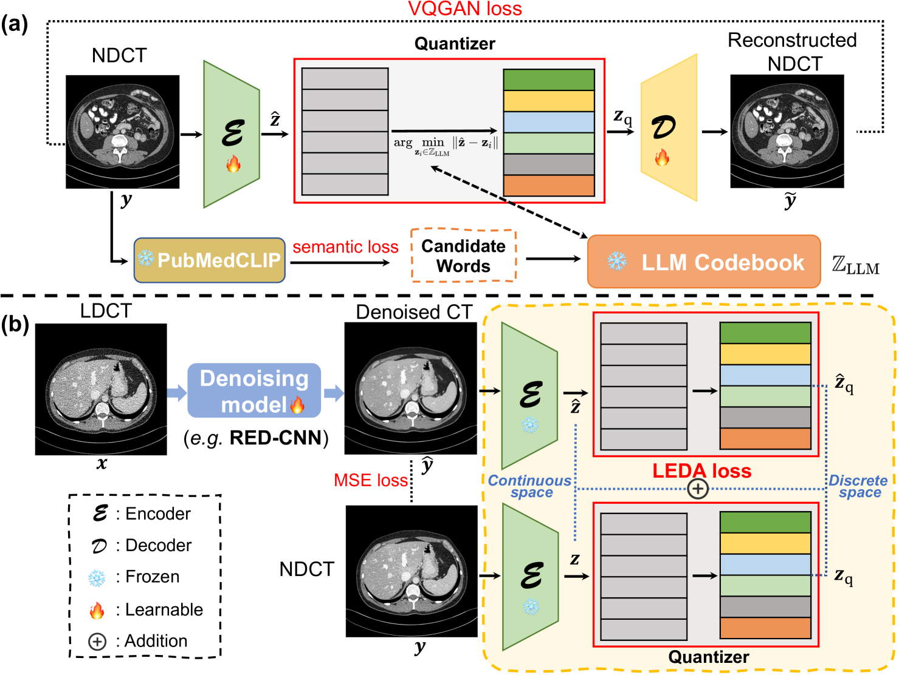
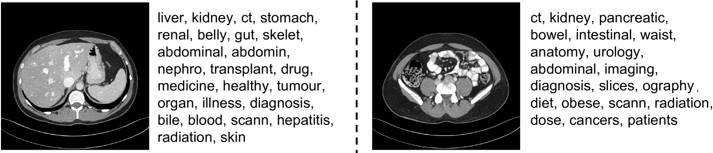
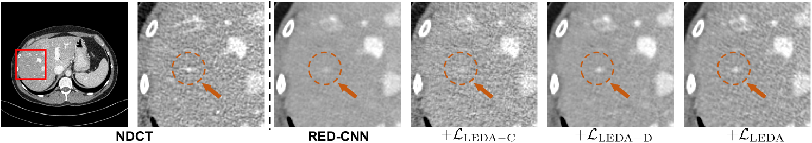
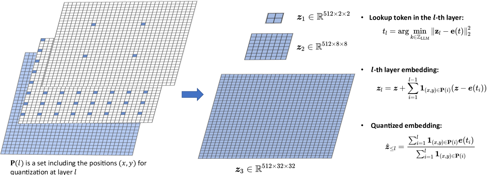

# 通过运用语言引导的双空间对齐技术，本研究致力于实现低剂量 CT 图像的有效降噪。

发布时间：2024年03月10日

`LLM应用`

> Low-dose CT Denoising with Language-engaged Dual-space Alignment

# 摘要

> 面对低剂量CT降噪任务中深度学习方法存在的过度平滑、模糊及解释性不足问题，我们创新性地设计了一种名为LEDA的“即插即用”双空间对齐策略，它巧妙运用大型语言模型的力量，在连续感知空间和离散语义空间同步对降噪后CT图像与正常剂量CT图像进行精准对齐。这一思路开启了基于LLM的低剂量CT降噪新篇章。LEDA实施分为两步：首先，预训练一个以LLM为导向的CT自编码器，它能将CT图像转化为连续高级特征并映射至令牌空间生成源于LLM词库的语义令牌；其次，通过最小化LLM导向的CT自编码器输出的降噪CT图像与其对应的正常剂量CT图像在编码高级特征和量化令牌嵌入间的差距。实验证明，在两个公开的LDCT降噪数据集上，LEDA显著提升了现有降噪模型的效果，无论是在定量评价还是定性评估上均表现出色，并且借助语言层面的图像理解赋予了模型可解释性。项目源代码已开源，访问地址为https://github.com/hao1635/LEDA。

> While various deep learning methods were proposed for low-dose computed tomography (CT) denoising, they often suffer from over-smoothing, blurring, and lack of explainability. To alleviate these issues, we propose a plug-and-play Language-Engaged Dual-space Alignment loss (LEDA) to optimize low-dose CT denoising models. Our idea is to leverage large language models (LLMs) to align denoised CT and normal dose CT images in both the continuous perceptual space and discrete semantic space, which is the first LLM-based scheme for low-dose CT denoising. LEDA involves two steps: the first is to pretrain an LLM-guided CT autoencoder, which can encode a CT image into continuous high-level features and quantize them into a token space to produce semantic tokens derived from the LLM's vocabulary; and the second is to minimize the discrepancy between the denoised CT images and normal dose CT in terms of both encoded high-level features and quantized token embeddings derived by the LLM-guided CT autoencoder. Extensive experimental results on two public LDCT denoising datasets demonstrate that our LEDA can enhance existing denoising models in terms of quantitative metrics and qualitative evaluation, and also provide explainability through language-level image understanding. Source code is available at https://github.com/hao1635/LEDA.

[Arxiv](https://arxiv.org/abs/2403.06128)