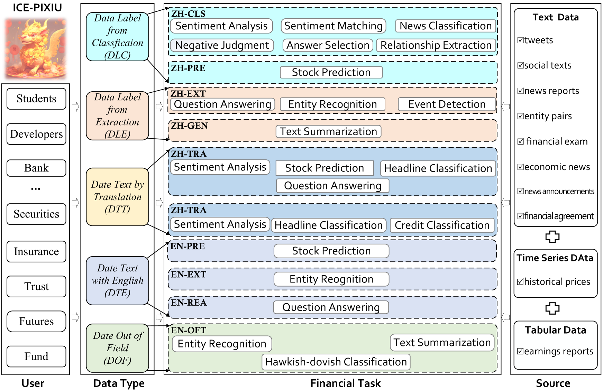
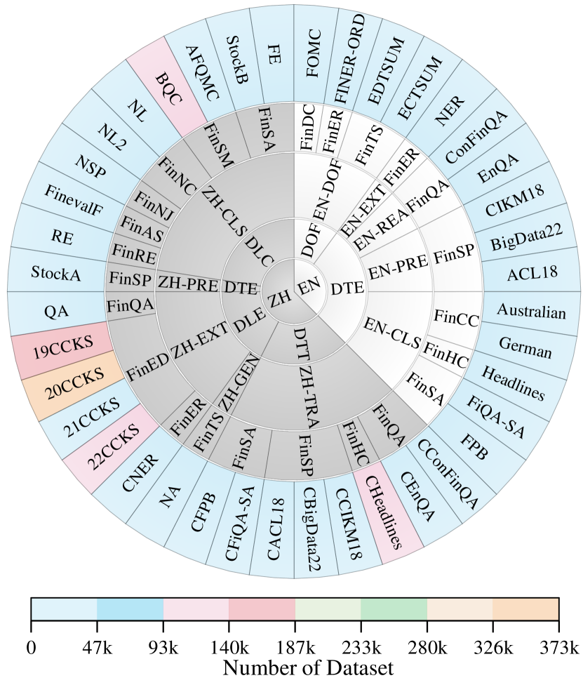
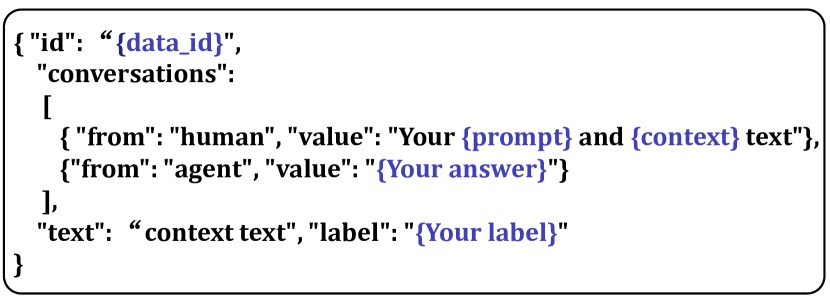
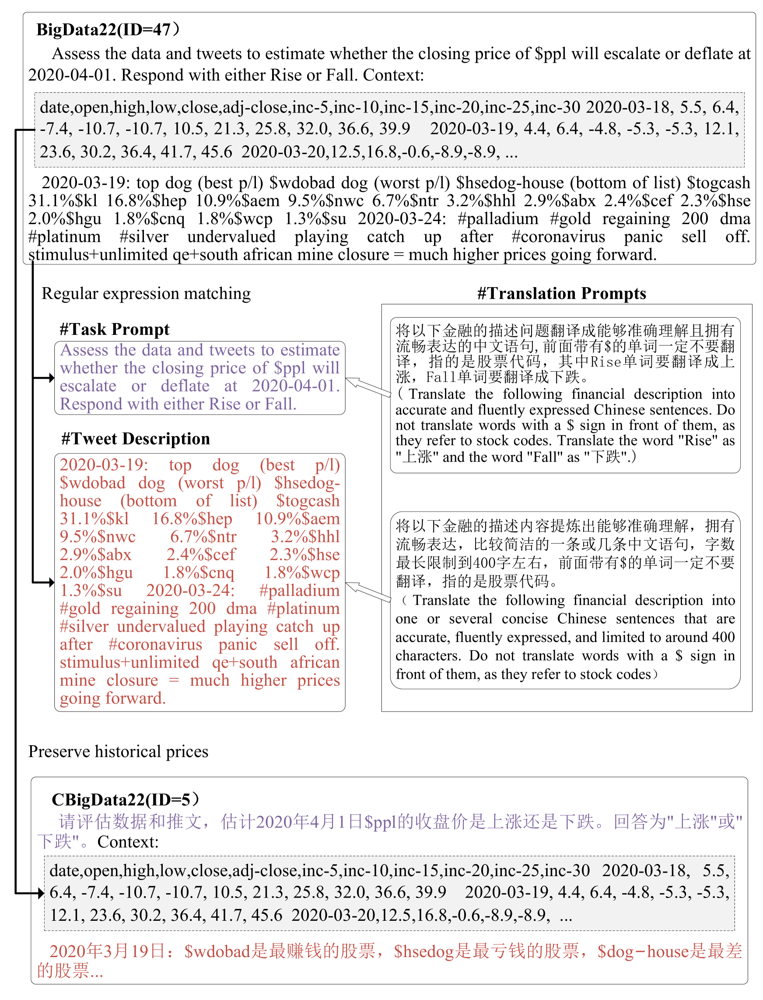

# 无论是金融领域的大型语言模型，还是指令数据集，抑或是基准测试，“没有一种语言是孤立的”。本研究旨在打破壁垒，将中文与英文在这些领域中实现深度融合与统一。

发布时间：2024年03月10日

`LLM应用`

> No Language is an Island: Unifying Chinese and English in Financial Large Language Models, Instruction Data, and Benchmarks

> 随着LLMs的发展大力推动金融分析进步，然而其应用场景主要局限在单语种范围内，尚未充分挖掘中英双语能力的潜能。为解决这一问题，我们推出了ICE-PIXIU，它巧妙地结合了ICE-INTENT模型与ICE-FLARE双语金融分析基准，一举打破壁垒。ICE-PIXIU独树一帜，将一系列中文任务与英文翻译原生数据集融为一体，有力拓宽并深化了双语金融模型的应用范围和理解层次。用户可以无障碍地获取多样化的模型版本，以及海量多元化的跨语言和多模态指令数据资源，并通过一个包含了10项NLP任务、20项双语特色任务在内的总计1,185k个数据集的权威评估基准进行评测。我们深入细致的评估揭示了在金融环境下运用这些双语数据集特别是原生英文数据所带来的优势，不仅提升了语言的适应性和灵活性，还极大地增强了分析精准度与洞察力。尤为引人注目的是，ICE-INTENT在双语环境中展现出超越传统LLMs和现存金融LLMs的巨大飞跃，生动诠释了扎实的双语数据对于金融NLP准确性和效能提升的关键作用。

> While the progression of Large Language Models (LLMs) has notably propelled financial analysis, their application has largely been confined to singular language realms, leaving untapped the potential of bilingual Chinese-English capacity. To bridge this chasm, we introduce ICE-PIXIU, seamlessly amalgamating the ICE-INTENT model and ICE-FLARE benchmark for bilingual financial analysis. ICE-PIXIU uniquely integrates a spectrum of Chinese tasks, alongside translated and original English datasets, enriching the breadth and depth of bilingual financial modeling. It provides unrestricted access to diverse model variants, a substantial compilation of diverse cross-lingual and multi-modal instruction data, and an evaluation benchmark with expert annotations, comprising 10 NLP tasks, 20 bilingual specific tasks, totaling 1,185k datasets. Our thorough evaluation emphasizes the advantages of incorporating these bilingual datasets, especially in translation tasks and utilizing original English data, enhancing both linguistic flexibility and analytical acuity in financial contexts. Notably, ICE-INTENT distinguishes itself by showcasing significant enhancements over conventional LLMs and existing financial LLMs in bilingual milieus, underscoring the profound impact of robust bilingual data on the accuracy and efficacy of financial NLP.

[Arxiv](https://arxiv.org/abs/2403.06249)