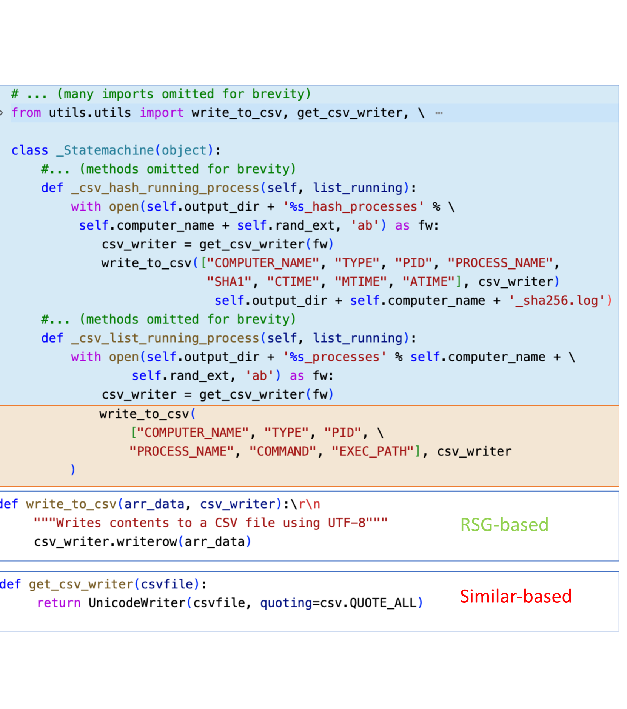
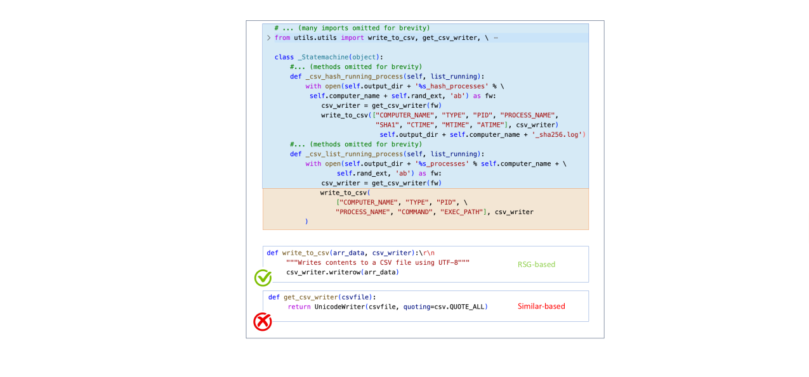
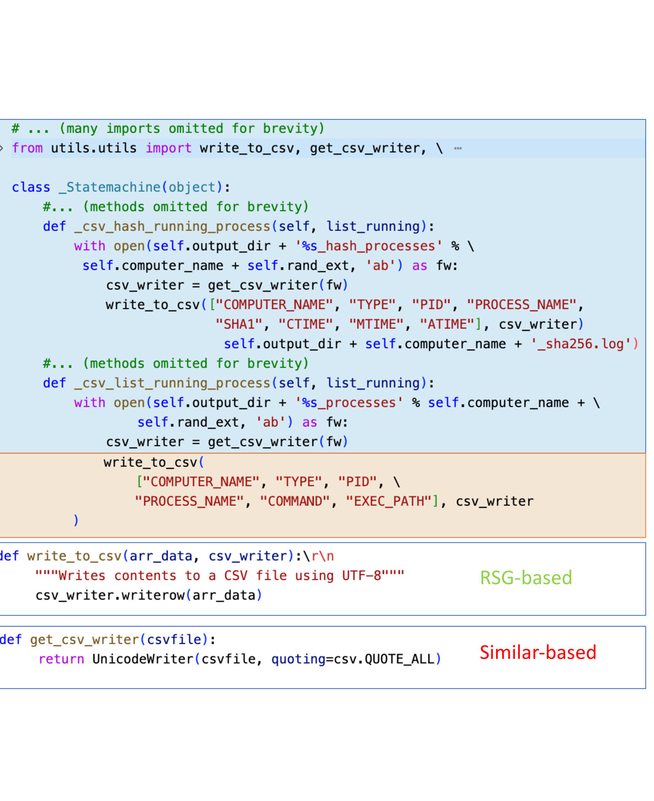

# [RepoHyper 提出，在仓库级别实现高效的代码补全，关键在于提升上下文检索能力，仅此一项改进就能满足需求。](https://arxiv.org/abs/2403.06095)

发布时间：2024年03月10日

`LLM应用`

> RepoHyper: Better Context Retrieval Is All You Need for Repository-Level Code Completion

> CodeLLMs在代码补全任务上表现出色，但在深入理解项目仓库如文件关联性和类层级结构等广泛上下文方面力有不逮，这可能降低补全的精准度。为此，我们创新设计了RepoHyper这一全方位框架，专注于解决仓库级代码补全的复杂难题。RepoHyper的关键在于其独创的Repo-level Semantic Graph（RSG），该语义图结构巧妙地包含了代码仓库的海量上下文信息。同时，RepoHyper采用了包含图扩展和链接预测算法在内的Expand and Refine检索技术，能有效地从RSG中检索并优先呈现相关代码片段。实验证明，RepoHyper在面对仓库级代码补全任务时，相比多种强劲基准技术，在各类数据集上均展现出卓越的准确率提升效果。

> Code Large Language Models (CodeLLMs) have demonstrated impressive proficiency in code completion tasks. However, they often fall short of fully understanding the extensive context of a project repository, such as the intricacies of relevant files and class hierarchies, which can result in less precise completions. To overcome these limitations, we present RepoHyper, a multifaceted framework designed to address the complex challenges associated with repository-level code completion. Central to RepoHyper is the Repo-level Semantic Graph (RSG), a novel semantic graph structure that encapsulates the vast context of code repositories. Furthermore, RepoHyper leverages Expand and Refine retrieval method, including a graph expansion and a link prediction algorithm applied to the RSG, enabling the effective retrieval and prioritization of relevant code snippets. Our evaluations show that RepoHyper markedly outperforms existing techniques in repository-level code completion, showcasing enhanced accuracy across various datasets when compared to several strong baselines.

[Arxiv](https://arxiv.org/abs/2403.06095)