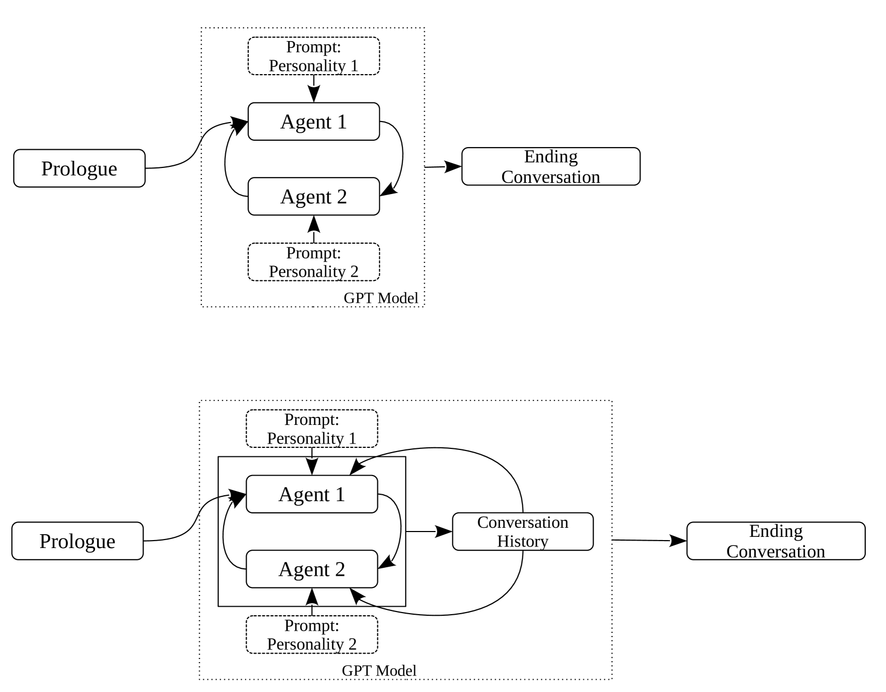
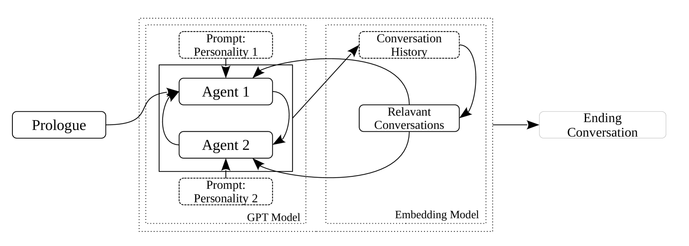
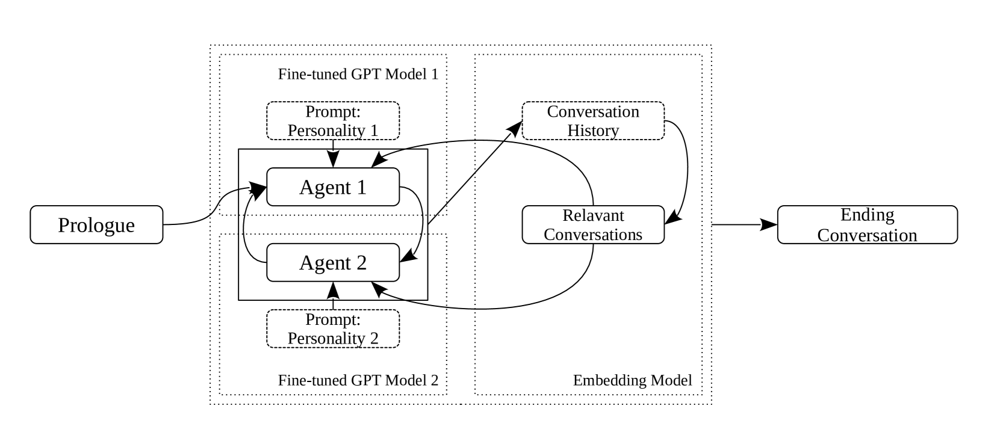
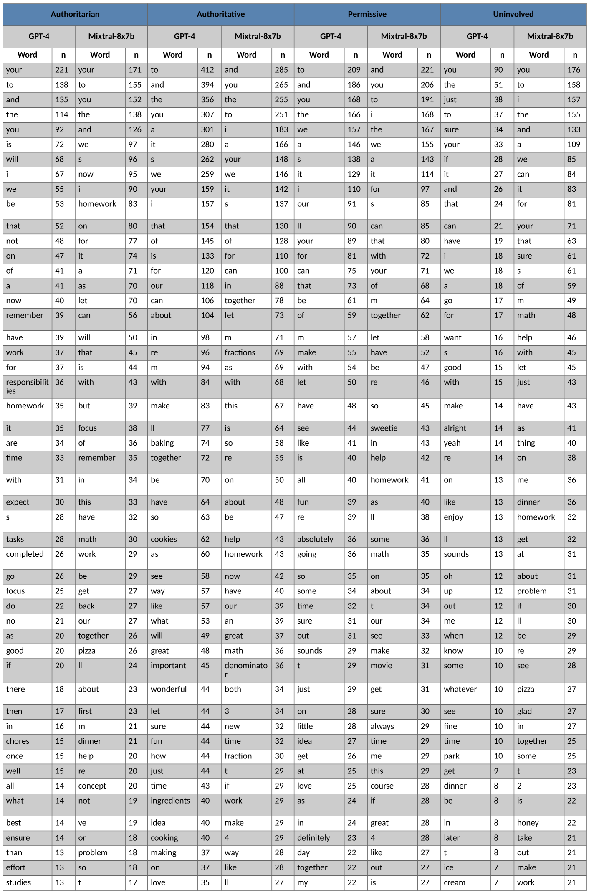

# 本研究运用大型语言模型（LLMs）模拟家庭对话，生动展现不同育儿风格。通过这项演示，我们期望揭示 LLMS 如何捕捉并重现真实世界中多样化的育儿方式。

发布时间：2024年03月10日

`LLM应用`

> Simulating Family Conversations using LLMs: Demonstration of Parenting Styles

> 本研究构建了一个利用LLMs模拟对话进行心理学和语言学探究的创新框架，尤其适用于模拟那些在传统真人实验中因涉及潜在不道德言行而不被允许的人际交往场景。以四类不同育儿风格（专制、权威、放任及忽视型）的家庭对话为例，我们发现模拟对话成功展现了各类风格的特点。为进一步提升模拟效果，可尝试融入情境感知，采用少量样本引导技术或针对具体模拟需求对模型进行微调。总之，此项研究提供了一种极具潜力的通过模拟对话进行心理学和语言学研究的新方法，同时也充分认识到了现有局限，并对未来如何优化和完善提出了建设性意见。

> This study presents a framework for conducting psychological and linguistic research through simulated conversations using large language models (LLMs). The proposed methodology offers significant advantages, particularly for simulating human interactions involving potential unethical language or behaviors that would be impermissible in traditional experiments with human participants. As a demonstration, we employed LLMs to simulate family conversations across four parenting styles (authoritarian, authoritative, permissive, and uninvolved). In general, we observed that the characteristics of the four parenting styles were portrayed in the simulated conversations. Several strategies could be used to improve the simulation quality, such as including context awareness, employing a few-shot prompting approach or fine-tuning models to cater to specific simulation requirements. Overall, this study introduces a promising methodology for conducting psychological and linguistic research through simulated conversations, while acknowledging the current limitations and proposing potential solutions for future refinement and improvement.

[Arxiv](https://arxiv.org/abs/2403.06144)