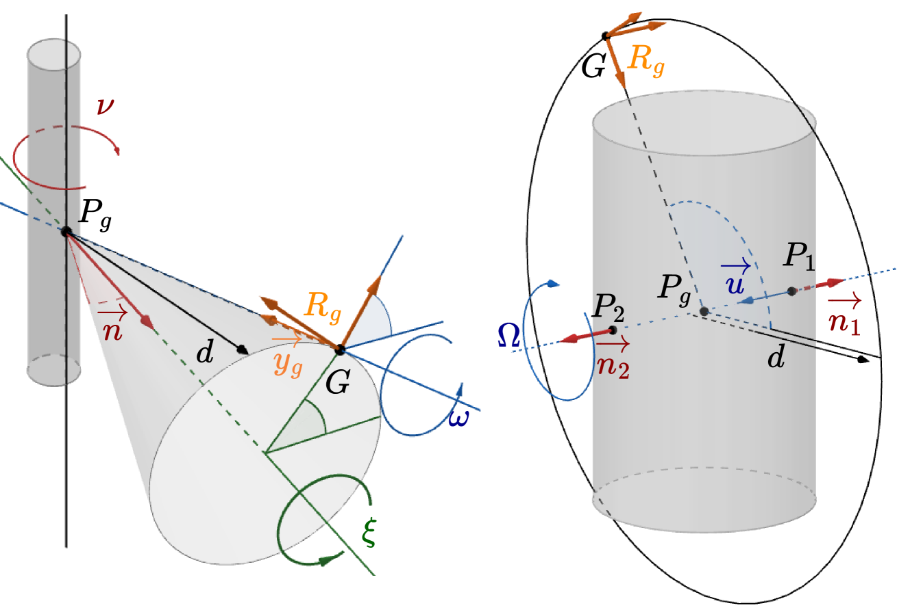
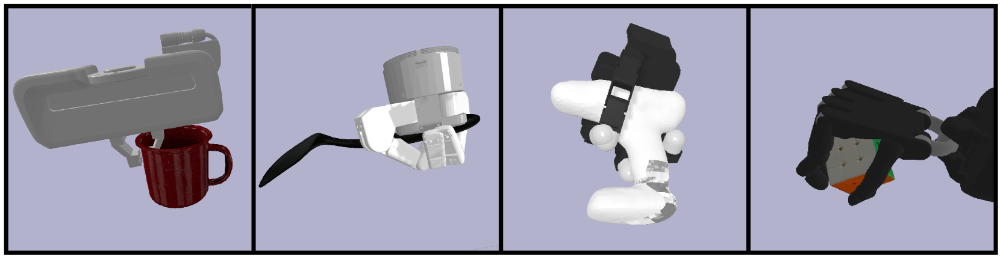
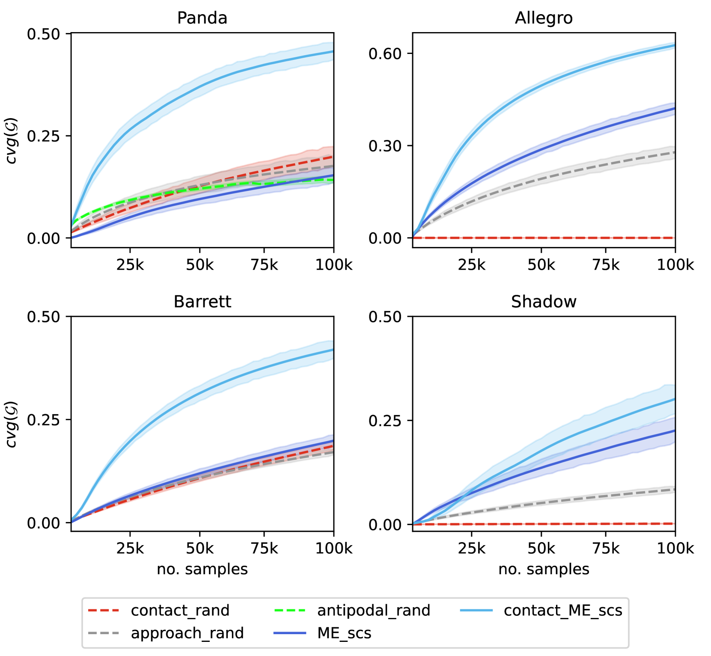
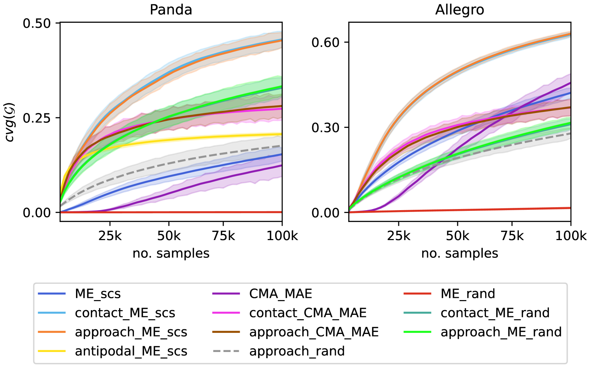
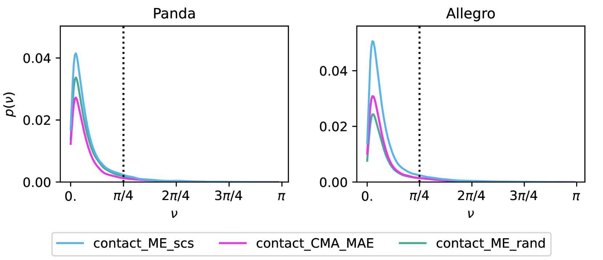
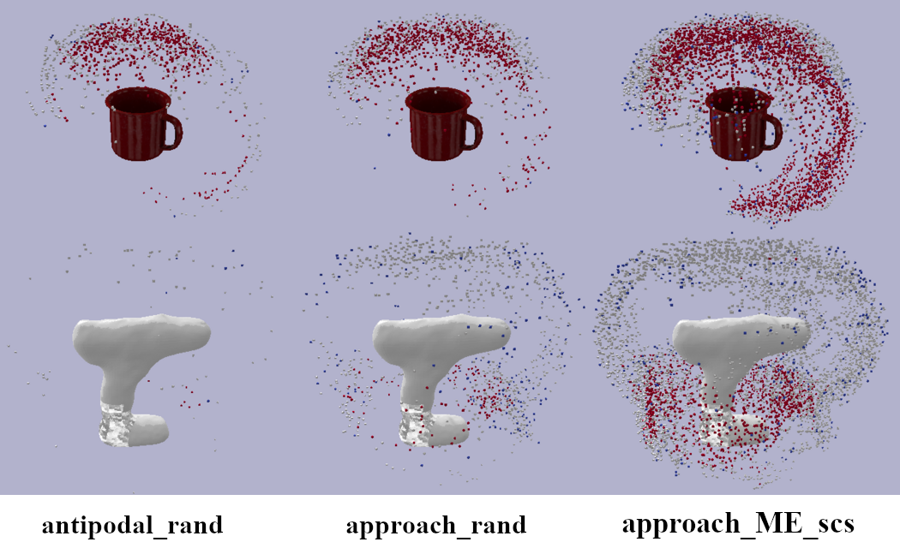
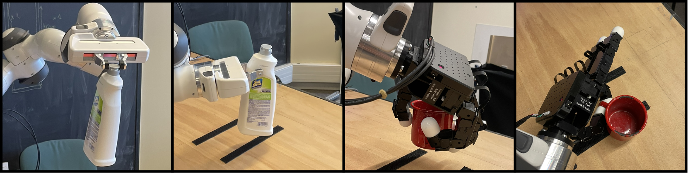

# 通过质量多样性提升 6 自由度抓取采样的效率

发布时间：2024年03月10日

`Agent`

> Speeding up 6-DoF Grasp Sampling with Quality-Diversity

> AI技术的最新突破使得机器人学习领域取得重大成效，尤其是在利用生成模型优化基于自然语言的规划和控制器方面。然而，要实现广泛适用，关键难题在于交互数据的稀缺，特别是获取抓取数据对于完成多种操控任务至关重要。QD算法通过优化一系列解来解决特定问题，寻找多样化且高性能的答案。本文研究如何借助先验知识，使QD加速模拟环境中多样抓取姿态的生成，相比传统的6自由度抓取采样策略更高效。实验结果显示，在4款配备2至5指的标准物体夹持器上，QD方法远胜于常规方法。更有意思的是，QD优化过程中能自动发现并利用一些通常需要手动硬编码的高效先验知识。当我们将生成的抓取策略应用于2指夹持器和Allegro机械手时，发现其多样性能成功迁移到实际场景中。我们坚信这些研究成果对于构建能够催生稳健且具备泛化能力的机器人抓取策略的大规模数据集是一次重要的飞跃。

> Recent advances in AI have led to significant results in robotic learning, including natural language-conditioned planning and efficient optimization of controllers using generative models. However, the interaction data remains the bottleneck for generalization. Getting data for grasping is a critical challenge, as this skill is required to complete many manipulation tasks. Quality-Diversity (QD) algorithms optimize a set of solutions to get diverse, high-performing solutions to a given problem. This paper investigates how QD can be combined with priors to speed up the generation of diverse grasps poses in simulation compared to standard 6-DoF grasp sampling schemes. Experiments conducted on 4 grippers with 2-to-5 fingers on standard objects show that QD outperforms commonly used methods by a large margin. Further experiments show that QD optimization automatically finds some efficient priors that are usually hard coded. The deployment of generated grasps on a 2-finger gripper and an Allegro hand shows that the diversity produced maintains sim-to-real transferability. We believe these results to be a significant step toward the generation of large datasets that can lead to robust and generalizing robotic grasping policies.

[Arxiv](https://arxiv.org/abs/2403.06173)