# [TRAD 研究通过逐步骤检索思维及决策对齐策略，提升LLM智能体的表现。]

发布时间：2024年03月10日

`Agent`

> TRAD: Enhancing LLM Agents with Step-Wise Thought Retrieval and Aligned Decision

> 鉴于LLM强大的知识储备和文本理解力，众多针对诸如网页浏览、网购等不同任务的LLM智能体已被开发出来。其中很多工作利用上下文示例实现无需微调的泛化效果，但关于如何有效筛选和利用这类示例的研究并不多见。近期研究提出了一种新方法，借助任务元数据进行轨迹级检索，并将轨迹用作上下文示例，以此提升一些序列决策任务中智能体的表现。不过，这种方法也可能因未考虑具体任务的状态转移动态以及冗余上下文信息导致输入过长而存在问题。为此，本论文创新性地提出了TRAD框架来解决此类问题。TRAD首先通过思维匹配实现逐步演示的精准选取，减少无关噪声，提高示例的有效性；随后引入对齐决策机制，将检索到的演示步骤与其前后相关步骤相结合，以应对思维表达不完整的情况，并在提供更多上下文与减少噪声之间取得平衡。在ALFWorld和Mind2Web基准测试中，TRAD展现出卓越性能，不仅超越现有最优模型，还在降低噪声、促进泛化方面表现突出。实际应用上，TRAD已被成功应用于全球某商业保险公司的真实场景中，显著提升了机器人流程自动化的成功率。

> Numerous large language model (LLM) agents have been built for different tasks like web navigation and online shopping due to LLM's wide knowledge and text-understanding ability. Among these works, many of them utilize in-context examples to achieve generalization without the need for fine-tuning, while few of them have considered the problem of how to select and effectively utilize these examples. Recently, methods based on trajectory-level retrieval with task meta-data and using trajectories as in-context examples have been proposed to improve the agent's overall performance in some sequential decision making tasks. However, these methods can be problematic due to plausible examples retrieved without task-specific state transition dynamics and long input with plenty of irrelevant context. In this paper, we propose a novel framework (TRAD) to address these issues. TRAD first conducts Thought Retrieval, achieving step-level demonstration selection via thought matching, leading to more helpful demonstrations and less irrelevant input noise. Then, TRAD introduces Aligned Decision, complementing retrieved demonstration steps with their previous or subsequent steps, which enables tolerance for imperfect thought and provides a choice for balance between more context and less noise. Extensive experiments on ALFWorld and Mind2Web benchmarks show that TRAD not only outperforms state-of-the-art models but also effectively helps in reducing noise and promoting generalization. Furthermore, TRAD has been deployed in real-world scenarios of a global business insurance company and improves the success rate of robotic process automation.

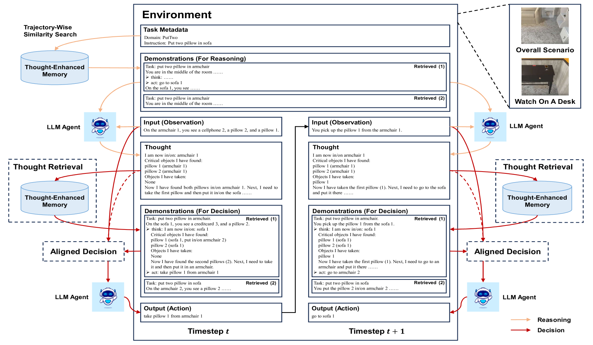

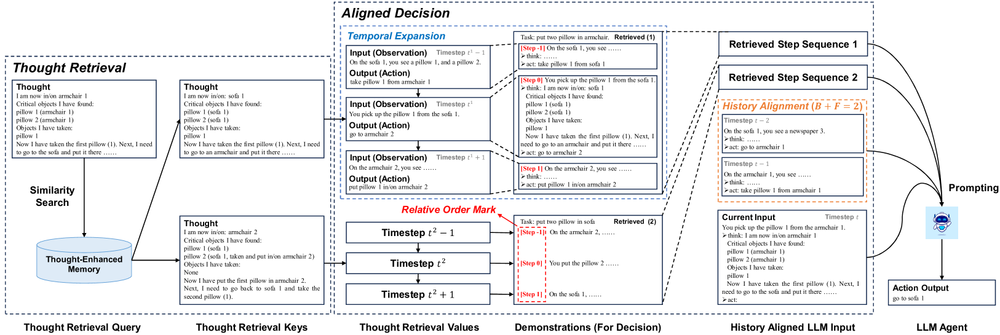

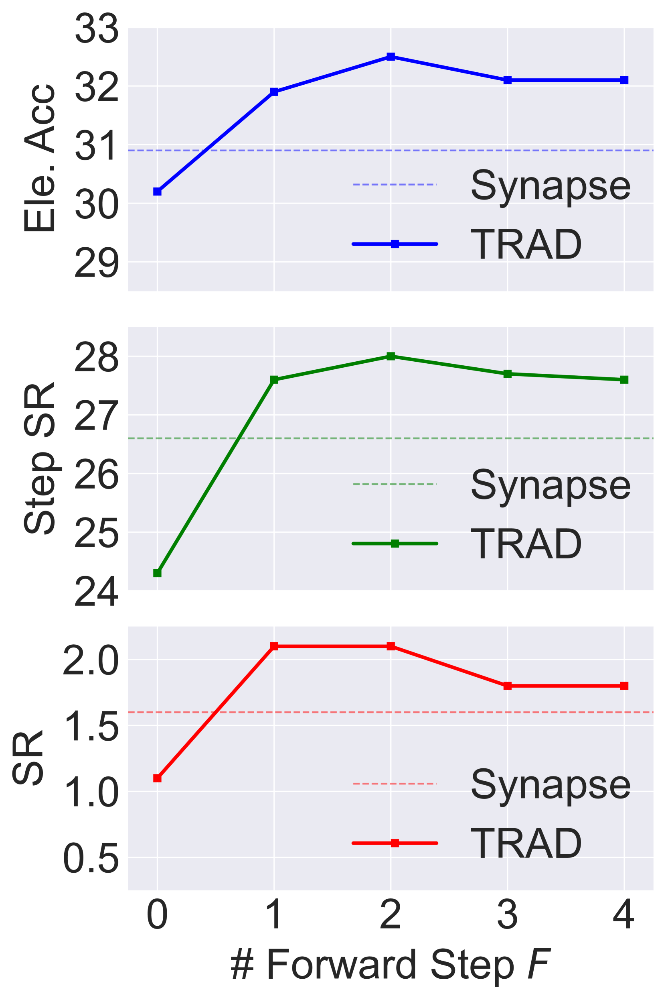

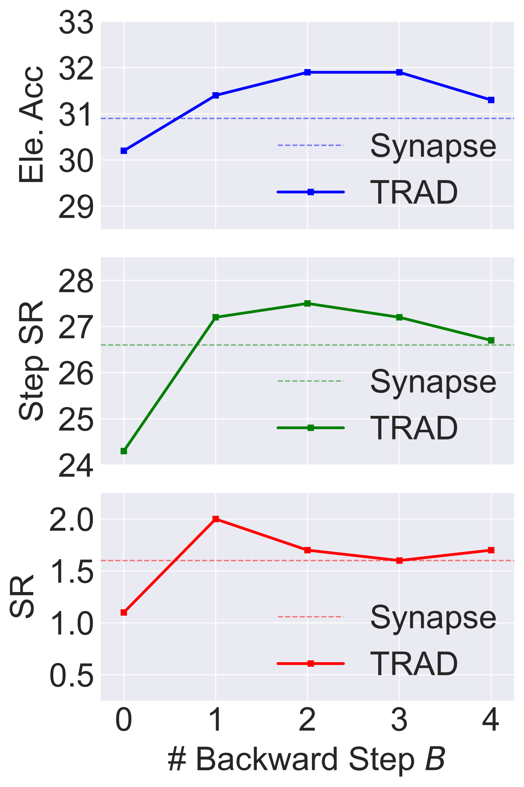

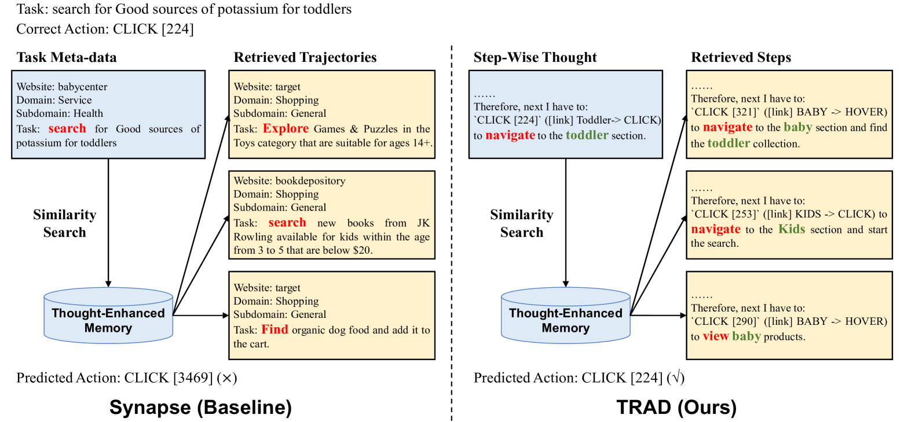

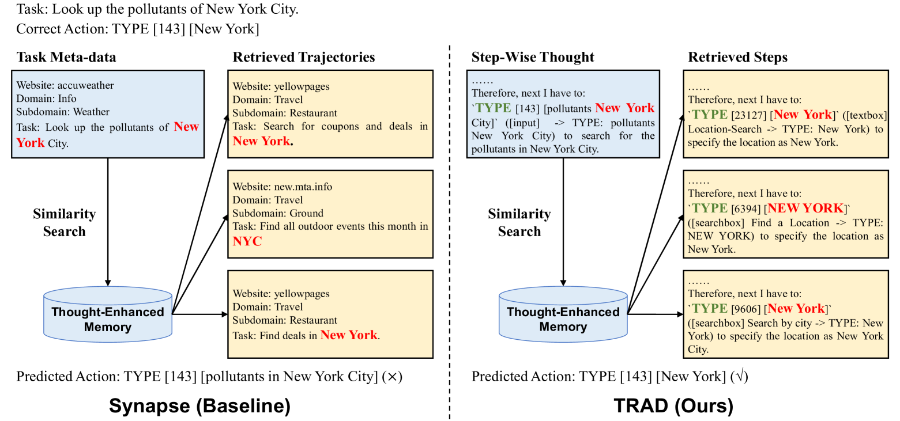

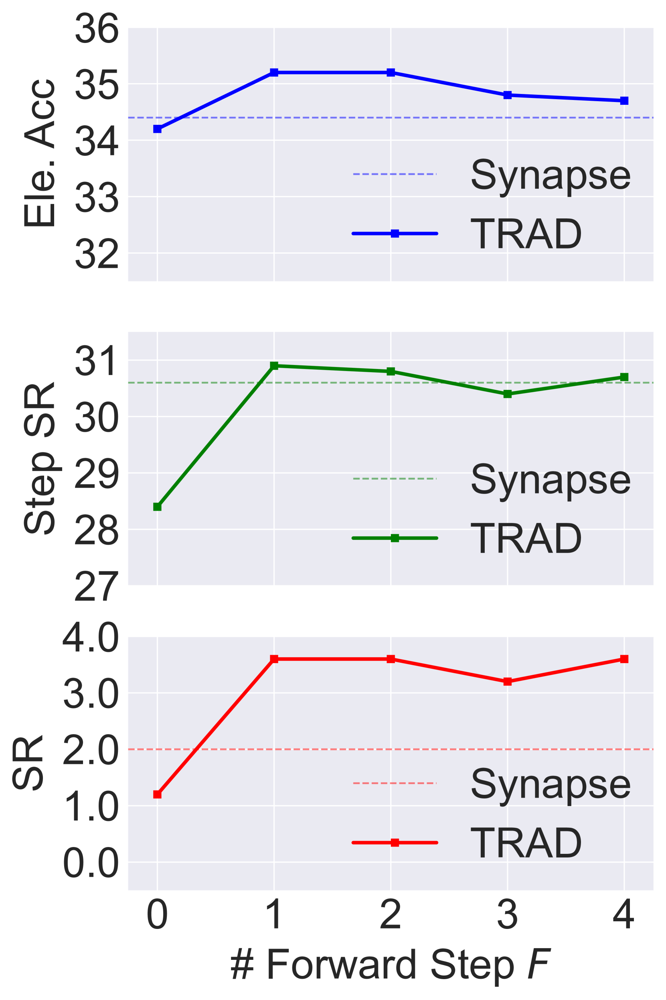

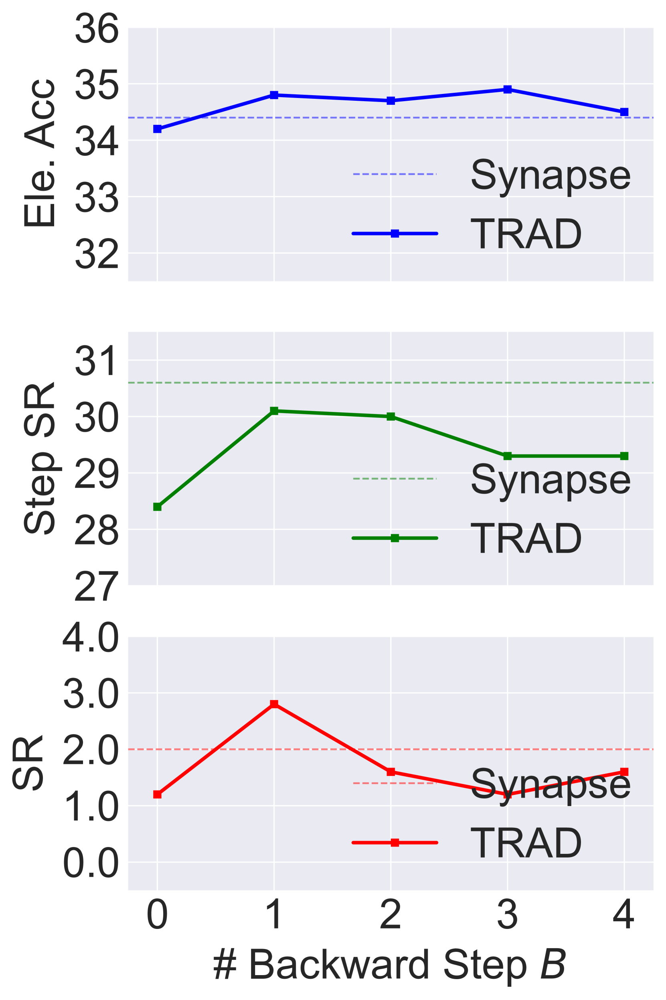

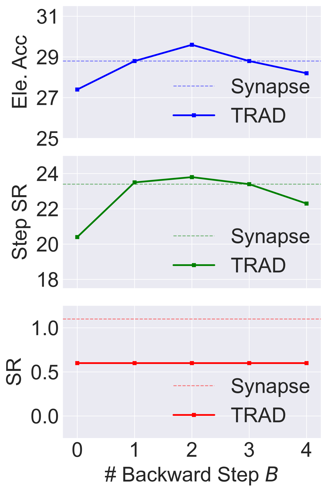

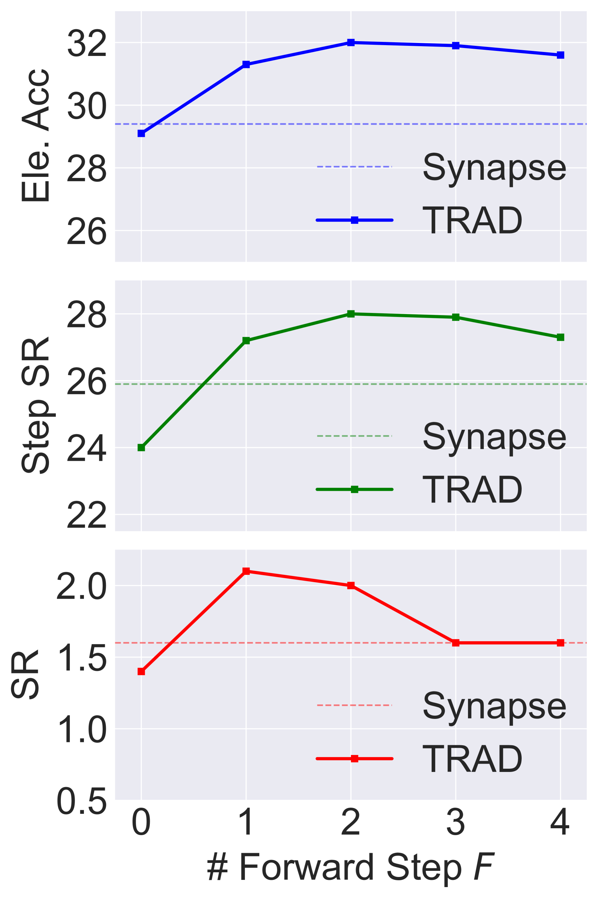

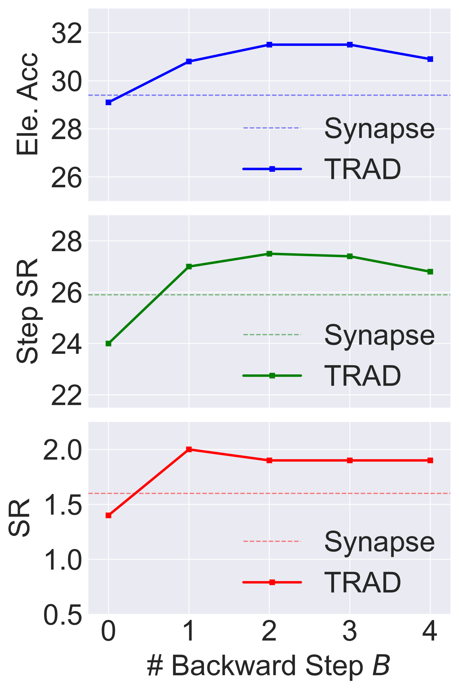

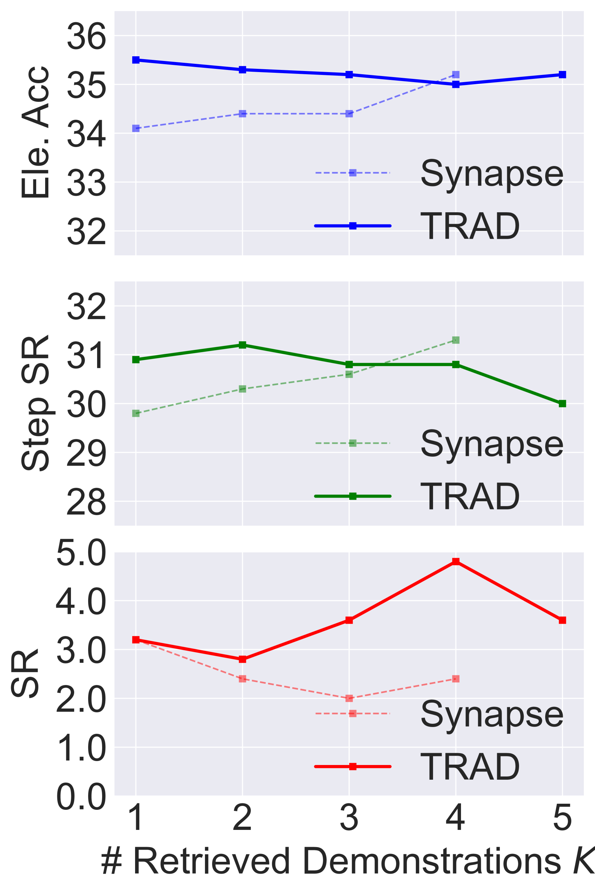

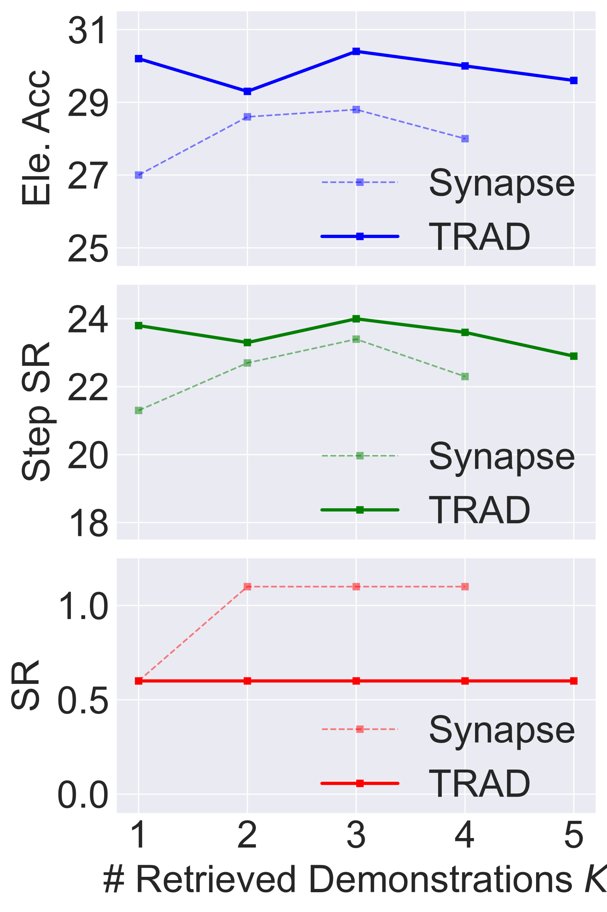

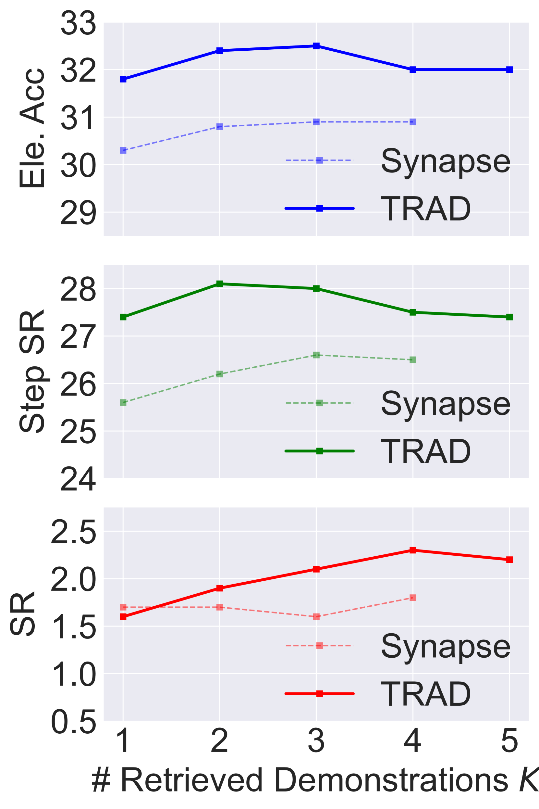

[Arxiv](https://arxiv.org/abs/2403.06221)