# 本文旨在深入剖析分词技术，通过评估其在文本压缩上的表现，并探究这一过程与模型整体性能之间的内在关联。

发布时间：2024年03月10日

`LLM理论`

> Unpacking Tokenization: Evaluating Text Compression and its Correlation with Model Performance

> 尽管作为BPE这一主流分词算法基石的压缩过程，其重要性仍未明晰。本文力证压缩在理论上可视作一种赋予所有标记等概率的0-gram语言建模方式，并通过实验证明其对预训练语言模型下游任务表现的关键作用。我们巧妙地调控不同BPE分词器在训练时所使用的文档数量，从百万级别直至无训练数据仅基于字符的分词处理，以探究它们的压缩性能差异。在此基础上，我们训练了一系列英语语言模型并针对多种任务进行微调。结果显示，分词器的压缩能力与模型下游任务的表现呈现出明显的正相关性，这意味着压缩效果可以作为衡量分词质量的一个可靠内禀标志。尤其在生成任务以及小型模型上，这种关联更加突出。我们选取部分有代表性的实验在土耳其语上进行了复现，得到了相似的结论，从而确认了这一发现对于不同于英语的语言也同样适用。因此，我们总结认为，研发更高性能的压缩型分词器不仅是一个值得深入研究的方向，也有望全面提升模型的整体表现。

> Despite it being the cornerstone of BPE, the most common tokenization algorithm, the importance of compression in the tokenization process is still unclear. In this paper, we argue for the theoretical importance of compression, that can be viewed as 0-gram language modeling where equal probability is assigned to all tokens. We also demonstrate the empirical importance of compression for downstream success of pre-trained language models. We control the compression ability of several BPE tokenizers by varying the amount of documents available during their training: from 1 million documents to a character-based tokenizer equivalent to no training data at all. We then pre-train English language models based on those tokenizers and fine-tune them over several tasks. We show that there is a correlation between tokenizers' compression and models' downstream performance, suggesting that compression is a reliable intrinsic indicator of tokenization quality. These correlations are more pronounced for generation tasks (over classification) or for smaller models (over large ones). We replicated a representative part of our experiments on Turkish and found similar results, confirming that our results hold for languages with typological characteristics dissimilar to English. We conclude that building better compressing tokenizers is a fruitful avenue for further research and for improving overall model performance.

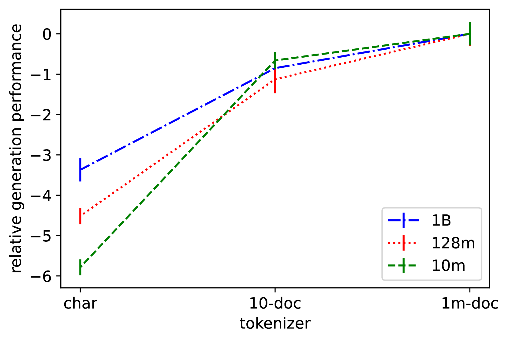

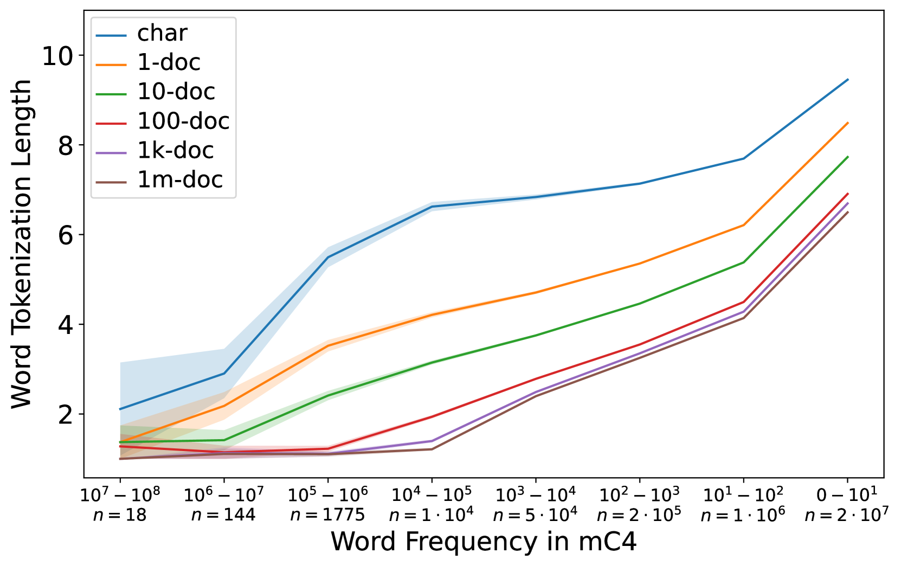

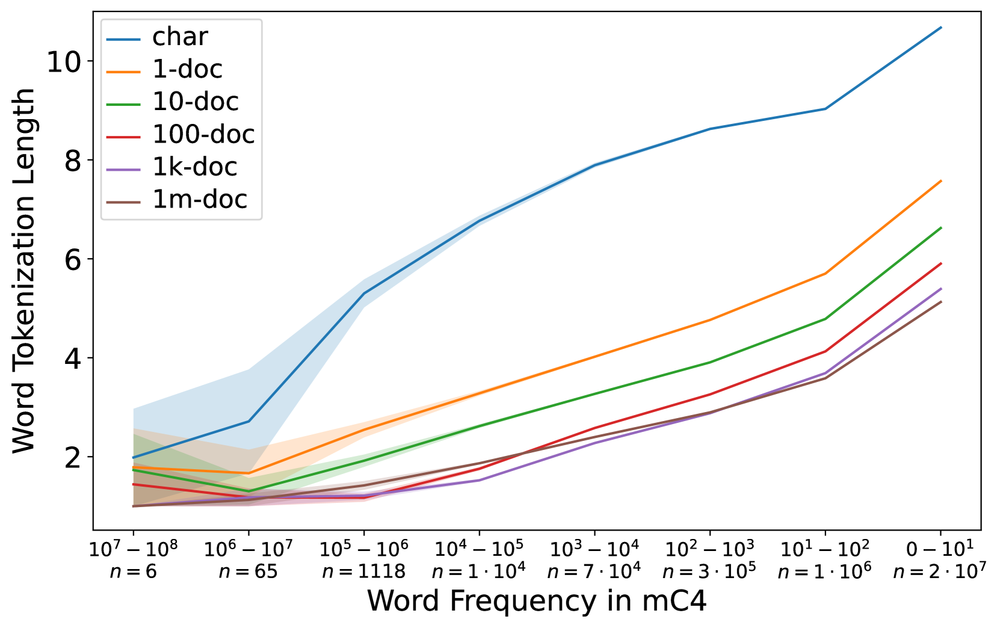

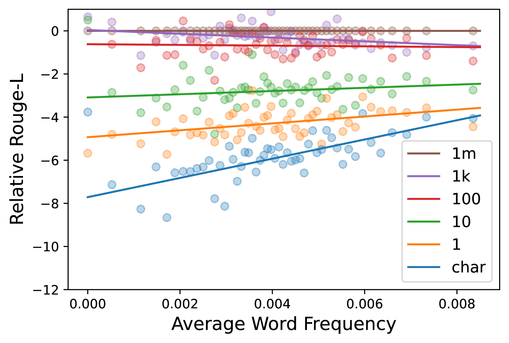

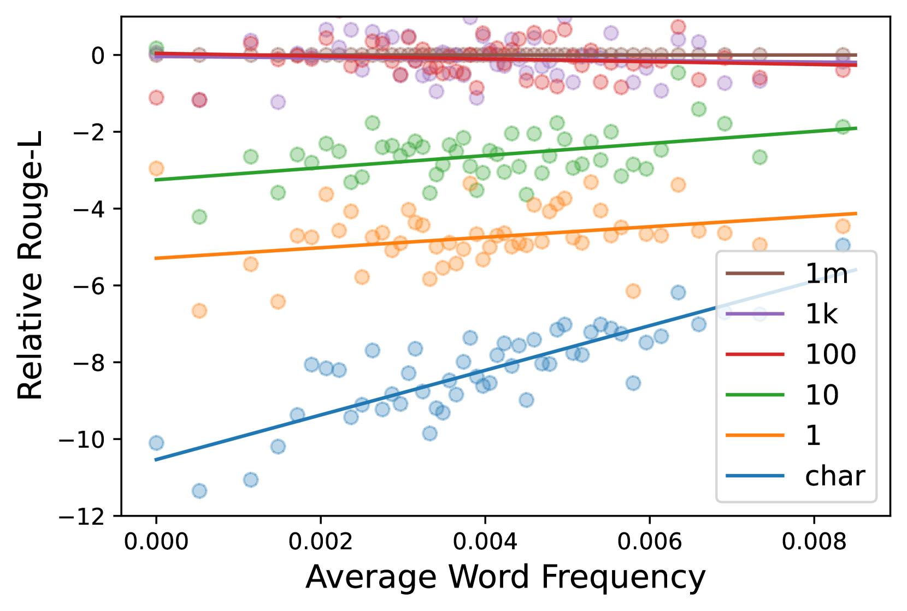

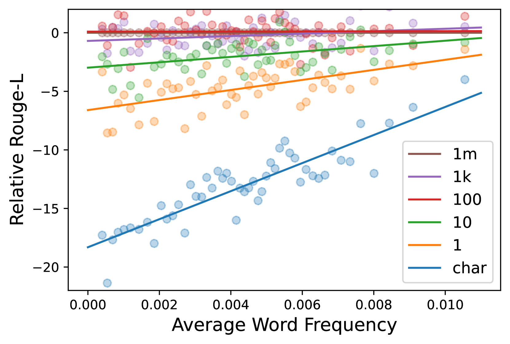

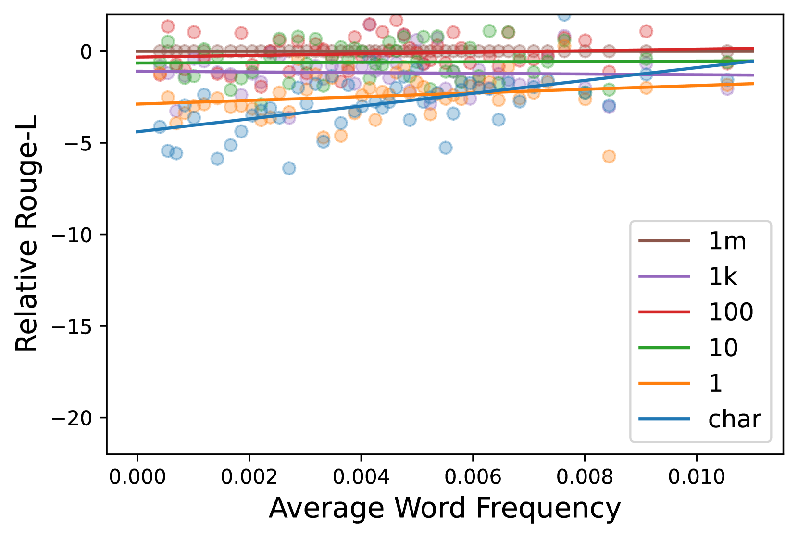

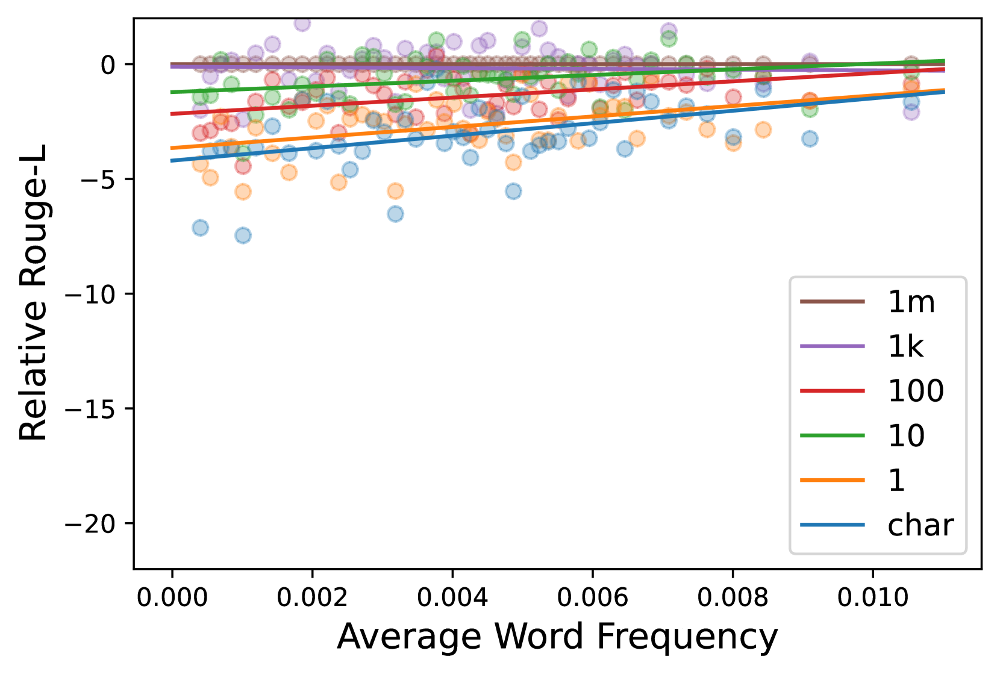

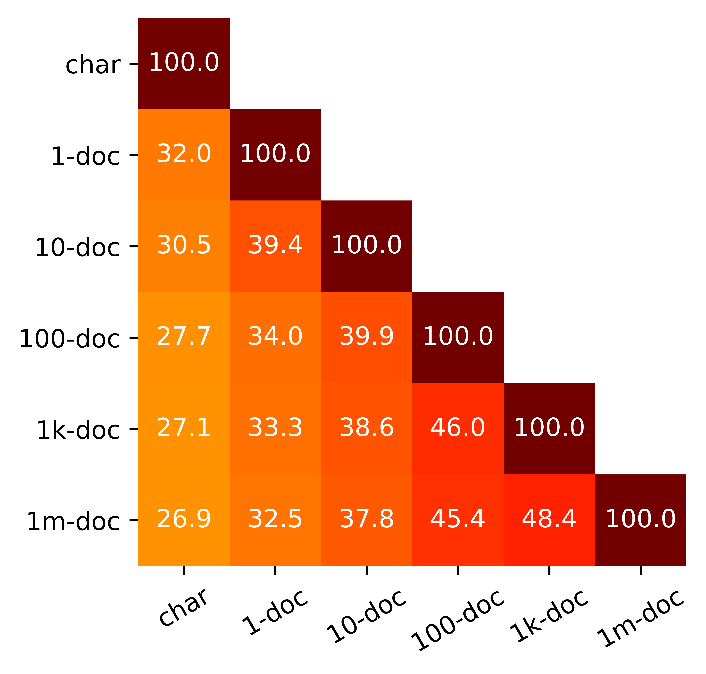

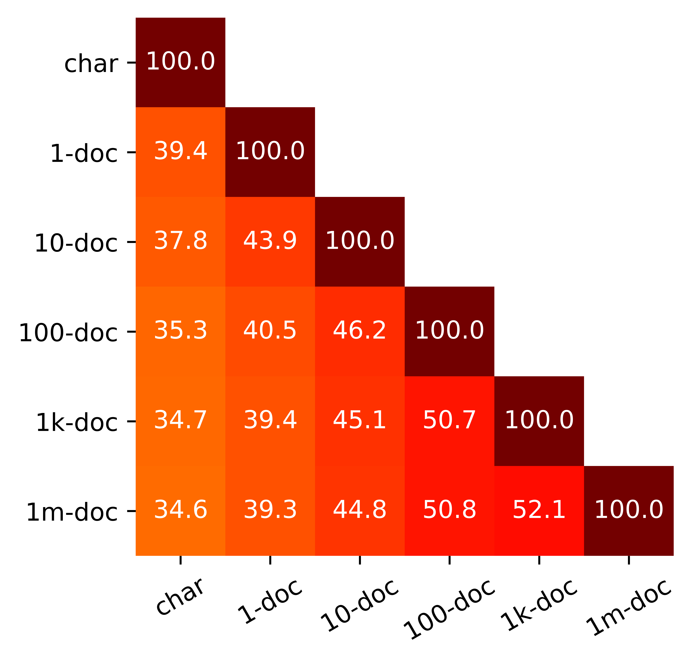

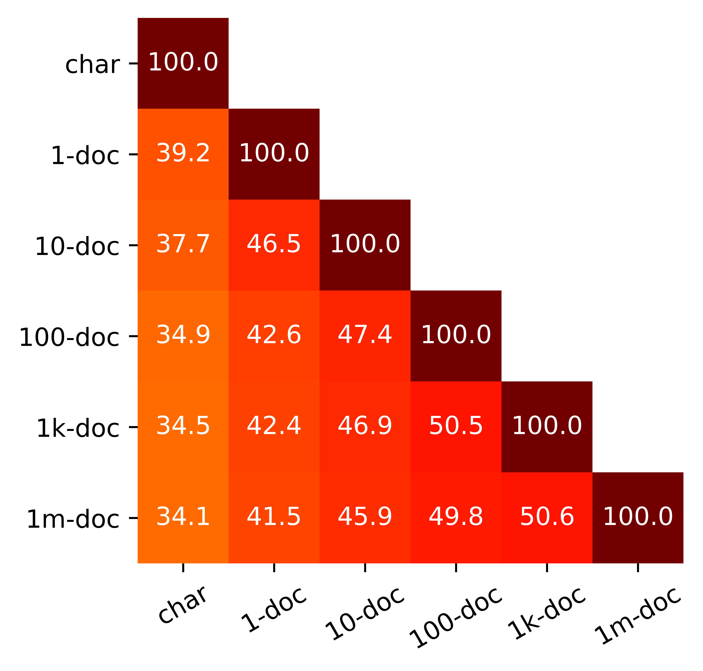

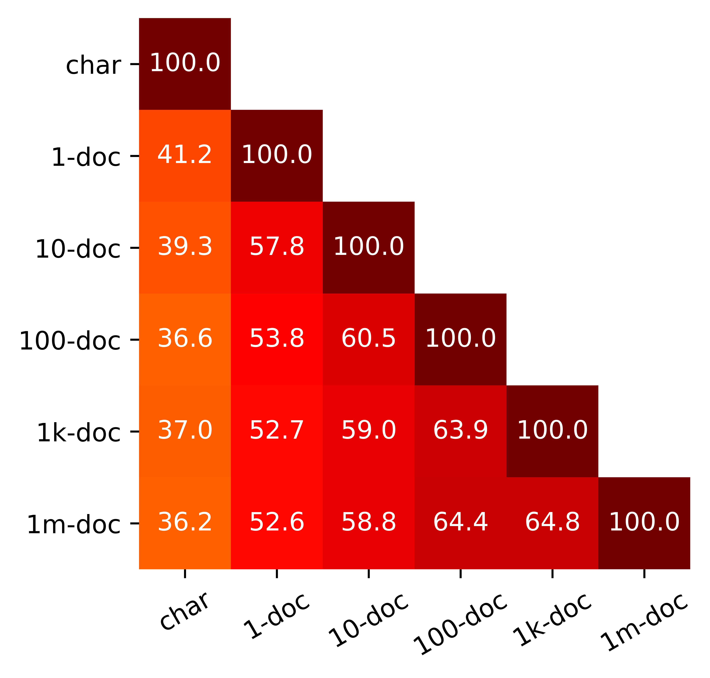

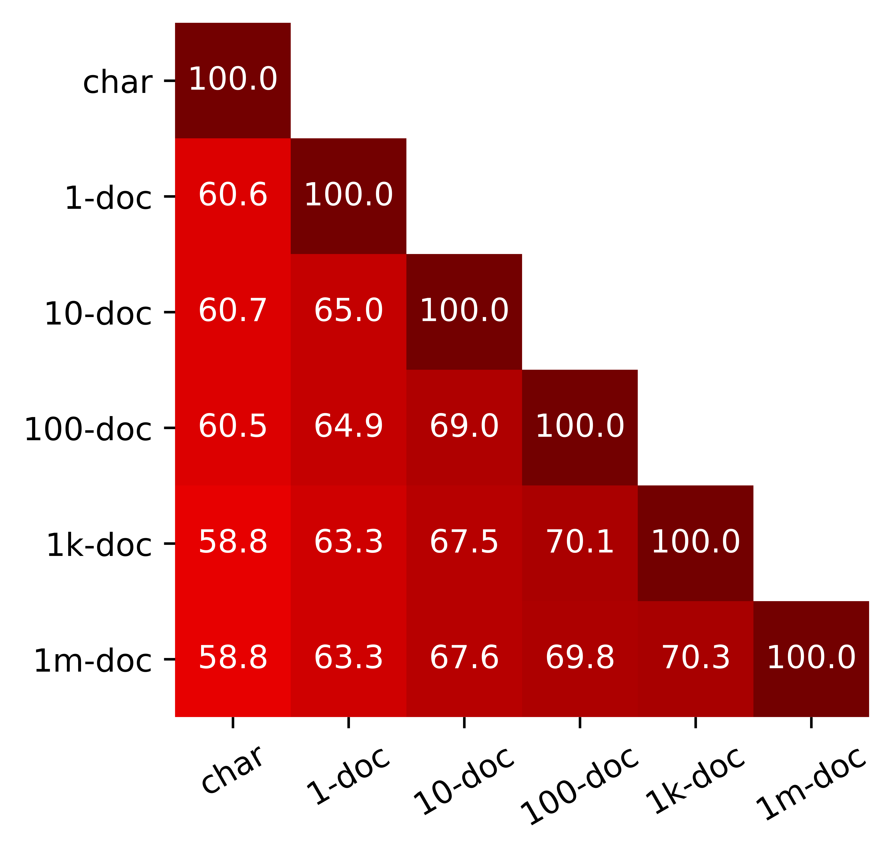

[Arxiv](https://arxiv.org/abs/2403.06265)