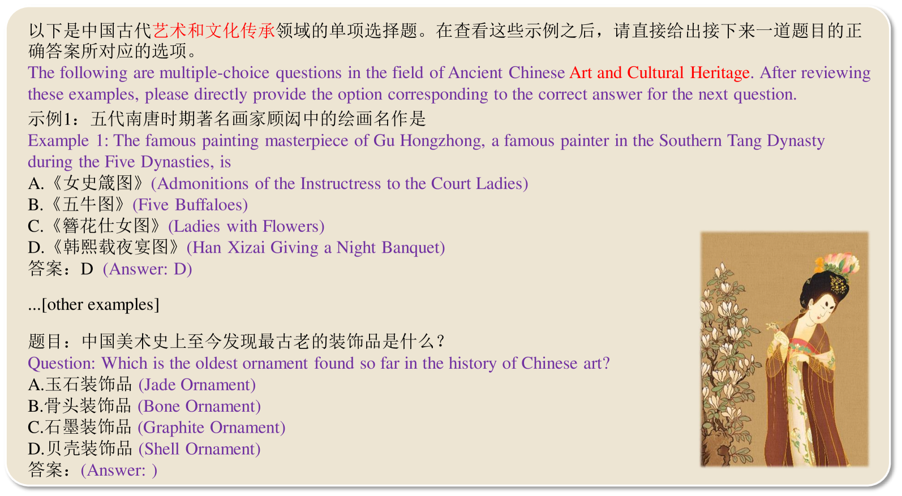
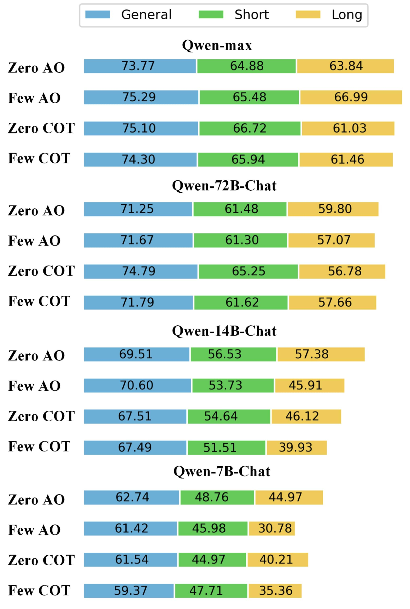
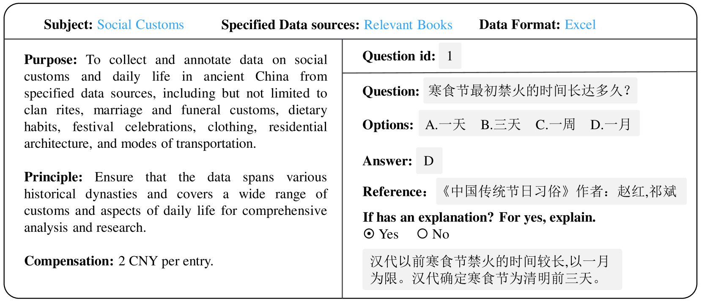
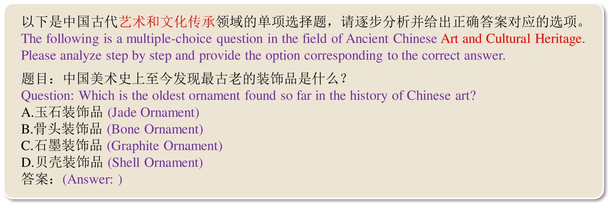

# [AC-EVAL：针对大型语言模型，我们提出一种评估方法，用于衡量其对古代汉语的理解程度。](https://arxiv.org/abs/2403.06574)

发布时间：2024年03月11日

`LLM应用`

> AC-EVAL: Evaluating Ancient Chinese Language Understanding in Large Language Models

> 鉴于古代汉语承载深厚历史文化底蕴的重要价值，在LLMs日新月异的发展背景下，亟需一套能有效检验它们对古代语境理解力的标准。为此，我们推出了创新性评估基准AC-EVAL，旨在深入探究LLMs在古代汉语环境中展现的高级知识掌握和推理能力。AC-EVAL精心设计了三个递进难度层级，分别对应语言理解的不同维度——普遍历史认知、短篇文本解析及长篇文本领悟，并由涵盖历史事实、地理、风俗习惯、艺术、哲学、古典诗词散文等在内的13项任务组成，构建了一套全面评估体系。我们对一批顶尖的中英文LLMs进行了深入评估，发现它们在增强古代文本理解方面具有显著提升空间。AC-EVAL旨在揭示LLMs的优势与短板，从而促进它们在古代汉语教育与学术研究领域的深度发展。目前，AC-EVAL的相关数据和评估代码已开放在https://github.com/yuting-wei/AC-EVAL供查阅下载。

> Given the importance of ancient Chinese in capturing the essence of rich historical and cultural heritage, the rapid advancements in Large Language Models (LLMs) necessitate benchmarks that can effectively evaluate their understanding of ancient contexts. To meet this need, we present AC-EVAL, an innovative benchmark designed to assess the advanced knowledge and reasoning capabilities of LLMs within the context of ancient Chinese. AC-EVAL is structured across three levels of difficulty reflecting different facets of language comprehension: general historical knowledge, short text understanding, and long text comprehension. The benchmark comprises 13 tasks, spanning historical facts, geography, social customs, art, philosophy, classical poetry and prose, providing a comprehensive assessment framework. Our extensive evaluation of top-performing LLMs, tailored for both English and Chinese, reveals a substantial potential for enhancing ancient text comprehension. By highlighting the strengths and weaknesses of LLMs, AC-EVAL aims to promote their development and application forward in the realms of ancient Chinese language education and scholarly research. The AC-EVAL data and evaluation code are available at https://github.com/yuting-wei/AC-EVAL.

[Arxiv](https://arxiv.org/abs/2403.06574)