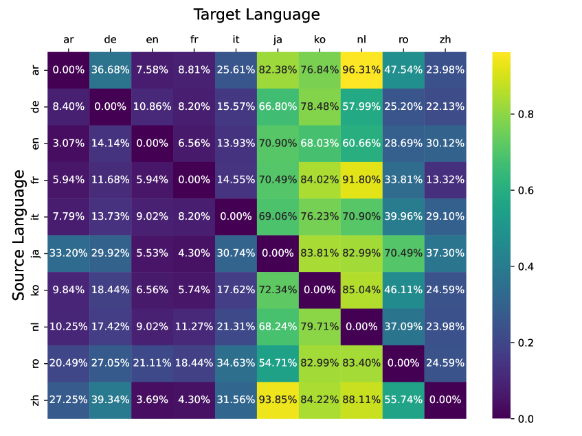
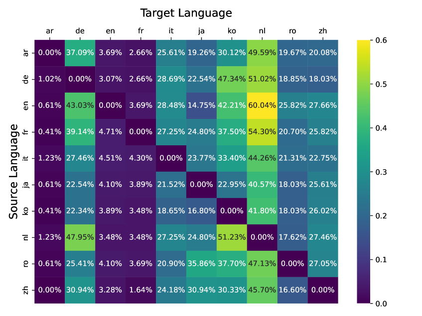
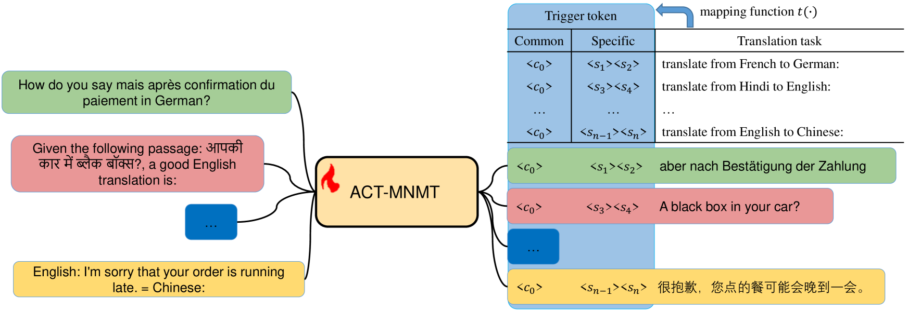
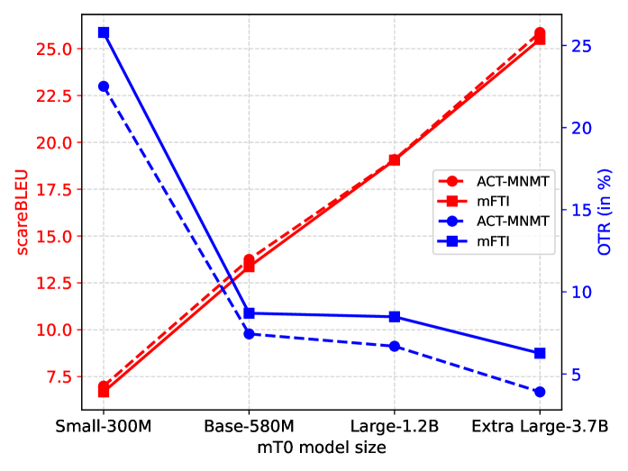
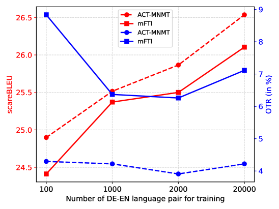
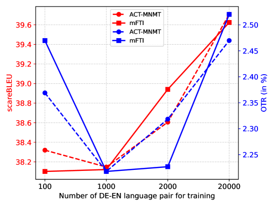
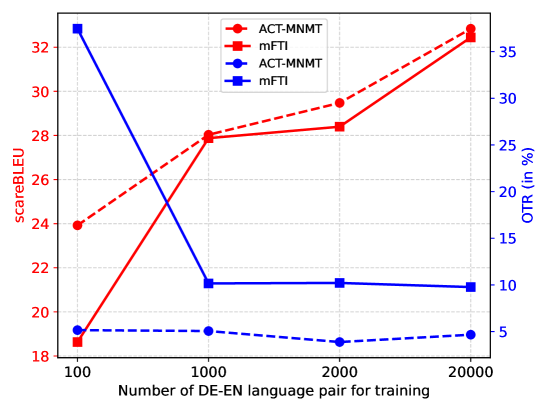
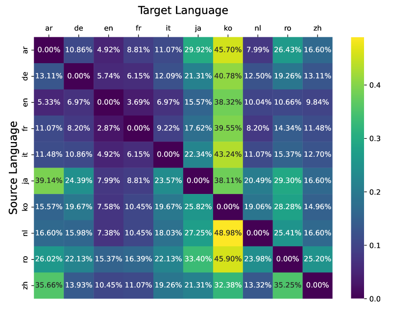
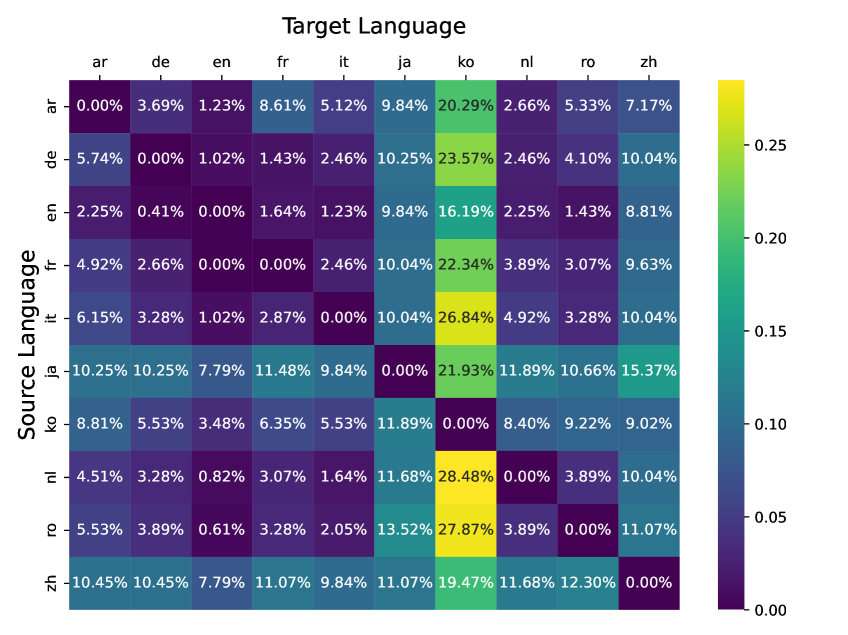

# ACT-MNMT 技术应用于多语言神经机器翻译，通过自动约束转换优化翻译效果。

发布时间：2024年03月11日

`LLM应用`

> ACT-MNMT Auto-Constriction Turning for Multilingual Neural Machine Translation

> LLMs借助零样本/少量样本提示或提示调整，在处理多语言机器翻译任务时表现卓越。但因其在预训练阶段混杂了多语言数据，使得基于LLM的翻译模型在各类基于提示的方法中难以避免出现“偏离目标”问题，这具体体现为一系列不良现象，如指令误读、用错目标语言和过度生成等。为此，本文提出一种创新的、监督式微调机制——\textbf{\underline{A}}uto-\textbf{\underline{C}}onstriction \textbf{\underline{T}}uning for \textbf{\underline{M}}ultilingual \textbf{\underline{N}}eural \textbf{\underline{M}}achine \textbf{\underline{T}}ranslation（\model），该机制能够有效解决上述问题。它通过在目标语言的真实翻译前插入特定触发令牌自动生成受限模板，并且这些触发令牌可以根据不同任务语境灵活组合及迭代更新，从而最大限度地提高标签匹配概率。实验证明，在使用多种评估指标对WMT测试集进行检验后，\model在多种翻译方向上均大幅度提升了翻译性能，并成功减少了偏离目标语言的现象。

> Large language model (LLM) has achieved promising performance in multilingual machine translation tasks through zero/few-shot prompts or prompt-tuning. However, due to the mixture of multilingual data during the pre-training of LLM, the LLM-based translation models face the off-target issue in both prompt-based methods, including a series of phenomena, namely instruction misunderstanding, translation with wrong language and over-generation. For this issue, this paper introduces an \textbf{\underline{A}}uto-\textbf{\underline{C}}onstriction \textbf{\underline{T}}urning mechanism for \textbf{\underline{M}}ultilingual \textbf{\underline{N}}eural \textbf{\underline{M}}achine \textbf{\underline{T}}ranslation (\model), which is a novel supervised fine-tuning mechanism and orthogonal to the traditional prompt-based methods. In this method, \model automatically constructs a constrained template in the target side by adding trigger tokens ahead of the ground truth. Furthermore, trigger tokens can be arranged and combined freely to represent different task semantics, and they can be iteratively updated to maximize the label likelihood. Experiments are performed on WMT test sets with multiple metrics, and the experimental results demonstrate that \model achieves substantially improved performance across multiple translation directions and reduce the off-target phenomena in the translation.

[Arxiv](https://arxiv.org/abs/2403.06745)