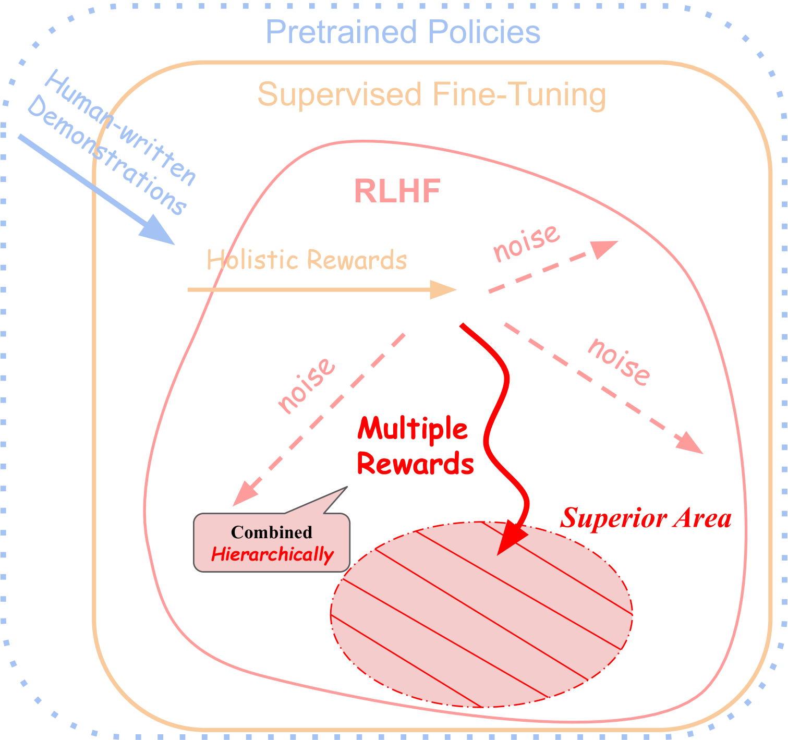
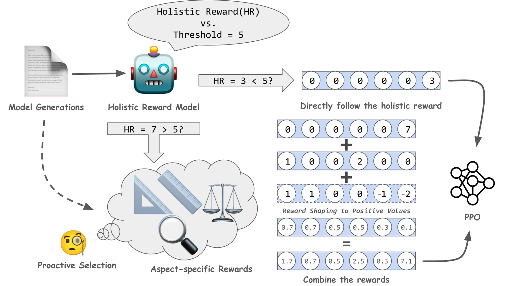
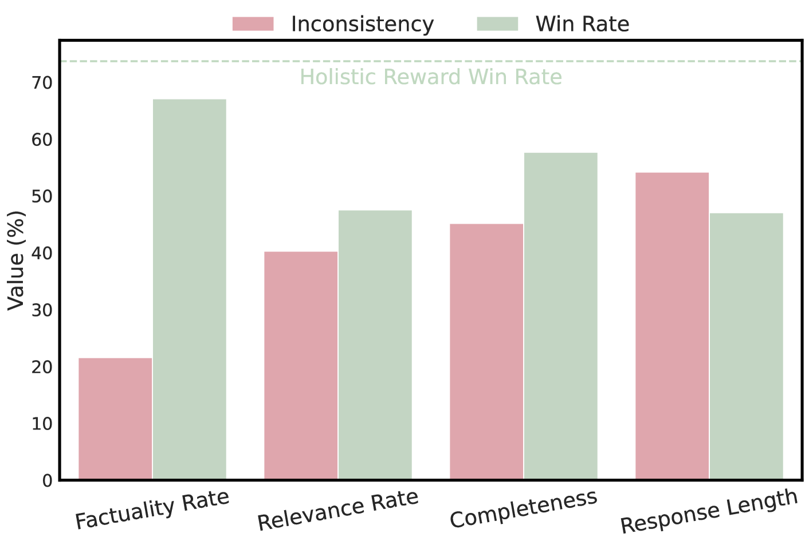
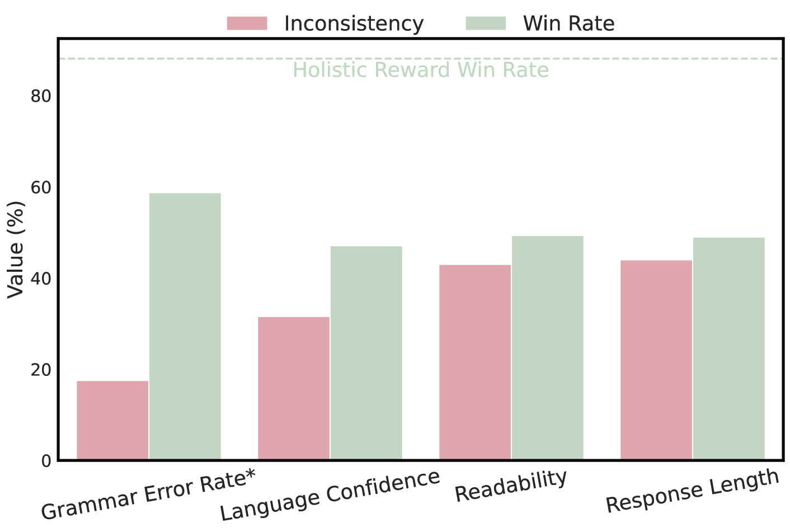
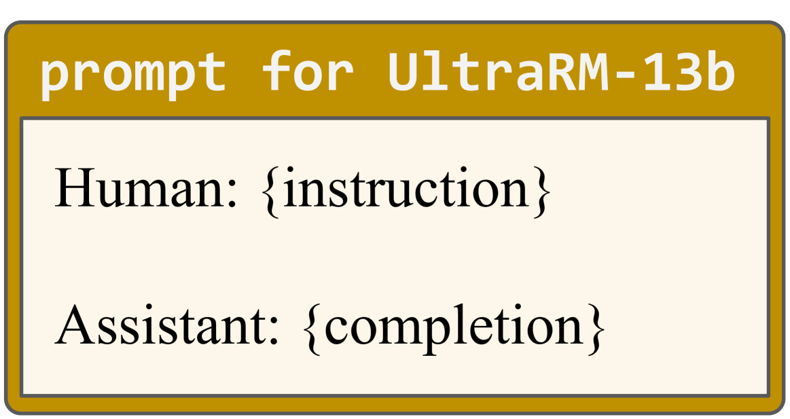
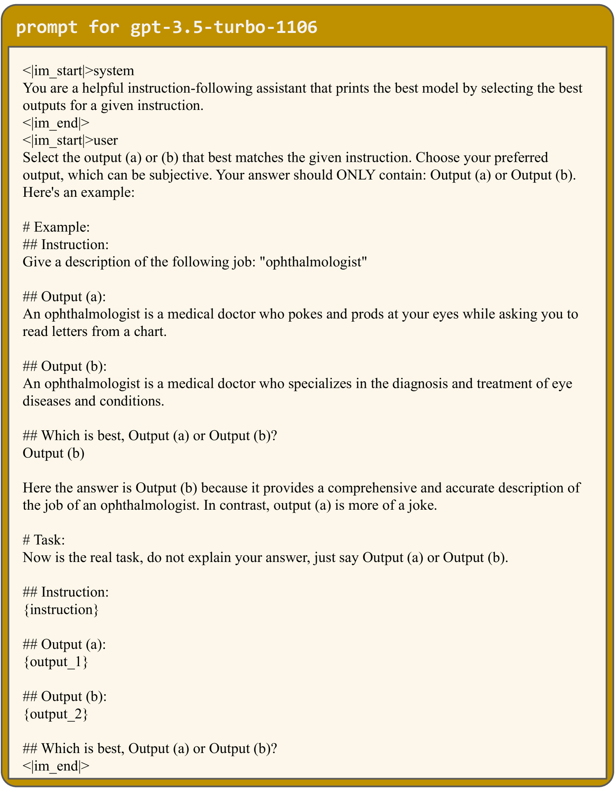

# ALaRM 是一种创新方法，它利用层次化奖励建模技术来对齐和优化语言模型的性能。该策略旨在通过模拟不同层级的奖励机制，更好地指导和调整语言模型的行为表现。步骤 1 翻译：ALaRM: 通过层级奖励建模实现语言模型的对齐步骤 2 翻译：ALaRM 是一项研究提出的技术，通过构建层级化的奖励模型，致力于有效对齐和提升语言模型的表现力，其原理在于运用多层级的激励机制来精细化指导和校准语言模型在各类任务中的行为反应。

发布时间：2024年03月11日

`Agent`

> ALaRM: Align Language Models via Hierarchical Rewards Modeling

# 摘要

> 我们创新性地推出了 ALaRM 框架，首次将分层奖励应用于基于人类反馈的强化学习中，目标是提升大型语言模型与人类偏好的契合度。针对目前对齐技术难以应对的人类监督信号不一致、稀疏问题，ALaRM 将全局奖励与特定方面奖励相结合，确保模型在复杂及开放文本生成任务中更精准、稳定地趋向理想输出。它采用了一套筛选并结合多种奖励的策略，依据奖励之间的一致性提高模型对齐效果的可靠性。我们通过在长篇问答和机器翻译任务中的实践应用，运用 gpt-3.5-turbo 进行对比试验，成功超越已有基准。此项研究证实了分层奖励建模在精细化 LLM 训练流程、增进对人类偏好的贴合度上的显著效果。目前，我们已将相关代码开源，发布于 https://ALaRM-fdu.github.io。

> We introduce ALaRM, the first framework modeling hierarchical rewards in reinforcement learning from human feedback (RLHF), which is designed to enhance the alignment of large language models (LLMs) with human preferences. The framework addresses the limitations of current alignment approaches, which often struggle with the inconsistency and sparsity of human supervision signals, by integrating holistic rewards with aspect-specific rewards. This integration enables more precise and consistent guidance of language models towards desired outcomes, particularly in complex and open text generation tasks. By employing a methodology that filters and combines multiple rewards based on their consistency, the framework provides a reliable mechanism for improving model alignment. We validate our approach through applications in long-form question answering and machine translation tasks, employing gpt-3.5-turbo for pairwise comparisons, and demonstrate improvements over existing baselines. Our work underscores the effectiveness of hierarchical rewards modeling in refining LLM training processes for better human preference alignment. We release our code at https://ALaRM-fdu.github.io.

[Arxiv](https://arxiv.org/abs/2403.06754)