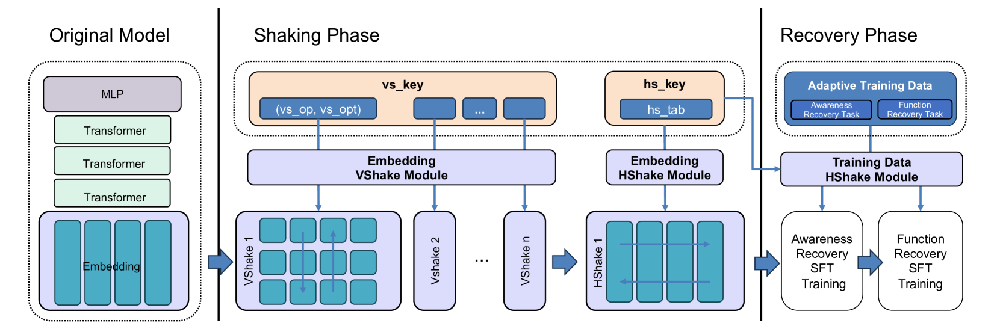
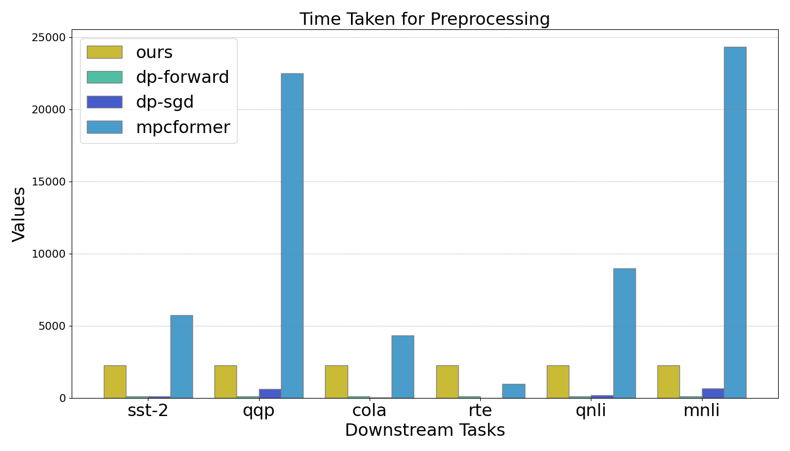
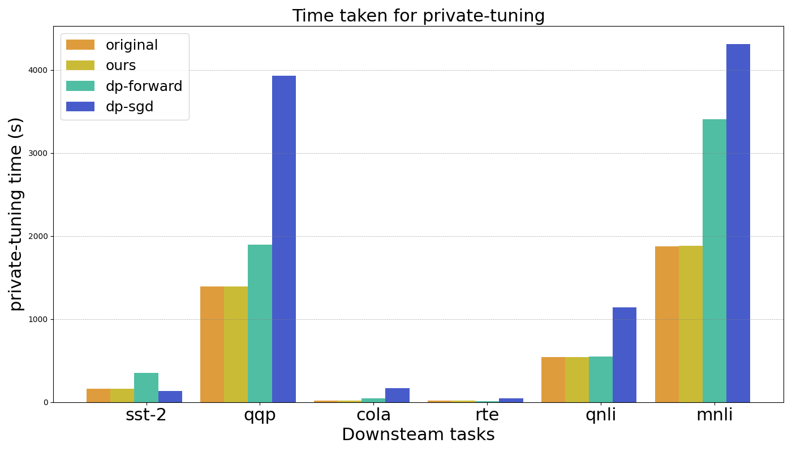
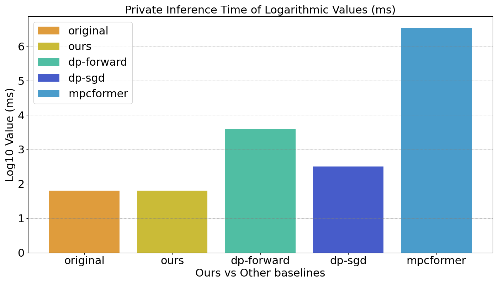
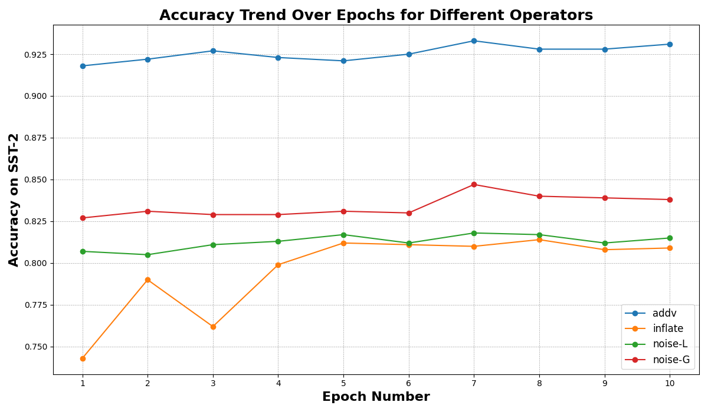
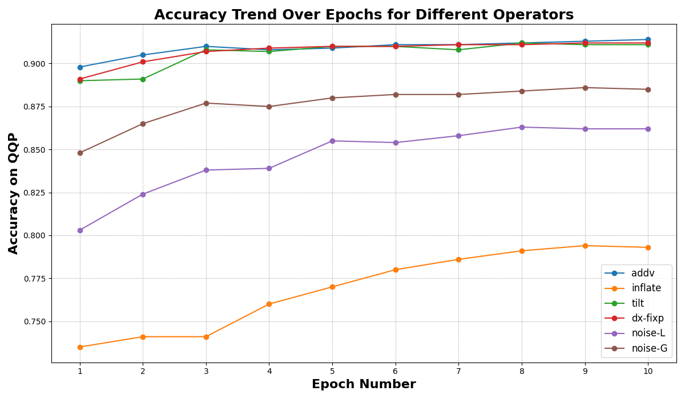

# 我们提出了一种兼顾成本效益和自我适应性的 LLM 振荡与恢复机制框架，旨在有效解决大型语言模型在运行过程中可能产生的不稳定性和性能波动问题，并实现模型自我修复与优化。

发布时间：2024年03月11日

`LLM应用`

> A Framework for Cost-Effective and Self-Adaptive LLM Shaking and Recovery Mechanism

# 摘要

> 随着LLMs在现实世界广泛应用中的显著成功，众多用户开始尝试通过云端服务构建并运用自己定制的LLMs。但针对特定行业，仍有关于成本、隐私保护与精确度之间平衡的问题待解决。为此，我们提出了一项名为CypherTalk的成本效益高且具备自我适应能力的LLM摇摆调优与恢复机制。该机制凭借独特设计的横向与纵向摇摆操作，能够在保证隐私的前提下，采用基于密码学或差分隐私的技术，实现与当前最优隐私保护LLM方案相媲美的精准度。实验结果显示，在CypherTalk框架内，通过合理配置摇摆操作符，用户能够确保模型保持稳定的高精度输出。迄今为止，这是我们首次在LLM情境中考量成本、模型实用性和隐私权衡的研究。

> As Large Language Models (LLMs) gain great success in real-world applications, an increasing number of users are seeking to develop and deploy their customized LLMs through cloud services. Nonetheless, in some specific domains, there are still concerns regarding cost and trade-offs between privacy issues and accuracy. In this study, we introduce a cost-effective and self-adaptive LLM shaking tuning and recovery mechanism, named CypherTalk. With carefully designed horizontal and vertical shaking operators, we can achieve comparable accuracy results with SOTA privacy-preserving LLM schemes using Cryptography-based or Differential Privacy-based methods. Experiments also show that with the CypherTalk framework, users can achieve reliable accuracy when using optimized shaking operator settings. To our best knowledge, this is the first work that considers cost, and trade-off between model utility and privacy in LLM scenarios.

[Arxiv](https://arxiv.org/abs/2403.07283)