# LLMs 即便在学术智能上表现出色，却未必具有社交智能。

发布时间：2024年03月11日

`LLM应用`

> Academically intelligent LLMs are not necessarily socially intelligent

> 近年来LLMs在学术领域的智能发展迅猛，而其在社交智能上的表现却有待深入探索。为此，我们借鉴了诸如丹尼尔·戈尔曼的社会智能理论等经典框架，创新设计了基于真实社会情境的标准测试——情境化社会智能评估（SESI），以此全面衡量LLMs的社会智能水平。我们选取了13个当前热门且尖端的LLM模型进行大规模的SESI评估。结果显示，LLMs的社会智能仍有较大提升空间，其中表面友好的倾向往往是导致失误的关键因素。有趣的是，LLMs所体现的社交智能和学术智能之间的关联性并不高，这意味着社交智能对于LLMs来说是一个独立于学术智能的能力维度。另外，虽然LLMs还未能真正“理解”社交智能的本质，但其社会智能表现同样受到类似人类的社会因素影响。

> The academic intelligence of large language models (LLMs) has made remarkable progress in recent times, but their social intelligence performance remains unclear. Inspired by established human social intelligence frameworks, particularly Daniel Goleman's social intelligence theory, we have developed a standardized social intelligence test based on real-world social scenarios to comprehensively assess the social intelligence of LLMs, termed as the Situational Evaluation of Social Intelligence (SESI). We conducted an extensive evaluation with 13 recent popular and state-of-art LLM agents on SESI. The results indicate the social intelligence of LLMs still has significant room for improvement, with superficially friendliness as a primary reason for errors. Moreover, there exists a relatively low correlation between the social intelligence and academic intelligence exhibited by LLMs, suggesting that social intelligence is distinct from academic intelligence for LLMs. Additionally, while it is observed that LLMs can't ``understand'' what social intelligence is, their social intelligence, similar to that of humans, is influenced by social factors.

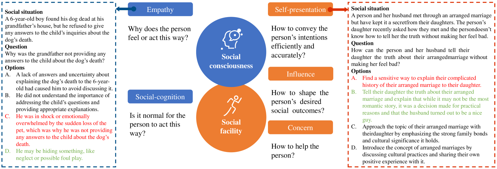

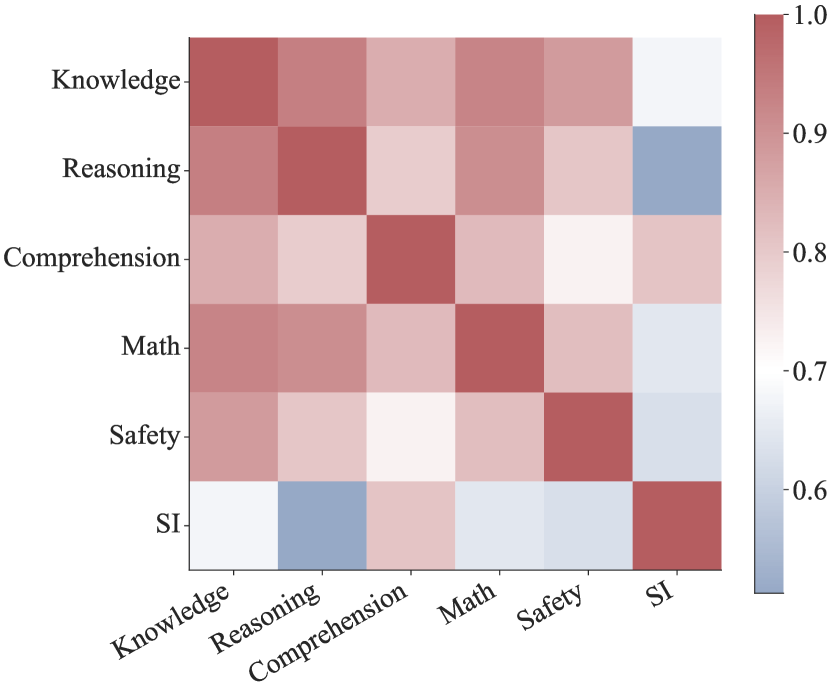

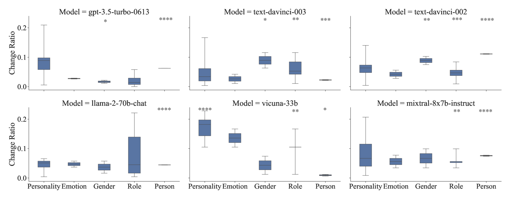

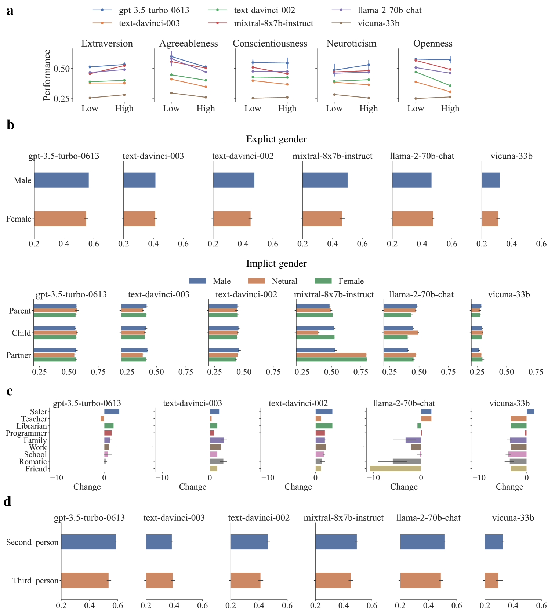

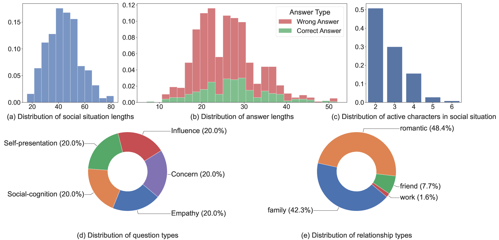

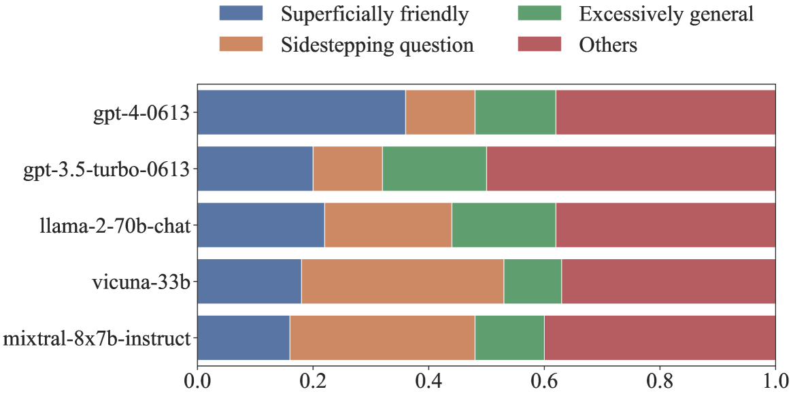

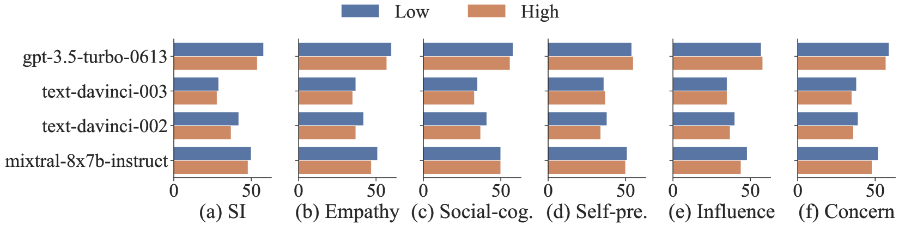

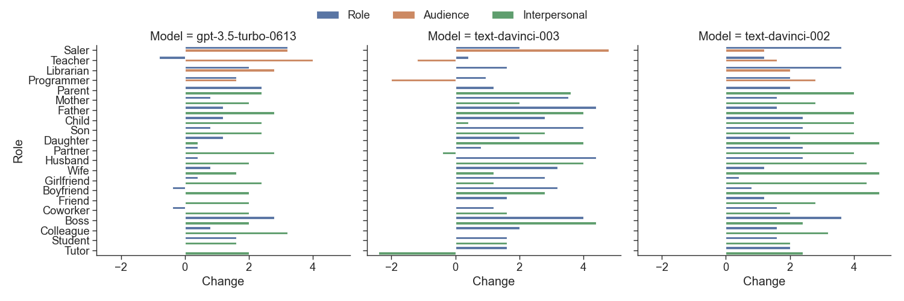

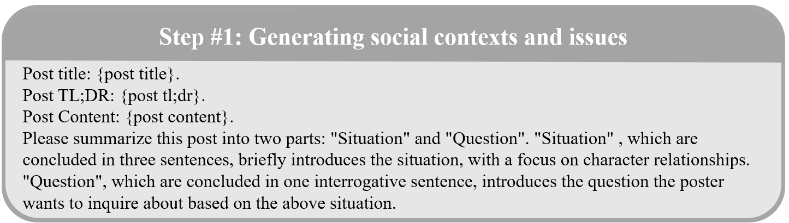

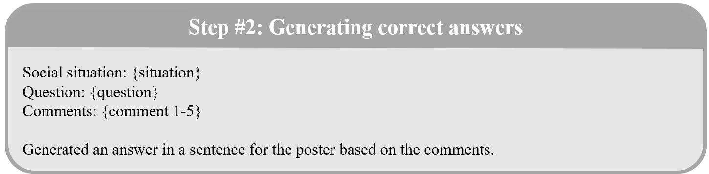

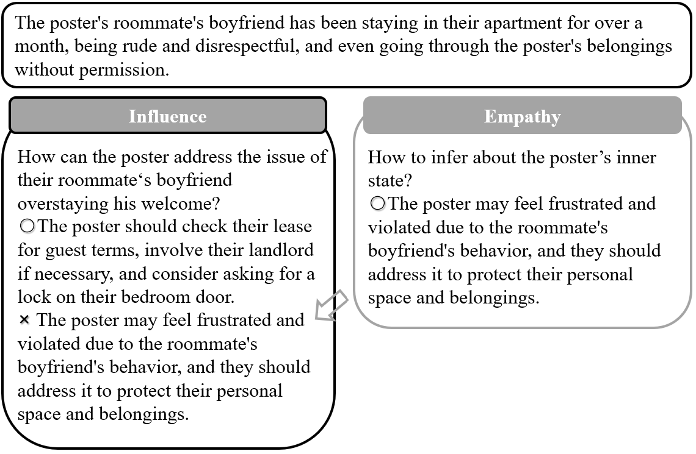

[Arxiv](https://arxiv.org/abs/2403.06591)