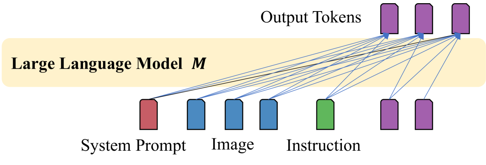
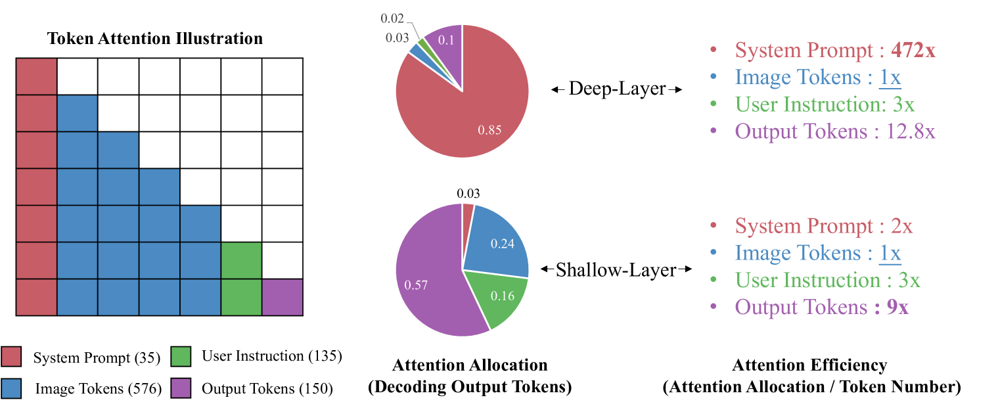
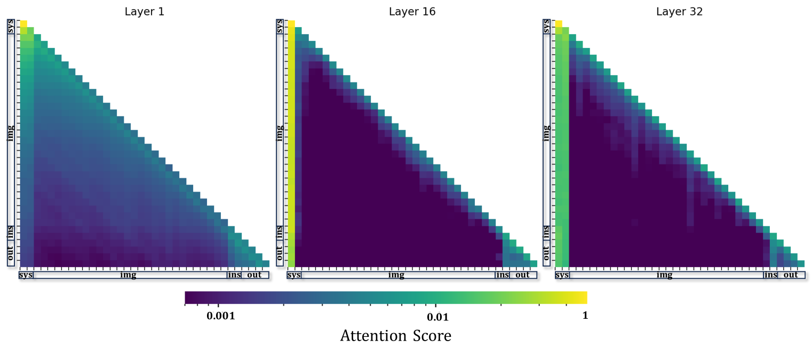
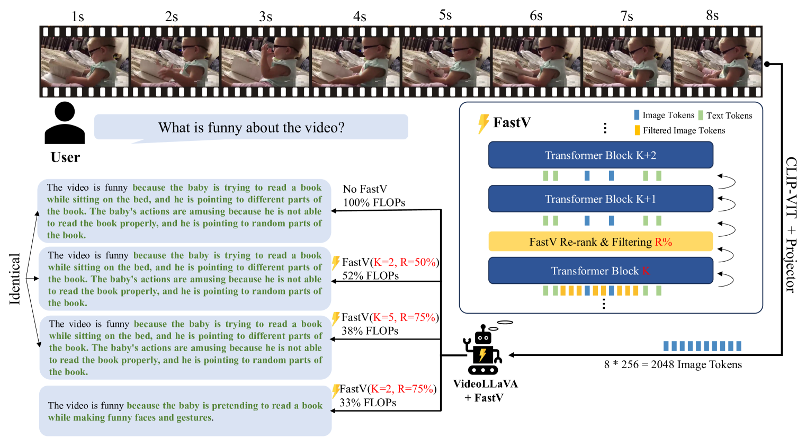
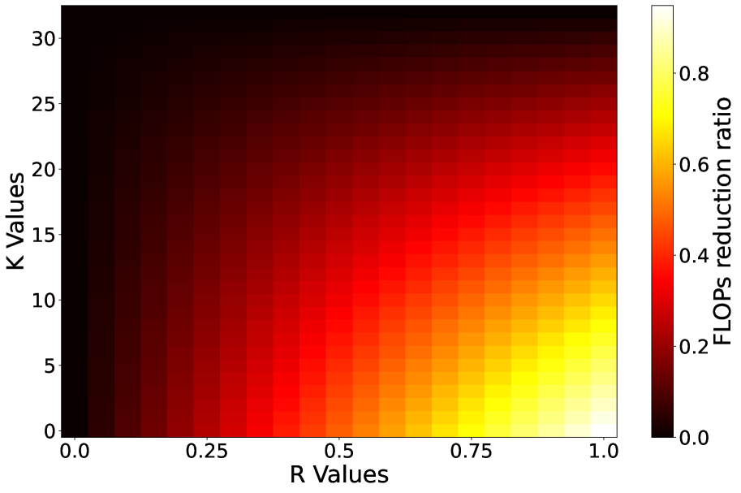
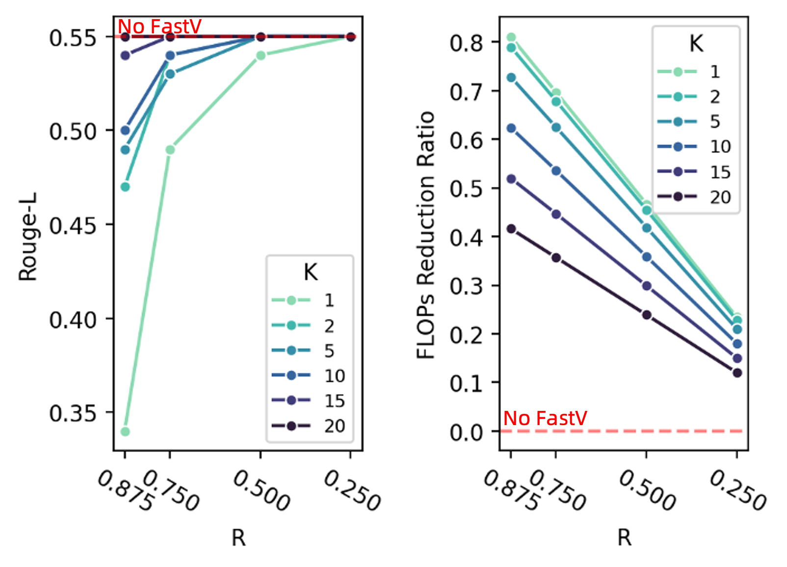
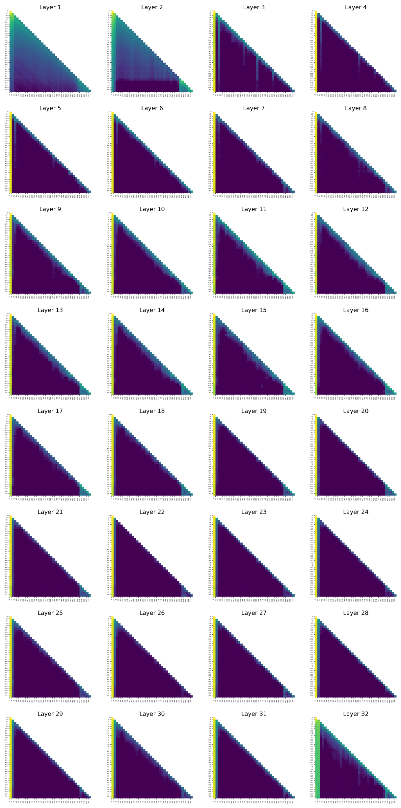

# 经过第二层处理后，图像信息可有效压缩为半个标记量级，为此我们提出一种针对大型视觉-语言模型的便捷式推理加速方案。

发布时间：2024年03月11日

`LLM应用`

> An Image is Worth 1/2 Tokens After Layer 2: Plug-and-Play Inference Acceleration for Large Vision-Language Models

# 摘要

> 本研究揭示了大尺寸视觉-语言模型（如 LLaVA-1.5 等热门模型）中的注意力机制低效问题。这些模型在深度层面对视觉信息的关注计算极其浪费，因此我们创新提出 FastV 方法，它能够在早期层学习适应性注意力模式并逐步修剪视觉标记，以实现计算效率的优化。实验证明，FastV 能够大幅削减计算开销（例如使 LLaVA-1.5-13B 模型的 FLOPs 下降 45%），即便在各种图像和视频理解任务上，也能保持性能不减。FastV 的计算效率与性能间的平衡点高度可定制且具备帕累托最优特性，使得即使是拥有130亿参数的模型，在经过压缩后，其FLOPs可以低于70亿参数模型，但仍能保持出色的表现。我们相信 FastV 将为边缘设备及商业场景下 LVLMs 的应用部署带来巨大价值，相关代码已在 https://github.com/pkunlp-icler/FastV 发布。

> In this study, we identify the inefficient attention phenomena in Large Vision-Language Models (LVLMs), notably within prominent models like LLaVA-1.5, QwenVL-Chat and Video-LLaVA. We find out that the attention computation over visual tokens is of extreme inefficiency in the deep layers of popular LVLMs, suggesting a need for a sparser approach compared to textual data handling. To this end, we introduce FastV, a versatile plug-and-play method designed to optimize computational efficiency by learning adaptive attention patterns in early layers and pruning visual tokens in subsequent ones. Our evaluations demonstrate FastV's ability to dramatically reduce computational costs (e.g., a 45 reduction in FLOPs for LLaVA-1.5-13B) without sacrificing performance in a wide range of image and video understanding tasks. The computational efficiency and performance trade-off of FastV are highly customizable and pareto-efficient. It can compress the FLOPs of a 13B-parameter model to achieve a lower budget than that of a 7B-parameter model, while still maintaining superior performance. We believe FastV has practical values for deployment of LVLMs in edge devices and commercial models. Code is released at https://github.com/pkunlp-icler/FastV.

[Arxiv](https://arxiv.org/abs/2403.06764)