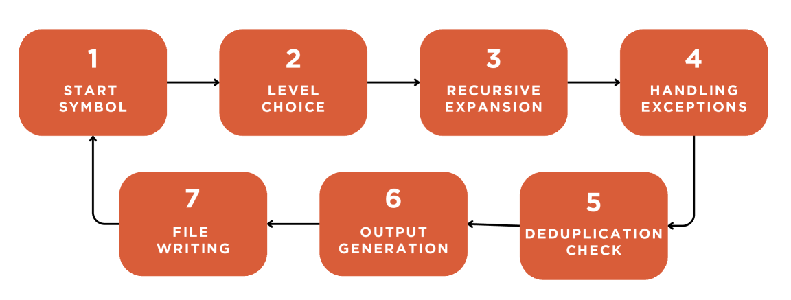
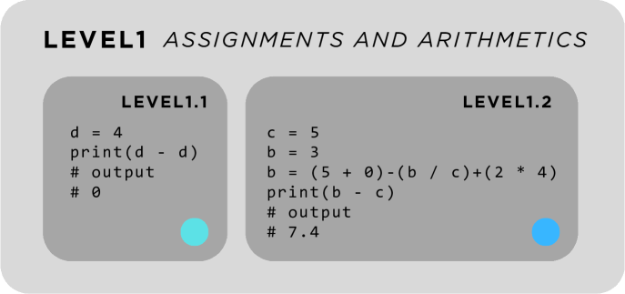
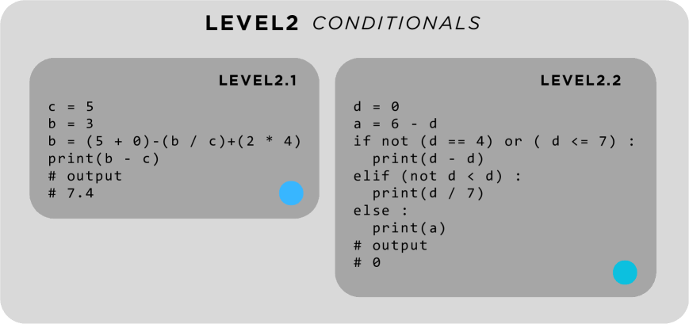
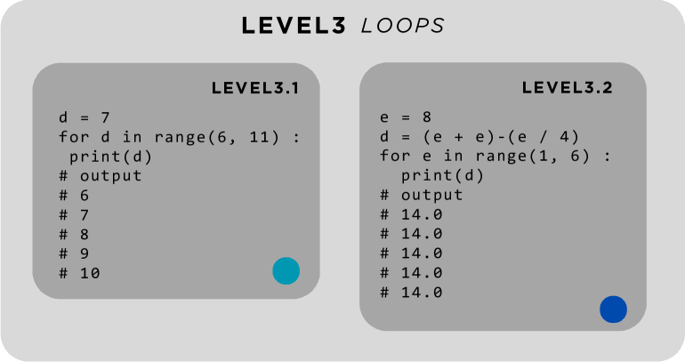
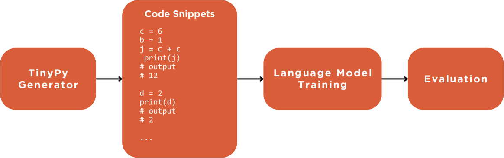
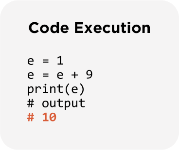

# [本研究探讨运用无上下文文法实现Python程序的自动化生成技术，旨在通过规则解析和程序结构自动生成，提高代码开发效率与灵活性。](https://arxiv.org/abs/2403.06503)

发布时间：2024年03月11日

`Agent`

> Automatic Generation of Python Programs Using Context-Free Grammars

> 近年来，数据被誉为新的“宝藏”，在构建智能系统中发挥着关键作用，但获取优质代码数据依然困难重重。为此，我们创新推出了TinyPy Generator，它运用无上下文文法自动生成合规的随机Python程序。这套系统依据自定义的BNF格式产生规则递归生成代码片段，涵盖了从基础赋值语句到包含条件判断、循环等复杂逻辑的各类代码层级。TinyPy Generator能轻松实现大规模Python代码的一键生成，广泛应用于众多场景。特别是在机器学习领域，它可以大量输出训练Python语言模型所需的代码。同时，研究编程语言的科研人员也可借助此工具创建实验数据集，检验代码解释器或编译器的稳健性。值得一提的是，我们已将TinyPy Generator开源，用户可根据个性化需求自由定制，并有潜力推广至其他编程语言的代码生成应用中。

> In recent years, data has emerged as the new gold, serving as a powerful tool for creating intelligent systems. However, procuring high-quality data remains challenging, especially for code. To address this, we developed TinyPy Generator, a tool that generates random Python programs using a context-free grammar. The generated programs are guaranteed to be correct by construction. Our system uses custom production rules (in the Backus-Naur Form (BNF) format) to recursively generate code. This allows us to generate code with different levels of complexity, ranging from code containing only assignments to more complex code containing conditionals and loops. Our proposed tool enables effortless large-scale Python code generation, beneficial for a wide range of applications. TinyPy Generator is particularly useful in the field of machine learning, where it can generate substantial amounts of Python code for training Python language models. Additionally, researchers who are studying programming languages can utilize this tool to create datasets for their experiments, which can help validate the robustness of code interpreters or compilers. Unlike existing research, we have open-sourced our implementation. This allows customization according to user needs and extends potential usage to other languages.

[Arxiv](https://arxiv.org/abs/2403.06503)