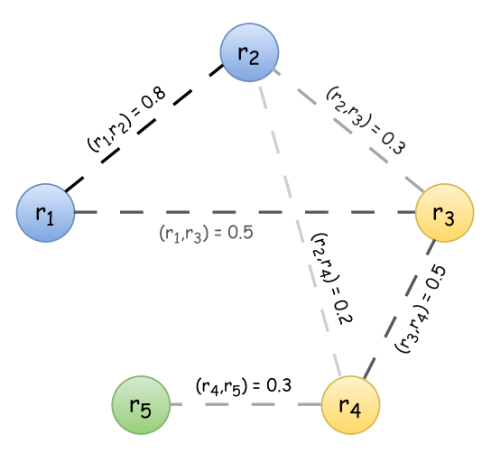
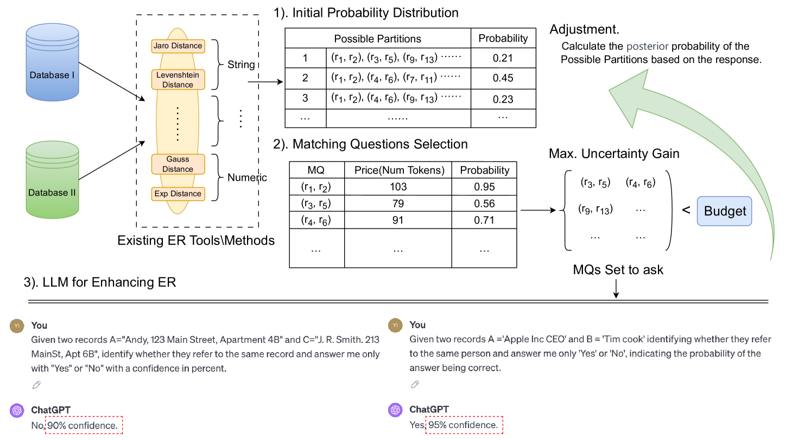
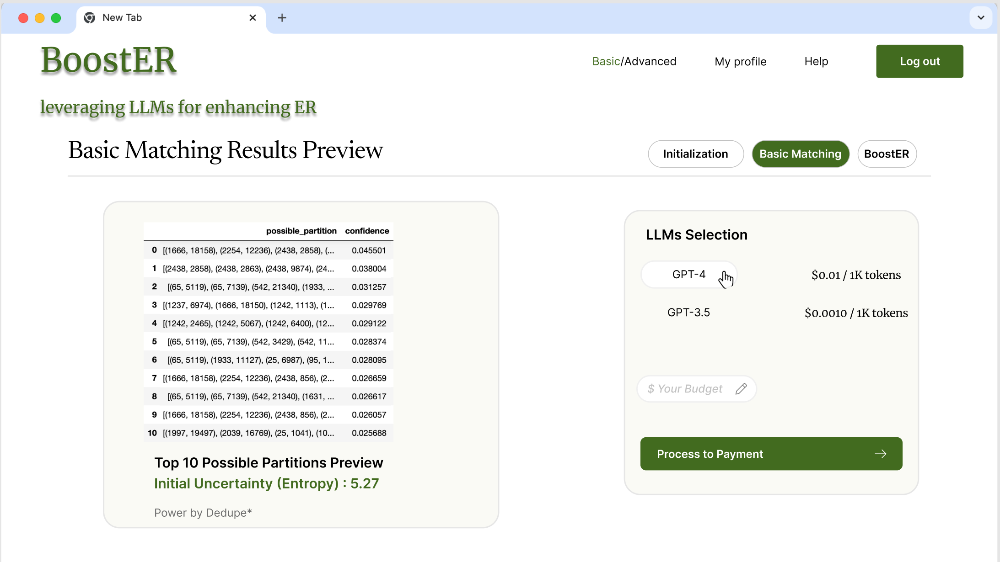
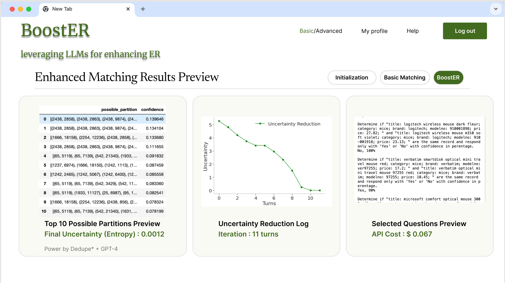

# [BoostER 技术巧妙运用大型语言模型，以强化实体解析效能。](https://arxiv.org/abs/2403.06434)

发布时间：2024年03月11日

`LLM应用`

> BoostER: Leveraging Large Language Models for Enhancing Entity Resolution

> 实体解析——确定并整合指向同一实体的不同记录，在诸如Web数据整合等领域扮演着至关重要的角色，尤其在网络充斥着众多复制与多版本数据资源的背景下。尽管如此，追求高质量的实体解析往往需耗费大量精力。随着GPT-4等大型语言模型（LLMs）的横空出世，它们所展现的卓越语言技能为解决此问题带来全新思路。本文介绍了一个名为BoostER的演示系统，探讨如何巧妙运用LLMs提升实体解析过程的效果，该系统不仅易于部署，而且成本低廉。我们采用的方法是精心选取一系列匹配问题提交给LLMs校验，并借助LLMs的回答进一步精细化实体解析结果的分布。这一方案有望为实际应用带来高质量的实体解析成果，特别适合那些无需深度模型训练或大额投资的小型企业和个人用户。

> Entity resolution, which involves identifying and merging records that refer to the same real-world entity, is a crucial task in areas like Web data integration. This importance is underscored by the presence of numerous duplicated and multi-version data resources on the Web. However, achieving high-quality entity resolution typically demands significant effort. The advent of Large Language Models (LLMs) like GPT-4 has demonstrated advanced linguistic capabilities, which can be a new paradigm for this task. In this paper, we propose a demonstration system named BoostER that examines the possibility of leveraging LLMs in the entity resolution process, revealing advantages in both easy deployment and low cost. Our approach optimally selects a set of matching questions and poses them to LLMs for verification, then refines the distribution of entity resolution results with the response of LLMs. This offers promising prospects to achieve a high-quality entity resolution result for real-world applications, especially to individuals or small companies without the need for extensive model training or significant financial investment.

[Arxiv](https://arxiv.org/abs/2403.06434)