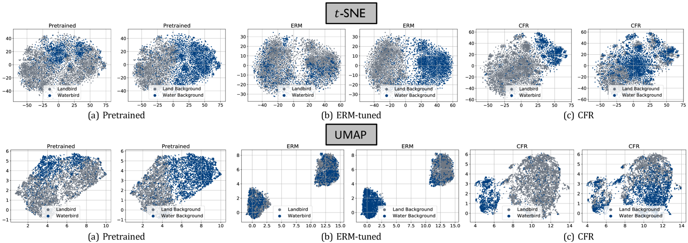
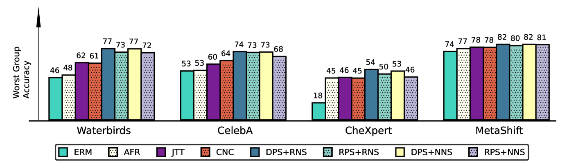
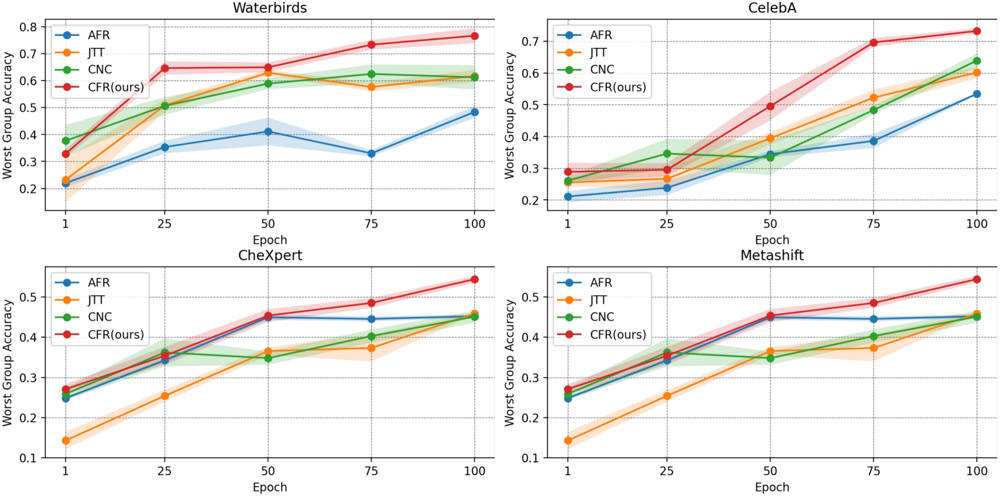
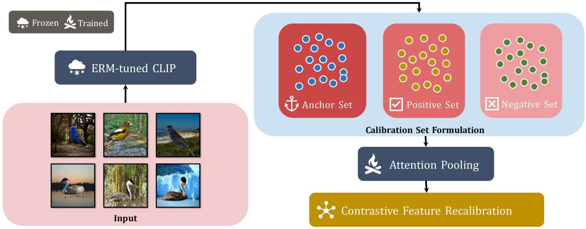
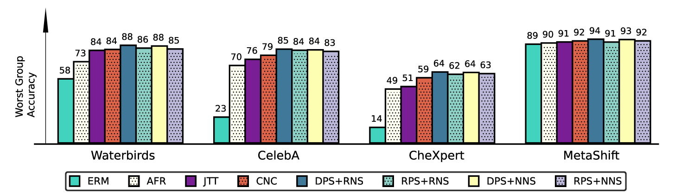
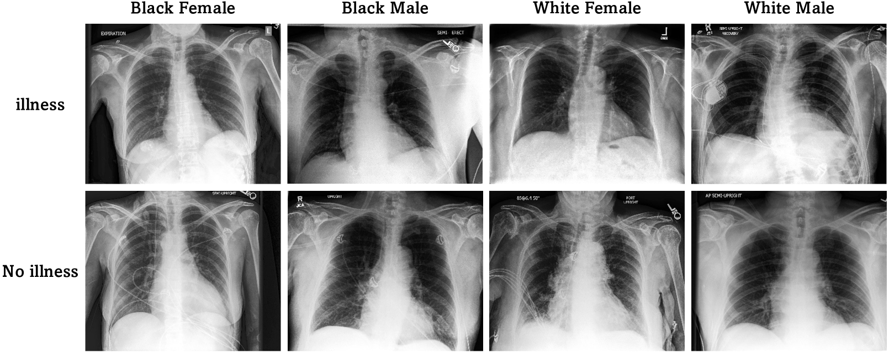

# [为实现无需标注的群体鲁棒性，我们致力于校准多模态表示的研究。本研究探讨如何在缺乏人工注释的前提下提升多模态模型对不同群体数据的适应性和稳定性。](https://arxiv.org/abs/2403.07241)

发布时间：2024年03月11日

`Agent`

> Calibrating Multi-modal Representations: A Pursuit of Group Robustness without Annotations

> 尽管像CLIP这样的预训练视觉-语言模型经微调后，在众多下游任务中表现出色，但这种模式还面临三个挑战：一是全面调整预训练模型耗时且计算资源开销大，导致微调后的模型过于专门化，不利于实际场景部署；二是新研究表明，预训练的视觉-语言分类器可能过度依赖于训练数据中存在的、与真正标注规则无本质联系的相关特征（即偶然特征）；三是当前减少偶然特征依赖的研究大多建立在能识别这类特征的假设之上，对于真实应用环境下的效果并未给出确切保障。因此，本研究以CLIP为例，尝试在无需任何群体标注的情况下减轻模型对偶然特征的依赖。我们首先在CLIP和CILP+ERM上系统研究了偶然关联的存在性，并借鉴深度特征重新加权（DFR）的最新成果，确认仅通过重训最后一层就能大幅提升预训练CLIP的群体鲁棒性。基于以上发现，我们提出了一种轻巧的表示校准策略，先利用预训练CLIP自动生成校准数据集，再通过对比学习在校准集内部调整样本的表示，全程无需人工标注群体信息。我们在多个基准数据集上进行了广泛实验和深入可视化分析，验证了该方案的有效性，明显降低了对偶然特征的依赖度，并极大提高了模型的泛化性能。

> Fine-tuning pre-trained vision-language models, like CLIP, has yielded success on diverse downstream tasks. However, several pain points persist for this paradigm: (i) directly tuning entire pre-trained models becomes both time-intensive and computationally costly. Additionally, these tuned models tend to become highly specialized, limiting their practicality for real-world deployment; (ii) recent studies indicate that pre-trained vision-language classifiers may overly depend on spurious features -- patterns that correlate with the target in training data, but are not related to the true labeling function; and (iii) existing studies on mitigating the reliance on spurious features, largely based on the assumption that we can identify such features, does not provide definitive assurance for real-world applications. As a piloting study, this work focuses on exploring mitigating the reliance on spurious features for CLIP without using any group annotation. To this end, we systematically study the existence of spurious correlation on CLIP and CILP+ERM. We first, following recent work on Deep Feature Reweighting (DFR), verify that last-layer retraining can greatly improve group robustness on pretrained CLIP. In view of them, we advocate a lightweight representation calibration method for fine-tuning CLIP, by first generating a calibration set using the pretrained CLIP, and then calibrating representations of samples within this set through contrastive learning, all without the need for group labels. Extensive experiments and in-depth visualizations on several benchmarks validate the effectiveness of our proposals, largely reducing reliance and significantly boosting the model generalization.

