# CoRAL 是一种创新的方法，它通过协同检索增强大型语言模型，有效改善了对长尾项目的推荐效果，尤其针对那些稀有和冷启动情境。

发布时间：2024年03月11日

`LLM应用`

> CoRAL: Collaborative Retrieval-Augmented Large Language Models Improve Long-tail Recommendation

> 面对数据稀疏和不平衡问题，长尾推荐对传统推荐系统构成了严峻挑战。近期大放异彩的大型语言模型（LLMs）展现出处理复杂推理的能力，仅凭少量用户互动就能推测出其喜好。但多数基于LLM的系统仅仅依赖项目本身的语义含义进行推理，忽视了宝贵的用户-项目交互协同信息，导致LLM的推理可能偏离实际任务数据集中的协同模式。为此，我们创新性地提出了协作检索增强型LLMs——CoRAL，它巧妙地将协同证据融入提示之中。借助检索到的用户-项目互动记录，CoRAL驱动下的LLM能够深入剖析用户间共享及独特的偏好，并提炼出何种类型用户会被何种项目吸引的规律。这些关键的协同证据引导LLM精准对准数据集中体现的用户-项目交互规律。然而，受限于输入提示的长度，如何高效筛选出推荐任务所需的最少但足够的协同信息是个棘手问题。于是我们运用序列决策过程找寻最优交互集合，并在强化学习（RL）框架下训练出了CoRAL这一检索策略。实验证明，CoRAL能够显著提升LLMs针对特定推荐任务的推理效能；而深入分析也表明，CoRAL借助强化学习更能游刃有余地挖掘并利用协同信息。

> The long-tail recommendation is a challenging task for traditional recommender systems, due to data sparsity and data imbalance issues. The recent development of large language models (LLMs) has shown their abilities in complex reasoning, which can help to deduce users' preferences based on very few previous interactions. However, since most LLM-based systems rely on items' semantic meaning as the sole evidence for reasoning, the collaborative information of user-item interactions is neglected, which can cause the LLM's reasoning to be misaligned with task-specific collaborative information of the dataset. To further align LLMs' reasoning to task-specific user-item interaction knowledge, we introduce collaborative retrieval-augmented LLMs, CoRAL, which directly incorporate collaborative evidence into the prompts. Based on the retrieved user-item interactions, the LLM can analyze shared and distinct preferences among users, and summarize the patterns indicating which types of users would be attracted by certain items. The retrieved collaborative evidence prompts the LLM to align its reasoning with the user-item interaction patterns in the dataset. However, since the capacity of the input prompt is limited, finding the minimally-sufficient collaborative information for recommendation tasks can be challenging. We propose to find the optimal interaction set through a sequential decision-making process and develop a retrieval policy learned through a reinforcement learning (RL) framework, CoRAL. Our experimental results show that CoRAL can significantly improve LLMs' reasoning abilities on specific recommendation tasks. Our analysis also reveals that CoRAL can more efficiently explore collaborative information through reinforcement learning.

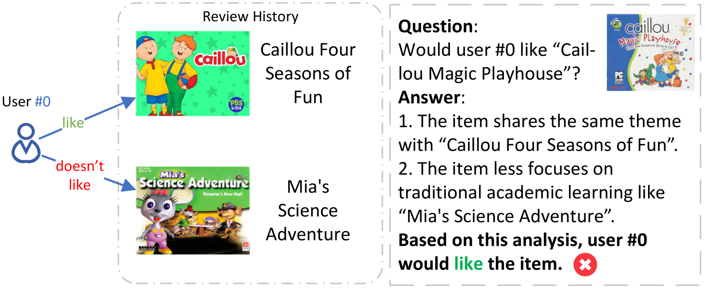

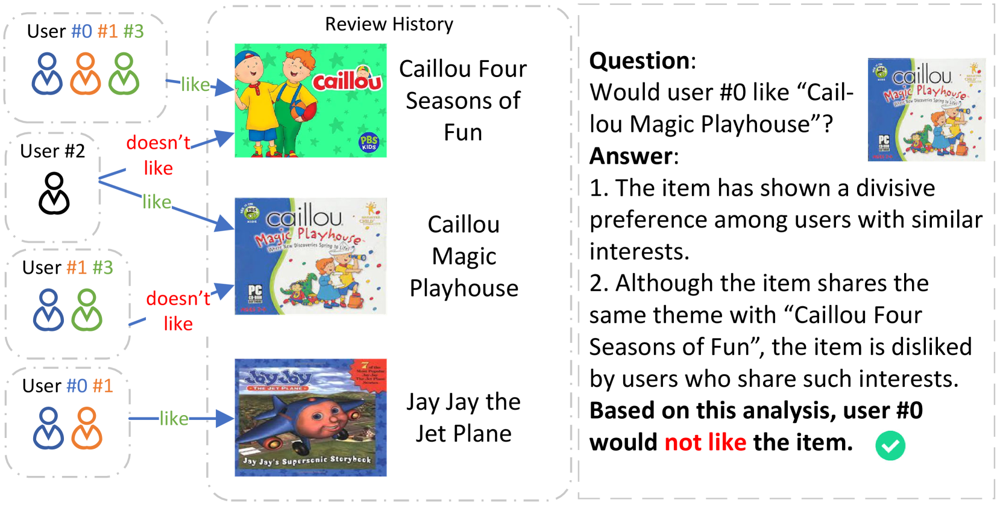

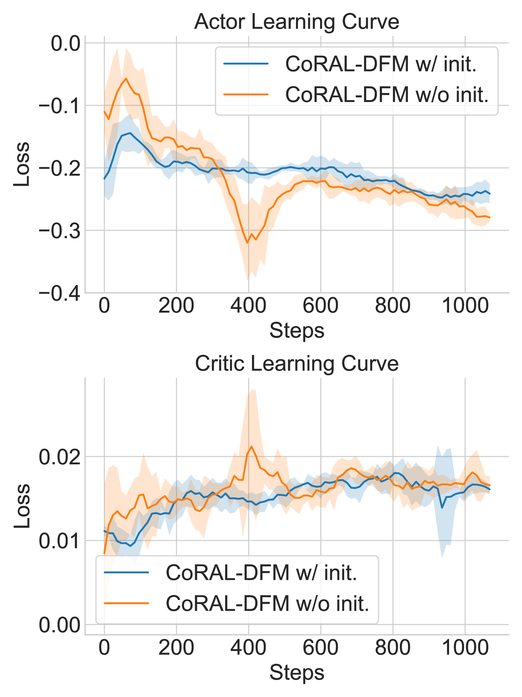

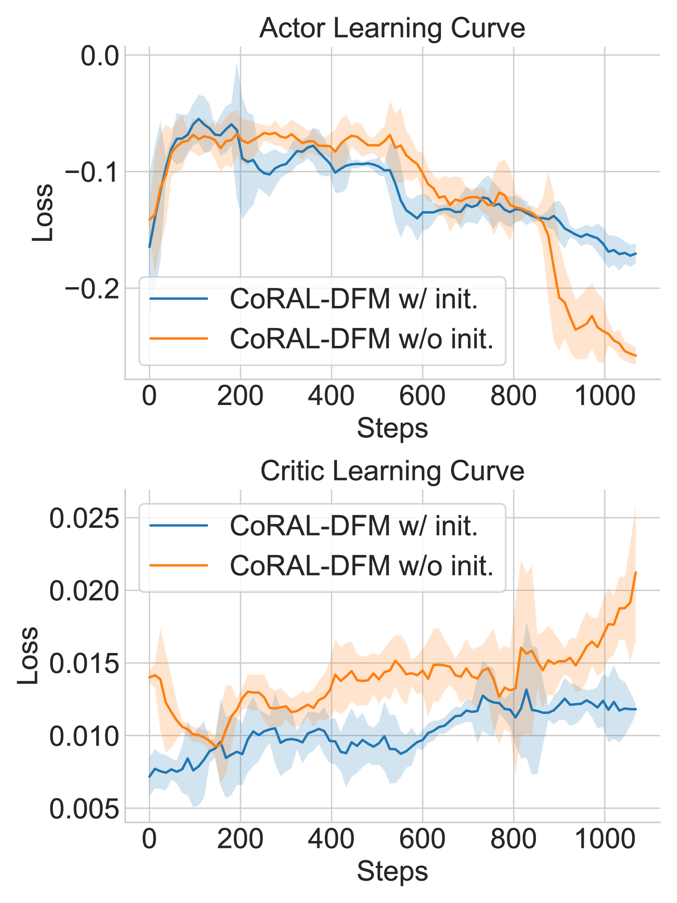

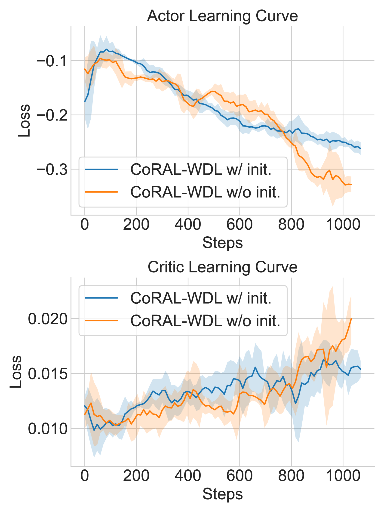

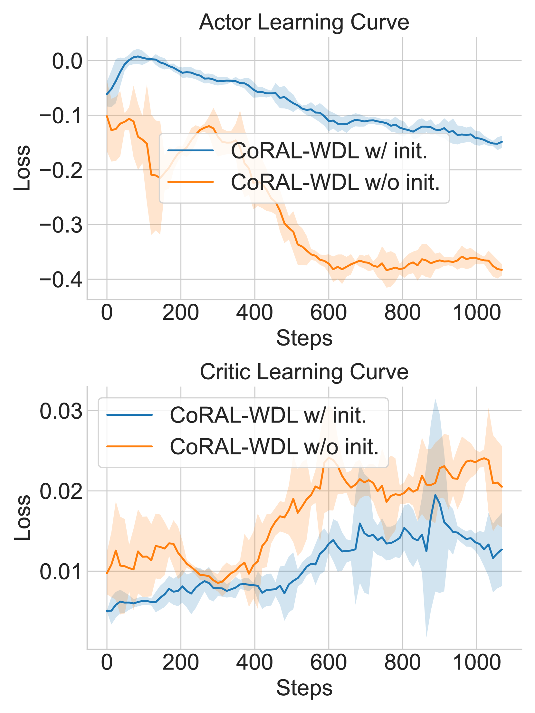

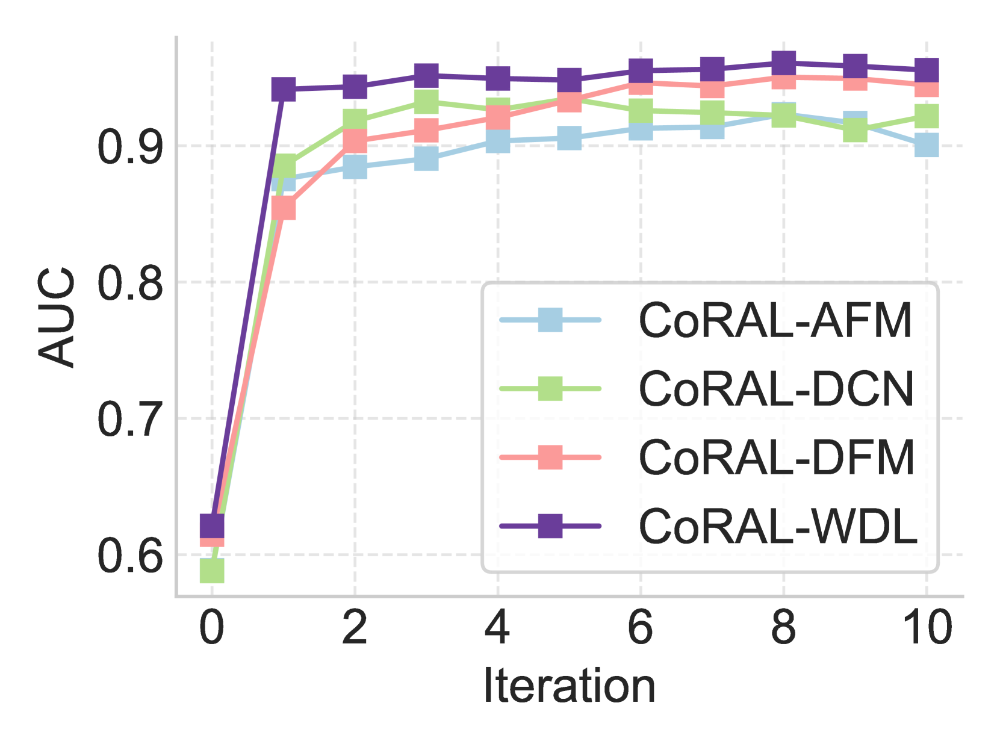

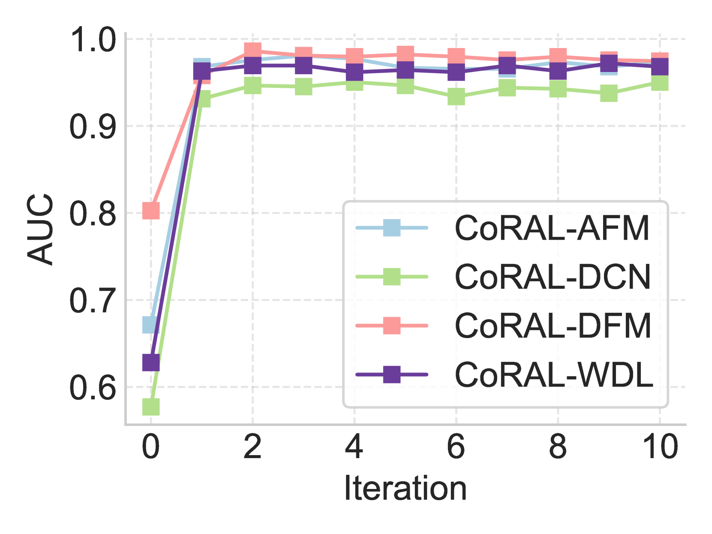

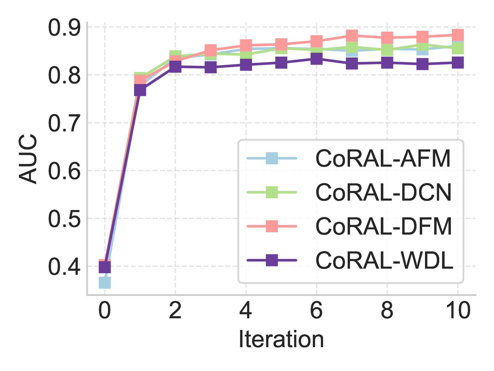

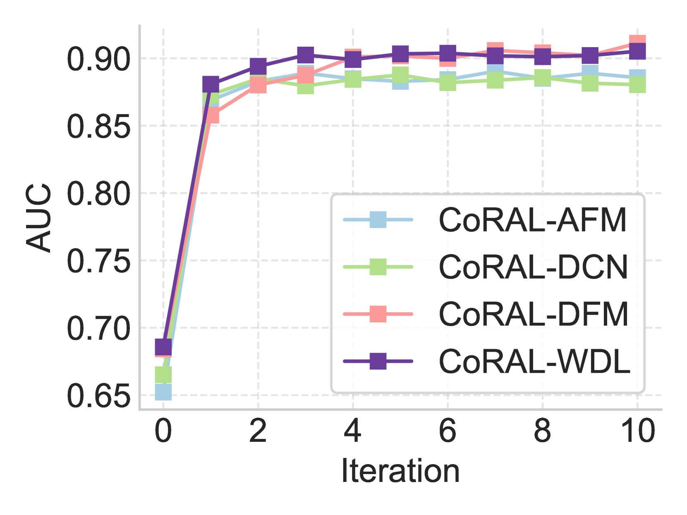

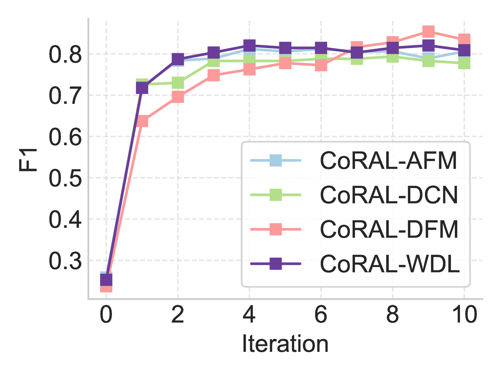

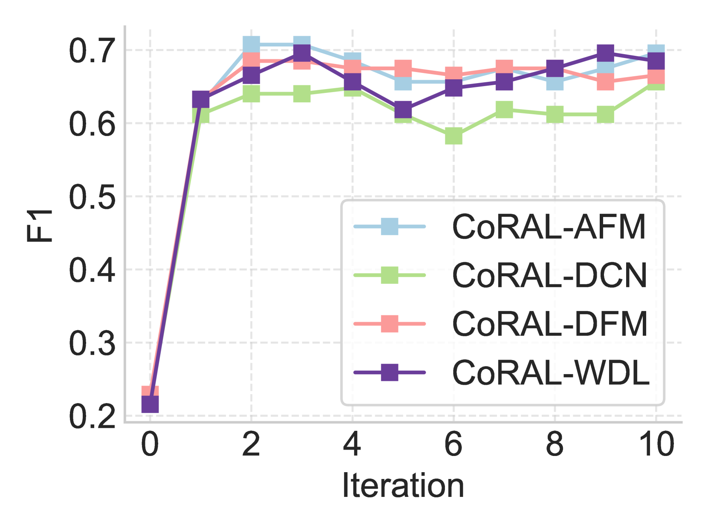

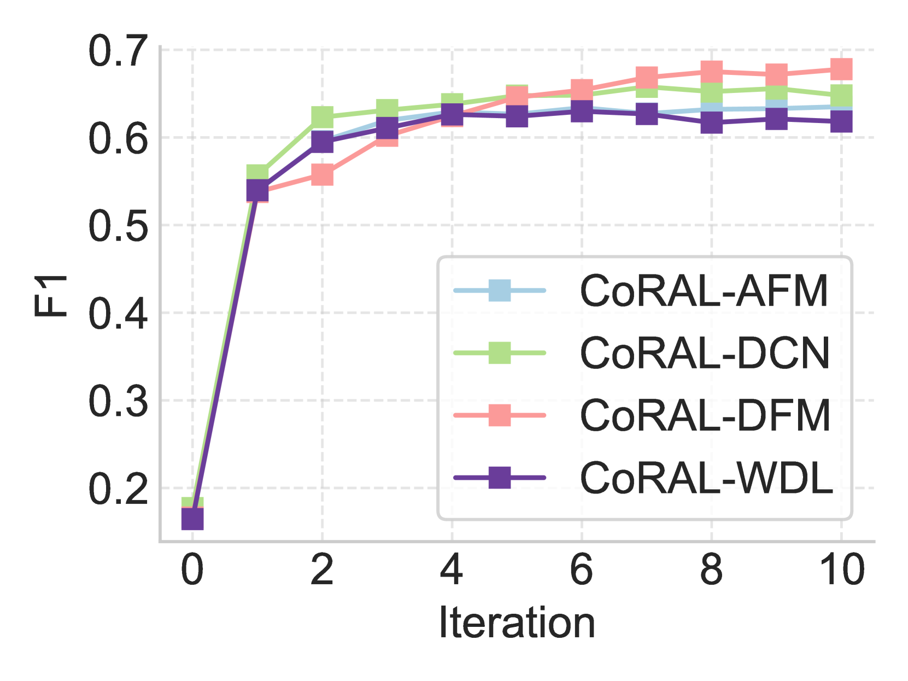

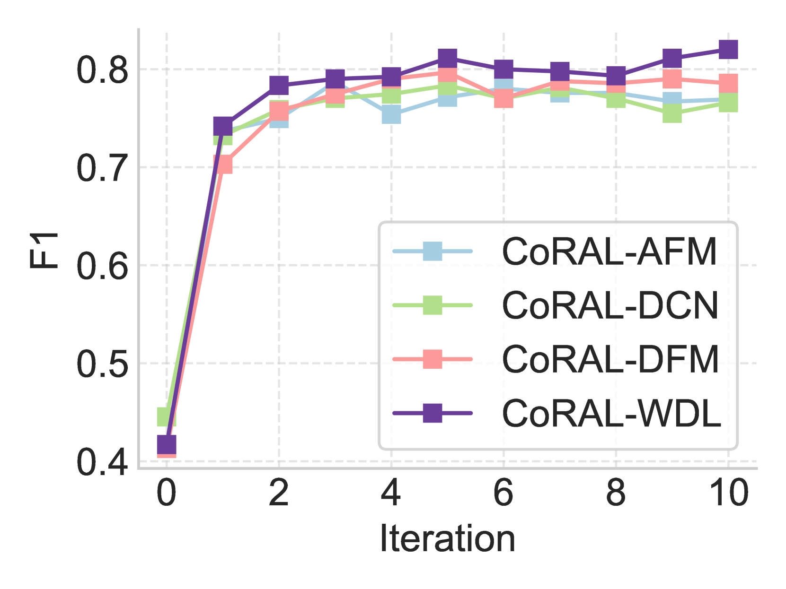

[Arxiv](https://arxiv.org/abs/2403.06447)