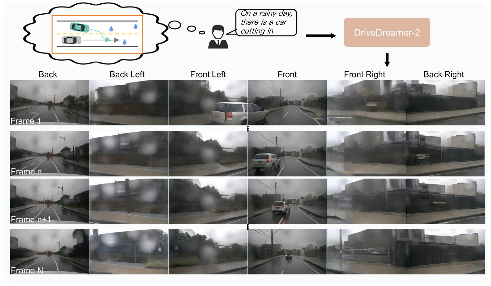
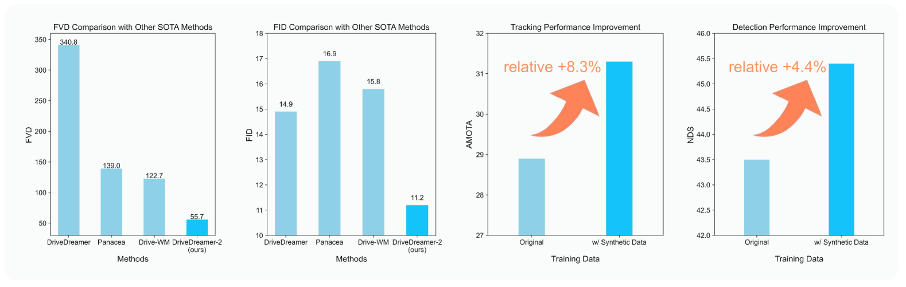
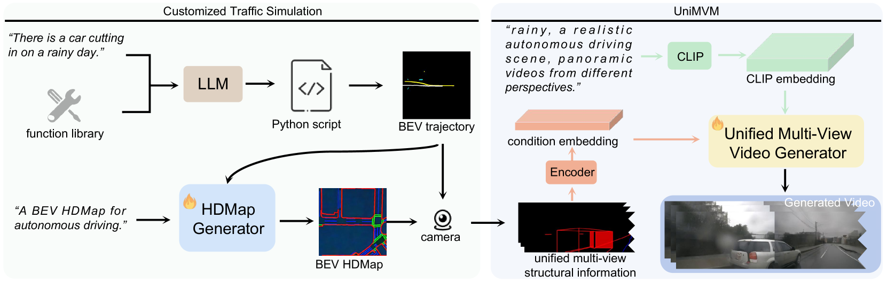
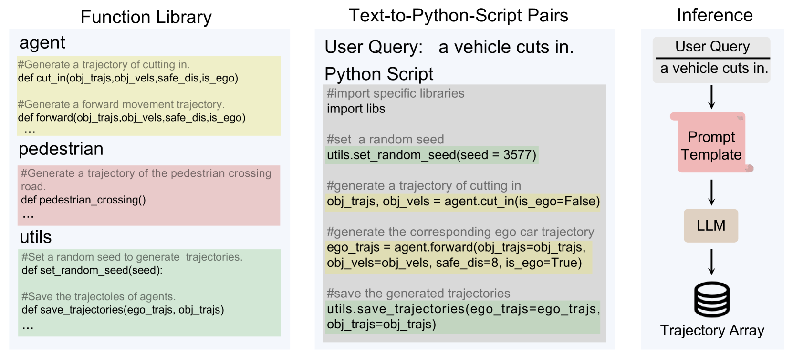
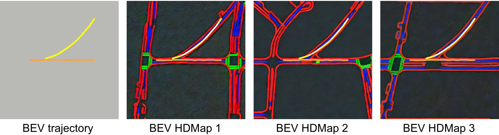
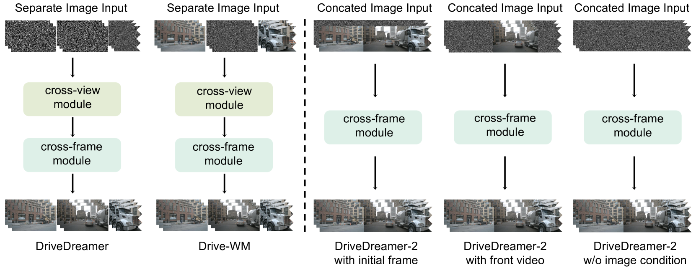
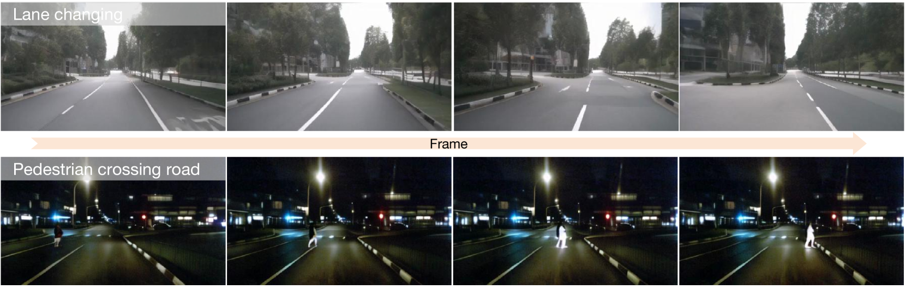

# DriveDreamer-2 是一款基于 LLM 强化的世界模型，专门用于创新且多样的驾驶视频生成任务。

发布时间：2024年03月11日

`Agent`

> DriveDreamer-2: LLM-Enhanced World Models for Diverse Driving Video Generation

> 世界模型在自动驾驶中独领风骚，尤其擅长生成多视角驾驶视频，但个性化驾驶视频的生成难题尚未解决。为此，本研究提出了DriveDreamer-2，它是在DriveDreamer基础上升级而成，创造性地融入了大型语言模型(LLM)，以便按用户需求生成驾驶视频。首先，通过LLM界面将用户的指令转化为行驶轨迹，接着据此生成符合交通法规的高清地图(HDMap)。最后，我们创新设计了统一多视角模型，显著提升了生成视频的时间与空间连贯性。DriveDreamer-2作为首款能随心所欲生成定制驾驶视频的世界模型，轻松驾驭诸如车辆突入等少见场景，且以用户友好方式呈现。实验证明，由DriveDreamer-2生成的视频还能助力提升3D检测与跟踪等驾驶感知技术的训练效能。不仅如此，DriveDreamer-2在视频生成质量上更胜一筹，其FID和FVD得分分别为11.2和55.7，实现了30%和50%的相对提升，傲视群雄。

> World models have demonstrated superiority in autonomous driving, particularly in the generation of multi-view driving videos. However, significant challenges still exist in generating customized driving videos. In this paper, we propose DriveDreamer-2, which builds upon the framework of DriveDreamer and incorporates a Large Language Model (LLM) to generate user-defined driving videos. Specifically, an LLM interface is initially incorporated to convert a user's query into agent trajectories. Subsequently, a HDMap, adhering to traffic regulations, is generated based on the trajectories. Ultimately, we propose the Unified Multi-View Model to enhance temporal and spatial coherence in the generated driving videos. DriveDreamer-2 is the first world model to generate customized driving videos, it can generate uncommon driving videos (e.g., vehicles abruptly cut in) in a user-friendly manner. Besides, experimental results demonstrate that the generated videos enhance the training of driving perception methods (e.g., 3D detection and tracking). Furthermore, video generation quality of DriveDreamer-2 surpasses other state-of-the-art methods, showcasing FID and FVD scores of 11.2 and 55.7, representing relative improvements of 30% and 50%.

[Arxiv](https://arxiv.org/abs/2403.06845)