# [标题生动翻译：“象群记忆无遗漏：检验语言模型对表格数据的存储能力”进一步优化：]

发布时间：2024年03月11日

`LLM应用`

> Elephants Never Forget: Testing Language Models for Memorization of Tabular Data

> 尽管广泛应用LLMs解决各类任务的现象屡见不鲜，但数据污染与记忆效应这两个核心问题却常被忽略。本研究聚焦于揭示LLMs在处理表格数据时的这类问题。我们首先进行了简单的定性测试以判断LLM是否理解特征及其取值，并进一步提出一系列创新方法来衡量污染程度，涵盖了条件分布建模的统计检验以及四项专门识别记忆化的测试。研究揭示，许多流行表格数据集在LLMs预训练阶段即被包含其中，这可能导致下游任务性能评估失真，因为LLMs事实上已在适应测试集。饶有趣味的是，我们发现存在一种情况：语言模型虽能复现数据的关键统计属性，却无法精确重现整个数据集内容。对于这些“似曾相识”的数据集，在下游任务上表现出色，并不一定是因为过拟合。这些发现强调了在利用LLMs进行机器学习任务时确保数据纯度的重要性。为此，我们开发并公开了一个开源工具（https://github.com/interpretml/LLM-Tabular-Memorization-Checker），便于今后研究者进行各种记忆化测试。

> While many have shown how Large Language Models (LLMs) can be applied to a diverse set of tasks, the critical issues of data contamination and memorization are often glossed over. In this work, we address this concern for tabular data. Starting with simple qualitative tests for whether an LLM knows the names and values of features, we introduce a variety of different techniques to assess the degrees of contamination, including statistical tests for conditional distribution modeling and four tests that identify memorization. Our investigation reveals that LLMs are pre-trained on many popular tabular datasets. This exposure can lead to invalid performance evaluation on downstream tasks because the LLMs have, in effect, been fit to the test set. Interestingly, we also identify a regime where the language model reproduces important statistics of the data, but fails to reproduce the dataset verbatim. On these datasets, although seen during training, good performance on downstream tasks might not be due to overfitting. Our findings underscore the need for ensuring data integrity in machine learning tasks with LLMs. To facilitate future research, we release an open-source tool that can perform various tests for memorization \url{https://github.com/interpretml/LLM-Tabular-Memorization-Checker}.

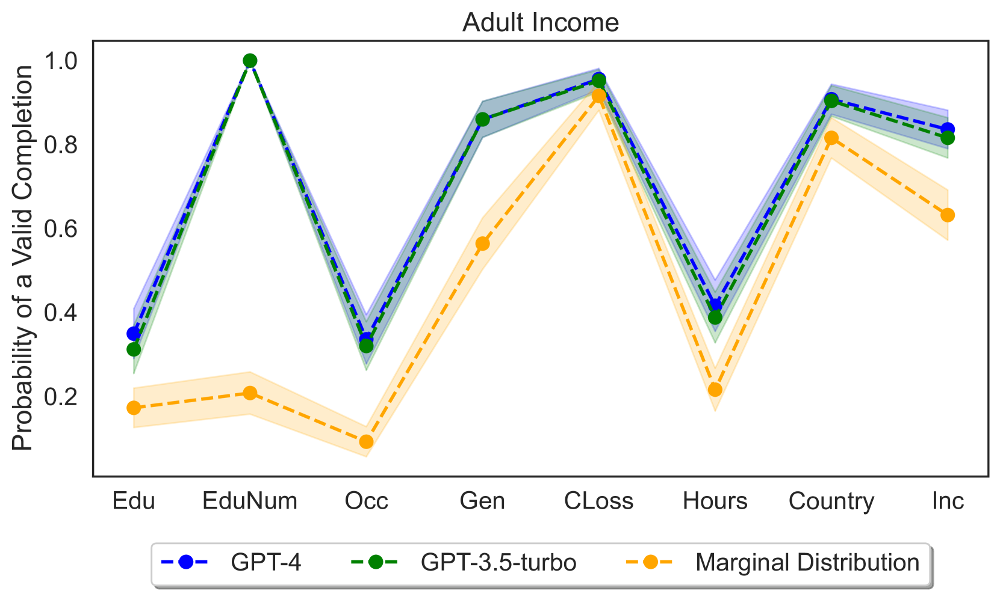

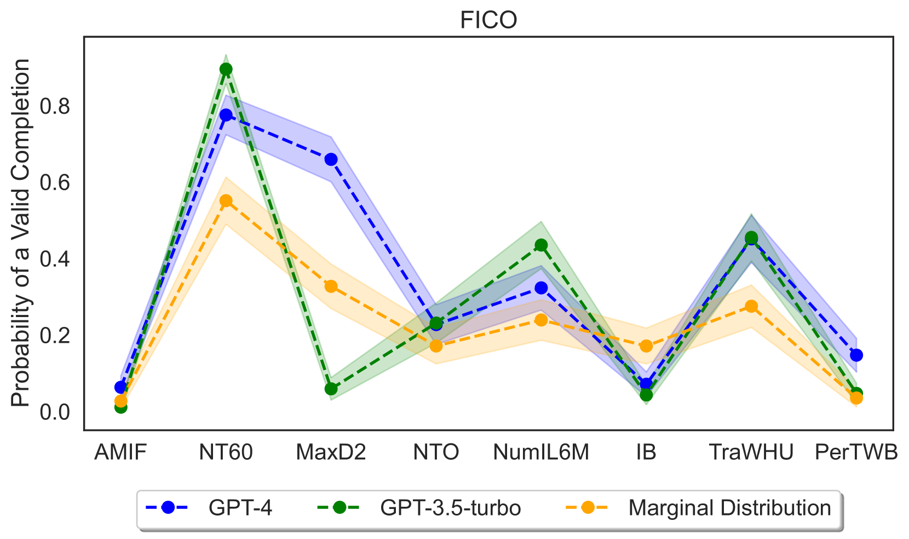

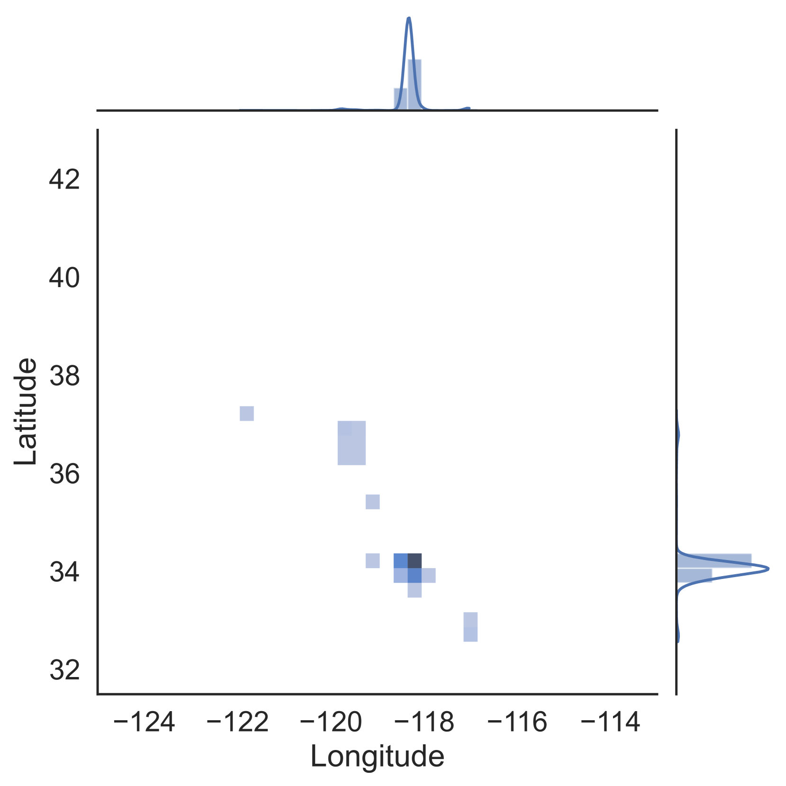

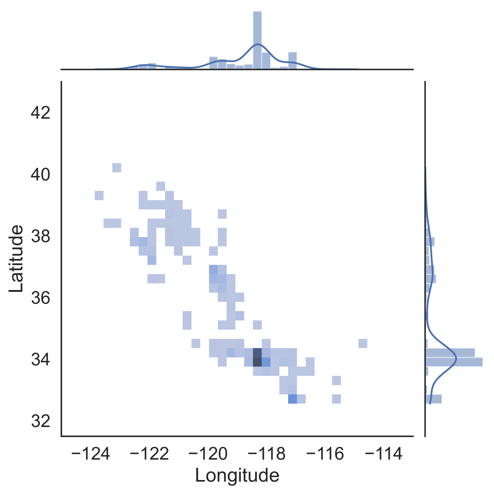

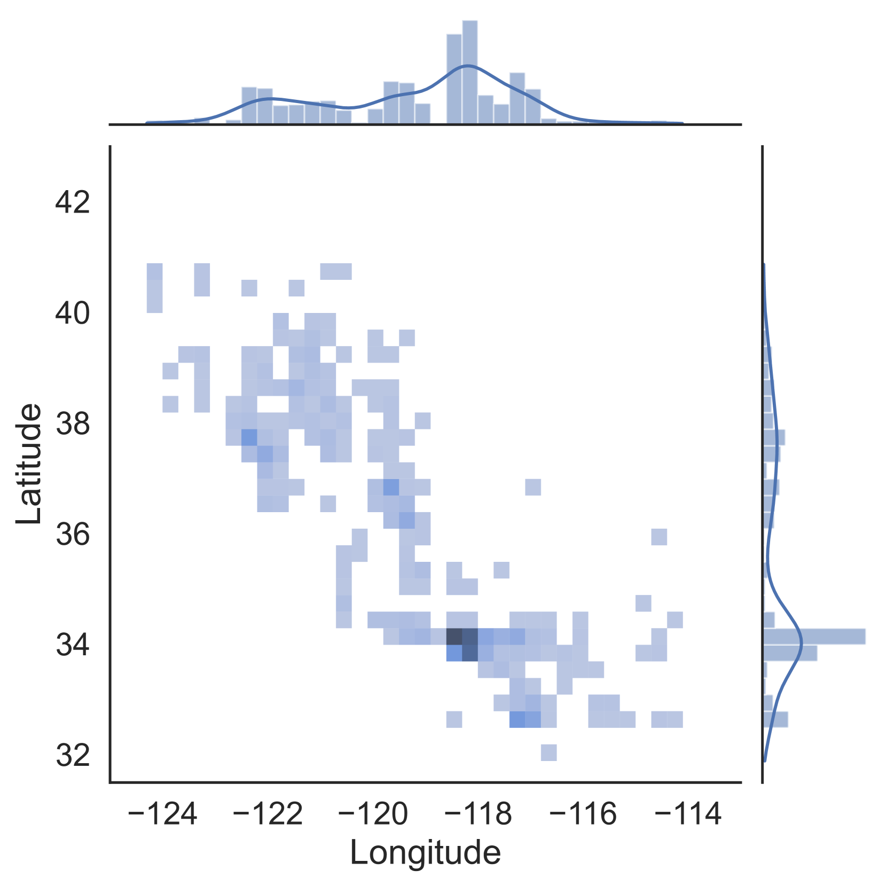

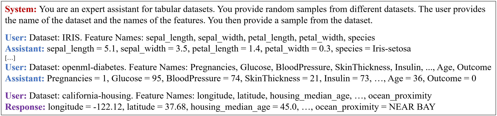

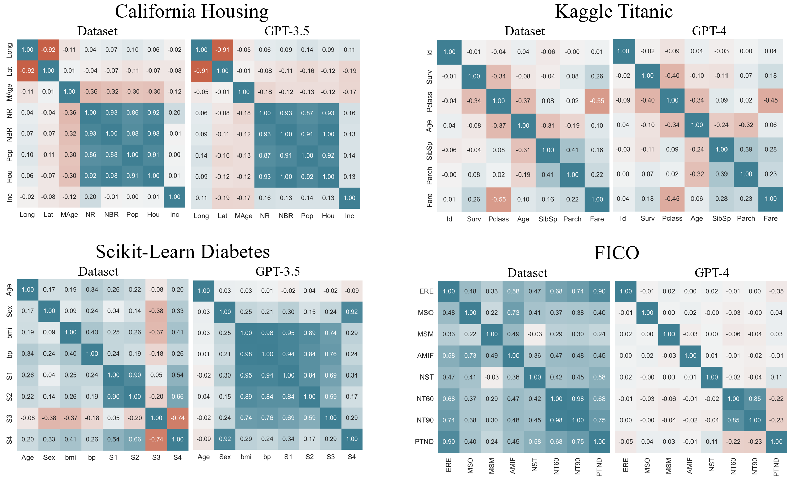

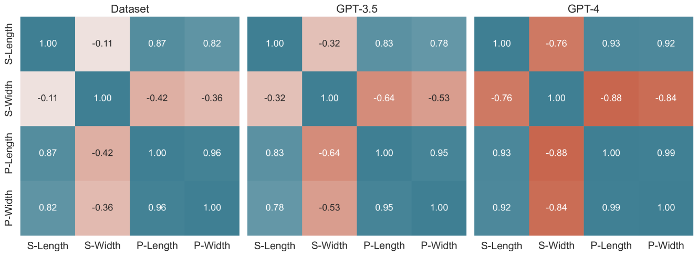

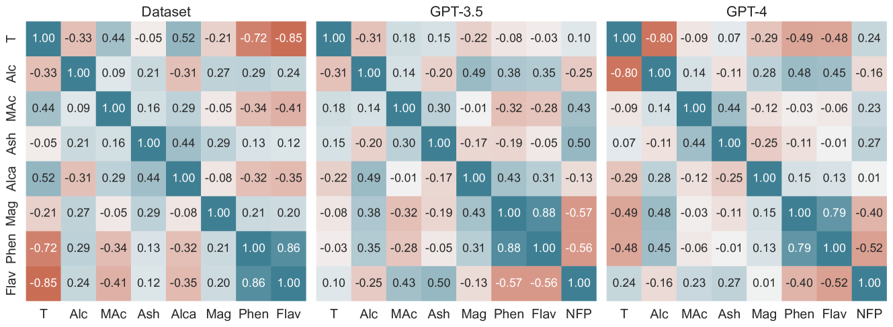

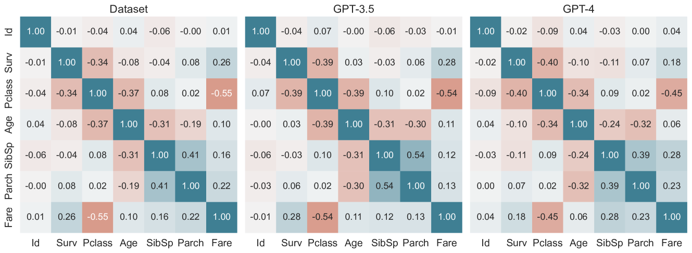

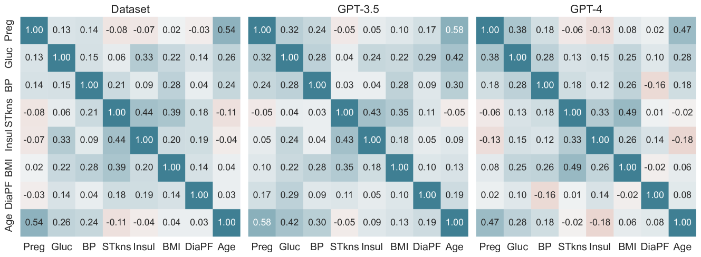

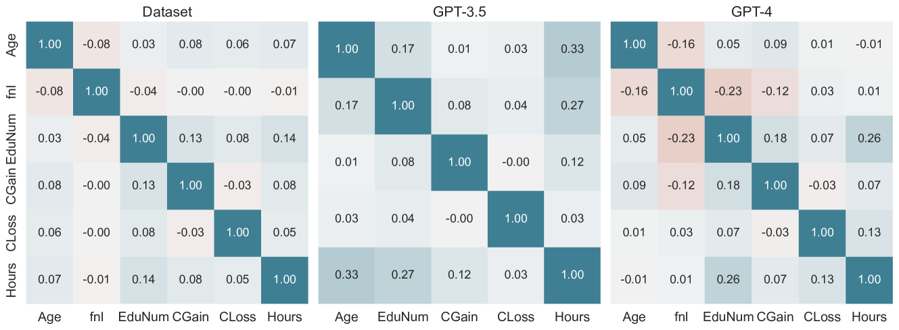

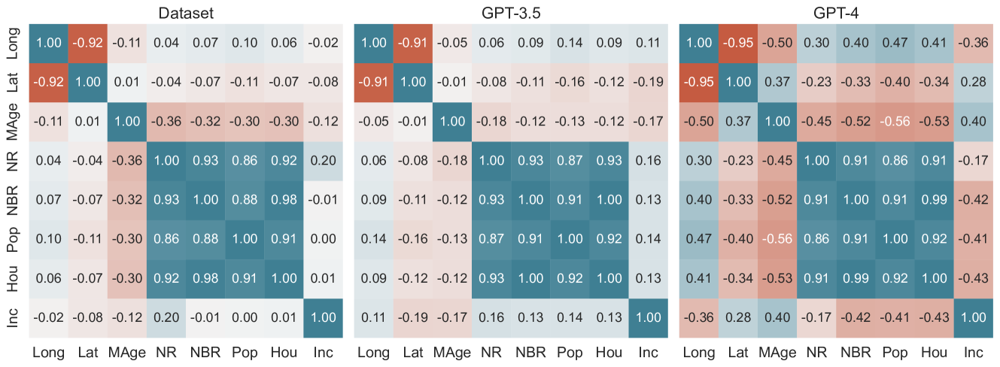

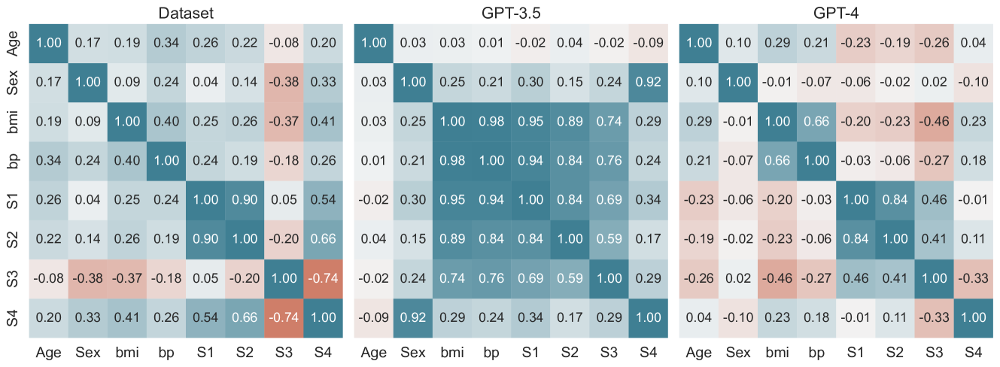

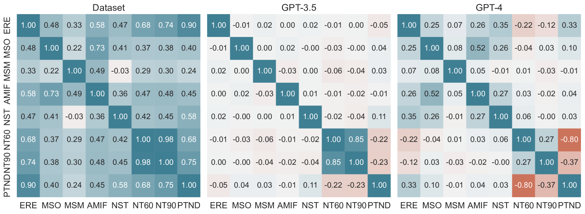

[Arxiv](https://arxiv.org/abs/2403.06644)