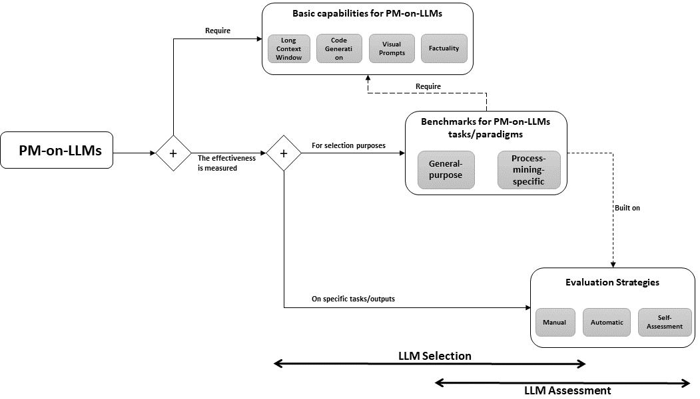

# 本研究探讨了大型语言模型在流程挖掘领域的表现，内容涵盖其功能特性、基准测试、评估策略以及未来所面临的挑战。

发布时间：2024年03月11日

`LLM应用`

> Evaluating Large Language Models in Process Mining: Capabilities, Benchmarks, Evaluation Strategies, and Future Challenges

# 摘要

> 随着LLMs在PM任务中日益凸显其重要性并初见成效，针对如何评价与基准化LLMs在PM中应用价值的策略研究却相对匮乏。本文梳理了LLMs在流程挖掘领域的现有实践，并聚焦三大核心议题：首先，探究LLMs应用于PM所需的最基本能力集合；其次，寻找助力甄选适合PM任务的最佳LLMs的基准策略；最后，探讨如何对LLMs在特定PM任务中的产出进行有效评估。解答这些关键问题，将为构建全面覆盖各类任务及实现模式的LLMs流程挖掘基准提供坚实基础。

> Using Large Language Models (LLMs) for Process Mining (PM) tasks is becoming increasingly essential, and initial approaches yield promising results. However, little attention has been given to developing strategies for evaluating and benchmarking the utility of incorporating LLMs into PM tasks. This paper reviews the current implementations of LLMs in PM and reflects on three different questions. 1) What is the minimal set of capabilities required for PM on LLMs? 2) Which benchmark strategies help choose optimal LLMs for PM? 3) How do we evaluate the output of LLMs on specific PM tasks? The answer to these questions is fundamental to the development of comprehensive process mining benchmarks on LLMs covering different tasks and implementation paradigms.

[Arxiv](https://arxiv.org/abs/2403.06749)