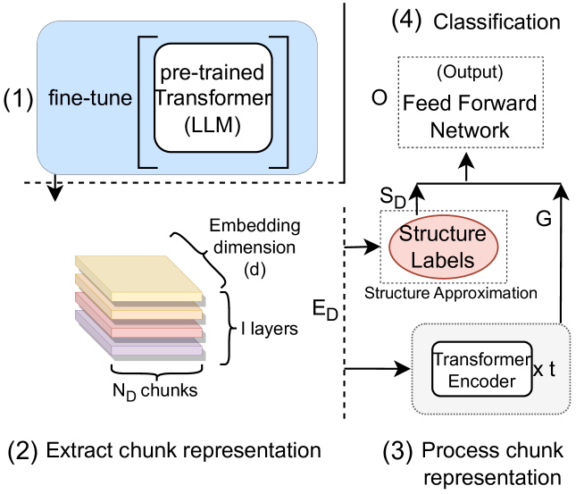
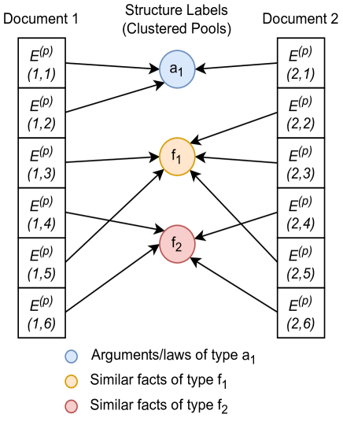
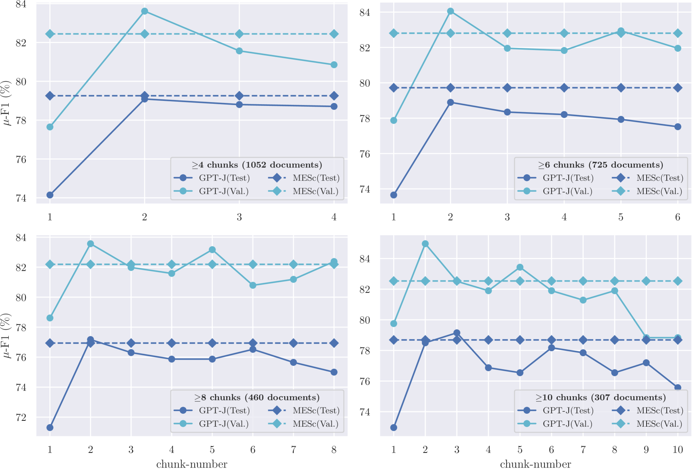

# [本研究致力于探究如何利用大型语言模型与层次化框架携手处理大规模非结构化法律文档的分类问题。](https://arxiv.org/abs/2403.06872)

发布时间：2024年03月11日

`LLM应用`

> Exploring Large Language Models and Hierarchical Frameworks for Classification of Large Unstructured Legal Documents

> 面对动辄数万字且结构不规整的法律判决预测难题，我们提出了一种创新的深度学习分层框架——MESc，它能够有效处理大规模法律文档并克服其结构信息缺失的问题。首先，我们将文档切割为多个部分，并借助定制优化的大规模语言模型（如GPT-Neo和GPT-J）最后四层提取嵌入特征；接着运用无监督聚类技术推测文档的潜在结构。进一步地，在新的Transformer编码器层中，我们整合各部分之间的语义关联，学习跨块的表达。通过在包含印度、欧盟和美国司法案例的ILDC数据集及LexGLUE数据集的部分样本上进行深入实验和消融研究，我们探究了百亿级参数的大型语言模型在MESc框架下与单独使用时的表现差异，以及它们在法律领域的内在迁移学习能力和融合最后一层嵌入的影响。最终，我们的方法成功超越了以往最先进的技术，整体性能提升了至少约2个百分点。

> Legal judgment prediction suffers from the problem of long case documents exceeding tens of thousands of words, in general, and having a non-uniform structure. Predicting judgments from such documents becomes a challenging task, more so on documents with no structural annotation. We explore the classification of these large legal documents and their lack of structural information with a deep-learning-based hierarchical framework which we call MESc; "Multi-stage Encoder-based Supervised with-clustering"; for judgment prediction. Specifically, we divide a document into parts to extract their embeddings from the last four layers of a custom fine-tuned Large Language Model, and try to approximate their structure through unsupervised clustering. Which we use in another set of transformer encoder layers to learn the inter-chunk representations. We analyze the adaptability of Large Language Models (LLMs) with multi-billion parameters (GPT-Neo, and GPT-J) with the hierarchical framework of MESc and compare them with their standalone performance on legal texts. We also study their intra-domain(legal) transfer learning capability and the impact of combining embeddings from their last layers in MESc. We test these methods and their effectiveness with extensive experiments and ablation studies on legal documents from India, the European Union, and the United States with the ILDC dataset and a subset of the LexGLUE dataset. Our approach achieves a minimum total performance gain of approximately 2 points over previous state-of-the-art methods.

