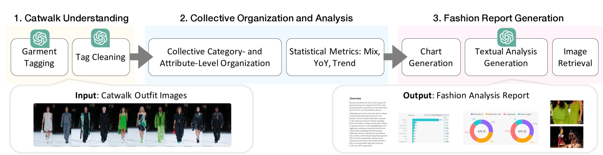
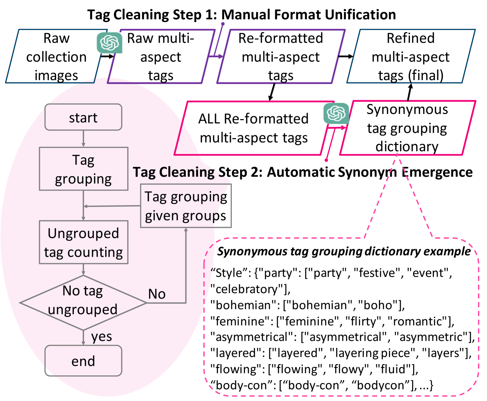
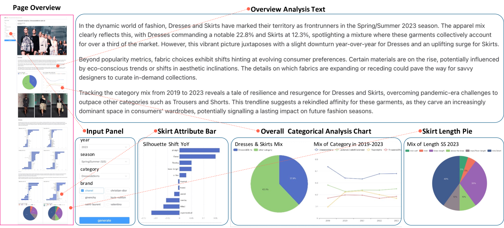

# [FashionReGen：借助LLM力量，革新时尚报告自动生成领域](https://arxiv.org/abs/2403.06660)

发布时间：2024年03月11日

`LLM应用`

> FashionReGen: LLM-Empowered Fashion Report Generation

> 时尚分析是对时尚界的潮流、款式和元素进行深度剖析，以洞悉行业现状并产出时尚报告的过程。以往这项工作主要依靠拥有丰富经验和专业知识的时尚专家完成，但人力成本高企且易受小群体主观判断的影响。为此，我们提出了一个名为GPT-FAR的智能时尚分析与报告系统，它基于先进的大型语言模型(LLMs)，旨在解决FashionReGen任务。该系统特别注重运用高效的走秀分析手段，涵盖了走秀理解、整合组织与深入分析、报告自动生成等关键环节。通过对FashionReGen这类开放式、复杂且专业性强的任务展开探讨，不仅可以验证LLMs在时尚领域的综合应用潜力，还能启迪我们在其他领域发掘更多具有产业价值的高端任务。欲了解更多关于GPT-FAR的视频展示及其他材料，请访问https://github.com/CompFashion/FashionReGen。

> Fashion analysis refers to the process of examining and evaluating trends, styles, and elements within the fashion industry to understand and interpret its current state, generating fashion reports. It is traditionally performed by fashion professionals based on their expertise and experience, which requires high labour cost and may also produce biased results for relying heavily on a small group of people. In this paper, to tackle the Fashion Report Generation (FashionReGen) task, we propose an intelligent Fashion Analyzing and Reporting system based the advanced Large Language Models (LLMs), debbed as GPT-FAR. Specifically, it tries to deliver FashionReGen based on effective catwalk analysis, which is equipped with several key procedures, namely, catwalk understanding, collective organization and analysis, and report generation. By posing and exploring such an open-ended, complex and domain-specific task of FashionReGen, it is able to test the general capability of LLMs in fashion domain. It also inspires the explorations of more high-level tasks with industrial significance in other domains. Video illustration and more materials of GPT-FAR can be found in https://github.com/CompFashion/FashionReGen.

[Arxiv](https://arxiv.org/abs/2403.06660)