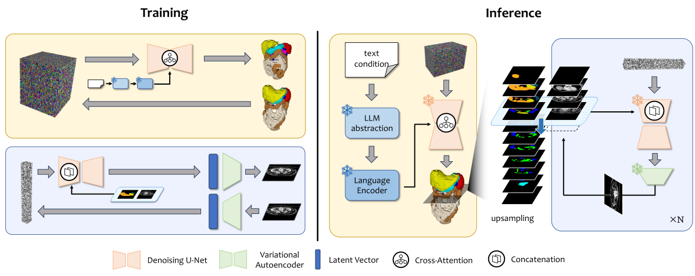
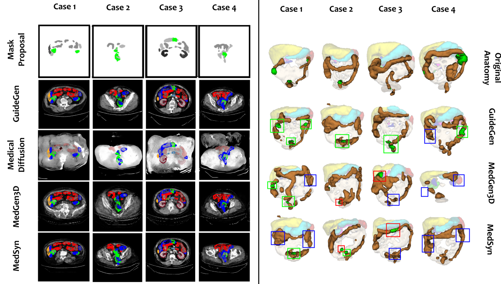

# GuideGen，一款创新的文本导向框架，专为协同生成CT体积数据与解剖结构而设计。

发布时间：2024年03月11日

`Agent` `医学影像`

> GuideGen: A Text-guided Framework for Joint CT Volume and Anatomical structure Generation

# 摘要

> 构建带标签的大规模医学图像数据集不仅耗时费力，而且经济效率低下，令人生畏，这就造成了训练数据不足的问题，严重影响了下游任务，并在某种程度上加大了医疗领域图像分析的挑战。如今，在生成式神经模型技术取得新突破的背景下，我们能够借助外部约束以高保真度合成图像数据集。本文即对此可能性进行了深入探索，并提出了名为\textbf{GuideGen}的创新流程，它可根据文本提示联合生成腹部器官及结直肠癌的CT图像及其对应的组织掩模。首先，我们运用“体积掩模采样器”技术拟合掩模标签的离散分布，并生成低分辨率的三维组织掩模。接下来，通过条件图像生成器自回归地依据相应的掩模切片生成CT切片，确保既融入了风格信息又遵循了解剖结构。这套流程确保了生成的CT体积与组织掩模间具备高保真度、多样性和精确匹配性。无论是定性还是定量的3D腹部CT实验都充分展示了我们提出的这种方法的强大性能，证明其完全可以胜任数据集生成角色，并有望为下游任务带来显著增益。我们期待这项工作能为CT与其解剖学掩模的多模态生成问题提供一个充满希望的解决方案，相关源代码已公开发布在https://github.com/OvO1111/JointImageGeneration。

> The annotation burden and extensive labor for gathering a large medical dataset with images and corresponding labels are rarely cost-effective and highly intimidating. This results in a lack of abundant training data that undermines downstream tasks and partially contributes to the challenge image analysis faces in the medical field. As a workaround, given the recent success of generative neural models, it is now possible to synthesize image datasets at a high fidelity guided by external constraints. This paper explores this possibility and presents \textbf{GuideGen}: a pipeline that jointly generates CT images and tissue masks for abdominal organs and colorectal cancer conditioned on a text prompt. Firstly, we introduce Volumetric Mask Sampler to fit the discrete distribution of mask labels and generate low-resolution 3D tissue masks. Secondly, our Conditional Image Generator autoregressively generates CT slices conditioned on a corresponding mask slice to incorporate both style information and anatomical guidance. This pipeline guarantees high fidelity and variability as well as exact alignment between generated CT volumes and tissue masks. Both qualitative and quantitative experiments on 3D abdominal CTs demonstrate a high performance of our proposed pipeline, thereby proving our method can serve as a dataset generator and provide potential benefits to downstream tasks. It is hoped that our work will offer a promising solution on the multimodality generation of CT and its anatomical mask. Our source code is publicly available at https://github.com/OvO1111/JointImageGeneration.

[Arxiv](https://arxiv.org/abs/2403.07247)