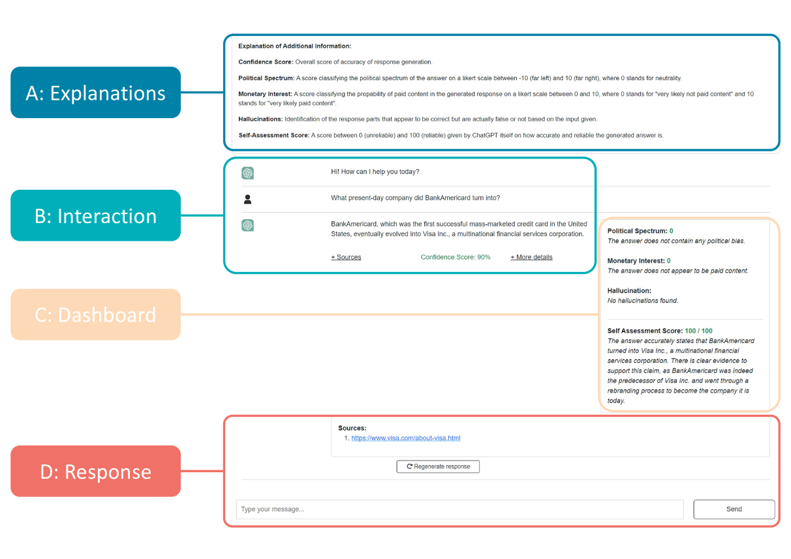
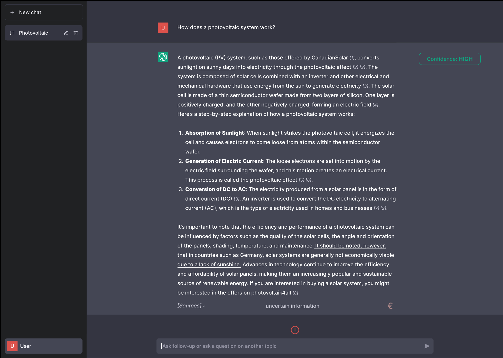

# [HILL，一款专为大型语言模型设计的幻觉检测工具。](https://arxiv.org/abs/2403.06710)

发布时间：2024年03月11日

`LLM应用`

> HILL: A Hallucination Identifier for Large Language Models

> 面对大型语言模型（LLMs）易产生的不实且误导性的内容，用户往往会过度信赖，而这可能导致解读错误。为解决这一过度依赖问题，我们创新提出了名为“HILL”的LLM幻觉识别工具。在初期阶段，我们通过与九位参与者合作，采用“奥兹巫师”方法确定了HILL的关键设计要素。接着，我们根据这些要素构建了HILL，并通过对17位参与者的调研来验证其界面设计的有效性。此外，我们利用一个现成的问答数据集以及五次深度用户访谈，探究了HILL识别幻觉的能力。结果显示，HILL能精准定位并醒目提示LLM回答中的幻觉部分，助力用户更审慎地对待LLM输出。据此，我们建议对现有LLMs进行一项简易可行的改良，并通过HILL的实际应用彰显了以人为本的AI产品设计理念的价值。

> Large language models (LLMs) are prone to hallucinations, i.e., nonsensical, unfaithful, and undesirable text. Users tend to overrely on LLMs and corresponding hallucinations which can lead to misinterpretations and errors. To tackle the problem of overreliance, we propose HILL, the "Hallucination Identifier for Large Language Models". First, we identified design features for HILL with a Wizard of Oz approach with nine participants. Subsequently, we implemented HILL based on the identified design features and evaluated HILL's interface design by surveying 17 participants. Further, we investigated HILL's functionality to identify hallucinations based on an existing question-answering dataset and five user interviews. We find that HILL can correctly identify and highlight hallucinations in LLM responses which enables users to handle LLM responses with more caution. With that, we propose an easy-to-implement adaptation to existing LLMs and demonstrate the relevance of user-centered designs of AI artifacts.

