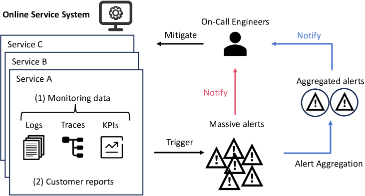
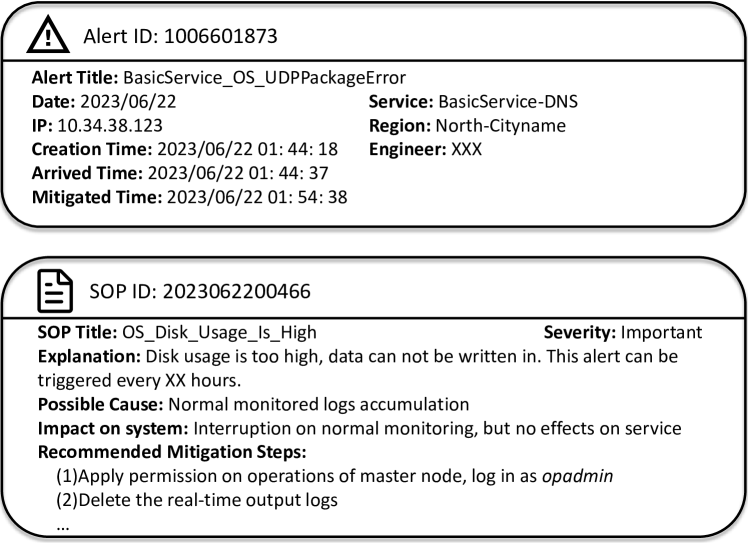
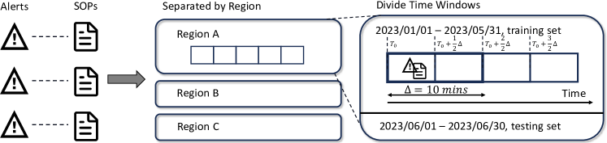
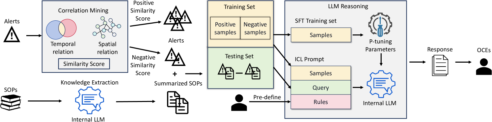
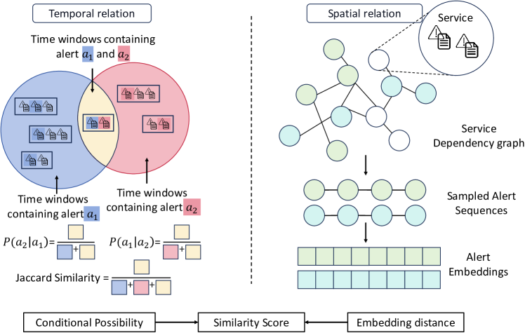
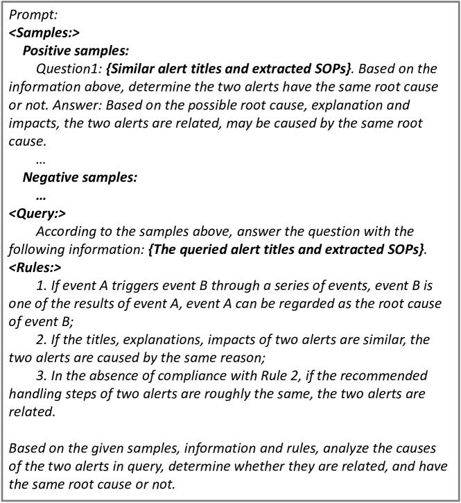
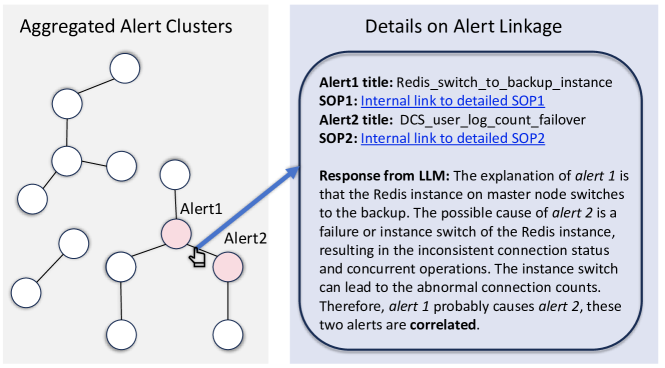

# 针对大规模云系统的警报管理，我们提出了一种融合了知识感知能力的混合警报聚合方法。这一创新方案旨在高效整合各类警报信息，在复杂的云环境中提升问题定位和决策效率。

发布时间：2024年03月11日

`LLM应用`

> Knowledge-aware Alert Aggregation in Large-scale Cloud Systems: a Hybrid Approach

> 鉴于云系统的庞杂与复杂性，一旦发生系统故障，便会触发大规模的相关警报风暴。尽管这些警报大多可归因于少数根本问题，但由于其数量过于庞大，人工排查难以为继。因此，警报聚合技术显得尤为重要，它能帮助工程师集中精力找到根源并加速问题解决。现有的警报聚合技术主要依赖于语义相似性或统计方法，然而前者忽略了警报间的因果联系，后者则在处理稀有警报时力不从心。为突破上述瓶颈，我们引入了一项创新思路——运用外部知识，即警报的标准操作程序（SOP），作为辅助手段。我们提出了 COLA，这是一种新颖的混合方法，结合了关联挖掘和大型语言模型（LLM）推理技术，实现在线警报的有效聚合。其中，关联挖掘模块能够精准捕捉警报间的时间和空间关联，高效衡量其相关性；而后，仅将置信度较低的疑似关联警报对送入LLM推理模块作深入分析。COLA通过融合统计方法处理高频警报的优势以及LLM强大的推理功能，在实际应用中展现出高效处理海量警报的能力。我们在大型云平台生产环境获取的三个数据集上验证了 COLA，实验结果表现出色，F1分数高达0.901至0.930，远超当前最优方法且运行效率可圈可点。同时，我们也分享了在Cloud X云系统中成功部署COLA的真实经验。

> Due to the scale and complexity of cloud systems, a system failure would trigger an "alert storm", i.e., massive correlated alerts. Although these alerts can be traced back to a few root causes, the overwhelming number makes it infeasible for manual handling. Alert aggregation is thus critical to help engineers concentrate on the root cause and facilitate failure resolution. Existing methods typically utilize semantic similarity-based methods or statistical methods to aggregate alerts. However, semantic similarity-based methods overlook the causal rationale of alerts, while statistical methods can hardly handle infrequent alerts.
  To tackle these limitations, we introduce leveraging external knowledge, i.e., Standard Operation Procedure (SOP) of alerts as a supplement. We propose COLA, a novel hybrid approach based on correlation mining and LLM (Large Language Model) reasoning for online alert aggregation. The correlation mining module effectively captures the temporal and spatial relations between alerts, measuring their correlations in an efficient manner. Subsequently, only uncertain pairs with low confidence are forwarded to the LLM reasoning module for detailed analysis. This hybrid design harnesses both statistical evidence for frequent alerts and the reasoning capabilities of computationally intensive LLMs, ensuring the overall efficiency of COLA in handling large volumes of alerts in practical scenarios. We evaluate COLA on three datasets collected from the production environment of a large-scale cloud platform. The experimental results show COLA achieves F1-scores from 0.901 to 0.930, outperforming state-of-the-art methods and achieving comparable efficiency. We also share our experience in deploying COLA in our real-world cloud system, Cloud X.

[Arxiv](https://arxiv.org/abs/2403.06485)