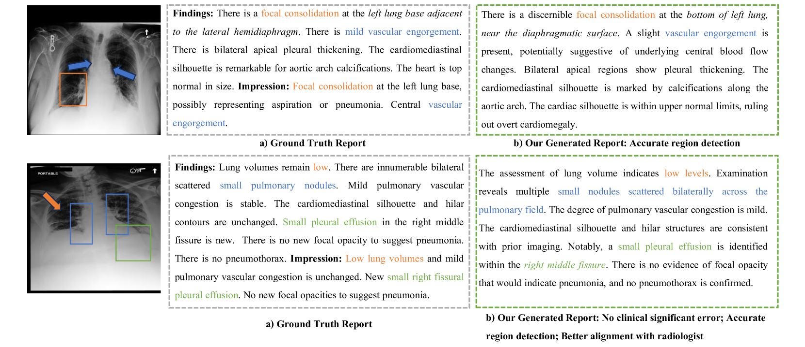

# 通过运用大型模型及临床质量强化学习驱动的策略，我们致力于实现高质量放射学报告自动生成。

发布时间：2024年03月11日

`Agent`

> Large Model driven Radiology Report Generation with Clinical Quality Reinforcement Learning

# 摘要

> 鉴于RRG技术能够有效减轻放射科医师的工作负担，因此备受瞩目。然而，现有的RRG方案在满足临床标准方面尚有欠缺。本文介绍了一项名为\textbf{LM-RRG}的创新放射学报告生成新方法，它巧妙地结合了大型模型（LMs）与临床质量强化学习，旨在生成精准全面的胸部X光放射学报告。首先，我们精心设计了一款依托大型语言模型的动力特征提取器，对胸部X光影像中的不同区域进行深度分析和解读，尤其注重挖掘具有医学价值的关键区域信息。接着，我们基于大型模型的解码器构建了一款多模态报告生成工具，通过融合视觉特征与文本指导的多模态提示，采用自回归的方式生成放射学报告。最后，为更真实反映放射科医师在撰写报告时对临床重要性及非重要性错误的关注程度，我们创新性地提出了一个临床质量强化学习策略，并将其在学习过程中以放射学报告临床质量（RadCliQ）指标作为奖赏函数。广泛的实验证明，在MIMIC-CXR和IU-Xray两大数据集上，本方法相较于现有最优技术展现出了明显优势。

> Radiology report generation (RRG) has attracted significant attention due to its potential to reduce the workload of radiologists. Current RRG approaches are still unsatisfactory against clinical standards. This paper introduces a novel RRG method, \textbf{LM-RRG}, that integrates large models (LMs) with clinical quality reinforcement learning to generate accurate and comprehensive chest X-ray radiology reports. Our method first designs a large language model driven feature extractor to analyze and interpret different regions of the chest X-ray image, emphasizing specific regions with medical significance. Next, based on the large model's decoder, we develop a multimodal report generator that leverages multimodal prompts from visual features and textual instruction to produce the radiology report in an auto-regressive way. Finally, to better reflect the clinical significant and insignificant errors that radiologists would normally assign in the report, we introduce a novel clinical quality reinforcement learning strategy. It utilizes the radiology report clinical quality (RadCliQ) metric as a reward function in the learning process. Extensive experiments on the MIMIC-CXR and IU-Xray datasets demonstrate the superiority of our method over the state of the art.

[Arxiv](https://arxiv.org/abs/2403.06728)