# [MEND 是一种“元演示蒸馏”方法，专注于提升上下文学习的效率和效果。](https://arxiv.org/abs/2403.06914)

发布时间：2024年03月11日

`LLM应用`

> MEND: Meta dEmonstratioN Distillation for Efficient and Effective In-Context Learning

> LLMs展现出了强大的ICL能力，在处理测试输入时，只需结合几个输入输出示例即可生成预测，但这种做法使得自注意力机制的计算成本大幅增加。现有方案力求将长篇示例压缩成简洁的向量表示，但往往需针对新任务重新训练模型，甚至可能影响LLM原有的上下文学习性能。为克服这些问题，我们创新性地提出了一种无需新任务下重新训练的模型——Meta dEmonstration Distillation（MEND）。它能智能地将任意长度的示例提炼成向量，并借助知识蒸馏技术强化与LLM间的协同效应，从而在保证高效的同时保持卓越性能。MEND通过元蒸馏预训练和微调两个阶段的学习过程，获得提炼各种示例的元知识内核。在涵盖七种不同ICL任务领域的广泛评估中，不论是仅解码器结构的GPT-2还是编码器-解码器结构的T5，MEND均展现出超群的实力。不仅在性能上媲美乃至超越原始ICL方法和其他顶级蒸馏模型，同时显著降低了计算资源的需求。这一突破有望推动大型语言模型的实际应用更加规模化、高效化。

> Large Language models (LLMs) have demonstrated impressive in-context learning (ICL) capabilities, where a LLM makes predictions for a given test input together with a few input-output pairs (demonstrations). Nevertheless, the inclusion of demonstrations leads to a quadratic increase in the computational overhead of the self-attention mechanism. Existing solutions attempt to distill lengthy demonstrations into compact vectors. However, they often require task-specific retraining or compromise LLM's in-context learning performance. To mitigate these challenges, we present Meta dEmonstratioN Distillation (MEND), where a language model learns to distill any lengthy demonstrations into vectors without retraining for a new downstream task. We exploit the knowledge distillation to enhance alignment between MEND and LLM, achieving both efficiency and effectiveness simultaneously. MEND is endowed with the meta-knowledge of distilling demonstrations through a two-stage training process, which includes meta-distillation pretraining and fine-tuning. Comprehensive evaluations across seven diverse ICL task partitions using decoder-only (GPT-2) and encoder-decoder (T5) attest to MEND's prowess. It not only matches but often outperforms the Vanilla ICL as well as other state-of-the-art distillation models, while significantly reducing the computational demands. This innovation promises enhanced scalability and efficiency for the practical deployment of large language models

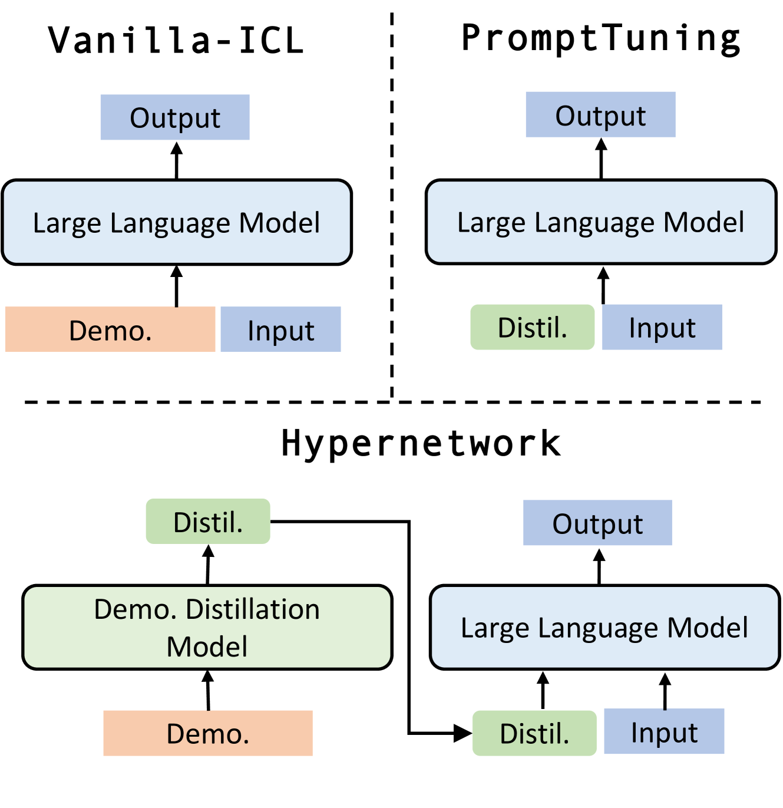

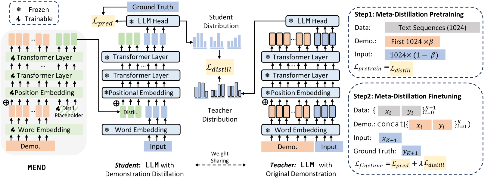

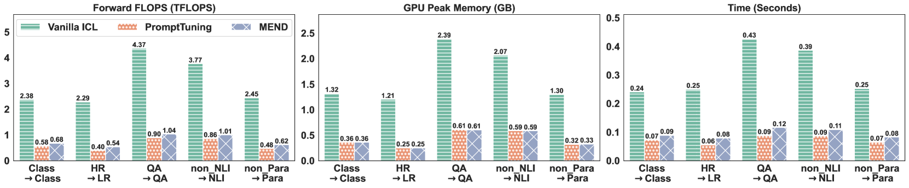

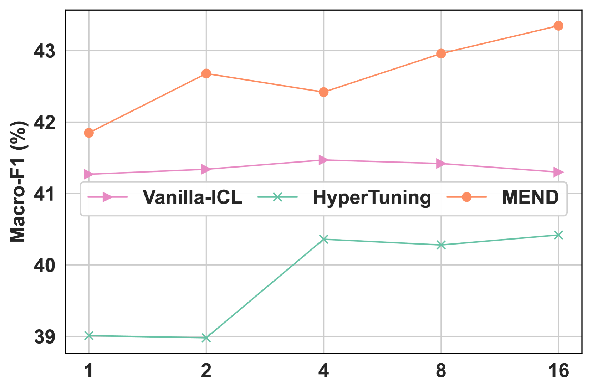

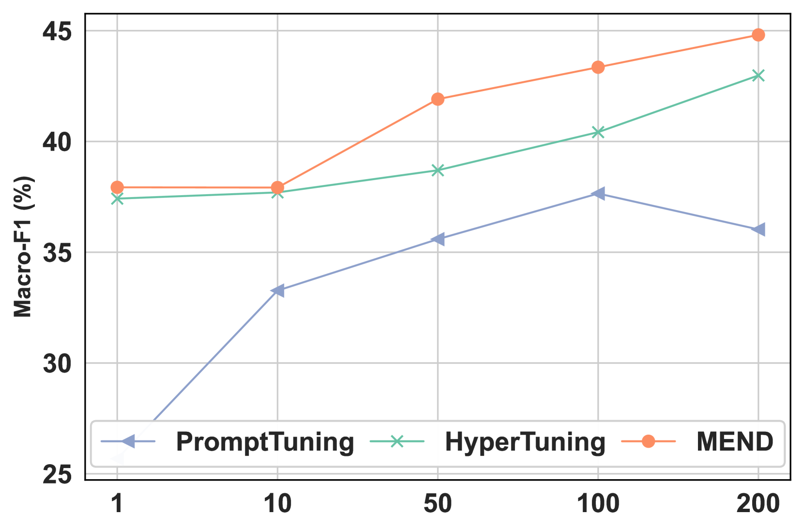

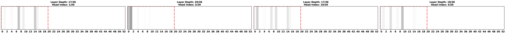

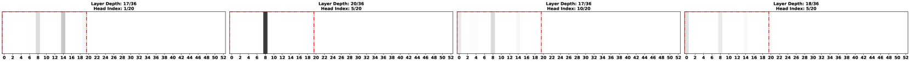

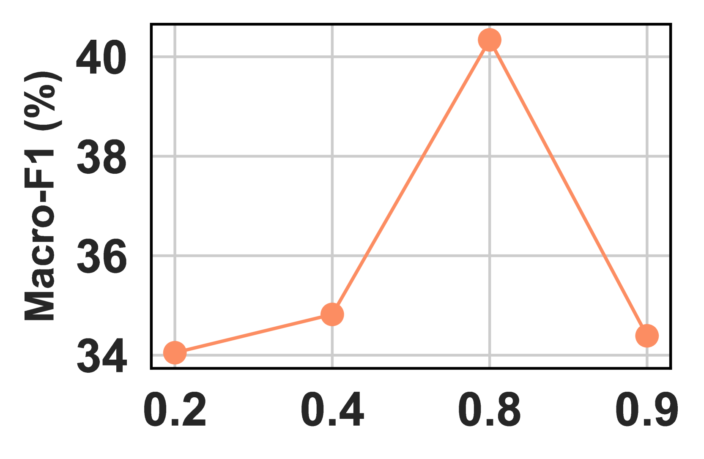

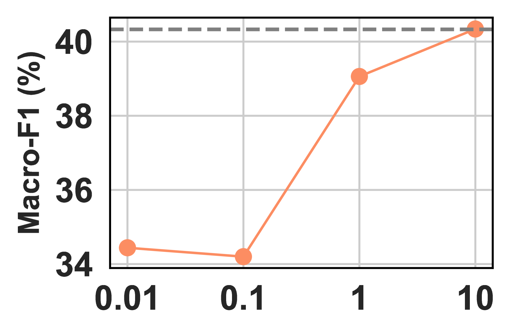

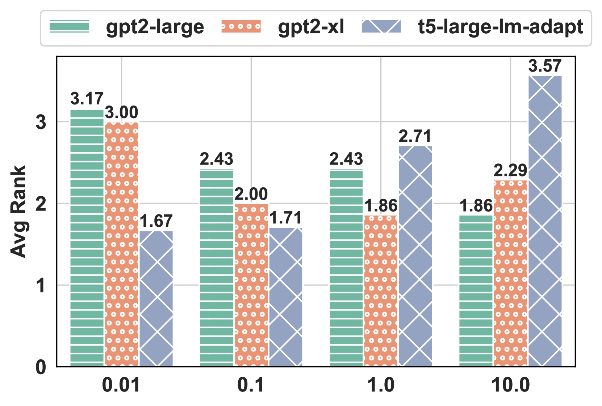

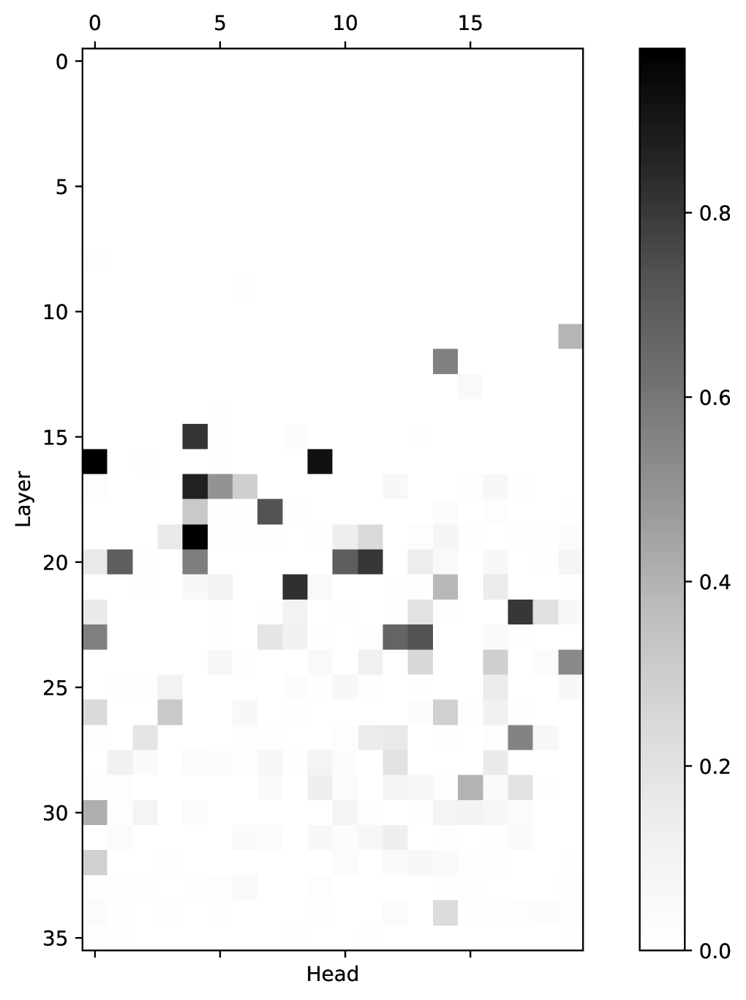

[Arxiv](https://arxiv.org/abs/2403.06914)