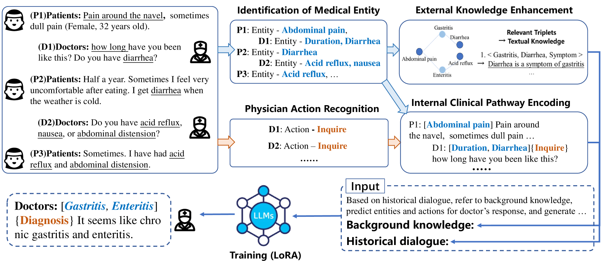
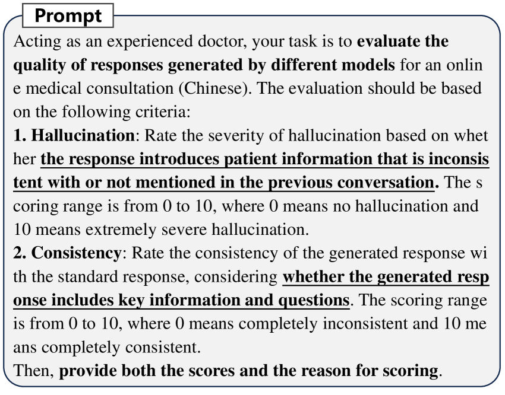

# [MedKP 是一个通过知识增强和临床路径编码提升性能的医疗对话系统，它旨在借助这些技术改进医疗服务中的对话质量和决策支持。](https://arxiv.org/abs/2403.06611)

发布时间：2024年03月11日

`LLM应用`

> MedKP: Medical Dialogue with Knowledge Enhancement and Clinical Pathway Encoding

> 当采用恰当的数据筛选和训练策略时，LLMs 在各类医学考试和选择题领域取得了非凡成就。不过，在更为贴近现实医疗场景的医疗对话生成任务上，LLMs 的应用还相对较少。这主要是由于LLMs的医学知识储备有限，往往导致生成的医疗回复存在错误或臆想信息。为此，我们创新推出了MedKP框架，它结合了医学知识图谱提供的外部知识增强模块以及通过医学实体和医生操作实现的内部临床路径编码机制。在对两个大规模线上真实医疗咨询数据集MedDG和KaMed进行综合测评后，实验结果显示MedKP不仅超越了多款基准模型，而且显著减少了臆想信息的发生，树立了新的行业标杆。深入的消融实验进一步验证了MedKP各组成部分的有效性。这一改进有力推动了基于LLMs的可靠自动化医疗咨询服务的发展，有望让更多人享受到及时、精确的医疗帮助。

> With appropriate data selection and training techniques, Large Language Models (LLMs) have demonstrated exceptional success in various medical examinations and multiple-choice questions. However, the application of LLMs in medical dialogue generation-a task more closely aligned with actual medical practice-has been less explored. This gap is attributed to the insufficient medical knowledge of LLMs, which leads to inaccuracies and hallucinated information in the generated medical responses. In this work, we introduce the Medical dialogue with Knowledge enhancement and clinical Pathway encoding (MedKP) framework, which integrates an external knowledge enhancement module through a medical knowledge graph and an internal clinical pathway encoding via medical entities and physician actions. Evaluated with comprehensive metrics, our experiments on two large-scale, real-world online medical consultation datasets (MedDG and KaMed) demonstrate that MedKP surpasses multiple baselines and mitigates the incidence of hallucinations, achieving a new state-of-the-art. Extensive ablation studies further reveal the effectiveness of each component of MedKP. This enhancement advances the development of reliable, automated medical consultation responses using LLMs, thereby broadening the potential accessibility of precise and real-time medical assistance.

