# 在大规模层面上探究 AI 内容修改，以ChatGPT对AI学术会议同行评审影响为切入点进行深入案例分析。

发布时间：2024年03月11日

`LLM应用`

> Monitoring AI-Modified Content at Scale: A Case Study on the Impact of ChatGPT on AI Conference Peer Reviews

# 摘要

> 我们提出了一项技术，能够估算大型语料库中受LLM显著影响或生成的文本部分占比。通过结合专家编写的和AI产生的参照文本，我们的最大似然模型能精准高效地分析LLM在真实世界大规模语料中的运用情况。这项技术在一项针对ChatGPT发布后各大AI会议（如ICLR 2024、NeurIPS 2023、CoRL 2023与EMNLP 2023）同行评审的研究案例中得到应用。研究表明，提交至这些会议的同行评审文本中，有6.5%至16.9%的内容可能经过LLM深度加工，远超简单的拼写纠错和微小的文字修订。生成文本的发生场景揭示了用户的使用习惯：在审稿人自信度较低、临近截止时间提交以及较少回应作者辩驳意见的情况下，其评审文本中LLM生成内容的比例相对较高。此外，我们还发现了在生成文本中存在的、不易从单个文档层面察觉的语料库整体趋势，并就这些趋势对同行评审的意义展开了讨论。我们倡议未来开展跨学科合作，深入研究LLM的使用如何悄然重塑我们的信息获取和知识建构方式。

> We present an approach for estimating the fraction of text in a large corpus which is likely to be substantially modified or produced by a large language model (LLM). Our maximum likelihood model leverages expert-written and AI-generated reference texts to accurately and efficiently examine real-world LLM-use at the corpus level. We apply this approach to a case study of scientific peer review in AI conferences that took place after the release of ChatGPT: ICLR 2024, NeurIPS 2023, CoRL 2023 and EMNLP 2023. Our results suggest that between 6.5% and 16.9% of text submitted as peer reviews to these conferences could have been substantially modified by LLMs, i.e. beyond spell-checking or minor writing updates. The circumstances in which generated text occurs offer insight into user behavior: the estimated fraction of LLM-generated text is higher in reviews which report lower confidence, were submitted close to the deadline, and from reviewers who are less likely to respond to author rebuttals. We also observe corpus-level trends in generated text which may be too subtle to detect at the individual level, and discuss the implications of such trends on peer review. We call for future interdisciplinary work to examine how LLM use is changing our information and knowledge practices.

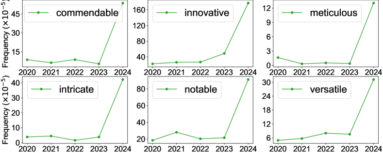

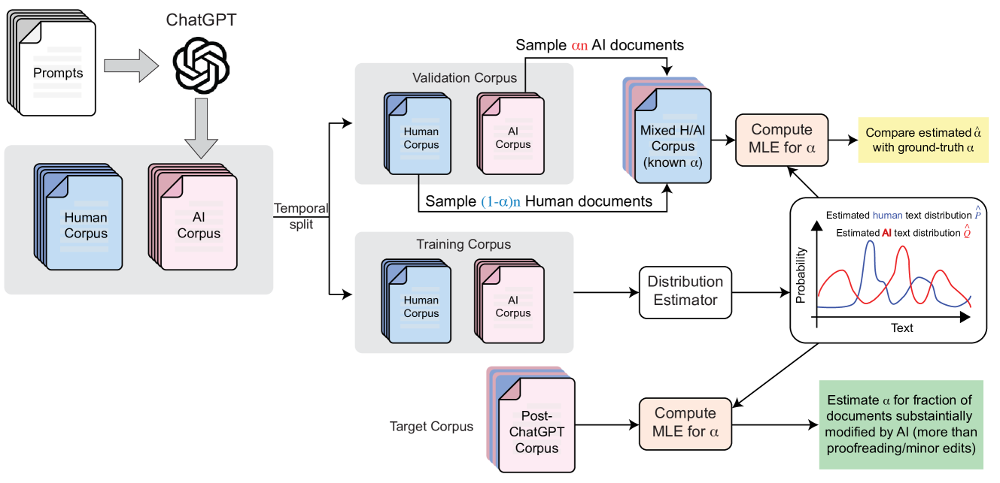

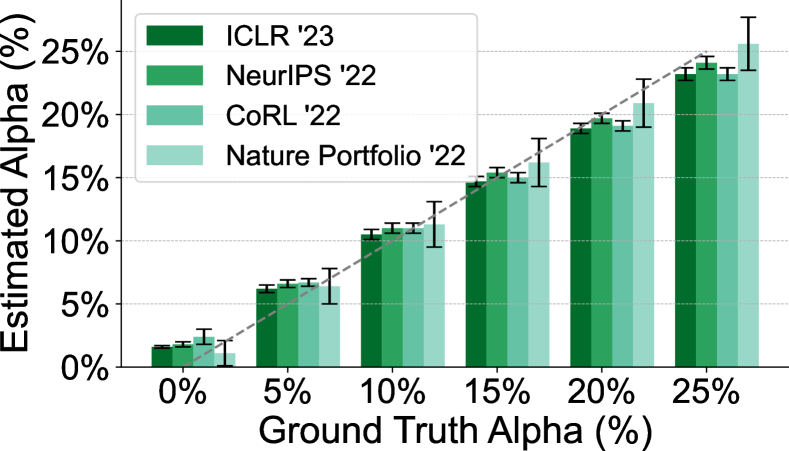

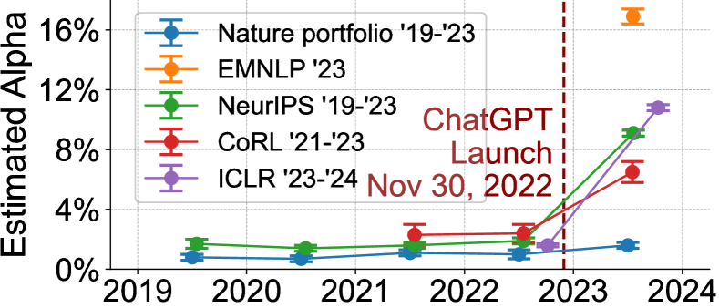

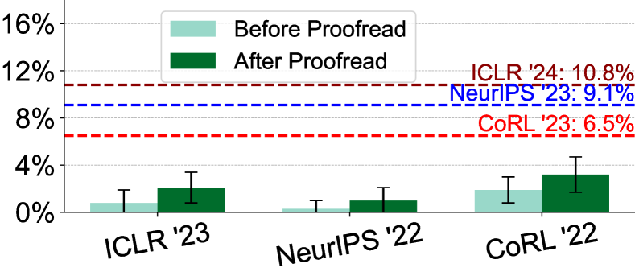

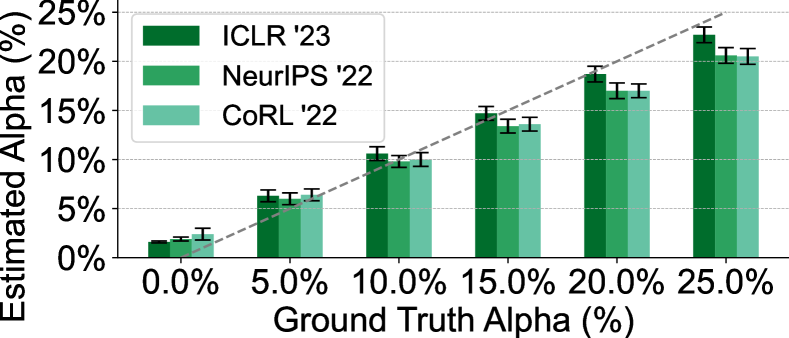

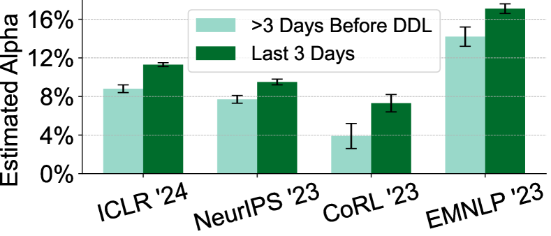

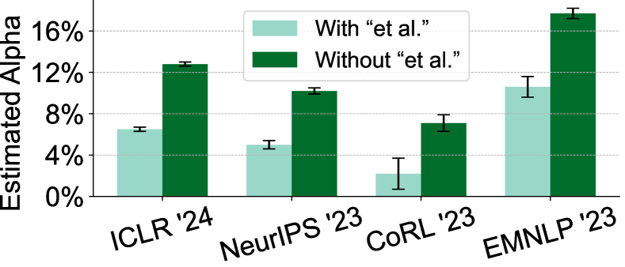

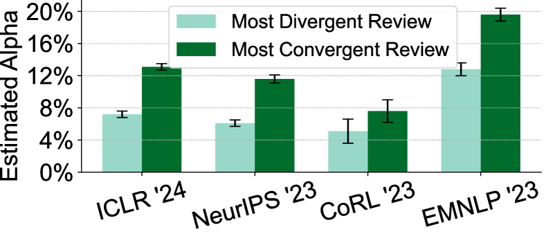

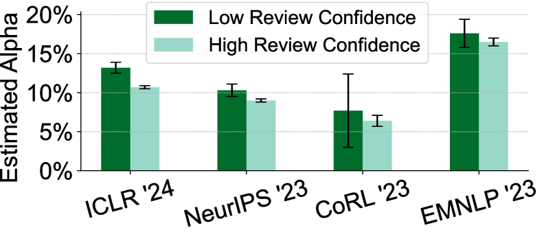

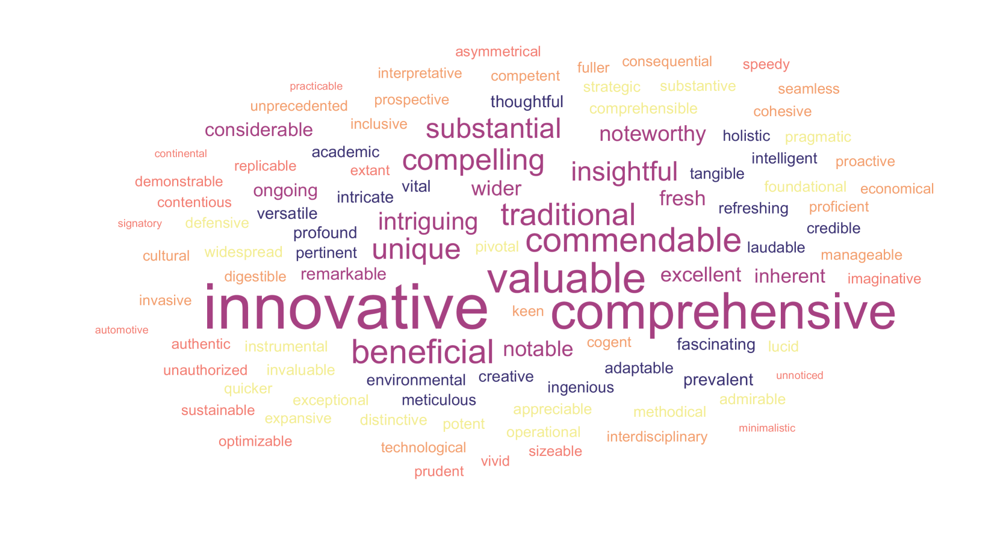

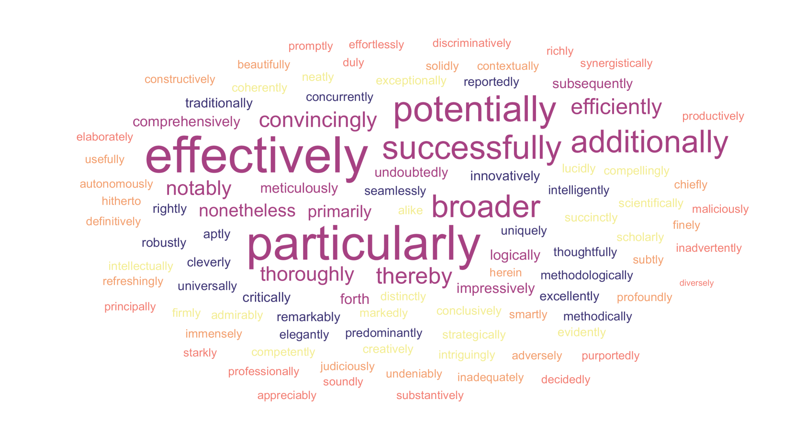

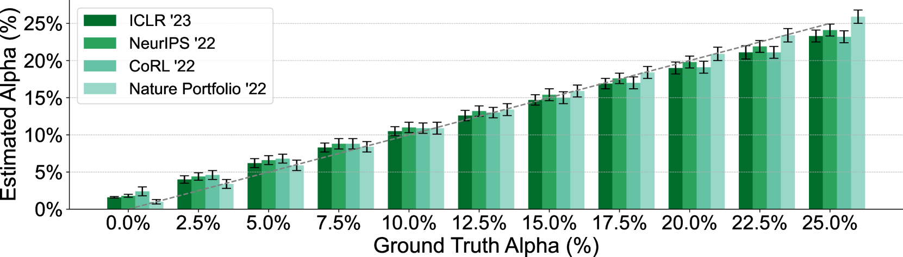

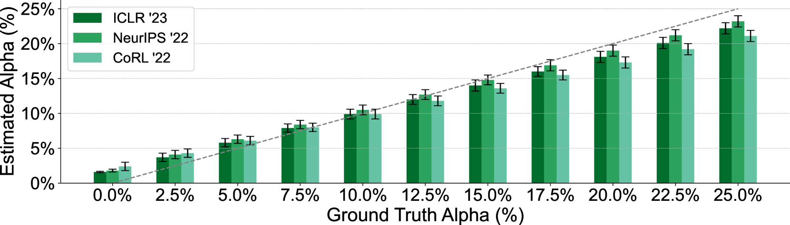

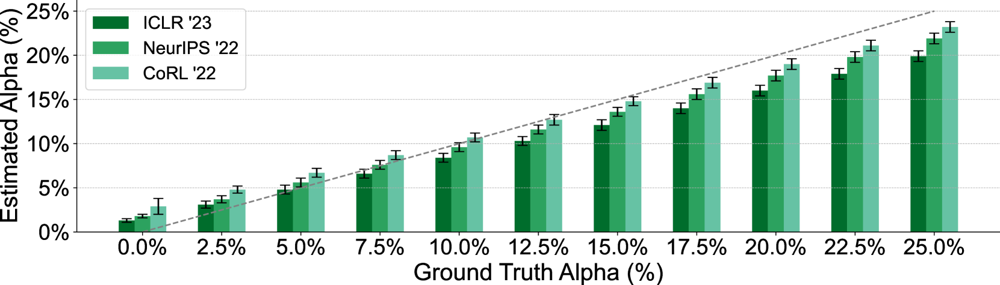

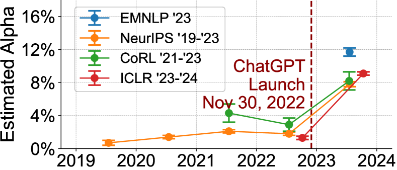

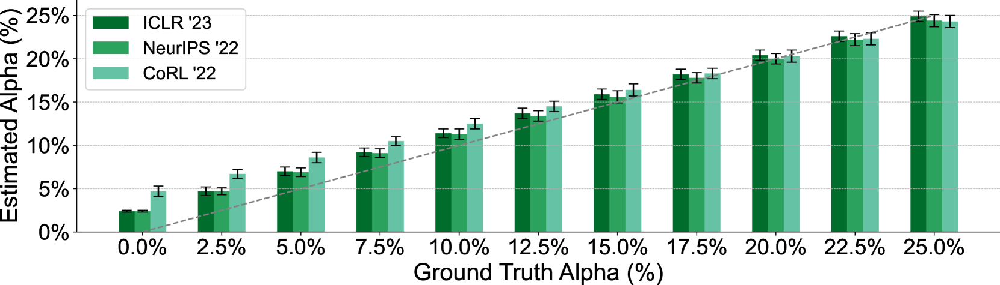

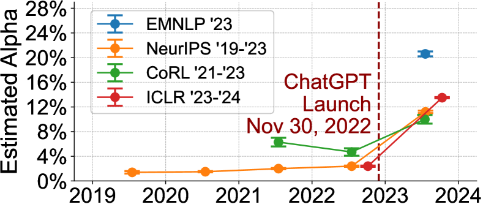

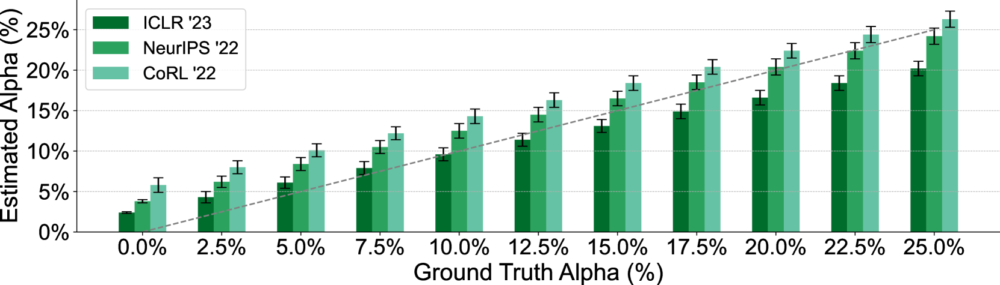

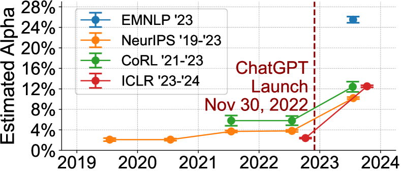

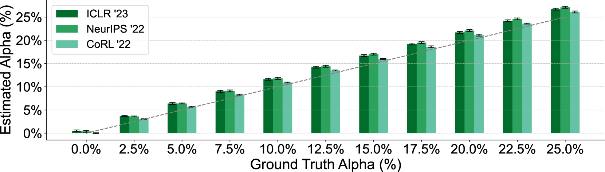

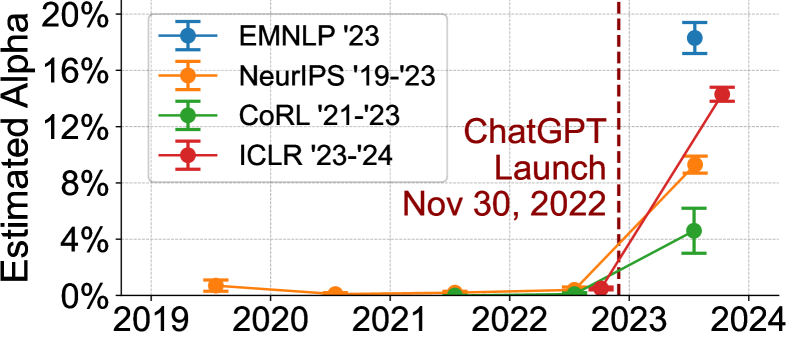

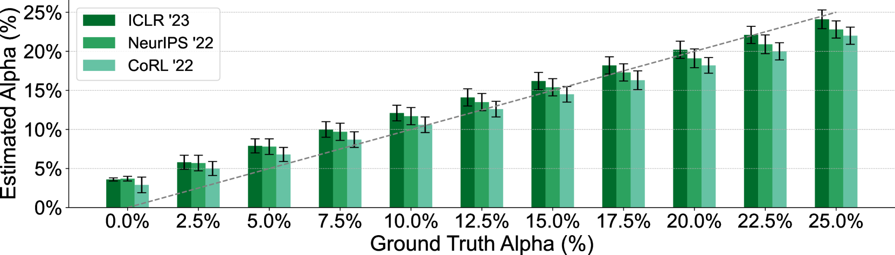

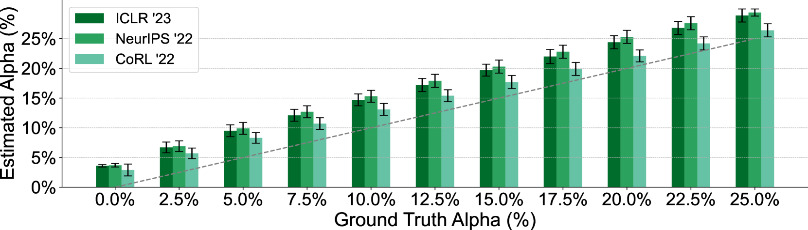

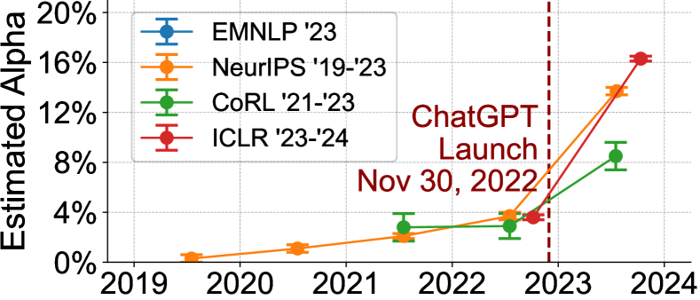

[Arxiv](https://arxiv.org/abs/2403.07183)