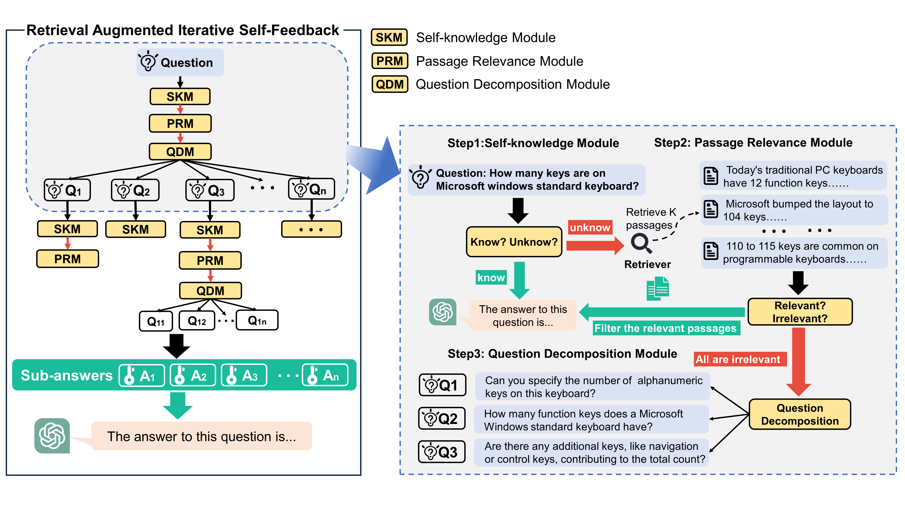
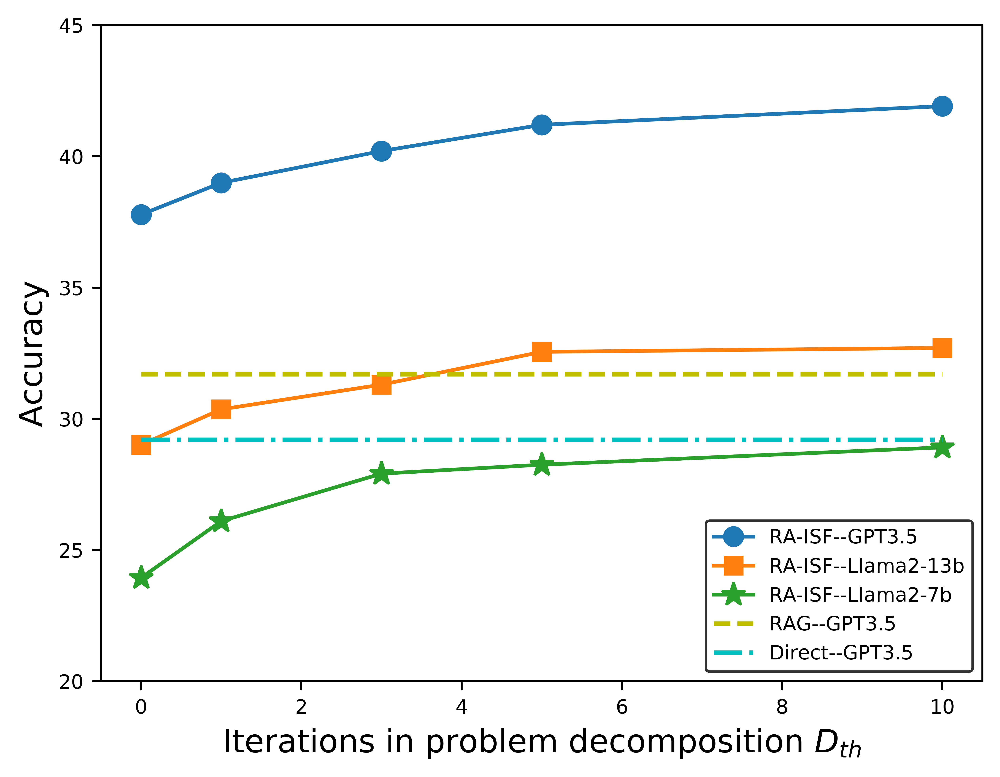
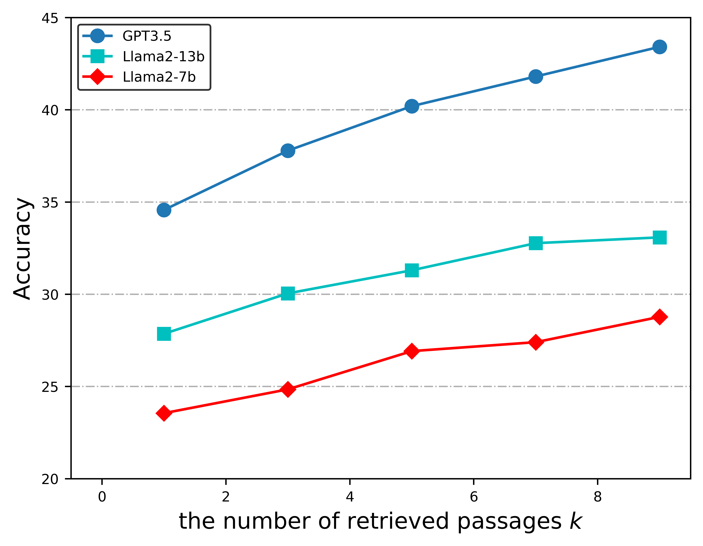
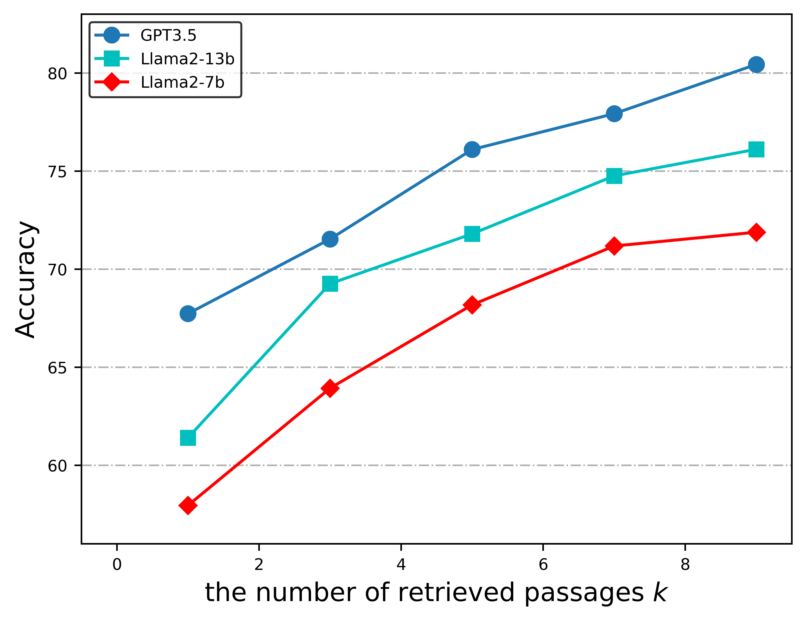

# [RA-ISF 模型致力于借助迭代自反馈机制，从检索增强中学习并掌握回答与理解的能力。](https://arxiv.org/abs/2403.06840)

发布时间：2024年03月11日

`RAG`

> RA-ISF: Learning to Answer and Understand from Retrieval Augmentation via Iterative Self-Feedback

> 尽管LLMs在多种任务上表现出众，但其解决问题的基础仍是内部储存的知识，并且知识更新的成本较高。为了解决这一难题，RAG技术通过融入外部知识资源得以应用。借助RAG，模型可在检索到与查询相关的知识后解答先前无法作答的问题，这在特定任务的某些场合有效提升了表现，但如果检索内容不相关，也可能导致模型性能下滑。本文创新性地提出了“检索增强迭代自反馈”(RA-ISF)框架，它通过循环拆解任务并在三个子模块中逐步处理，有力地提升了模型对各类问题的解决能力。实验证明，相比已有基准，此方法在GPT3.5、Llama2等模型上表现更优，显著提高了事实推理准确度，并有效地减少了模型产生的臆想错误。

> Large language models (LLMs) demonstrate exceptional performance in numerous tasks but still heavily rely on knowledge stored in their parameters. Moreover, updating this knowledge incurs high training costs. Retrieval-augmented generation (RAG) methods address this issue by integrating external knowledge. The model can answer questions it couldn't previously by retrieving knowledge relevant to the query. This approach improves performance in certain scenarios for specific tasks. However, if irrelevant texts are retrieved, it may impair model performance. In this paper, we propose Retrieval Augmented Iterative Self-Feedback (RA-ISF), a framework that iteratively decomposes tasks and processes them in three submodules to enhance the model's problem-solving capabilities. Experiments show that our method outperforms existing benchmarks, performing well on models like GPT3.5, Llama2, significantly enhancing factual reasoning capabilities and reducing hallucinations.

