# [本研究致力于“重建 ROME”，旨在解决在对模型进行连续编辑时出现的模型坍塌问题。](https://arxiv.org/abs/2403.07175)

发布时间：2024年03月11日

`Agent`

> Rebuilding ROME : Resolving Model Collapse during Sequential Model Editing

> 近期对运用热门模型编辑技术Rank-One Model Editing (ROME) 的研究揭示，对于某些特定事实，若要修正而不破坏模型，则算法显得无能为力，这类修正被称为“禁用编辑”。这些禁用编辑会引发模型立刻失效，从而限制了ROME在连续编辑任务上的应用。本文主要有两大发现：首先，我们指出只有在使用CounterFact数据集进行编辑时，ROME才会导致模型坍塌，而采用zsRE数据集则不会遇到此问题；其次，我们发现在ROME的原始实现中，禁用编辑现象其实是一个内在局限性。因此，本文提出了一种更稳定的ROME改进版——r-ROME，并展示了在进行大规模连续编辑时，利用改进后的r-ROME已不再出现模型坍塌的问题。

> Recent work on model editing using Rank-One Model Editing (ROME), a popular model editing method, has shown that there are certain facts that the algorithm is unable to edit without breaking the model. Such edits have previously been called disabling edits. These disabling edits cause immediate model collapse and limits the use of ROME for sequential editing. In this paper, we make two main contributions. Firstly, we show that model collapse with ROME only happens when making edits using the CounterFact dataset and does not happen when using the zsRE dataset. Secondly, we find that disabling edits are an artifact of the original implementation of ROME. With this paper, we provide a more stable implementation ROME, which we call r-ROME and show that we no longer observe model collapse when making large scale sequential edits with ROME.

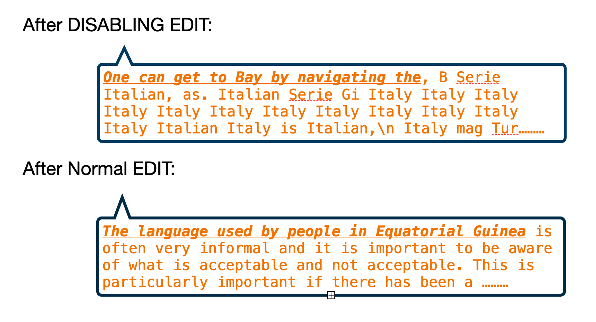

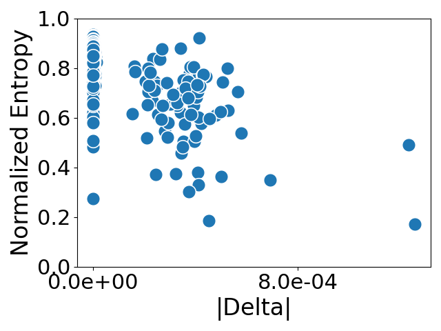

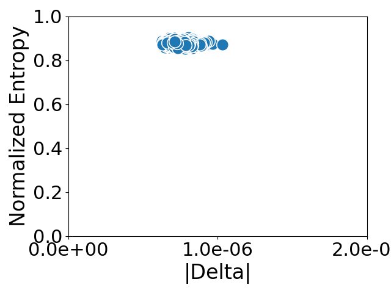

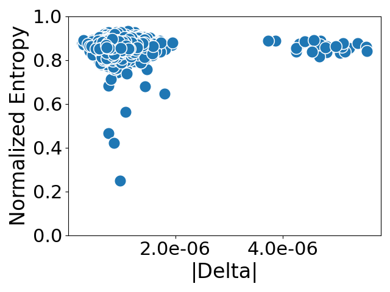

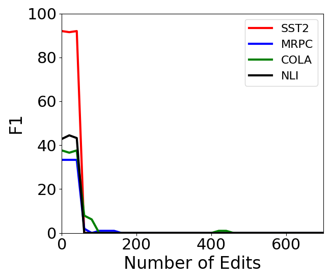

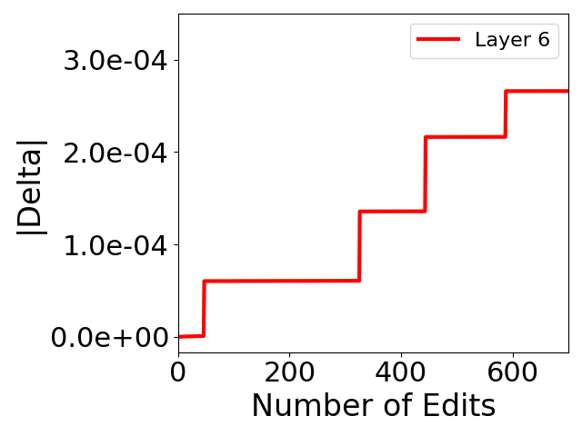

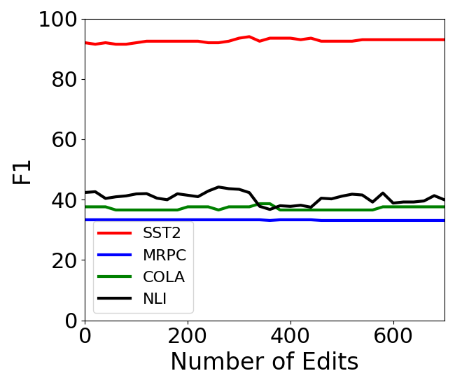

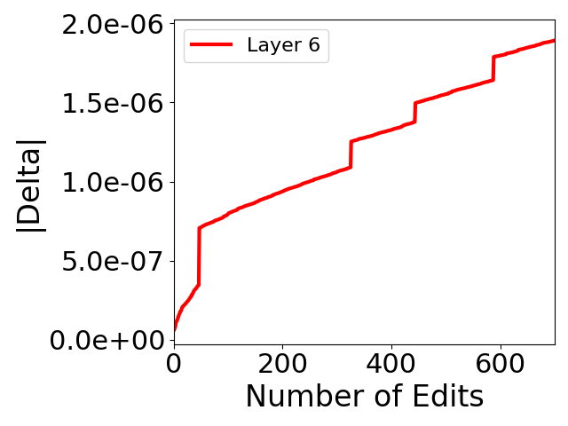

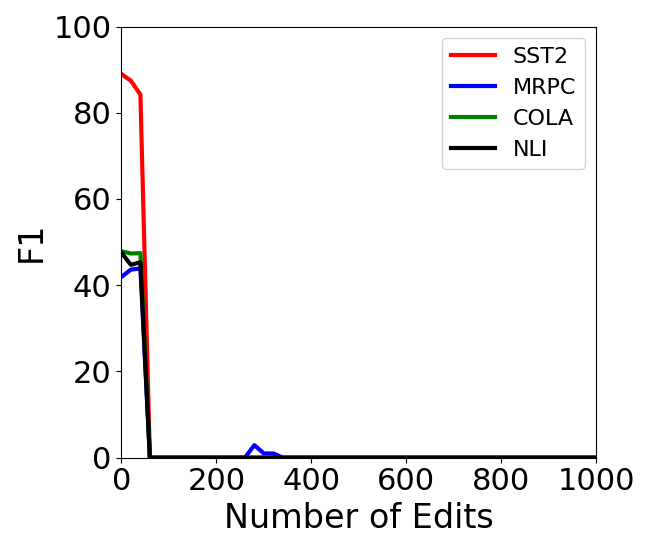

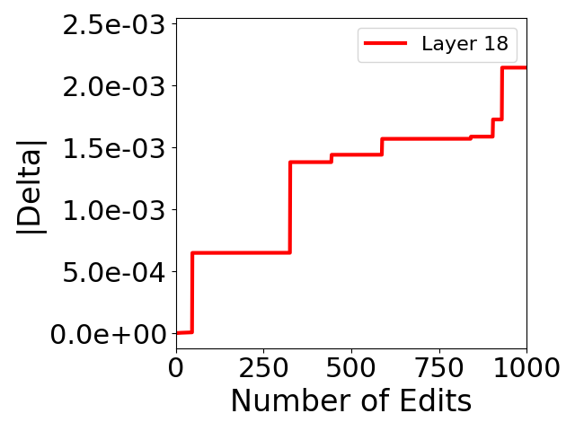

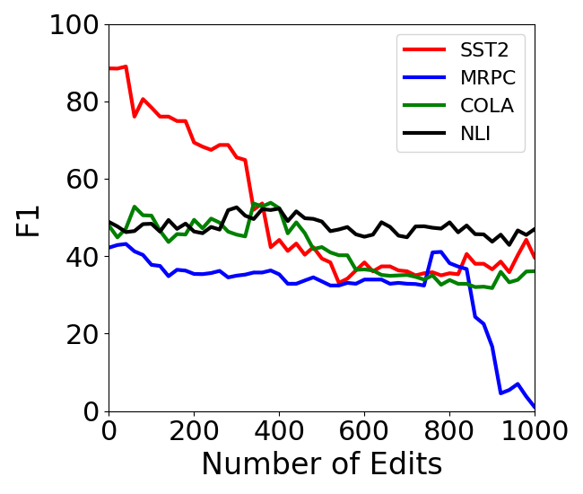

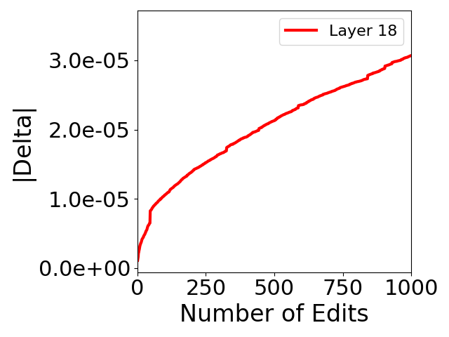