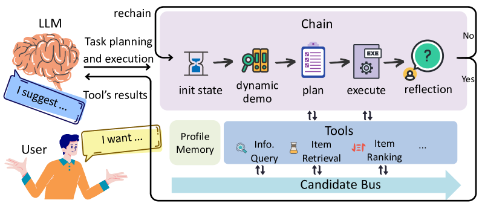
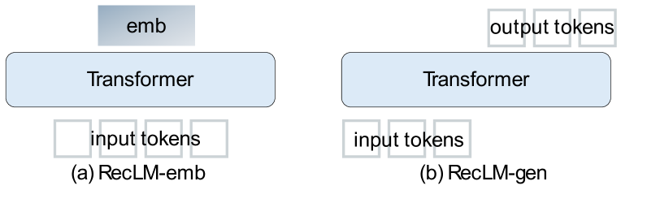

# RecAI项目通过巧妙运用大型语言模型，为下一代推荐系统的开发注入活力。

发布时间：2024年03月11日

`LLM应用`

> RecAI: Leveraging Large Language Models for Next-Generation Recommender Systems

> 本文推出RecAI这一强大工具包，它借助LLMs的力量革新并强化推荐系统。这套工具集包含了推荐AI代理、定向推荐语言模型、知识组件、RecExplainer解释模块以及评估器，全方位协助LLMs与推荐系统的深度融合。在LLMs赋能的新一代推荐系统中，我们将看到更为全能、易理解、交互友好且可控的特性，从而引领推荐体验迈入更加智能化和以人为本的新阶段。我们期待RecAI的开源版本能够助力推动新型高端推荐系统的发展进步，其源代码现可在GitHub（\url{https://github.com/microsoft/RecAI}）上获取。

> This paper introduces RecAI, a practical toolkit designed to augment or even revolutionize recommender systems with the advanced capabilities of Large Language Models (LLMs). RecAI provides a suite of tools, including Recommender AI Agent, Recommendation-oriented Language Models, Knowledge Plugin, RecExplainer, and Evaluator, to facilitate the integration of LLMs into recommender systems from multifaceted perspectives. The new generation of recommender systems, empowered by LLMs, are expected to be more versatile, explainable, conversational, and controllable, paving the way for more intelligent and user-centric recommendation experiences. We hope the open-source of RecAI can help accelerate evolution of new advanced recommender systems. The source code of RecAI is available at \url{https://github.com/microsoft/RecAI}.

[Arxiv](https://arxiv.org/abs/2403.06465)