# [Smart-Infinity：通过在真实系统中应用近存储处理技术，实现大型语言模型的高效快速训练](https://arxiv.org/abs/2403.06664)

发布时间：2024年03月11日

`Agent`

> Smart-Infinity: Fast Large Language Model Training using Near-Storage Processing on a Real System

> 随着LLMs规模的增长，参数数量剧增，推动了技术的巨大飞跃，但也带来了庞大的内存需求，以致需要动辄数十块GPU才能满足。为此，业界引入了存储卸载训练策略，借助主机内存及存储资源形成扩展内存层级。不过，这种做法容易引发存储带宽瓶颈问题，毕竟存储设备带宽远低于GPU内存带宽。在此背景下，我们的研究成果Smart-Infinity应运而生，它运用近存储处理设备实现在真实系统中有效突破LLM训练的存储带宽限制。Smart-Infinity的核心是SmartUpdate模块，能在定制的近存储加速器上高效完成参数更新操作。我们发现，将参数更新移至存储端能大幅度削减存储流量。同时，我们创新设计了一种高效的传输管理机制，解决了Smart-Infinity在系统集成层面的挑战，通过复用设备缓冲区，实现数据传输与固定内存占用的并行处理。更进一步，面对多近存储处理设备扩展时遇到的共享通道写入瓶颈问题，我们提出了基于加速器的梯度压缩/解压缩方案，通过降低通信流量，提升系统的可扩展性能。实验结果显示，Smart-Infinity相比基础方法取得了显著的速度提升。值得一提的是，Smart-Infinity是一个即刻可用且无缝整合于真实PyTorch环境下的解决方案，我们计划将其开源，以方便更多研究者和开发者便捷地应用这一技术。

> The recent huge advance of Large Language Models (LLMs) is mainly driven by the increase in the number of parameters. This has led to substantial memory capacity requirements, necessitating the use of dozens of GPUs just to meet the capacity. One popular solution to this is storage-offloaded training, which uses host memory and storage as an extended memory hierarchy. However, this obviously comes at the cost of storage bandwidth bottleneck because storage devices have orders of magnitude lower bandwidth compared to that of GPU device memories. Our work, Smart-Infinity, addresses the storage bandwidth bottleneck of storage-offloaded LLM training using near-storage processing devices on a real system. The main component of Smart-Infinity is SmartUpdate, which performs parameter updates on custom near-storage accelerators. We identify that moving parameter updates to the storage side removes most of the storage traffic. In addition, we propose an efficient data transfer handler structure to address the system integration issues for Smart-Infinity. The handler allows overlapping data transfers with fixed memory consumption by reusing the device buffer. Lastly, we propose accelerator-assisted gradient compression/decompression to enhance the scalability of Smart-Infinity. When scaling to multiple near-storage processing devices, the write traffic on the shared channel becomes the bottleneck. To alleviate this, we compress the gradients on the GPU and decompress them on the accelerators. It provides further acceleration from reduced traffic. As a result, Smart-Infinity achieves a significant speedup compared to the baseline. Notably, Smart-Infinity is a ready-to-use approach that is fully integrated into PyTorch on a real system. We will open-source Smart-Infinity to facilitate its use.

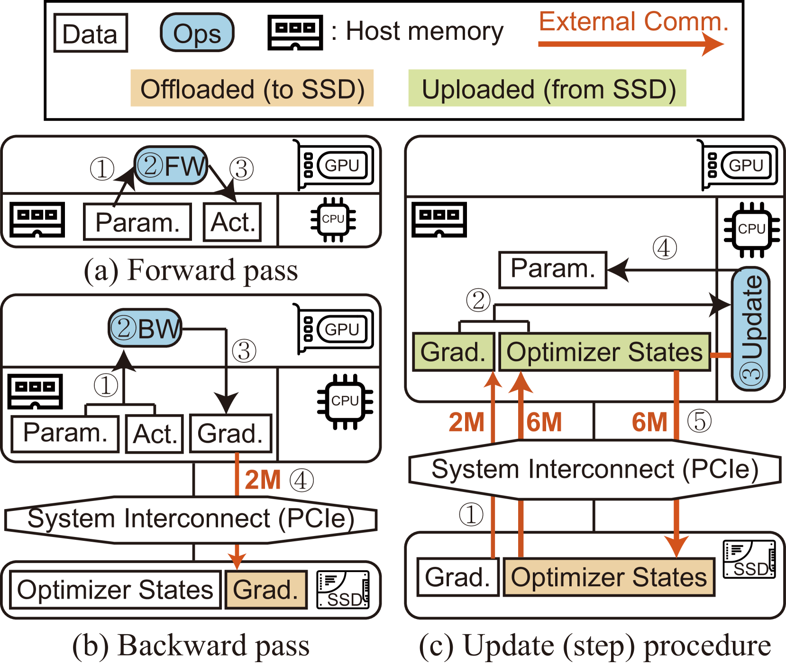

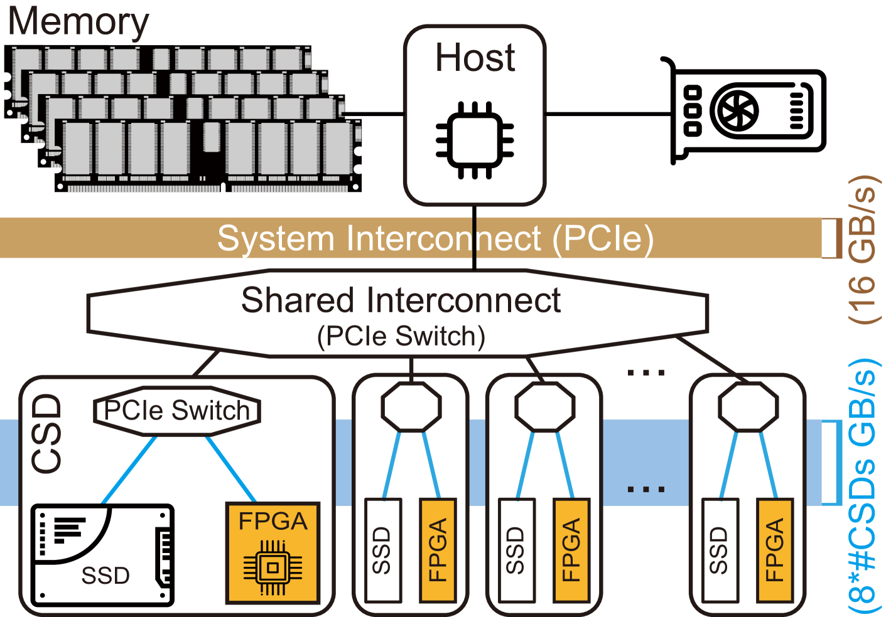

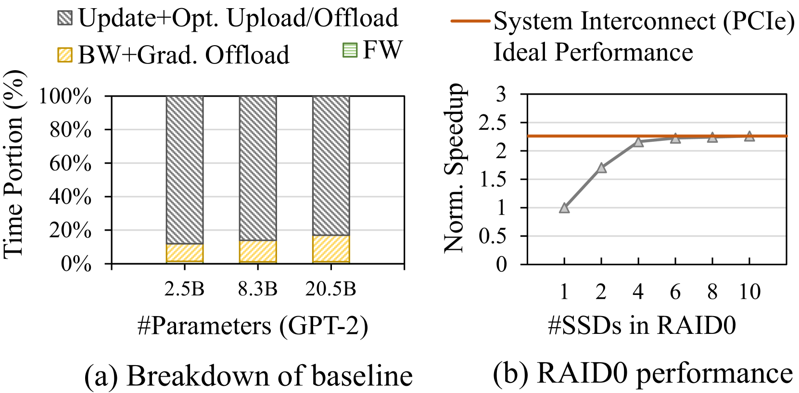

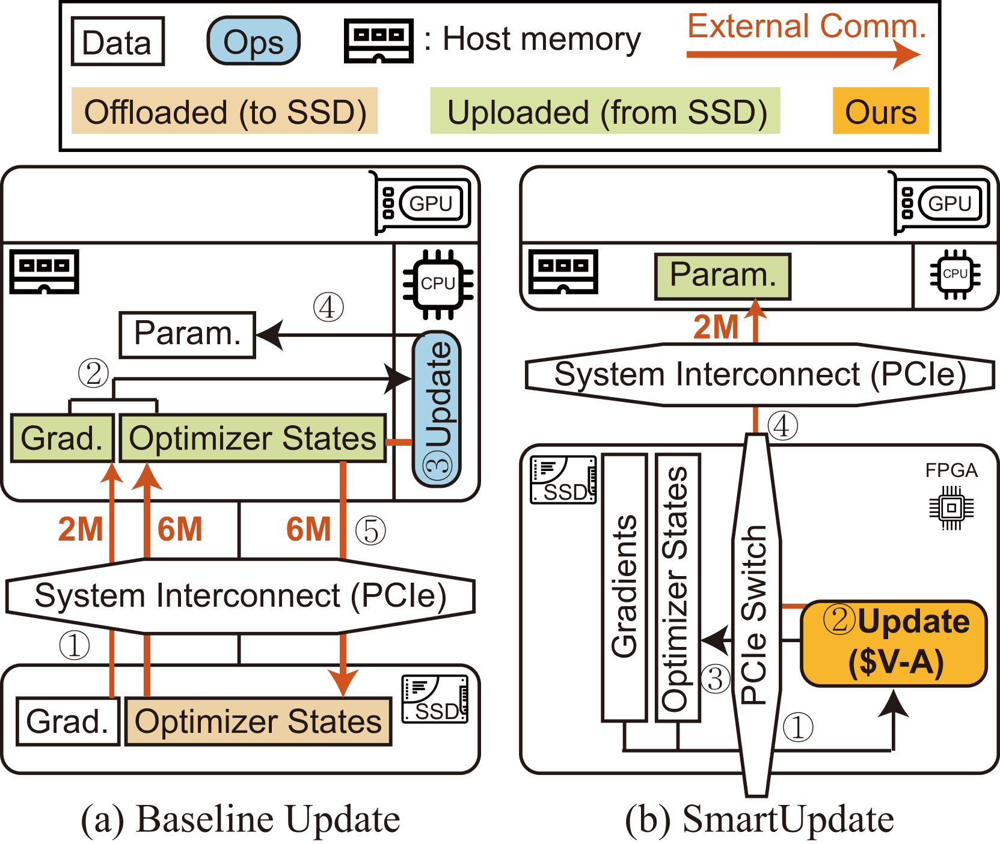

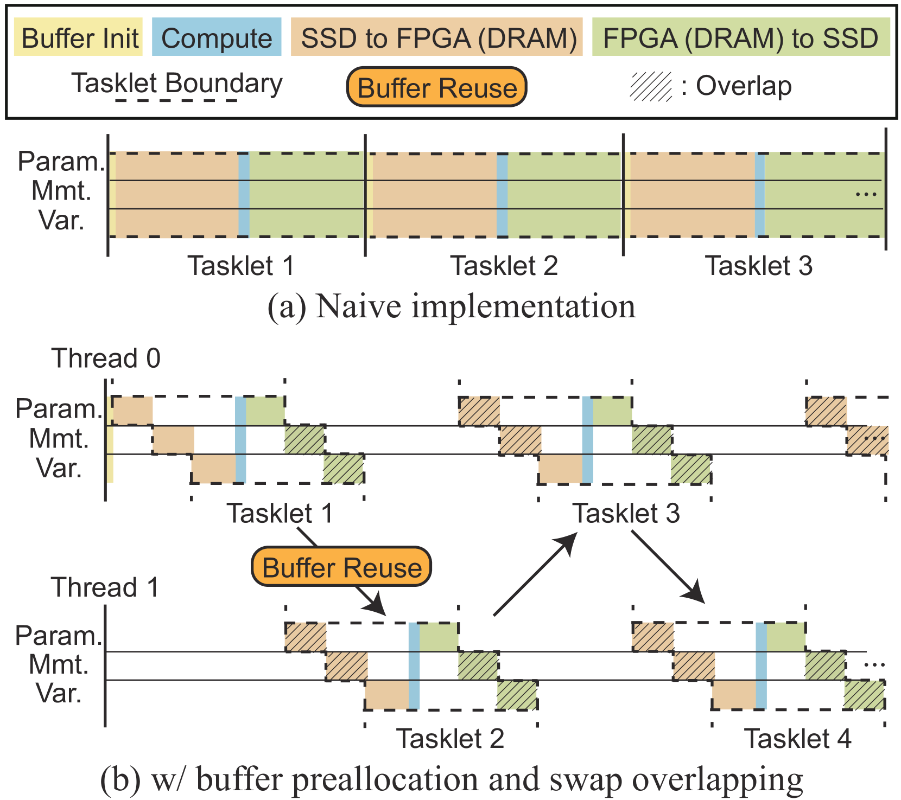

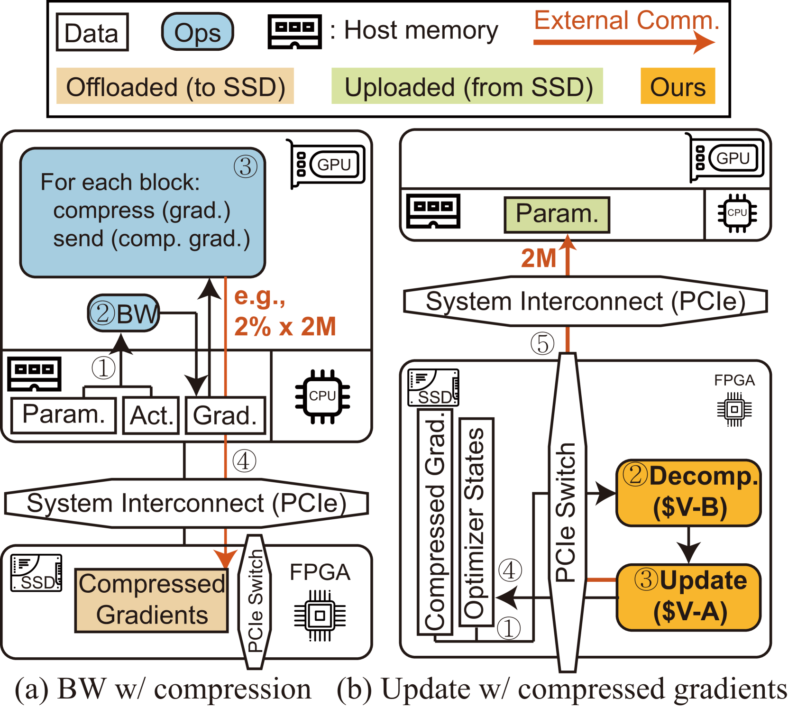

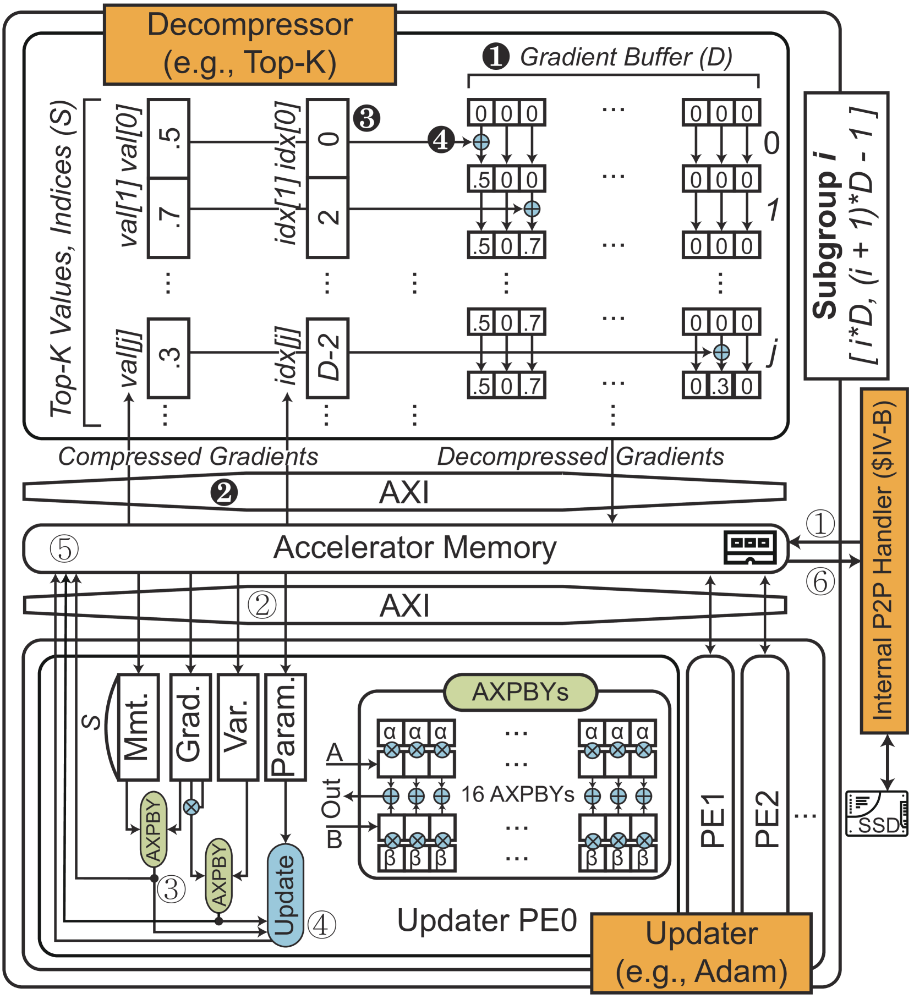

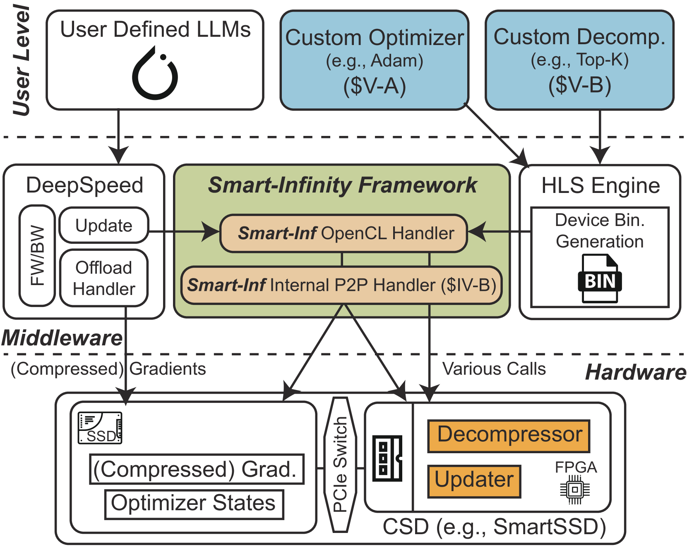

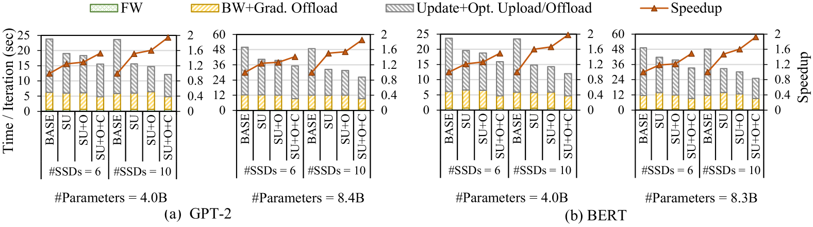

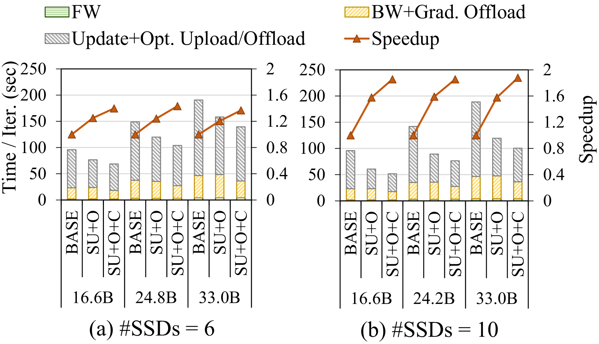

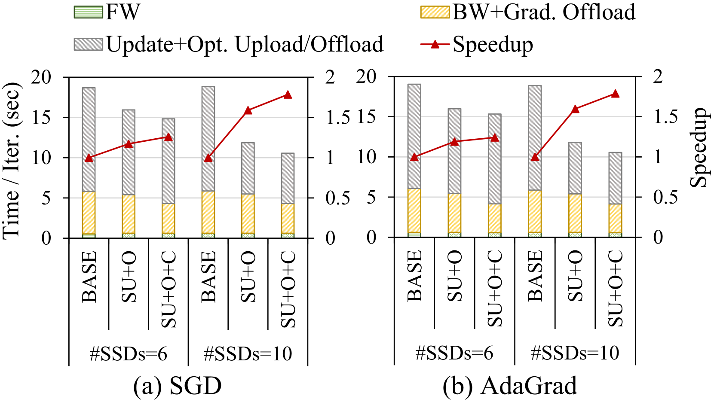

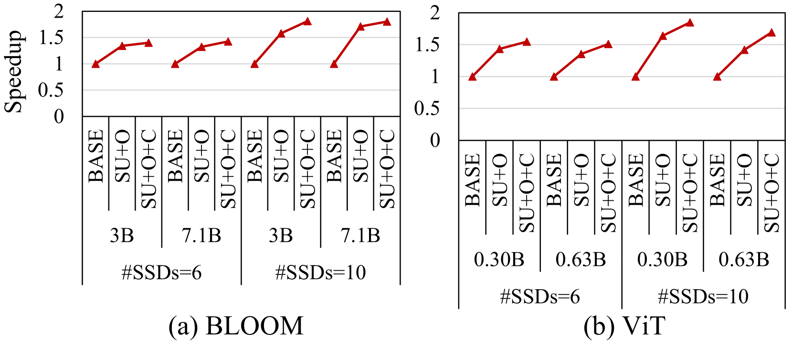

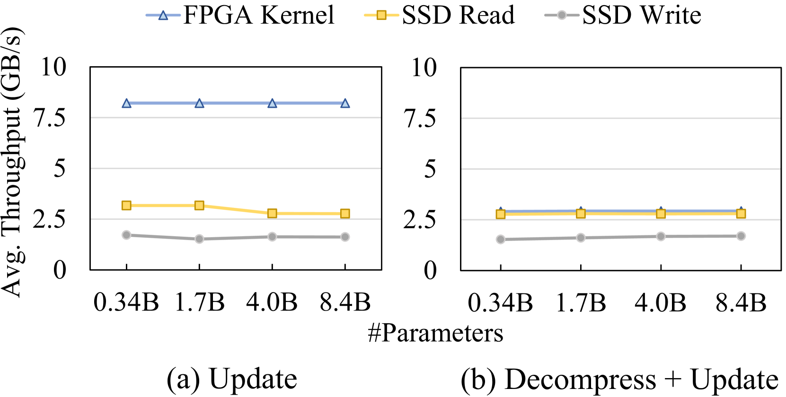

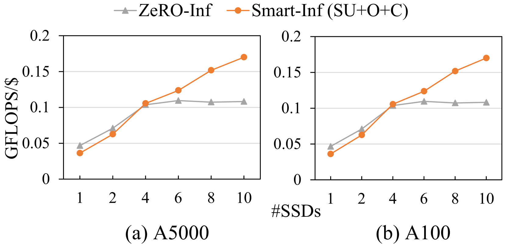

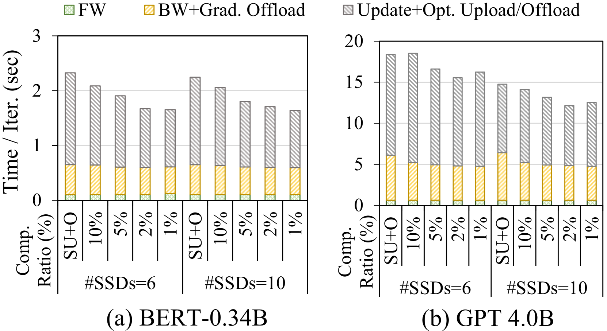

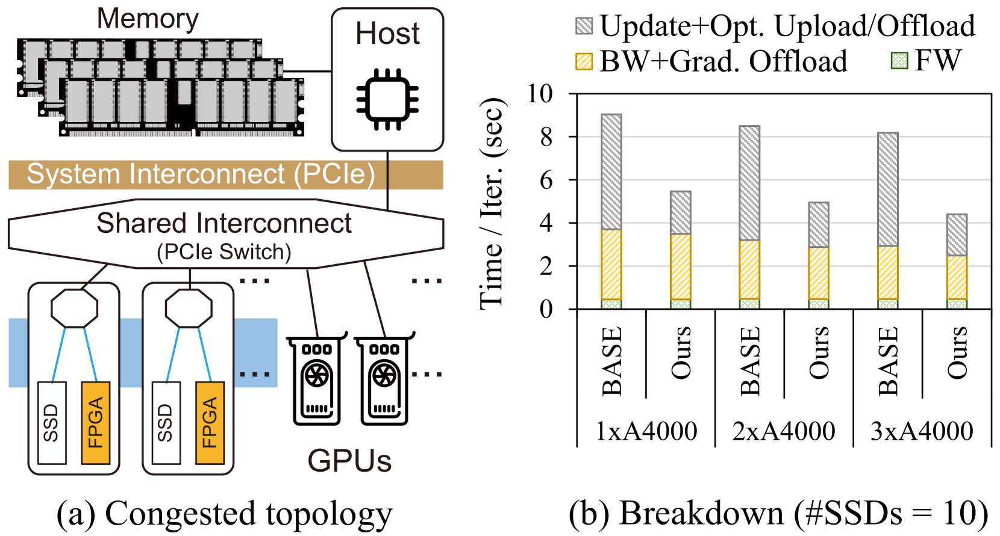